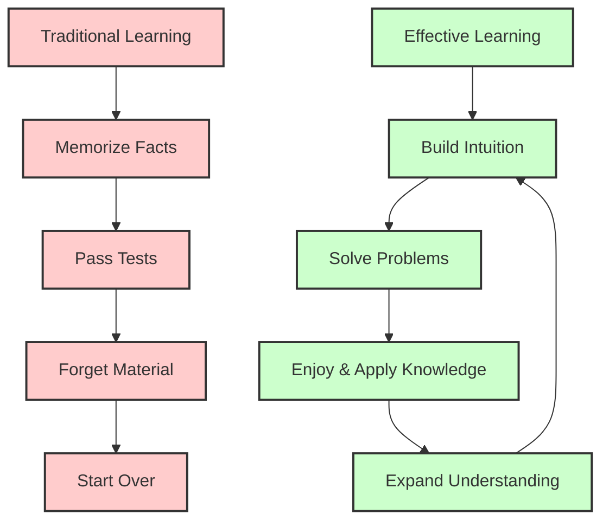
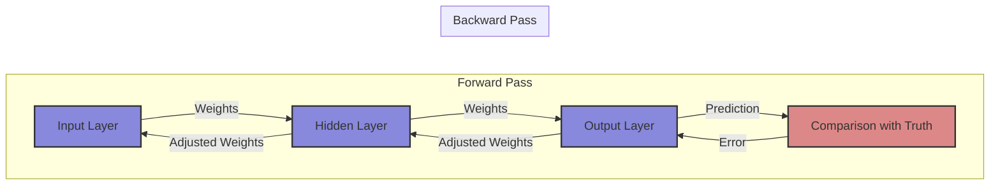
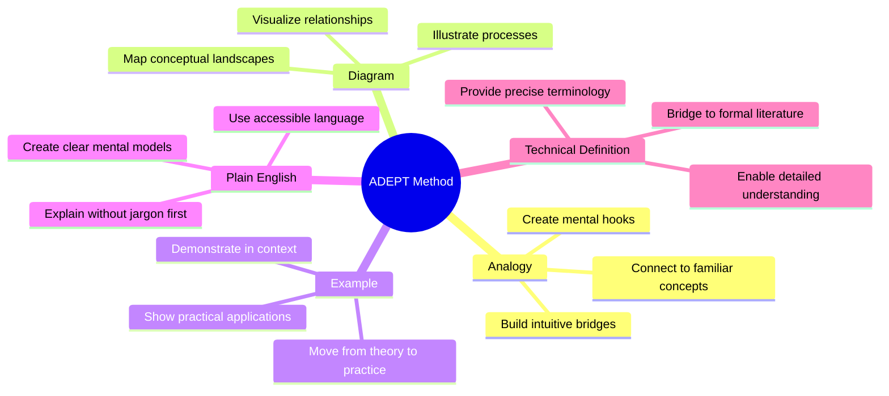
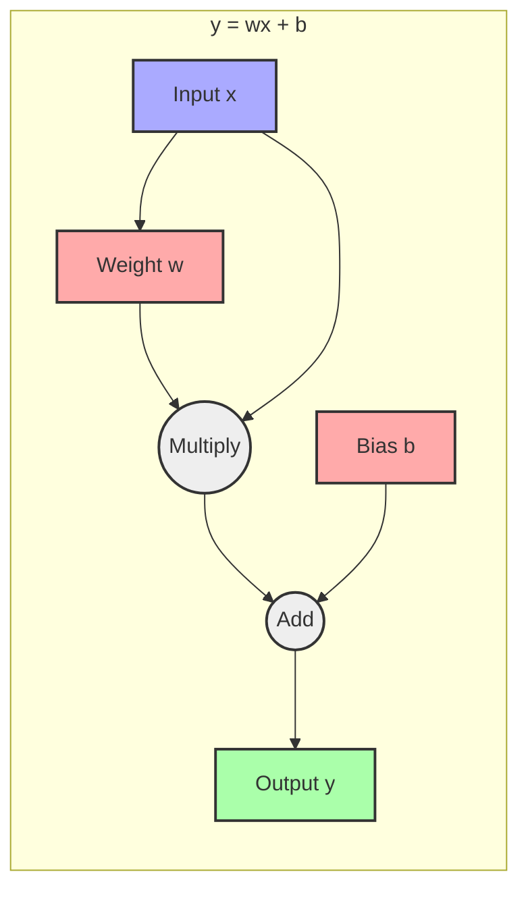
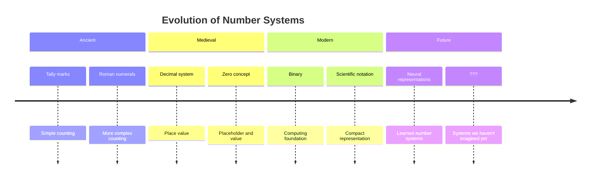
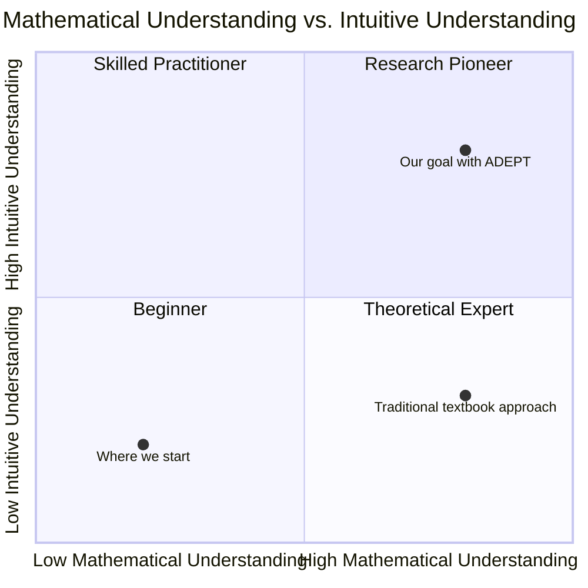
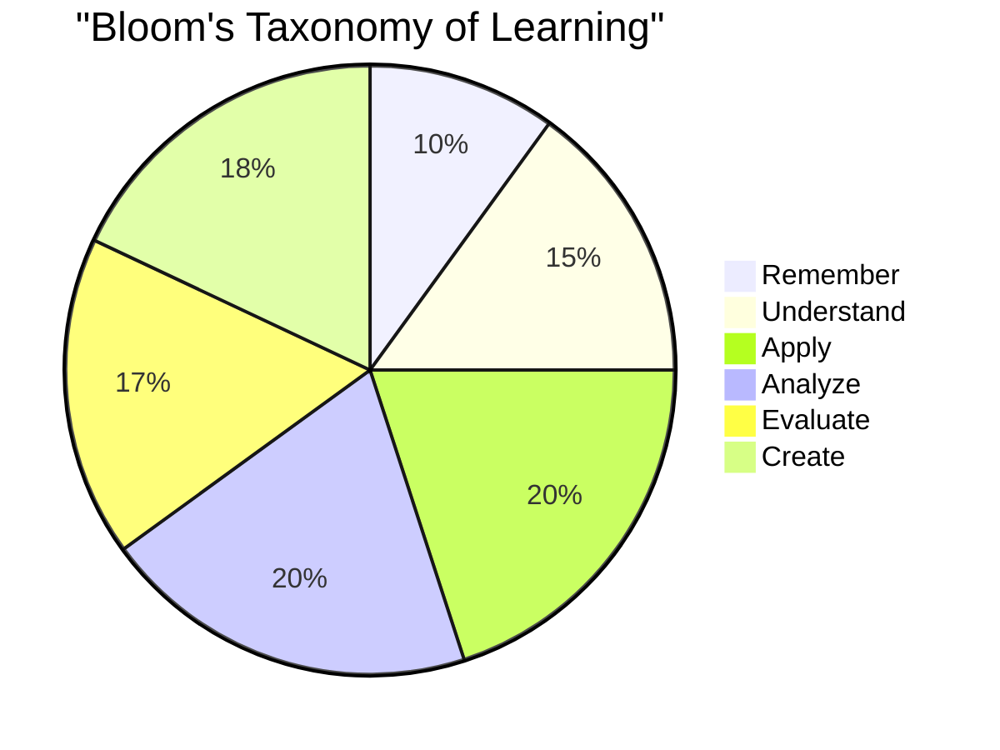
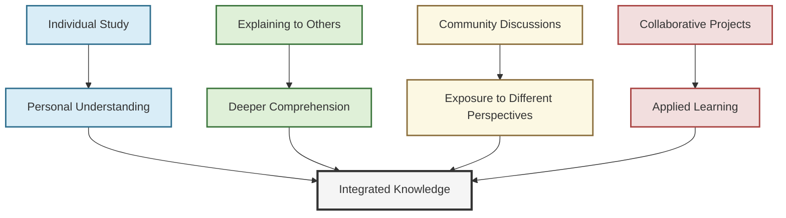
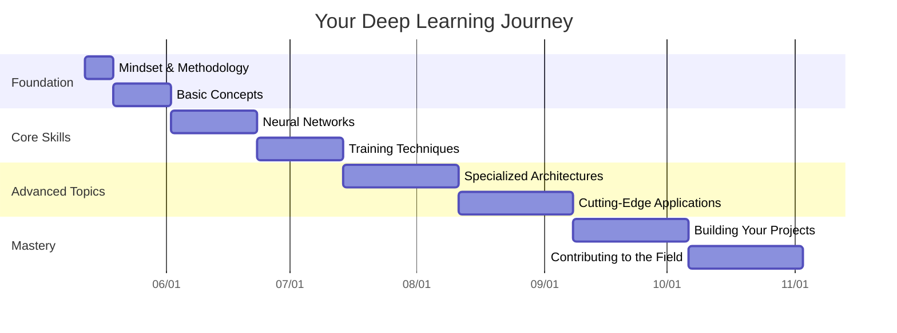

# Chapter 0: Learning Methodology: Mind Hacks: How to Succeed in This Deep Learning Adventure

> *"The mind is not a vessel to be filled, but a fire to be kindled."* — Plutarch

Welcome to your deep learning journey! Before we dive into neural networks, gradient descent, and the technical aspects of deep learning, let's take a moment to discuss something equally important: *how* to learn effectively. The adventure you're about to embark on is challenging but immensely rewarding. The right mindset and learning strategies will make all the difference.

## The Promise of This Book

**This book has a unique and powerful promise**: We will explain deep mathematical concepts using nothing more than algebra. Even calculus-heavy topics will be presented algebraically with intuitive explanations.

Why? Because math is just a language to model ideas—it is not the only way ideas can be represented! Too many aspiring data scientists and AI enthusiasts give up when confronted with walls of intimidating equations. They miss the forest (understanding AI concepts) for the trees (complex mathematical notation).

Inspired by educators like Kalid Azad from [BetterExplained.com](https://betterexplained.com/), we believe that mathematical intuition should come before formal notation. As Kalid wisely states, *"Don't memorize formulas, understand them."*

## Why Learning Methodology Matters

What's the point of taking this deep learning journey?

- **Build a lasting intuition** for neural networks and AI concepts
- **Understand deeply enough** to solve real-world problems
- **Enjoy the subject enough** to revisit and expand your knowledge over time

These should be your goals, rather than simply memorizing formulas or cramming information that will be forgotten. Deep learning isn't just a set of techniques—it's a new way of thinking about problems.



## The ADEPT Method for Learning Complex Topics

Throughout this book, we'll use the ADEPT method to make complex deep learning concepts more accessible. Let me introduce you to this powerful approach that can transform how you absorb and retain information:

### Analogy: Connect New Concepts to Familiar Ideas

The brain learns best by connecting new information to existing knowledge. When facing complex neural network concepts, I'll provide analogies that bridge the gap between the unfamiliar and what you already understand.

**Example:** When we discuss gradient descent, I might compare it to descending a mountain in fog. You can't see the entire landscape, but you can feel which direction is downhill from your current position, take a step, and repeat until you reach the bottom.

### Diagram: Visualize Relationships and Processes

Visual representations can unlock understanding where words alone might fail. Throughout this book, you'll find diagrams that illustrate key concepts and relationships.

**Example:** Instead of just explaining backpropagation in text, we'll visualize how errors flow backward through a network:



### Example: See Concrete Applications of Abstract Concepts

Theory becomes meaningful when you see it in action. For each concept, I'll provide real examples that demonstrate its practical application.

**Example:** When learning about convolutional neural networks, we won't just cover the mathematics—we'll walk through how they identify edges, textures, and eventually recognize objects in images.

### Plain English: Explain Ideas in Accessible Language

Complex ideas don't require complex language. I'll explain concepts in clear, everyday terms before introducing technical jargon.

**Example:** Before diving into "stochastic gradient descent with momentum," I'll explain it as "taking smaller, randomized steps toward your goal while maintaining some forward momentum to avoid getting stuck."

### Technical Definition: Build Precise Understanding

Once the intuition is established, we'll add the technical precision necessary for implementation and deeper comprehension.

**Example:** After building intuition about neural networks, we'll define them formally as "parameterized functions that transform input data through a series of weighted linear combinations and non-linear activations to produce output predictions."



## Developing a Mathematical Mindset

Many students approach deep learning with trepidation because of its mathematical foundations. Let's reframe how you think about mathematics in this context.

### Understanding Math as a Tool for Modeling Relationships

Mathematics in deep learning isn't just abstract manipulation of symbols—it's a powerful language for describing relationships in data. When you see an equation, try to understand what relationship it's expressing rather than just memorizing it.

As promised, this book will use algebraic expressions rather than complex calculus. Why? Because algebra provides us with all the tools we need to understand the *relationships* that matter in deep learning. You won't see intimidating integrals or differential equations—instead, we'll use simple algebraic operations that anyone with a basic math background can follow.

**Example:** When we write $y = wx + b$, we're modeling how an input $x$ relates to an output $y$ through a relationship defined by parameters $w$ (weight) and $b$ (bias). This simple equation is the building block of neural networks.



### How Mathematical Thinking Evolves Over Time

Mathematical notation and concepts have evolved to become more efficient at expressing complex ideas. Similarly, your understanding of mathematical concepts in deep learning will evolve.

Consider how number systems have developed throughout history:



Just as number systems evolved from tally marks to decimal systems, your understanding of deep learning will progress from basic perceptrons to complex transformer architectures. Be patient with yourself through this evolution.

### The Importance of Intuition in Deep Learning

Deep learning combines mathematical rigor with intuitive leaps. The field advances not just through equations, but through researchers developing intuitions about what might work and why.

As Andrew Ng often says, "Debugging a machine learning system is more about intuition than it is about mathematical proofs."



We need both mathematical understanding and intuition. This book aims to develop both simultaneously, rather than focusing solely on mathematical formalism.

## Effective Learning Strategies

### Recording "Aha!" and "Huh?" Moments

When studying deep learning (or any complex subject), keep track of two types of moments:

1. **"Aha!" moments**: When a concept suddenly clicks, write it down in your own words immediately. These insights are precious and form the foundation of your understanding.

2. **"Huh?" moments**: When something doesn't make sense, note that too. Don't gloss over confusion—mark it, move on temporarily, and return to it later with fresh eyes or a different approach.

```mermaid
flowchart TD
    A[Studying New Concept] --> B{Understand?}
    B -->|Yes| C[Record "Aha!" Moment]
    B -->|No| D[Record "Huh?" Moment]
    C --> E[Apply to Reinforce]
    D --> F[Try Different Approach]
    F --> G[Seek Additional Resources]
    G --> H[Revisit Later]
    H --> B
    E --> I[New Concept]
    
    style A fill:#f9f,stroke:#333,stroke-width:2px
    style B fill:#bbf,stroke:#333,stroke-width:2px
    style C fill:#bfb,stroke:#333,stroke-width:2px
    style D fill:#fbb,stroke:#333,stroke-width:2px
    style E fill:#bfb,stroke:#333,stroke-width:2px
    style F fill:#fbf,stroke:#333,stroke-width:2px
    style G fill:#fbf,stroke:#333,stroke-width:2px
    style H fill:#fbf,stroke:#333,stroke-width:2px
    style I fill:#f9f,stroke:#333,stroke-width:2px
```

**Pro Tip**: Create a learning journal specifically for your deep learning journey. Divide each page into "Aha!" and "Huh?" sections. Review your "Huh?" moments regularly to see if they've evolved into "Aha!" moments.

### From Factual Knowledge to Deep Understanding

Factual knowledge is just the beginning. True understanding means being able to:

- **Apply** concepts to new problems
- **Explain** ideas to others in your own words
- **Connect** different concepts into a coherent whole
- **Generate** new ideas based on what you've learned



As you progress through this book, challenge yourself to move up this hierarchy of understanding. Don't just memorize the equations for backpropagation—understand why they work, apply them to different problems, analyze when they might fail, evaluate alternative approaches, and eventually create your own innovations.

### Learning as a Collaborative Process

Learning deep learning is not a solitary endeavor. The field advances through collaboration, and your learning will accelerate when you engage with others.

- **Explain concepts** to friends or colleagues (teaching is the best way to learn)
- **Join online communities** like r/MachineLearning, PyTorch forums, or deep learning Discord servers
- **Contribute to open-source projects** even in small ways
- **Share your "Aha!" moments** with others and compare notes



## A University Professor and the Zen Master

Let me share a story that beautifully illustrates the mindset needed for learning deep learning:

> A university professor went to visit a famous Zen master. While the master quietly served tea, the professor talked about deep learning, listing all the papers he had read and concepts he understood.
> 
> The master poured the visitor's cup to the brim, and then kept pouring. The professor watched the overflow until he could no longer restrain himself. "It's overfull! No more will go in!" he exclaimed.
> 
> "Like this cup," the master replied, "you are full of your own opinions and theories. How can I show you deep learning unless you first empty your cup?"

This story reminds us that sometimes our preconceptions and existing knowledge can prevent us from truly learning. Approach deep learning with a beginner's mind—curious, open, and ready to be surprised.

## Your Learning Contract

Before moving on to Chapter 1, consider making a learning contract with yourself. Commit to:

1. **Being patient** with yourself through challenging concepts
2. **Applying the ADEPT method** when encountering difficulties
3. **Recording your "Aha!" and "Huh?" moments** throughout your journey
4. **Engaging actively** rather than passively consuming the material
5. **Taking breaks** when needed to let ideas incubate



Remember, this is a marathon, not a sprint. Deep learning is a vast field that even experts are continuously learning. Be kind to yourself, celebrate small victories, and enjoy the process of discovery.

## Summary

In this chapter, we've established the foundation for your deep learning journey by exploring:

- **The ADEPT method** for learning complex topics through Analogy, Diagram, Example, Plain English, and Technical Definition
- **Mathematical mindset** that views math as a tool for modeling relationships rather than a barrier
- **Effective learning strategies** including recording your "Aha!" and "Huh?" moments
- **Collaborative learning** as a way to deepen your understanding

Armed with these meta-learning tools, you're ready to begin exploring the exciting world of deep learning. In the next chapter, we'll dive into an introduction to deep learning and why it's revolutionizing how we solve problems across nearly every industry.

> *"The expert in anything was once a beginner."* — Helen Hayes

## Exercises

1. **Create your learning journal** with sections for "Aha!" and "Huh?" moments. Write your first entry about what you hope to learn from this book.

2. **Draw your own diagram** (on paper or digitally) representing how you think deep learning works, even if you're not sure yet. This will give you a baseline to see how your understanding evolves.

3. **Find an analogy** for how you think neural networks learn. How is it similar to how humans learn? How is it different?

4. **Share your goals** for learning deep learning with someone else, or in an online forum. What specific problems do you hope to solve with these skills?
