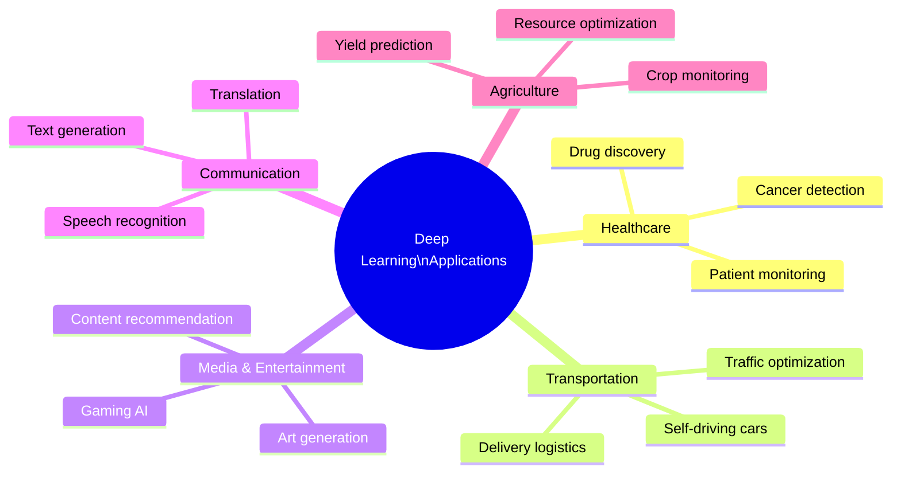
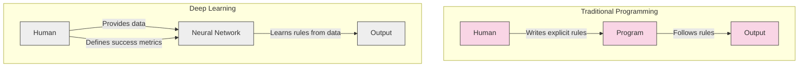
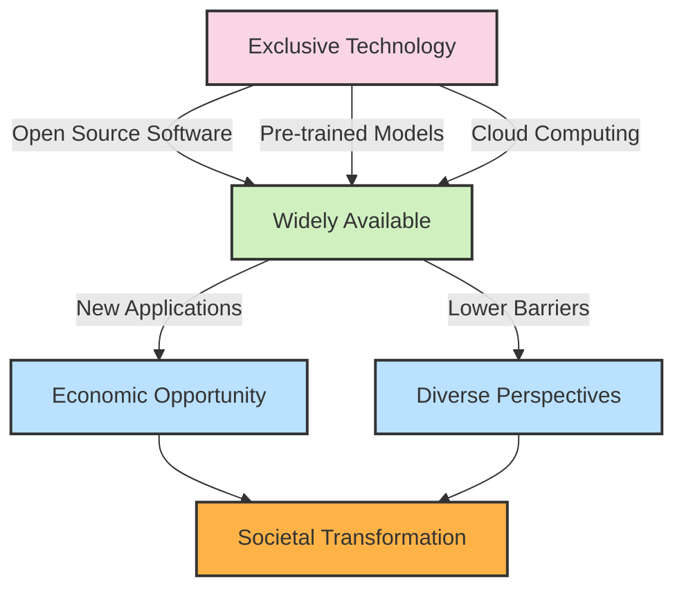
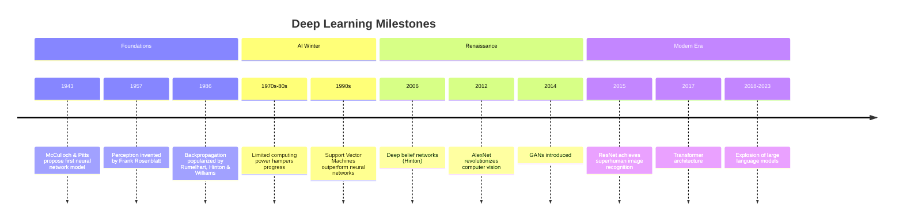
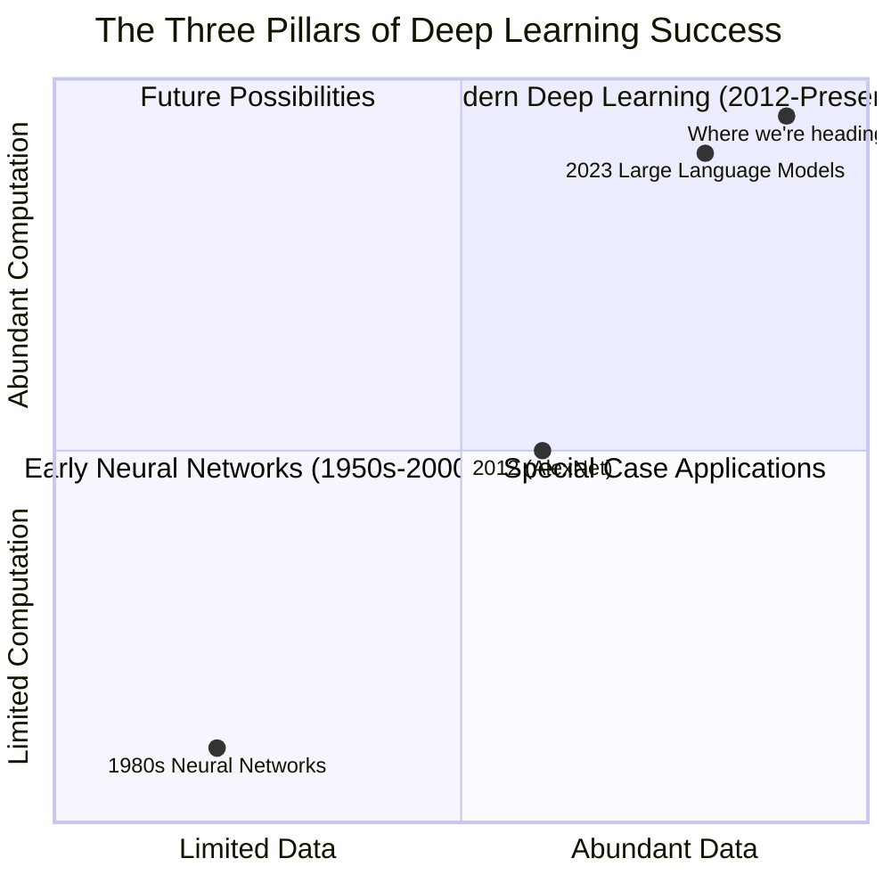
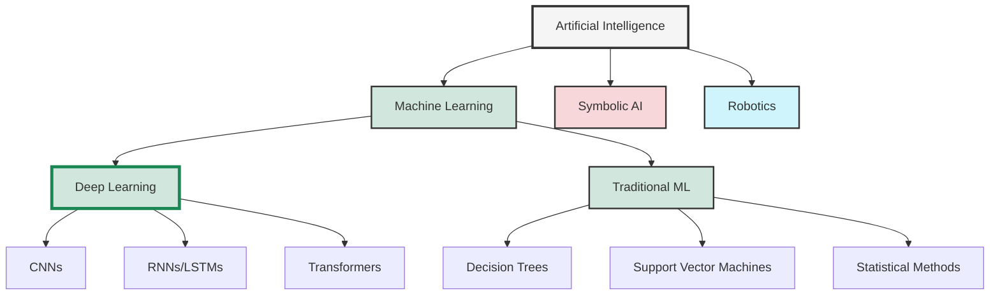
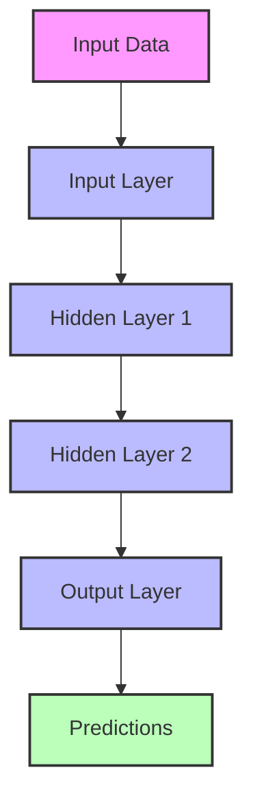
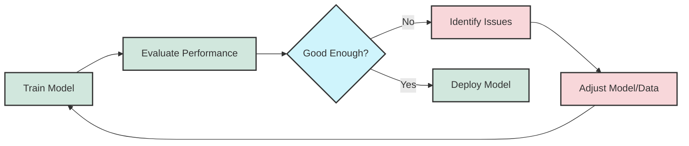
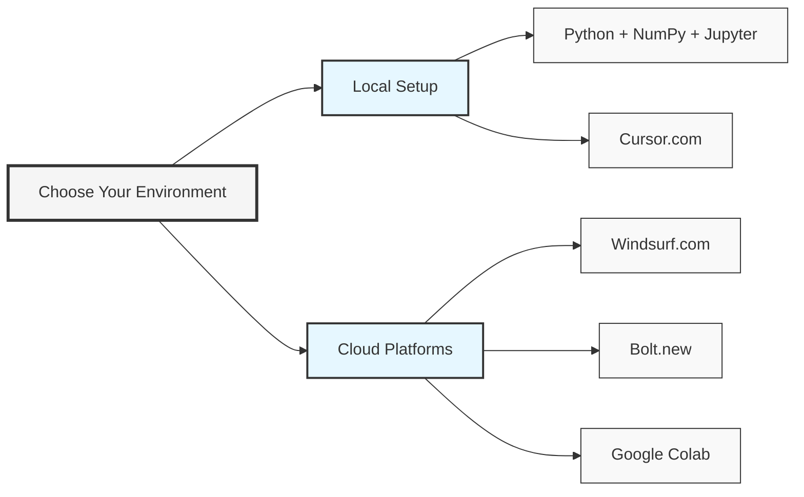

# Chapter 1: Introduction to Deep Learning: Neural Networks Unplugged: Why Deep Learning Will Change Your Life

> *"Math should be a way to see the world more clearly, not a barrier to learning."* — Dr. Ernesto Lee

## Get Ready to Pick Up Amazing Skills That Will Shape Tomorrow!

Wow! I'm so glad you're here with me on this adventure! Think about where computers and smart tech are going these days – deep learning sits right at the heart of it all. It's where clever computer code meets brain-like thinking, and it's turning whole industries upside down in the best possible way. Right now, the skills you'll learn here are helping phones recognize faces, recommending your next favorite song, helping doctors spot diseases, and teaching cars to drive themselves. It's not just hiding in research labs anymore – it's all around us and changing how we live!

This isn't some small coding trick or passing fad. You're starting a journey to learn what might be the most useful set of skills in today's world. Just imagine that for a second. The time you spend with these pages could open doors to new jobs, bring exciting chances your way, and put you right in the middle of the biggest tech revolution of our time.

## Why Deep Learning Belongs in Your Toolkit

### It Helps Computers Think More Like Us

Since the first tools were made, people have been making things to help us understand and change the world around us. Deep learning is the newest big step in this long story.

What makes deep learning special is that it's about making computers smarter, not just stronger or faster. While older tools helped our bodies do more (like cars or hammers), deep learning helps our brains do more. It's teaching machines to learn bit by bit, just like we do. In just the last few years, we've seen amazing jumps forward - computers that can see pictures, understand words, and translate languages better than ever before.

The cool part? Deep learning uses the same basic idea - neural networks that work kind of like our brains - to solve all these different problems. Even though we're still figuring it all out, what we've seen so far has many people super excited: maybe we've found not just a clever trick, but a whole new way to understand how thinking itself works!

### Deep Learning is Already Changing How We Work

People say a lot about what AI might do someday. Some of it's over the top, but one thing is real and happening now: deep learning is changing jobs in big ways.

This matters because even if AI stopped getting better today (which it won't!), we already see it reshaping work. Look around - customer service chatbots, self-driving taxis, AI writers, and data analysis tools are taking over tasks that used to need humans.

The most clear example? Look at GPT models and AI helpers. They're writing emails, building websites, making marketing posts, answering customer questions, and even creating art and music that looks human-made! Things we thought only people could do five years ago are now handled by AI every day in businesses worldwide.

Good news - big changes don't happen overnight. But we're already at a turning point with this technology. I wrote this book hoping it helps you move from a job that might get automated to a growing field with lots of chances to succeed: working with deep learning itself!

### It's Actually Really Fun and Makes You Think

Being honest, I started learning deep learning because it's just so cool! When humans and machines meet, amazing things happen. As you teach computers to think, you end up learning more about what makes us human - how we think, solve problems, and create new things.

Picture this: collecting thousands of Monet paintings, then showing them to a computer until it learns to paint new pictures in that exact style. A few years back, that was just a dream. Now anyone can do it with the right tools - and seeing it happen feels like watching magic unfold! The best part is understanding how the magic works.



Each of these applications was made possible by recent advances in deep learning. The impact is already being felt, but we're just at the beginning of what's possible.

## Is This Going to Be Hard to Learn?

### When Do I Get to the Good Stuff?

Here's what everyone wants to know! For me, the most exciting moment is when I watch something I built start to learn on its own. There's real magic in seeing your code figure things out without you telling it exactly what to do. If that sounds cool to you too, then I have good news: by the time you reach Chapter 3, you'll build your very first neural network. All you need to do until then is read through these first few chapters.

And once you've got that first taste, Chapter 4 brings another big reward after you've practiced a small bit of code from Chapter 3. That's how this book works - each chapter builds on the last one with small, manageable steps, and before you know it, you're watching your own AI systems learn and grow!



## Why This Book is Different

### Anyone Can Understand It - No PhD Required

I created this book for the same reason you might be reading it - there just aren't many resources that teach deep learning without expecting you to already be a math wizard. Most guides assume you've taken college-level math courses or remember complex formulas.

Now, there are perfectly good reasons why other books use lots of math. Math is a clear way to express ideas precisely. But here's the thing - you don't need to be a math expert to understand how deep learning works and build amazing things with it.

That's why this book is special. All I expect is that you remember basic high school math - and even if it's a bit rusty, that's totally okay! Can you multiply numbers? Do you roughly remember those x-y graphs with lines and points? Great! That's honestly all we need to get started. We'll explain everything else step by step as we go.

### You'll Understand the Engines, Not Just Drive the Car

Most deep learning books and courses fall into two camps. The first teaches you how to use ready-made tools like PyTorch, TensorFlow, or ChatGPT APIs. The second teaches the actual science of how deep learning works beneath those tools.

Both matter, but in the right order. Think about it like learning to drive race cars: you need to know both how to handle a specific car model (like using TensorFlow) and the general skill of driving (the core science). But jumping straight to using advanced frameworks without understanding the basics is like trying to race a fancy car without knowing how to steer or brake!

This book focuses on teaching you the fundamentals first - how neural networks actually think and learn. Once you get that, you'll find that picking up any specific AI tool becomes much easier because you'll understand what's happening under the hood.

### We Turn Math into Stories You'll Remember

When I see a complex math formula, I don't just stare at the symbols. I turn it into a story or picture that makes sense in everyday life. Every equation is telling us something about the world - we just need to translate it into plain language.

Throughout this book, whenever we hit a math concept, I'll give you a real-world comparison that helps it stick in your mind. A formula isn't just symbols on a page - it's a recipe, a relationship, or a rule that we can understand through familiar examples. As the saying goes, "If you can't explain it simply, you don't understand it well enough."

### Get Your Hands Dirty with Real Projects Using Vibe Coding

One thing that drives me crazy when learning: spending hours on theory without seeing how it matters in real life. It's like someone teaching you all about hammers - their history, types, and physics - but never letting you actually hit a nail!

This book does the opposite. After the first few chapters, everything becomes hands-on. We'll give you the tools and materials first, then help you build something cool while explaining how it works. We'll use a modern approach called Vibe Coding that makes creating AI systems more intuitive and fun.

By the end, you won't just have a bunch of facts in your head - you'll have actual skills to solve real problems. Best of all, you'll know exactly when to use each technique and why it works for specific challenges. This practical knowledge is what will set you apart, whether you want to use these skills for research, a new job, or your own creative projects.

### Everyone Can Join the AI Party Now

One of the most awesome things happening in deep learning is how it's becoming available to everyone. Just a few years ago, only big research labs with expensive computers could do this stuff. Now anyone with a laptop and internet can build impressive AI systems!

Three big changes made this possible:

1. **Free, open tools**: Amazing software like PyTorch and TensorFlow is completely free for anyone to use and improve
2. **Ready-to-use AI models**: You can now grab pre-built models like BERT or ResNet and adapt them to your needs without starting from zero
3. **Rent powerful computers**: Cloud services let you use super-fast AI hardware by the hour instead of buying expensive machines



This democratization has profound implications. The skills you're about to learn are not just academically interesting—they're economically valuable. As Albert Einstein allegedly said about compound interest, deep learning knowledge might be "the most powerful force in the universe" for career growth in the 21st century.

## The Deep Learning Revolution

### Historical Context and Recent Breakthroughs

While neural networks have existed conceptually since the 1940s, the current deep learning revolution began in earnest around 2012 with a breakthrough in the ImageNet competition. A neural network called AlexNet demonstrated dramatically better performance on image recognition tasks than traditional computer vision approaches, sparking renewed interest in the field.

Let's trace the key milestones that have shaped the modern deep learning landscape:



What's remarkable about this timeline is how much of the current revolution has happened in just the last decade. Many of the core ideas existed earlier, but the combination of better algorithms, more data, and vastly more computing power created a perfect storm for breakthrough performance.

### The Role of Data and Computation

Deep learning's remarkable success rests on three pillars:

1. **Algorithms**: Neural network architectures and training techniques
2. **Data**: Massive datasets to learn from
3. **Computation**: Hardware powerful enough to process the data

While many of the algorithmic ideas have been around for decades, the explosion in available data and computing power has been the catalyst for recent breakthroughs.



This chart illustrates how the field has evolved as both data and computation have become more abundant. The future will likely see continued growth in both dimensions, enabling models of even greater sophistication and capability.

### Deep Learning's Place in the Broader AI Landscape

It's important to understand that deep learning is just one approach within the broader field of artificial intelligence. While it has shown remarkable success in many domains, it's not a universal solution for all problems.



Deep learning excels at tasks involving patterns in large datasets like images, text, and audio, but other approaches may be more suitable for problems requiring logical reasoning, certified safety guarantees, or working with very limited data.

The field is now moving toward hybrid systems that combine deep learning with other AI techniques to overcome the limitations of each approach alone. As you progress in your journey, you'll develop an intuition for which tools are most appropriate for different problems.

## The Observe-Model-Refine Framework

One of the key insights in deep learning is that learning systems follow a pattern that mirrors scientific inquiry and human learning. We call this the Observe-Model-Refine framework, and it will guide our approach throughout this book.

```mermaid
circle
    title Observe-Model-Refine Framework
    idSalt 12345
    "Observe" --> "Model"
    "Model" --> "Refine"
    "Refine" --> "Observe"
```

### Observing Patterns in Data

The journey begins with observation. In deep learning, this means collecting, exploring, and understanding the data that will serve as the foundation for learning.

Effective observation involves:

1. **Gathering diverse, representative data** that captures the full range of scenarios the model will encounter
2. **Exploring relationships and patterns** through visualization and analysis
3. **Identifying potential challenges** like class imbalance, outliers, or biased data

The quality of your observations directly impacts the ceiling of your model's performance. As the saying goes in machine learning: "Garbage in, garbage out."

### Building Models to Capture Relationships

With data in hand, we move to the modeling phase. This is where neural networks come into play—they provide a flexible framework for representing complex relationships between inputs and outputs.

The modeling process involves:

1. **Selecting an appropriate architecture** for the problem (e.g., convolutional networks for images)
2. **Configuring the model parameters** like the number of layers and neurons
3. **Defining how the model will learn** through loss functions and optimization strategies



The beauty of neural networks is their ability to start with simple patterns and progressively build more complex representations through multiple layers. This hierarchical learning is what gives deep learning its power to tackle previously unsolvable problems.

### Refining Models to Improve Accuracy

The final piece of the puzzle is refinement. No model gets everything right the first time, and the process of iterative improvement is where the real learning happens—both for the model and for you as a practitioner.

Refinement encompasses:

1. **Evaluating performance** to identify strengths and weaknesses
2. **Adjusting model parameters** through training (backpropagation)
3. **Iterating on the architecture and approach** based on results



This cycle of training, evaluation, and refinement lies at the heart of deep learning. It's an inherently iterative process, often requiring patience and persistence, but it's also where the most profound insights emerge.

## Getting Set Up for Success

### Building Your Vibe Coding Playground

For me, the perfect workbench for learning deep learning is Jupyter Notebook. Why? Because it lets you pause your AI while it's learning, look inside its brain, and see exactly what's happening at each step. This peek-under-the-hood ability is pure gold when you're trying to understand how these systems work.

We'll be using NumPy as our main tool for handling data and math. There's a good reason for keeping it simple with just one library - you'll actually understand everything that's happening instead of just calling mysterious functions. We're building neural networks from the ground up, with every piece explained clearly.

Besides the classic tools, we now have some really cool new environments that make learning AI even more enjoyable:

Installation instructions for these essential tools can be found at [http://jupyter.org](http://jupyter.org) for Jupyter and [http://numpy.org](http://numpy.org) for NumPy. For easy installation, I also recommend the Anaconda framework: [https://docs.continuum.io/anaconda/install](https://docs.continuum.io/anaconda/install).

In addition to these foundational tools, several modern platforms have emerged that streamline the AI development process and make Vibe Coding even more accessible:

- **Windsurf.com**: A powerful platform specifically designed for AI development. Check out their getting started guide at [https://drlee.io/getting-started-with-vibe-coding-build-ai-powered-apps-with-windsurf-3a0fe0dd3b4d](https://drlee.io/getting-started-with-vibe-coding-build-ai-powered-apps-with-windsurf-3a0fe0dd3b4d) to learn how to build AI-powered applications with minimal setup.

- **Cursor.com**: An AI-augmented code editor that can significantly accelerate your development process. Students can get 1 year of free Cursor Pro at [https://www.cursor.com/students](https://www.cursor.com/students).

- **Bolt.new**: A browser-based development environment that lets you start coding instantly without any installation.

```python
# Example: Creating a simple neural network weight matrix in NumPy
import numpy as np

# Initialize random weights for a small network layer (3 inputs, 2 outputs)
weights = np.random.randn(3, 2)
print("Neural network weights:\n", weights)

# Apply a simple input to our weights
inputs = np.array([0.5, 0.3, 0.2])
output = np.dot(inputs, weights)
print("Neural network output:\n", output)
```

This simple example demonstrates how we can use NumPy to create and manipulate the matrices that form the backbone of neural networks. As we progress, we'll build on these basics to create complete learning systems.



The best environment is the one that lets you focus on learning rather than fighting with setup issues. Feel free to explore these options and choose the one that works best for your learning style.

### Just Bring Your High School Math (We'll Handle the Rest)

Don't worry - we're not expecting you to be a math genius! This book only asks that you remember the basics of algebra from high school. No need for calculus, fancy linear algebra, or statistics degrees - just bring a willingness to learn and we'll take care of the rest.

As promised, we'll always start with easy-to-understand examples and pictures before showing any formulas. This way, you'll have a clear mental picture of what's happening before we add in the math symbols.

### Find a Project That Gets You Excited

This tip might seem optional, but it's probably the most important one: find a specific problem that really interests you personally. I've noticed something about everyone who gets good at deep learning - they all started with a cool problem they wanted to solve. Learning deep learning was just a necessary step toward solving that interesting challenge.

In my case, I was fascinated by using social media trends to predict market movements. This interest kept me motivated through the tough parts of learning because I really wanted to see my project work!

Here's something amazing about this field - it's still so new and growing so quickly that if you focus on one specific problem area for a year or two, you could become a recognized expert in that niche before you know it. I started as a complete beginner, but within just 18 months of focused learning on my specific problem, I landed a research opportunity with a financial company to apply what I'd learned.

The secret sauce is finding a problem where you can use one type of data to predict another. When you're genuinely curious about the answer, learning the tools becomes an adventure rather than a chore. So what problem would you love to solve?

### A Little Python Will Go a Long Way

We'll be using Python throughout this book for all our examples. I picked Python because it's friendly to beginners, widely used in AI, and reads almost like English. The Python community also values keeping things simple, which matches our approach perfectly.

Don't worry if you're not a coding expert! If you can look through the topics in the Python Codecademy course ([www.codecademy.com/learn/python](https://www.codecademy.com/learn/python)) and generally understand what they're talking about, you're ready for this book. If those topics look unfamiliar, I'd recommend taking that course first - it's designed for beginners and will teach you everything you need to get started here.

## Wrapping Up

If you've got Jupyter ready and know some basic Python, you're all set for what's next! You're starting a journey to learn skills that are changing the world right now.

Let's look back at what we talked about:

- **Why Learn Deep Learning**: It helps computers think more like us, is changing how we work (including creating new job opportunities), and it's genuinely fun to play with.

- **Is It Hard?**: Not the way we teach it! By Chapter 3, you'll build your first neural network, and we've designed the whole book to give you quick wins along the way.

- **What Makes This Book Special**: We avoid complicated math, use everyday examples to explain tough concepts, and help you understand how AI actually works under the hood instead of just memorizing steps.

- **What You Need**: Just some basic Python skills, high school math, and ideally a problem you're curious about. We'll use friendly tools like Jupyter, NumPy and modern environments like Windsurf, Cursor, and Bolt.

Just so you know - Chapter 2 will be our last mainly theory chapter. We'll cover the big ideas and vocabulary of AI and machine learning there. After that, we roll up our sleeves and start building cool stuff!

## Try These Out

1. **Your First AI Idea**: What problem in your life or work might AI help solve? Write down a few sentences about a challenge you're interested in and how you think deep learning could help tackle it.

2. **Tool Setup**: Pick one of the coding environments we talked about and get it running on your computer. If you're new to this, Anaconda is a great choice because it includes both Jupyter and NumPy in one simple installation.

3. **AI in Your World**: Find a real example of deep learning being used in something you care about - maybe in music, sports, healthcare, or whatever interests you. How has it changed what people can do? What jobs might it affect?

4. **Python Check**: If your Python is rusty or new to you, spend some time on the Codecademy Python course making sure you understand the basics like variables, lists, loops, and functions.

5. **Draw Your Thoughts**: Sketch how you think a computer learns from data. This doesn't need to be technically accurate at all - it's just to get you thinking about the process. Draw boxes, arrows, or whatever helps you visualize learning. We'll build on this intuition as we go!"}}
]
