# Chapter 2: Machine Learning Fundamentals: Machine Learning 101: Teaching Computers Without Explicit Programming

> *"Machine learning will cause every successful IPO win in five years."* — Eric Schmidt, former Google executive chairman

## What's This Machine Learning Thing All About?

Before we dive into building neural networks, we need to understand the bigger picture. Machine learning might sound like robots taking over the world, but it's actually about teaching computers to find patterns and make decisions without someone writing explicit step-by-step instructions for every possible situation.

Imagine if you had to write down detailed rules for identifying every dog breed in photos - you'd need thousands of specific instructions covering fur patterns, ear shapes, sizes, and countless other details. With machine learning, we instead show the computer thousands of dog pictures with labels, and it figures out the patterns on its own. That's what makes it so powerful!

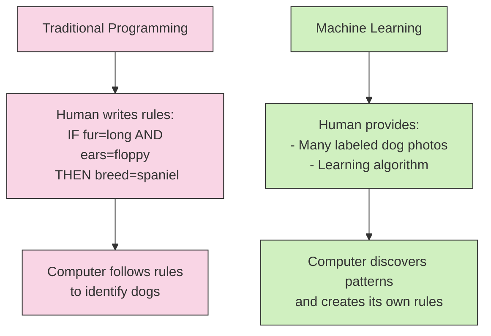

In this chapter, we'll explore the key ideas that form the foundation of machine learning. We'll keep things simple and focused on what you really need to know. By the end, you'll understand the different ways machines learn, how they store what they've learned, and the core principles that make machine learning work in real-world applications.

## Types of Learning

Machines can learn in different ways, just like humans. Let's explore the three main approaches:

### Supervised Learning: Learning from Labeled Data

Supervised learning is like learning with a teacher who shows you examples and tells you the right answers. The computer gets training data with clear labels saying "this is what you should output for this input."

For example:
- Input: Photo → Output: "Dog" or "Cat"
- Input: Customer data → Output: "Will buy" or "Won't buy"
- Input: Email text → Output: "Spam" or "Not spam"

```mermaid
graph LR
    A[Input Data] --> B[Machine Learning Model]
    C[Labels/"Right Answers"] --> B
    B --> D[Predictions]
    
    style A fill:#bbdefb,stroke:#333,stroke-width:1px
    style B fill:#f5f5f5,stroke:#333,stroke-width:2px
    style C fill:#ffccbc,stroke:#333,stroke-width:1px
    style D fill:#c8e6c9,stroke:#333,stroke-width:1px
```

What makes supervised learning so useful is that it's basically a way to transform one type of data into another. Think of it as a magic box that can turn what you know (input) into what you want to know (output).

Some real-world examples of supervised learning include:

- Turning email text into spam/not-spam decisions
- Transforming house features (size, location) into price estimates
- Converting medical images into disease diagnoses
- Changing weather data into tomorrow's forecast

The key thing to remember is that supervised learning needs examples of both inputs AND outputs to learn from. It needs to see the pattern between them many times before it can make good predictions on new data.

### Unsupervised Learning: Finding Patterns Without Labels

Unsupervised learning is like exploring on your own without a teacher. The computer gets data without any labels and has to find interesting patterns by itself.

Imagine you have a basket of fruits but don't know their names. You might group them by color, size, shape, or other features. That's what unsupervised learning does - it finds natural groupings or structures in data.

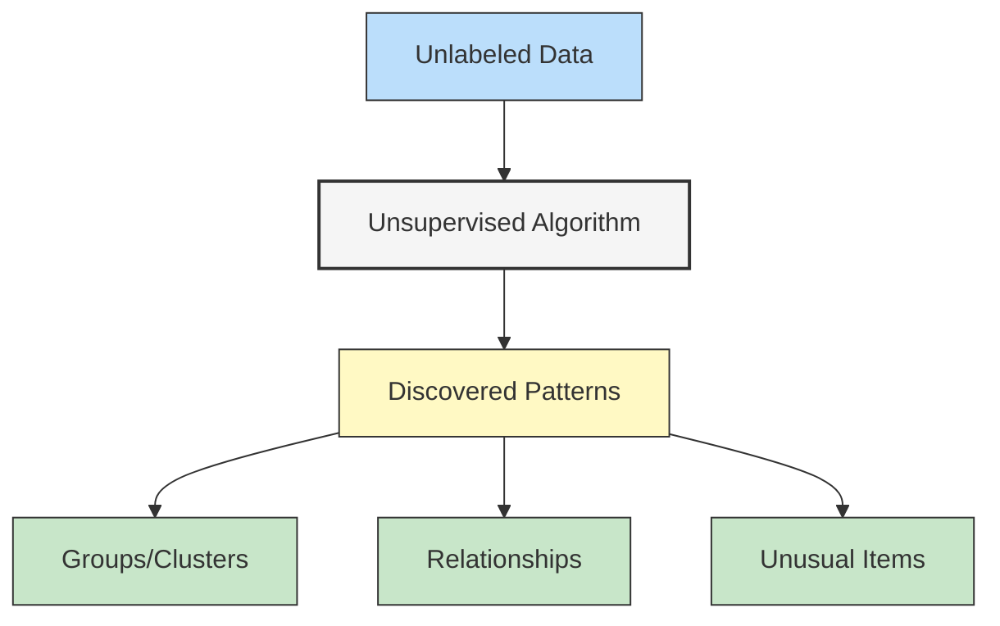

The most common type of unsupervised learning is clustering - grouping similar things together. The computer doesn't name these groups; it just says, "Hey, I found some patterns! These items seem to belong together."

Let's look at a simple example:

```
Items: pizza, puppy, burger, kitten, taco, hamster

After clustering:
Group 1: puppy, kitten, hamster
Group 2: pizza, burger, taco
```

The algorithm doesn't tell us what Group 1 and Group 2 represent - that's for us to figure out. (Here, Group 1 contains pets and Group 2 contains foods.)

Real-world examples of unsupervised learning include:
- Grouping customers with similar buying habits
- Finding unusual credit card transactions (anomaly detection)
- Discovering topics in a collection of documents
- Compressing data while keeping important patterns

### Reinforcement Learning: Learning Through Interaction

Reinforcement learning is like training a dog with treats. You don't tell it exactly what to do, but you reward good behaviors and maybe punish bad ones. Over time, it figures out what actions lead to rewards.

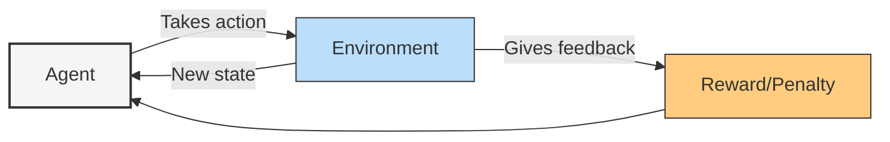

Reinforcement learning is different from both supervised and unsupervised learning. Instead of learning from examples or finding patterns in data, it learns through trial and error by interacting with an environment.

Here's how it works:
1. The agent (our learning system) takes an action
2. The environment changes and provides feedback (reward or penalty)
3. The agent learns which actions lead to the most rewards over time

This approach is perfect for problems like:
- Teaching a robot to walk
- Playing games (like AlphaGo beating world champions)
- Managing investment portfolios
- Optimizing energy usage in data centers
- Self-driving cars navigating traffic

What makes reinforcement learning special is that it can learn in situations where we don't know the "right answer" - we just know if the outcome was good or bad.

## Parametric vs. Nonparametric Models

Now let's look at another way to categorize machine learning approaches: by how they store what they've learned.

### Understanding Model Complexity and Flexibility

Imagine you're trying to understand the relationship between study hours and test scores. You could draw a straight line through the data points (simple), a curved line (more complex), or a wiggly line that hits every point exactly (very complex).

```mermaid
scatter
    title Hours Studied vs. Test Score
    x-axis Hours Studied
    y-axis Test Score
    1 65
    2 70
    3 75
    4 72
    5 85
    6 89
    7 95
```

This shows the trade-off between simplicity and flexibility. Models that are too simple might miss important patterns (underfitting), while models that are too complex might confuse random noise for patterns (overfitting).

### The Role of Parameters in Machine Learning Models

Parameters are like the knobs and dials that a machine learning model can adjust to fit the data better. They're the numbers that get updated during learning.

**Parametric Models** have a fixed number of parameters, no matter how much data you throw at them. Think of them as machines with a specific number of knobs to turn:

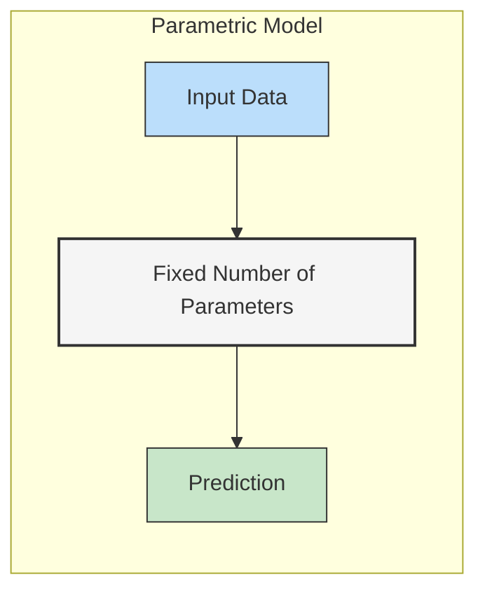

Imagine trying to fit a straight line to data points. The line is defined by just two parameters: slope and intercept. No matter how many data points you have, you're still just adjusting those two numbers.

Examples of parametric models include:
- Linear regression
- Logistic regression
- Neural networks (including deep learning)

**Nonparametric Models** let the number of parameters grow with the amount of data. They're more flexible and can capture complex patterns, but they require more data and can be slower:

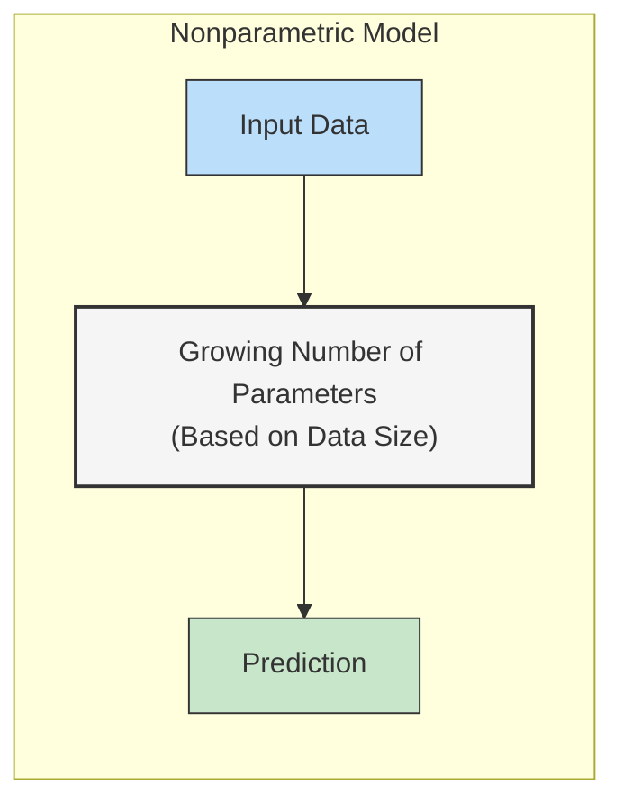

A simple example is K-Nearest Neighbors. Instead of learning parameters, it memorizes the training data and makes predictions based on similar examples it's seen before. As you add more training data, the model effectively grows.

Examples of nonparametric models include:
- Decision trees
- Random forests
- K-nearest neighbors
- Support vector machines with certain kernels

### Trade-offs Between Different Approaches

Choosing between parametric and nonparametric models involves several trade-offs:

**Parametric Models:**
- ✅ Simple and fast
- ✅ Need less data to train
- ✅ Less likely to overfit with small datasets
- ❌ May be too simple for complex relationships
- ❌ Require you to choose the right form upfront

**Nonparametric Models:**
- ✅ Flexible, can fit complex patterns
- ✅ Don't require assumptions about data distribution
- ✅ Can improve with more data
- ❌ Need more data to train effectively
- ❌ Can be computationally expensive
- ❌ More prone to overfitting

Deep learning models (which we'll focus on in this book) are parametric, but they have so many parameters that they can be almost as flexible as nonparametric models. That's what makes them so powerful!

## Core Machine Learning Principles

No matter what type of machine learning you're doing, some fundamental principles apply across the board.

### The Training-Testing Paradigm

One of the most important concepts in machine learning is splitting your data into training and testing sets. This helps you measure how well your model will work on new, unseen data.

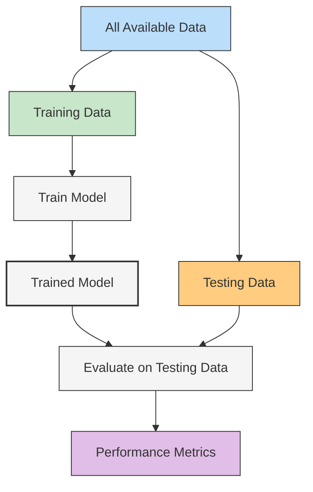

Here's how it works:
1. Split your data into two parts: training (typically 70-80%) and testing (20-30%)
2. Use only the training data to teach your model
3. Test the model on the testing data to see how well it performs on new examples

This approach prevents a common problem called **overfitting**, where your model memorizes the training data instead of learning general patterns. A model that's overfit will perform great on training data but poorly on new data.

Think of it like this: if you memorize all the questions and answers for a practice exam, you might get 100% on that practice test. But how will you do on the real exam with different questions? That's what the testing data helps us measure.

### Generalization and Model Evaluation

The ultimate goal of machine learning is **generalization** - having a model that works well on new, unseen data. It's not enough to do well on the examples you trained with; the model needs to learn the underlying patterns that will apply to future cases.

We evaluate models using various metrics depending on the task:

- **Classification** (predicting categories): accuracy, precision, recall, F1-score
- **Regression** (predicting numbers): mean squared error, mean absolute error, R-squared
- **Clustering** (finding groups): silhouette score, Davies-Bouldin index

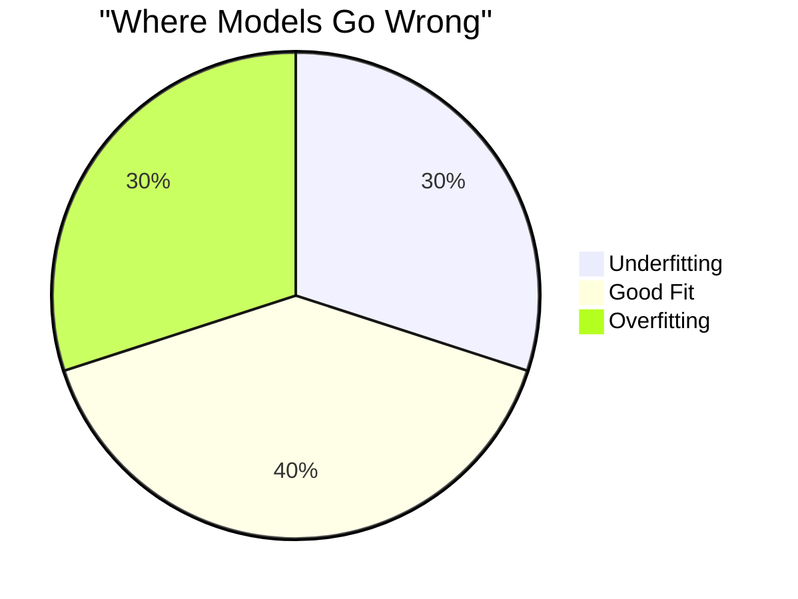

Effective evaluation requires asking the right questions:
- Is our test data representative of the real-world data the model will see?
- Does our evaluation metric match what we actually care about?
- How sensitive is our model to small changes in the data?

### The Bias-Variance Tradeoff

One of the most fundamental challenges in machine learning is balancing **bias** and **variance** - two types of errors that pull in opposite directions.

**Bias** is the error from overly simplistic assumptions. A high-bias model pays too little attention to the training data and oversimplifies the problem (underfitting).

**Variance** is the error from sensitivity to small fluctuations in the training data. A high-variance model pays too much attention to the training data and doesn't generalize well (overfitting).

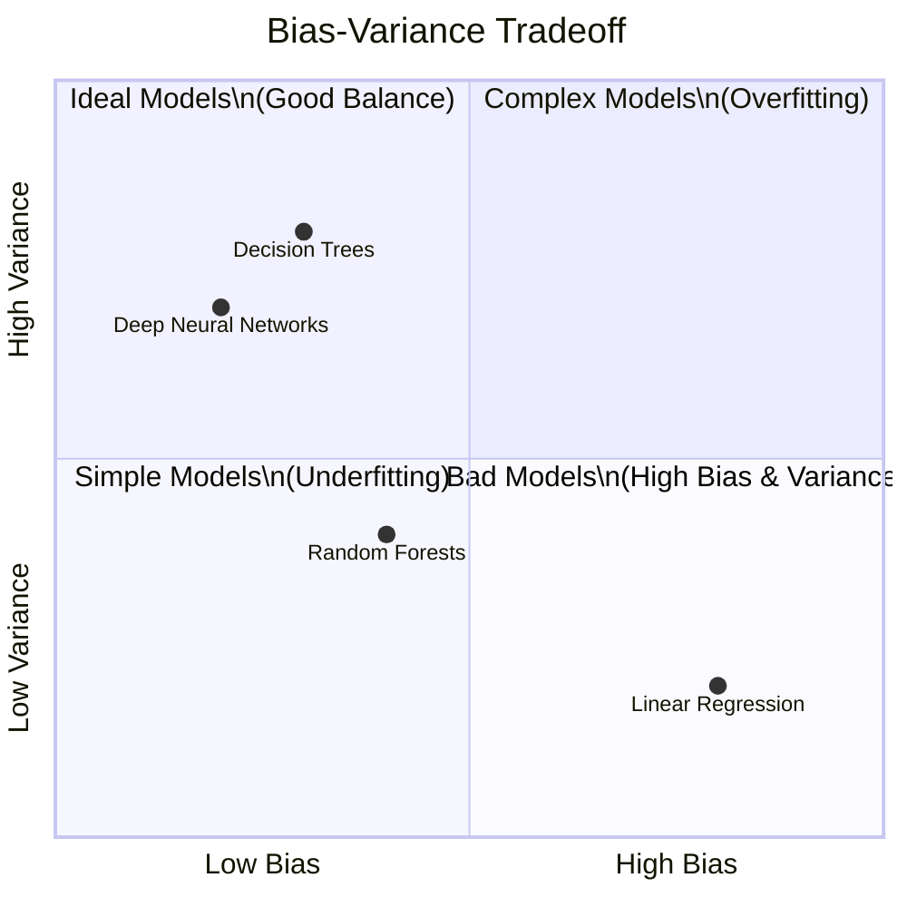

The goal is to find the sweet spot - a model complex enough to learn the true patterns in the data, but not so complex that it learns the noise. This is why we use techniques like:

- **Regularization**: Adding penalties for complexity
- **Cross-validation**: Testing on multiple subsets of data
- **Ensemble methods**: Combining multiple models
- **Early stopping**: Halting training before overfitting occurs

As we build deep learning models in later chapters, managing this tradeoff will be crucial for developing systems that work well in the real world.

## Machine Learning in the Wild

Enough theory! Let's look at how machine learning is actually being used to solve real problems.

### Real-World Examples and Case Studies

Machine learning is transforming industries across the board. Here are just a few examples:

**Healthcare:**
- Detecting diseases from medical images
- Predicting patient readmissions
- Discovering new drugs
- Personalized treatment recommendations

**Finance:**
- Fraud detection
- Algorithmic trading
- Loan approval
- Customer service chatbots

**Transportation:**
- Self-driving vehicles
- Traffic prediction
- Route optimization
- Predictive maintenance

**Entertainment:**
- Content recommendation (Netflix, Spotify)
- Game AI opponents
- Voice assistants
- Content creation (art, music, writing)

**Educational Technology (EdTech):**
- Personalized learning paths based on student performance
- Automatic grading and feedback systems
- Detecting student engagement and emotional states
- Predicting at-risk students who might need extra support
- Adaptive testing that adjusts difficulty based on student responses
- Content recommendation for educational resources
- Analyzing teaching methods and their effectiveness

**Agentic Workflow Systems:**
- AI assistants that can execute complex tasks across multiple tools
- Document processing agents that extract, summarize, and take actions on information
- Research agents that gather information, synthesize findings, and generate reports
- Code generation and debugging assistants that understand developer intent
- Meeting assistants that transcribe, summarize, and create action items
- Data processing workflows that clean, transform, and analyze without human intervention
- Project management agents that track progress and allocate resources automatically

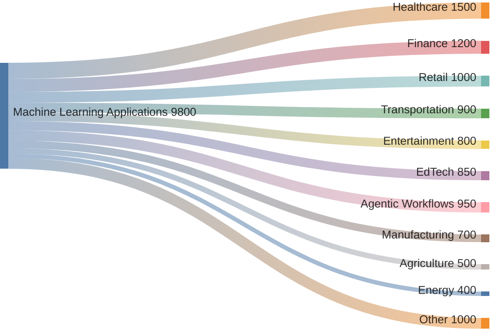

In each case, machine learning provides value by:
1. Finding patterns humans would miss
2. Operating at scales humans couldn't manage
3. Making consistent decisions without fatigue
4. Adapting to new data without being explicitly reprogrammed
5. Automating complex workflows with minimal human supervision

### From Simple to Complex Learning Systems

Machine learning systems exist on a spectrum of complexity. Let's look at a few examples across different domains, from simplest to most complex:

**Simple Learning Systems:**
- **Linear Regression**: Predicting house prices based on square footage and bedrooms
- **Decision Trees**: Creating basic student placement recommendations in EdTech
- **Rule-based Classifiers**: Filtering basic spam emails
- **Simple Chatbots**: Answering frequently asked questions with pattern matching

**Medium Complexity Systems:**
- **Random Forests**: Detecting fraudulent financial transactions
- **Gradient Boosting**: Predicting student performance in adaptive learning platforms
- **Support Vector Machines**: Medical diagnosis from structured patient data
- **Collaborative Filtering**: Recommending educational resources based on similar users

**Complex Learning Systems:**
- **Deep Neural Networks**: Recognizing objects in images, translating languages
- **Large Language Models**: Powering sophisticated agentic frameworks that can reason, plan and execute
- **Multi-agent Systems**: Coordinating multiple AI workers to complete complex tasks
- **Reinforcement Learning**: Personalizing educational content delivery in real-time
- **Agentic Workflow Frameworks**: LangChain, AutoGPT and similar tools that enable autonomous planning and execution

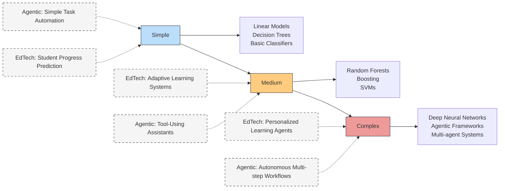

The key insight is that we should match the complexity of our solution to the complexity of the problem. Not every task needs deep learning or agentic frameworks - sometimes simpler approaches work just fine and are easier to understand, faster to train, and require less data. For example, a basic educational recommendation system might work well with collaborative filtering, while a fully personalized adaptive learning platform might need deep learning approaches.

### The Machine Learning Landscape Today

The field of machine learning is evolving incredibly quickly. Here's where things stand today:

**Trending Areas:**
- **Foundation Models**: Massive models like GPT-4 and DALL-E that can be adapted to many tasks
- **Self-supervised Learning**: Models that learn from data without explicit labels
- **Multimodal Learning**: Systems that can process different types of inputs (text, images, audio)
- **AI Agents**: Systems that can take actions in environments to achieve goals
- **Explainable AI**: Making black-box models more interpretable

**Current Challenges:**
- **Data Quality**: Getting good, representative, unbiased data
- **Compute Resources**: Training larger models requires significant computing power
- **Energy Consumption**: The environmental impact of training large models
- **Privacy Concerns**: Using personal data while respecting privacy
- **Fairness and Bias**: Ensuring models don't perpetuate or amplify societal biases

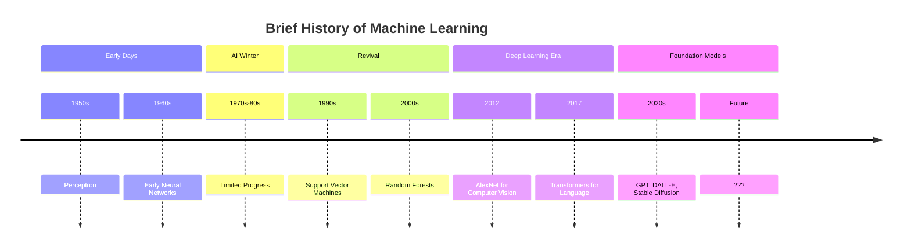

As someone learning deep learning today, you're entering the field at an incredibly exciting time. The tools, frameworks, and knowledge available now make it possible to build systems that would have seemed like science fiction just a decade ago.

### The Rise of AI Employees: From Automation to Digital Colleagues

The evolution of AI in business settings reveals a fascinating progression in how we think about work and automation:

**Phase 1: Manual Human Work**  
Traditionally, businesses relied entirely on human employees performing manual tasks - from data entry to customer service to complex decision-making. Every step required human time, attention, and expertise.

**Phase 2: Robotic Process Automation (RPA)**  
The first wave of business automation focused on rule-based tasks. RPA tools could mimic specific human actions in digital systems - clicking buttons, copying data between applications, following IF-THEN logic. These 'software robots' excelled at repetitive, predictable tasks but lacked intelligence or adaptability.

**Phase 3: AI Employees**  
We're now entering the era of AI Employees - autonomous systems that function more like human workers than simple automation tools. Unlike RPA, these systems can:

- **Learn and adapt** to new situations without explicit reprogramming
- **Understand context** and handle ambiguity
- **Make judgment calls** when faced with uncertainty
- **Work across multiple systems and domains** with general problem-solving abilities
- **Collaborate** with humans and other AI systems

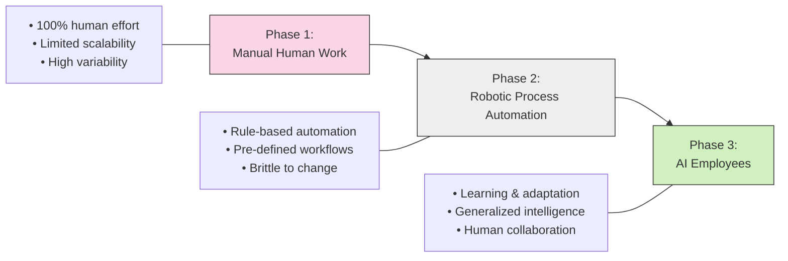

AI Employees aren't just automating tasks - they're transforming how we think about work itself. Forward-thinking companies now maintain 'digital workforces' alongside their human teams, with AI systems taking on roles like:

- **AI Research Assistants** that can review thousands of papers, extract insights, and generate summaries
- **AI Creative Partners** that collaborate with designers to generate and refine visual assets
- **AI Coding Companions** that understand software architecture and can implement features
- **AI Customer Support Agents** that handle complex service inquiries with empathy and problem-solving
- **AI Data Analysts** that continuously monitor business metrics and proactively generate insights

Unlike traditional software that depreciates over time, these AI systems get better through use - learning from feedback, adapting to new requirements, and continuously increasing their value to the organization.

Perhaps most importantly, AI Employees aren't replacing humans but rather changing what humans focus on. By handling routine cognitive tasks, they free people to concentrate on creative problem-solving, innovation, relationship-building, and other uniquely human strengths.

## Summary

In this chapter, we've explored the fundamental concepts of machine learning:

- **Types of Learning**: We've seen how supervised learning uses labeled data to make predictions, unsupervised learning finds patterns without labels, and reinforcement learning learns through interaction and feedback.

- **Parametric vs. Nonparametric Models**: We've learned about two approaches to storing knowledge - fixed parameters vs. growing with the data - and the trade-offs between them.

- **Core Principles**: We've covered the training-testing paradigm, the importance of generalization, and the constant challenge of balancing bias and variance.

- **Real-World Applications**: We've explored how machine learning is transforming industries and the current state of the field.

In the next chapter, we'll dive into forward propagation - the foundational mechanism that allows neural networks to make predictions. Get ready to build your first neural network!

## Exercises

1. **Learning Types**: Identify whether each of these tasks is supervised, unsupervised, or reinforcement learning:
   - Grouping customers by purchasing behavior
   - Teaching a robot to walk
   - Predicting tomorrow's stock prices based on today's
   - Finding unusual patterns in credit card transactions

2. **Data Split**: Why is it important to split your data into training and testing sets? What might happen if you evaluate your model only on the data it was trained on?

3. **Practical Application**: Think about a problem in your life or work that might benefit from machine learning. What type of learning would be most appropriate? What data would you need?

4. **Bias-Variance**: For a house price prediction model, give examples of what might indicate:
   - High bias (underfitting)
   - High variance (overfitting)
   - A good balance between the two

5. **Technology Exploration**: Choose one of the machine learning tools or libraries mentioned in Chapter 1 (TensorFlow, PyTorch, etc.) and spend 15 minutes exploring its documentation. What kinds of problems is it designed to solve?
