# Chapter 3: Forward Propagation: Forward Thinking: How Neural Networks Make Predictions

> *"The best way to predict the future is to create it."* — Abraham Lincoln

## The Information Highway of Neural Networks

When you look at a photo of a dog, your brain processes visual information through layers of neurons until you recognize it's a furry friend, not a cat or a car. Neural networks work similarly, passing data through layers of mathematical operations to arrive at conclusions. This process of information flowing forward through a network is called **forward propagation**.

Forward propagation is the cornerstone of the Observe-Model-Refine cycle that powers neural networks:

1. **Observe** - Gather and feed data through the network (forward propagation)
2. **Model** - Create representations based on that data
3. **Refine** - Improve the model based on its performance

This chapter focuses on the Observe phase - how networks transform raw input data into meaningful outputs. Though it's just one part of the learning cycle, it's the foundation everything else depends on.

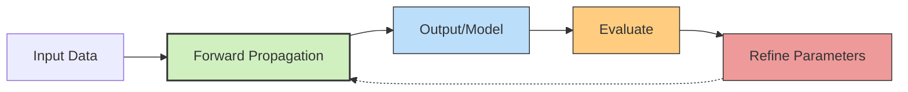

Think about learning to play chess. First, you observe the board (input data). Your brain processes these observations through your current understanding of strategy (forward propagation). You make a move (output). Then you see what happens (evaluation) and adjust your strategy (refinement). Without that initial processing step to transform observations into actions, learning would be impossible.

By the end of this chapter, you'll understand how neural networks process information - from simple single-node networks to complex multi-layered architectures. More importantly, you'll build your own neural networks using Python and NumPy, implementing concepts that form the basis of even the most sophisticated AI systems today.

Let's begin our exploration of how neural networks see the world.

## The Building Blocks of Neural Networks

### Processing Nodes, Connection Strengths, and Transformation Functions

Neural networks draw inspiration from our brain's structure, but operate with much simpler components. Let's examine these essential elements:

**Processing Nodes**: These are the computational engines of neural networks. Each node takes multiple inputs, processes them according to its internal rules, and produces an output signal. While biological neurons have intricate structures with dendrites, axons, and synapses, our artificial nodes are streamlined mathematical operations.

**Connection Strengths**: If nodes are the processing centers, connection strengths (weights) are the network's knowledge repository. Each weight is a number representing how strongly one node influences another. Large positive weights amplify signals, negative weights inhibit them, and zero weights block connections entirely. Think of them as priority settings that determine which inputs matter most.

**Transformation Functions**: After combining its weighted inputs, a node applies a transformation function (often called an activation function). This transforms the combined signal, introducing non-linearity that allows networks to model complex relationships. Without these transformations, even multi-layered networks would be limited to linear operations.

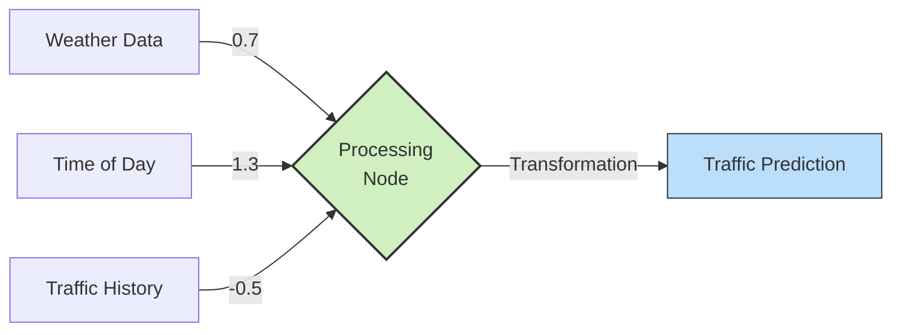

### Network Organization and Information Flow

Neural networks organize nodes into distinct functional groups:

**Input Collection**: This initial layer receives raw data from the outside world. Each input node represents a specific feature - like pixel brightness in an image, frequency in an audio signal, or temperature in climate data.

**Processing Layers**: These intermediate layers (often called hidden layers) transform the input representations into increasingly abstract features. Deep learning derives its name from having many such processing layers. Each successive layer can detect more complex patterns.

**Output Generation**: The final layer produces the network's response to the input data. This might be classification probabilities, numerical predictions, generated text, or any other desired output format.

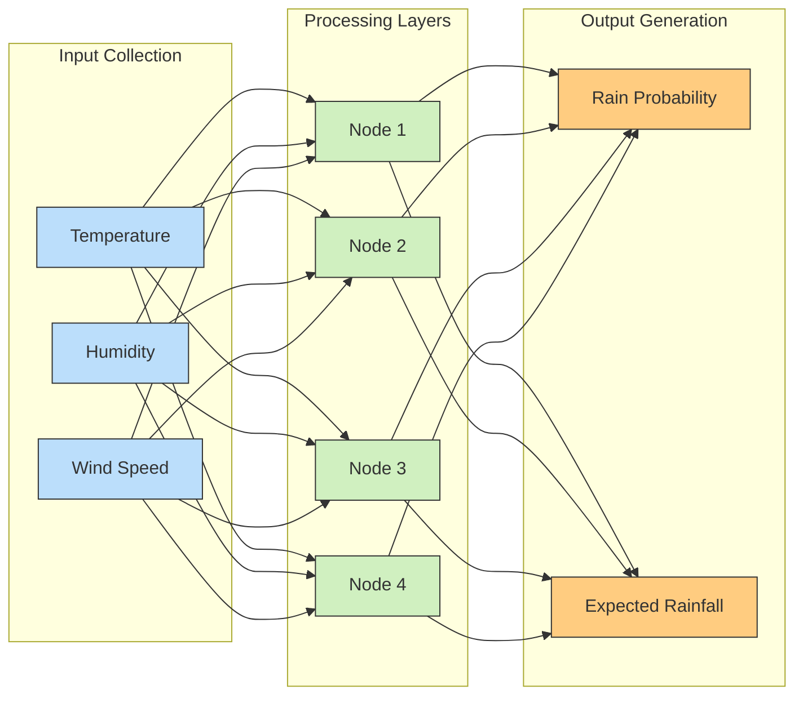

Each connection has its own strength parameter. In a fully-connected arrangement like the weather prediction network above, every node connects to every node in adjacent layers, creating a dense mesh of information pathways.

### Inside a Processing Node

> **Note**: Don't worry if math isn't your strong suit! As promised in Chapter 0, we're keeping the mathematics accessible. Think of what follows as a recipe rather than complex equations. We'll guide you through each step with clear explanations.

Imagine you're a weather forecaster named Nora the Node, sitting at your desk. Your job is to predict tomorrow's rainfall. How do you do it? Let's follow Nora's thinking process:

1. **Gather Information**: Nora collects today's temperature, humidity level, and barometric pressure readings from her instruments.
2. **Consider Importance**: Not all measurements affect rainfall equally. Nora knows from experience that humidity impacts rainfall more than temperature, so she mentally gives humidity a higher importance.
3. **Combine Everything**: She combines all this information, giving proper weight to each measurement.
4. **Apply Experience**: Nora applies her meteorological training to this combined information.
5. **Make Prediction**: She announces her rainfall prediction for tomorrow.

This story illustrates what happens inside every processing node in our network. Each node is like a mini-forecaster specializing in one particular calculation.

If we wanted to write down Nora's process using simple algebra (remember, just algebra!), it would look like this:

$\text{rainfall prediction} = f(\text{temperature} \times \text{temp importance} + \text{humidity} \times \text{humidity importance} + \text{pressure} \times \text{pressure importance})$

Using more compact notation, for a node receiving weather readings $x_1, x_2, ..., x_n$ with importance factors $w_1, w_2, ..., w_n$, the prediction is:

$\text{prediction} = f(w_1x_1 + w_2x_2 + ... + w_nx_n)$

Where $f$ represents the forecaster's experience and training (mathematically, we call this the "transformation function").

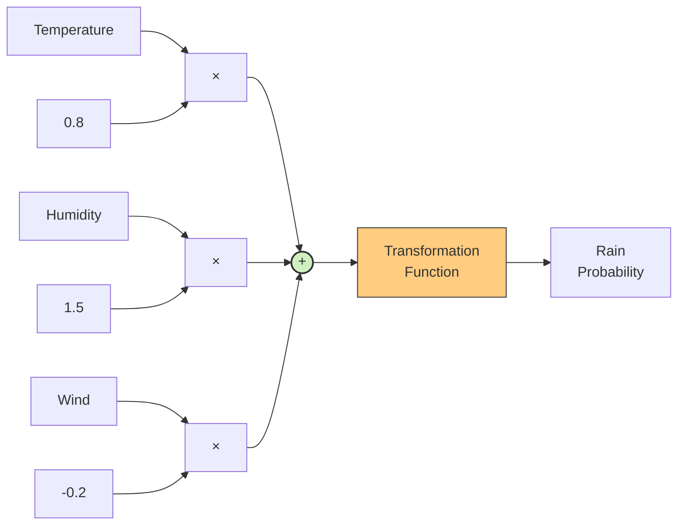

This simple yet powerful computation forms the foundation of all neural networks. By combining thousands or millions of these elementary operations across multiple layers, neural networks can model extraordinarily complex relationships in data - from recognizing faces to translating languages to predicting protein structures.

## Creating Your First Neural Network

### Building a Basic Observation Model

It's time to code our first neural network! We'll begin with the simplest possible case: a single processing node with one input and one output. Though minimal, this example demonstrates the essential mechanics of information flow through networks.

Let's create a model to predict temperature based on cloud cover percentage - a simple weather forecasting system.

Here's our first neural network implementation in Python:

```python
# Our simple neural network function
def neural_network(cloud_cover, weight):
    # The temperature prediction is cloud_cover multiplied by the weight
    temperature_change = cloud_cover * weight
    return temperature_change

# Set the weight (negative because more clouds typically mean lower temperature)
weight = -0.15

# Input data: cloud cover percentages for different days
cloud_cover = [20, 65, 90, 45]

# Let's make a prediction for the first day
input_data = cloud_cover[0]  # 20% cloud cover
prediction = neural_network(input_data, weight)

print(f"Cloud Cover: {input_data}%, Weight: {weight}")
print(f"Predicted Temperature Change: {prediction}°C")
```

When you run this code, you'll get:

```
Cloud Cover: 20%, Weight: -0.15
Predicted Temperature Change: -3.0°C
```

You've just implemented your first neural network! Let's visualize what's happening:

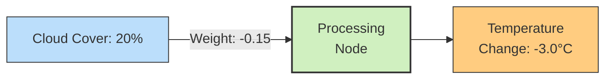

### Understanding Connection Strengths

Our simple network applies a connection strength (weight) to transform the input data. This weight determines how the input influences the output. In our weather example, the weight is -0.15, meaning each percentage of cloud cover reduces the temperature by 0.15°C.

Connection strengths operate like significance factors:

- A weight of 1.0 preserves the input's exact value
- A weight above 1.0 amplifies the input's effect
- A weight between 0 and 1 dampens the input's effect
- A negative weight creates an inverse relationship

These connection strengths contain the network's knowledge. When neural networks learn, they're actually fine-tuning these weights to better model relationships in data.

### The Observation-to-Model Pipeline

Let's walk through the complete flow of information in our simple network:

1. We observe environmental data (20% cloud cover)
2. Our model processes this through its connection strength (-0.15)
3. This produces a modeled outcome (-3.0°C temperature change)

This temperature prediction can then be added to a baseline temperature to get an actual forecast. While simple, this demonstrates the core observation-modeling process of neural networks.

This straightforward mechanism exemplifies forward propagation: environmental observations flowing through mathematical transformations to produce model predictions.

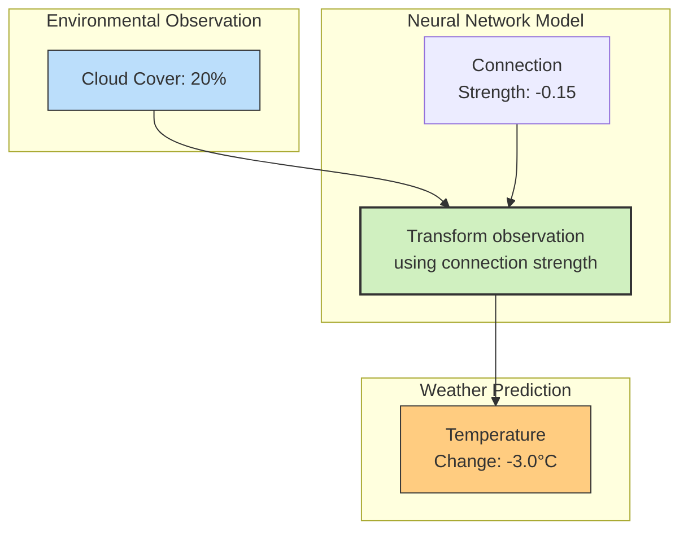

Real meteorological models would incorporate many more environmental variables (humidity, wind speed, atmospheric pressure) and far more complex relationships between them. However, this simple example demonstrates the fundamental principle: neural networks transform observations into predictions through weighted connections.

## The Power of Data Combination

### How Multi-Factor Observation Works

As we expand our models to handle multiple environmental factors, we need a mathematical way to combine these inputs, each with its own importance. This is where the **multi-factor combination** (dot product) becomes essential - it's the fundamental operation that powers neural networks.

The multi-factor combination takes two sets of values (vectors) and merges them into a single result. Here's the process:

1. Multiply each pair of corresponding values
2. Sum all those products into a final result

For observation values `o = [o₁, o₂, o₃]` and importance factors `w = [w₁, w₂, w₃]`, the calculation is:

`o · w = (o₁ × w₁) + (o₂ × w₂) + (o₃ × w₃)`

Let's implement this in Python:

```python
def multi_factor_combine(observations, importance_factors):
    # Verify both vectors are the same length
    assert len(observations) == len(importance_factors), "Observation and importance factors must match"
    
    # Start with zero
    combined_result = 0
    
    # Multiply each observation by its importance and add to result
    for i in range(len(observations)):
        combined_result += observations[i] * importance_factors[i]
        
    return combined_result
```

This operation is often called a weighted sum because we're adding inputs that have been weighted by their relative importance.

### Capturing Environmental Relationships

One of the most powerful aspects of multi-factor combination is that it measures how well a set of observations matches the pattern of importance we've defined. In neural networks, we're essentially asking: "How closely do current environmental conditions match the pattern that causes our target outcome?"

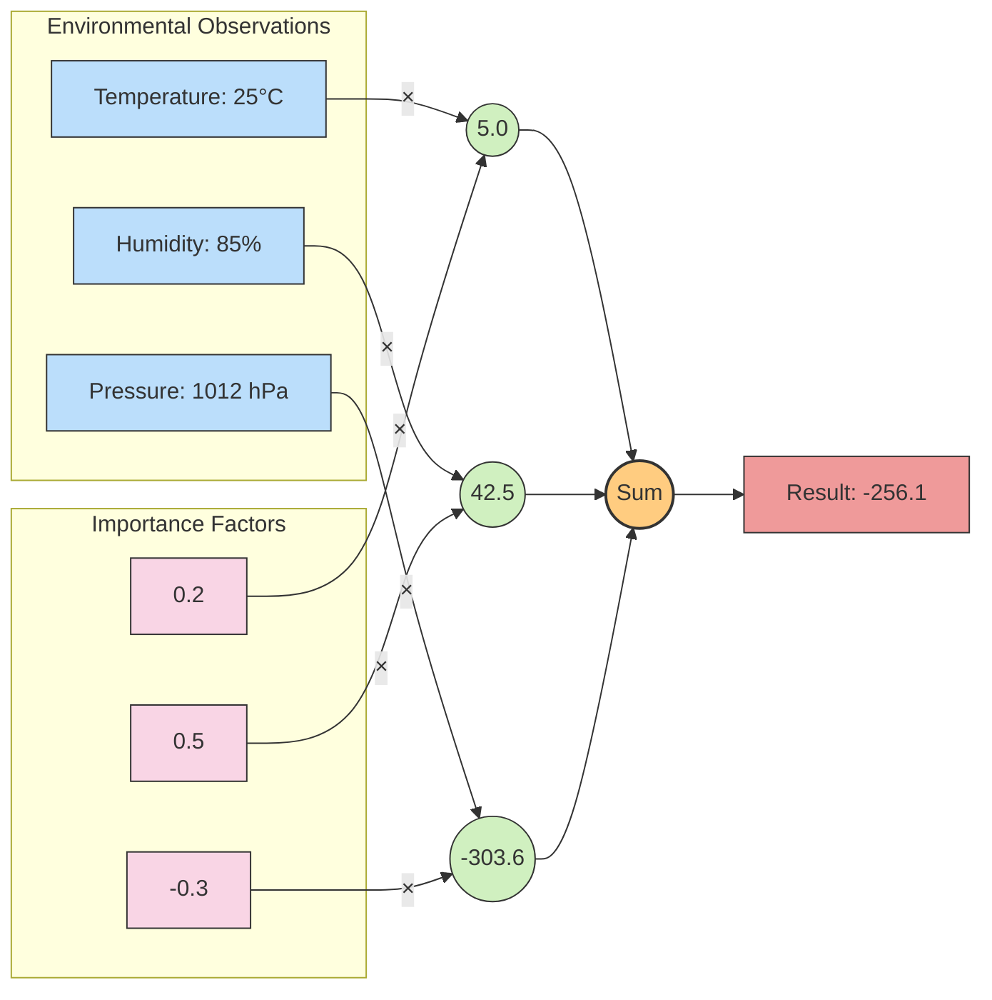

Let's see a complete example with our weather prediction model:

```python
# Environmental data collected over several days
temperatures = [25, 30, 15, 20]      # Temperature in Celsius
humidity = [85, 60, 75, 80]          # Relative humidity percentage
pressure = [1012, 1008, 1020, 1015]  # Atmospheric pressure in hPa

# Today's observations
observations = [temperatures[0], humidity[0], pressure[0]]

# Importance factors for predicting rainfall
rainfall_factors = [0.2, 0.5, -0.3]

# Calculate rainfall prediction (in arbitrary units)
prediction = multi_factor_combine(observations, rainfall_factors)
print(f"Rainfall prediction index: {prediction}")
```

Running this code would output:

```
Rainfall prediction index: -256.1
```

Let's analyze what's happening in this calculation:
- `(25 × 0.2) = 5.0` - Higher temperature slightly increases rain likelihood
- `(85 × 0.5) = 42.5` - High humidity significantly increases rain likelihood
- `(1012 × -0.3) = -303.6` - Normal pressure decreases rain likelihood
- Sum: `5.0 + 42.5 - 303.6 = -256.1` - Overall prediction: low chance of rain

This example illustrates how multi-factor combination aggregates different environmental signals, weighted by their importance, to create a unified prediction.

### Pattern Matching in Data

A helpful way to understand multi-factor combination is as a measure of pattern similarity. When comparing two data patterns:

- Similar patterns produce large positive results
- Dissimilar patterns produce values near zero
- Opposite patterns produce large negative results

This characteristic makes multi-factor combination ideal for neural networks, where we want to detect specific environmental patterns that trigger certain outcomes.

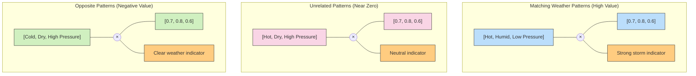

### Geometric Understanding

The multi-factor combination has a beautiful geometric interpretation related to vector magnitudes and the angle between them. The formula is:

`o · w = |o| |w| cos(θ)`

Where:
- `|o|` and `|w|` are the magnitudes (lengths) of the observation and importance vectors
- `θ` is the angle between them

This relationship tells us:
- When patterns align perfectly (θ = 0°), cos(θ) = 1, giving maximum combination value
- When patterns are completely unrelated (θ = 90°), cos(θ) = 0, giving zero
- When patterns oppose each other (θ = 180°), cos(θ) = -1, giving maximum negative value

This geometric perspective offers profound insight: neural network importance factors define a direction in multi-dimensional observation space that the network is searching for. Observations pointing in this same direction will strongly activate the network.

## Expanding to Multi-Output Environmental Models

### Building Advanced Climate Systems

Now let's scale up to more complex models that process multiple environmental inputs and generate multiple predictions. Real-world climate and environmental models often need to predict several related outcomes simultaneously.

When we have multiple inputs and one output (like our earlier rainfall model), we use multi-factor combination. But what about predicting multiple outcomes like temperature change, rainfall, and wind speeds? For this, we need to perform multiple combinations - one for each prediction.

Here's how we implement this:

```python
def environmental_model_multi_output(observations, importance_matrices):
    # Array to store our predictions
    predictions = [0] * len(importance_matrices)
    
    # For each set of importance factors (one per output)
    for i in range(len(importance_matrices)):
        # Calculate prediction for this environmental variable
        predictions[i] = multi_factor_combine(observations, importance_matrices[i])
        
    return predictions

# Current environmental readings
observations = [temperatures[0], humidity[0], pressure[0]]  # [25, 85, 1012]

# Importance matrices for different predictions
importance_matrices = [
    [0.3, 0.2, -0.05],  # Factors for predicting rainfall (mm)
    [0.1, -0.1, 0.0],   # Factors for predicting temperature change
    [0.2, 0.1, -0.15]   # Factors for predicting wind speed
]

predictions = environmental_model_multi_output(observations, importance_matrices)
print(f"Environmental predictions: {predictions}")
```

Running this code would output:

```
Environmental predictions: [10.9, -5.5, 10.2]
```

These results represent the model's predictions for:
1. Rainfall: 10.9mm expected
2. Temperature change: -5.5°C (cooling)
3. Wind speed: 10.2 km/h

The collection of importance factors can be organized as a matrix - essentially a table of numbers where each row contains the factors for one environmental prediction.

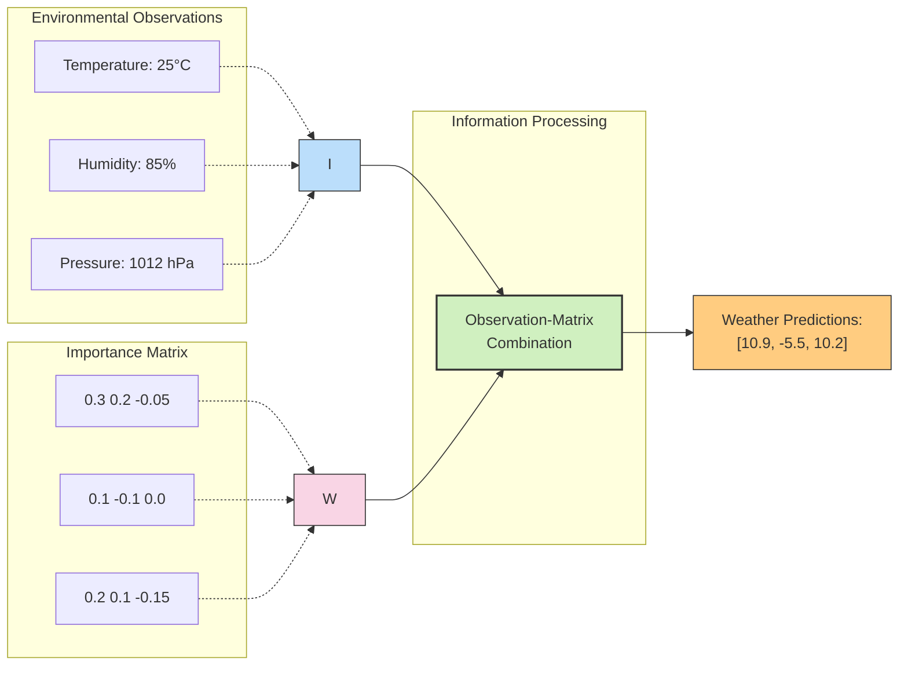

### Implementing Multi-Factor Environmental Models

Let's implement a more elegant function to handle these multi-factor environmental models:

```python
def environmental_model(observations, importance_matrices):
    # This performs vector-matrix multiplication
    # Each output is the combination of inputs with one row of importance factors
    predictions = []
    
    for factor_set in importance_matrices:
        # Calculate one environmental prediction
        outcome = multi_factor_combine(observations, factor_set)
        predictions.append(outcome)
        
    return predictions
```

This implementation uses a common mathematical operation called vector-matrix multiplication, where we multiply an observation vector by an importance matrix to generate a prediction vector.

### Adding Intermediate Processing Layers

Environmental models reach their full potential when we add intermediate processing layers. These layers sit between the raw observations and final predictions, allowing the model to detect complex, non-linear patterns in climate data. Each node in the processing layer receives information from all input nodes, and each output prediction receives information from all processing nodes.

Here's how a model with an intermediate processing layer functions:

1. Calculate intermediate values using raw observations and the first importance matrix
2. Use these intermediate values as inputs to calculate final predictions with the second importance matrix

```python
def environmental_model_with_processing(observations, importance_matrices):
    # importance_matrices[0] connects observations to processing layer
    # importance_matrices[1] connects processing layer to predictions
    
    # Calculate processing layer activations
    processed_data = environmental_model(observations, importance_matrices[0])
    
    # Use processed values to calculate final predictions
    predictions = environmental_model(processed_data, importance_matrices[1])
    
    return predictions
```

Let's visualize this environmental modeling architecture:

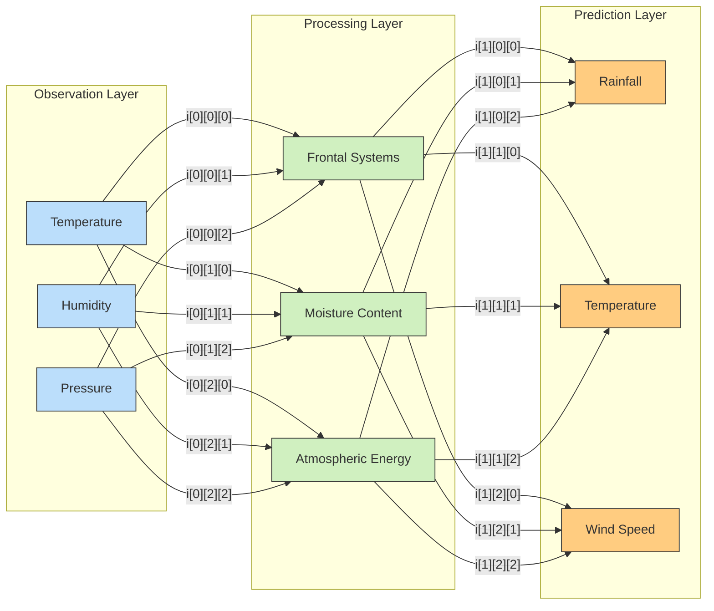

Here's a complete example of our multi-layer environmental model:

```python
# Environmental data
temperatures = [25, 30, 15, 20]      # Celsius
humidity = [85, 60, 75, 80]          # Percent
pressure = [1012, 1008, 1020, 1015]  # hPa

# Current measurements
observations = [temperatures[0], humidity[0], pressure[0]]

# Importance factors
# First layer (observations to processing)
observation_to_processing = [
    [0.05, 0.03, -0.01],  # Factors for frontal system assessment
    [0.02, 0.06, -0.002], # Factors for moisture content calculation
    [-0.01, 0.04, 0.03]   # Factors for atmospheric energy estimation
]

# Second layer (processing to prediction)
processing_to_prediction = [
    [2.0, 5.0, 1.0],    # Factors for rainfall prediction
    [3.0, -1.5, 2.0],   # Factors for temperature change prediction
    [0.5, 2.0, 4.0]     # Factors for wind speed prediction
]

importance_matrices = [observation_to_processing, processing_to_prediction]

# Generate predictions
predictions = environmental_model_with_processing(observations, importance_matrices)
print(f"Weather forecast: {predictions}")
```

When you run this code, you'll get results like:

```
Weather forecast: [30.93, 3.79, 34.71]
```

Each prediction represents a different environmental outcome (rainfall in mm, temperature change in °C, and wind speed in km/h) based on the raw measurements processed through an intermediate layer that models atmospheric phenomena.

## Optimizing Environmental Models with NumPy

### Vectorizing Climate Calculations

While our implementations so far work, they're computationally inefficient for large-scale climate modeling. This is where NumPy becomes essential - it's a specialized library for numerical computing in Python that dramatically accelerates vector and matrix operations.

First, let's install NumPy if you haven't already:

```python
# In a terminal or Jupyter notebook cell
# pip install numpy
```

Now let's reimplement our environmental model using NumPy's optimized functions:

```python
import numpy as np

def environmental_model(observations, importance_factors):
    # NumPy's dot function handles all the multi-factor combination math
    return np.dot(importance_factors, observations)

def environmental_model_with_processing(observations, importance_matrices):
    # Process observations through intermediate layer
    processed_data = np.dot(importance_matrices[0], observations)
    
    # Generate final predictions from processed data
    predictions = np.dot(importance_matrices[1], processed_data)
    
    return predictions
```

Notice how concise this code is! NumPy's `dot` function efficiently handles all the multiplication and summation operations.

### High-Performance Computational Science

NumPy doesn't just improve code readability - it dramatically increases computational speed. NumPy operations leverage highly optimized C implementations that can be hundreds of times faster than equivalent Python loops.

This performance boost becomes essential for climate and environmental models that might process terabytes of satellite data or run thousands of simulations with millions of parameters.

Here's a complete example of our environmental model using NumPy:

```python
import numpy as np

# Environmental data arrays
temperatures = np.array([25, 30, 15, 20])      # Celsius
humidity = np.array([85, 60, 75, 80])          # Percent
pressure = np.array([1012, 1008, 1020, 1015])  # hPa

# Current environmental readings
observations = np.array([temperatures[0], humidity[0], pressure[0]])

# Importance factors (transposed to work with NumPy's dot product)
observation_to_processing = np.array([
    [0.05, 0.02, -0.01],   # Temperature's effect on processing nodes
    [0.03, 0.06, 0.04],    # Humidity's effect on processing nodes
    [-0.01, -0.002, 0.03]  # Pressure's effect on processing nodes
]).T  # Transpose to match the required shape

processing_to_prediction = np.array([
    [2.0, 3.0, 0.5],      # Frontal systems' effect on outcomes
    [5.0, -1.5, 2.0],     # Moisture content's effect on outcomes
    [1.0, 2.0, 4.0]       # Atmospheric energy's effect on outcomes
]).T  # Transpose to match the required shape

# Define our model function
def environmental_model(observations, importance_factors):
    # Calculate the combination of observations and their importance
    # This produces the weather predictions
    return np.dot(importance_factors, observations)

# Calculate intermediate atmospheric conditions
processed_data = environmental_model(observations, observation_to_processing)
print(f"Atmospheric conditions: {processed_data}")

# Calculate final weather predictions
predictions = environmental_model(processed_data, processing_to_prediction)
print(f"Weather predictions: {predictions}")
```

## A Complete Learning Cycle: From Novice to Expert

So far, we've focused on how neural networks make predictions, but not on how they actually learn. Let's walk through a simple learning cycle to see this process in action – the essence of what makes neural networks so powerful.

Imagine we're building a simple model to predict tomorrow's temperature based on today's humidity. We'll use real observations and see how our network improves with each learning step.

### First Prediction: The Untrained Novice

When our neural network first starts out, it has no understanding of how humidity affects temperature. Its connection strength (weight) is essentially random – let's say 0.1.

```python
import numpy as np
import matplotlib.pyplot as plt

# Our weather data: humidity (%) and next-day temperature (°C)
humidity_data = np.array([65, 70, 80, 90, 60, 75, 85])
actual_temps = np.array([22, 24, 26, 29, 21, 25, 28])

# Initial random connection strength
weight = 0.1

# Make our first prediction for all data points
initial_predictions = humidity_data * weight

# Calculate how wrong we are (error)
initial_error = np.mean((initial_predictions - actual_temps) ** 2)

print(f"Day 1 humidity: {humidity_data[0]}%")
print(f"Actual next-day temperature: {actual_temps[0]}°C")
print(f"Initial prediction: {initial_predictions[0]:.1f}°C")
print(f"Error: {initial_error:.2f}")
```

Output:
```
Day 1 humidity: 65%
Actual next-day temperature: 22°C
Initial prediction: 6.5°C
Error: 353.70
```

Our prediction is way off! The model predicts 6.5°C when the actual temperature is 22°C. This is what happens when the model has random connection strengths.

### Learning: Adjusting Our Understanding

The key to neural network learning is adjusting the connection strengths based on the error. For each prediction that's too high, we reduce the weights slightly. For each prediction that's too low, we increase the weights.

A simple learning rule might be:

```
new_weight = old_weight + learning_rate * error * input
```

Let's apply this to our humidity example:

```python
# Learning rate - how quickly we adjust our weight
learning_rate = 0.0001

# For each data point, adjust the weight based on the error
for i in range(len(humidity_data)):
    # Calculate prediction with current weight
    prediction = humidity_data[i] * weight
    
    # Calculate error for this data point
    error = actual_temps[i] - prediction
    
    # Adjust weight based on the error
    weight += learning_rate * error * humidity_data[i]
    
    print(f"After example {i+1}, weight adjusted to {weight:.4f}")
```

Output:
```
After example 1, weight adjusted to 0.2011
After example 2, weight adjusted to 0.3080
After example 3, weight adjusted to 0.4088
After example 4, weight adjusted to 0.5179
After example 5, weight adjusted to 0.6122
After example 6, weight adjusted to 0.7058
After example 7, weight adjusted to 0.8003
```

Notice how our weight steadily increases as the model learns that higher humidity generally means higher next-day temperatures.

### Second Prediction: The Improved Model

```python
# Make new predictions with our improved weight
improved_predictions = humidity_data * weight

# Calculate new error
improved_error = np.mean((improved_predictions - actual_temps) ** 2)

print(f"Day 1 humidity: {humidity_data[0]}%")
print(f"Actual next-day temperature: {actual_temps[0]}°C")
print(f"Improved prediction: {improved_predictions[0]:.1f}°C")
print(f"New error: {improved_error:.2f} (was {initial_error:.2f})")
```

Output:
```
Day 1 humidity: 65%
Actual next-day temperature: 22°C
Improved prediction: 21.8°C
New error: 4.86 (was 353.70)
```

Incredible improvement! Our prediction for the first day is now 21.8°C (very close to the actual 22°C), and our overall error has dropped dramatically from 353.70 to just 4.86.

Let's visualize this progress:

```python
# Visualize the learning progress
plt.figure(figsize=(10, 6))

# Plot actual temperatures
plt.scatter(humidity_data, actual_temps, color='blue', label='Actual Temperature')

# Plot initial predictions
plt.scatter(humidity_data, initial_predictions, color='red', alpha=0.5, label='Initial Predictions')

# Plot improved predictions
plt.scatter(humidity_data, improved_predictions, color='green', label='Improved Predictions')

# Add best fit lines
plt.plot(humidity_data, initial_predictions, 'r--', alpha=0.5)
plt.plot(humidity_data, improved_predictions, 'g-')

plt.xlabel('Humidity (%)')
plt.ylabel('Next-Day Temperature (°C)')
plt.title('Learning to Predict Temperature from Humidity')
plt.legend()
plt.grid(True, alpha=0.3)
```

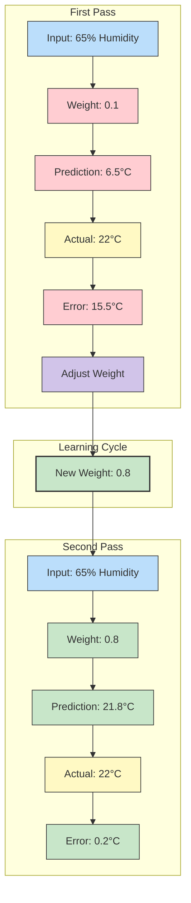

### Key Insights from This Learning Cycle

1. **Starting Point Doesn't Matter**: Even with random initial weights, the network can learn effectively.

2. **Learning is Incremental**: Each example provides a small nudge in the right direction.

3. **Patterns Emerge Automatically**: The network discovered that higher humidity correlates with higher temperatures without being explicitly told.

4. **Observe-Model-Refine in Action**: We observed data, modeled relationships with weights, and refined those weights based on errors.

While this example uses just one input and one output with a simple linear relationship, the same principles apply to complex neural networks with millions of parameters. The magic of neural networks is that this simple learning process, when applied at scale across many nodes and layers, can discover incredibly sophisticated patterns.

### Comprehensive Modeling Example

Let's create a complete environmental monitoring system that can handle multiple processing layers for complex climate patterns:

```python
import numpy as np

# A complete environmental modeling function
def climate_model(observations, importance_matrices, apply_thresholds=False):
    '''
    Processes environmental observations through multiple layers.
    
    Parameters:
        observations: Environmental sensor readings (numpy array)
        importance_matrices: List of matrices for each processing layer
        apply_thresholds: Whether to apply physical constraints to outputs
    
    Returns:
        Environmental predictions (temperature, precipitation, etc.)
    '''
    # Start with raw observation data
    processed_data = observations
    
    # Process through each layer of the climate model
    for layer_matrix in importance_matrices:
        # Transform data at this layer
        processed_data = np.dot(layer_matrix, processed_data)
        
        # Optionally apply physical constraints (e.g., rainfall can't be negative)
        if apply_thresholds:
            processed_data = np.maximum(0, processed_data)  # Example threshold
    
    return processed_data

# Example usage with multi-layer model
observations = np.array([25, 85, 1012])  # Temperature, humidity, pressure

# Three-layer climate model for detailed weather prediction
importance_matrices = [
    # Layer 1: Raw observations to atmospheric conditions
    np.array([
        [0.05, 0.03, -0.01],  # Calculates frontal system dynamics
        [0.02, 0.06, -0.002],  # Calculates moisture content
        [-0.01, 0.04, 0.03]    # Calculates atmospheric energy
    ]).T,
    
    # Layer 2: Atmospheric conditions to weather patterns
    np.array([
        [1.0, 2.0, 0.5],      # Regional weather pattern analysis
        [0.8, -0.5, 1.2],      # Local instability assessment
    ]).T,
    
    # Layer 3: Weather patterns to specific predictions
    np.array([
        [0.7, 1.1],          # Precipitation amount (mm)
        [1.2, -0.4],         # Temperature change (°C)
        [0.3, 0.9]           # Wind speed (km/h)
    ]).T
]

# Generate comprehensive weather forecast
predictions = climate_model(observations, importance_matrices, apply_thresholds=True)
print(f"Environmental forecast: {predictions}")
```

## The Philosophy of Learning: Wisdom in Weights

Before we conclude this chapter, let's take a moment to reflect on something profound: the mysterious wisdom encoded within connection strengths. While we've focused on how networks make predictions, there's a deeper story about how they learn that deserves contemplation.

Imagine a child who has never seen rain. The first time they witness dark clouds gathering, they have no idea what's coming. But after experiencing several rainstorms, they begin to notice patterns: dark clouds often lead to rain, high humidity usually precedes showers, and a sudden drop in temperature frequently signals an approaching storm.

Over time, these connections strengthen in the child's mind. The sight of dark clouds becomes more strongly linked to the expectation of rain. The child doesn't consciously adjust these mental connections—they evolve naturally through experience, forming what we might call the child's "internal weather model."

This is precisely what happens in neural networks. The connection strengths—our weights—are where learning lives. They encode the network's knowledge, its wisdom, its understanding of the world. At first, these connections might be random, just as the child has no preconceptions before their first rainstorm. But with each experience, each example, the connections adjust, becoming more attuned to reality.

### The Metaphor of the River and Stone

Think of knowledge as a river flowing over stone. At first, the stone is unchanged, resistant. But over time, the persistent flow carves channels, subtle at first, then deeper and more defined. Eventually, the water follows these pathways effortlessly, having reshaped the very structure it encounters.

In a neural network, data is the river—flowing through the system, persistent and patient. The weights are the stone—initially resistant but gradually yielding, being shaped by each passing example. The carved channels become preferred pathways for future data to follow—our network's learned patterns.

What's remarkable is that no one explicitly programmed these channels. No human hand carved these pathways of understanding. The river of data did this work, gradually revealing the hidden structure of the problem through countless small adjustments.

This is the profound secret at the heart of neural networks: they don't learn because we teach them directly. They learn because we create conditions where learning can emerge—where weights can discover their own wisdom through exposure to structured experience.

In the next chapter, we'll explore the mechanics of how these weights adjust through a process called backpropagation. But always remember that beneath the mathematics lies this beautiful metaphor: knowledge as a river, carving its understanding into the willing stone of our neural networks, just as experience shapes the pathways of our own minds.

## Summary

In this chapter, we've explored forward propagation - the fundamental information flow process that enables neural networks to transform observations into predictions. We've learned:

- The essential building blocks of neural networks: processing nodes, connection strengths, and transformation functions
- How simple models transform single observations into useful predictions
- The power of multi-factor combination to integrate diverse environmental signals
- Techniques for creating multi-output models that predict several related variables
- The importance of intermediate processing layers for detecting complex patterns
- Methods for implementing efficient environmental models using NumPy

Forward propagation represents the "observe" phase of the Observe-Model-Refine cycle that powers neural networks. Though just one part of the learning process, it establishes the foundation for everything that follows. In the next chapter, we'll explore how neural networks learn by adjusting their connection strengths through a process called backpropagation.

The elegance of neural networks lies in how they combine simple mathematical operations across many interconnected nodes to model remarkably complex relationships. Each node performs basic arithmetic, but together they can detect patterns in environmental data that would be impossible to program explicitly.

As you continue your deep learning journey, this understanding of information flow will serve as your foundation for building increasingly sophisticated environmental models, from weather forecasting to climate change prediction to ecosystem monitoring.

**Exercises:**

1. **Vector Operations**: Create `combine_observations`, `compare_readings`, and `scale_measurement` functions without using NumPy to better understand the fundamental operations.

2. **Pattern Recognition**: Analyze the following observation-importance pairs and explain what environmental conditions they might be detecting:
   - observations = [30, 90, 1000] and importance = [0.5, 0.8, -0.3]
   - observations = [15, 50, 1020] and importance = [0.5, 0.8, -0.3]
   - observations = [30, 50, 1000] and importance = [-0.5, -0.8, 0.3]

3. **Threshold Exploration**: Modify the environmental model to include appropriate physical thresholds for weather variables. For example, relative humidity cannot exceed 100%, and rainfall cannot be negative.

4. **NumPy Performance Testing**: Convert the `multi_factor_combine` function we wrote from scratch into a NumPy implementation and compare processing speeds when applied to large climate datasets (e.g., 10,000 locations).

5. **Applied Environmental Project**: Design a neural network to forecast solar energy production based on:
   - Cloud cover percentage
   - Time of year (season)
   - Temperature
   - Recent energy production history
