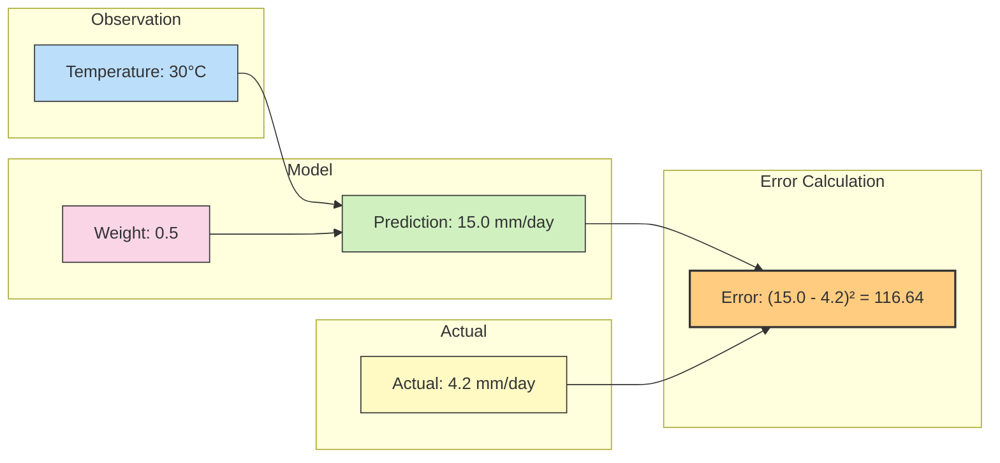
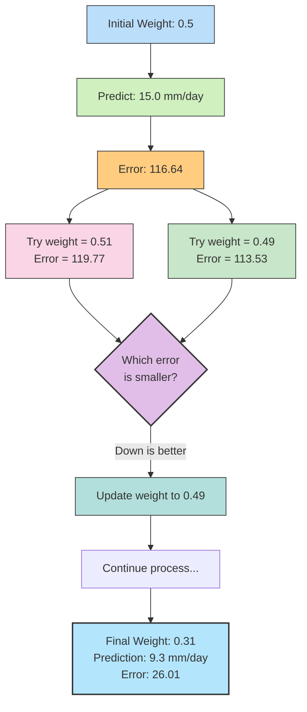
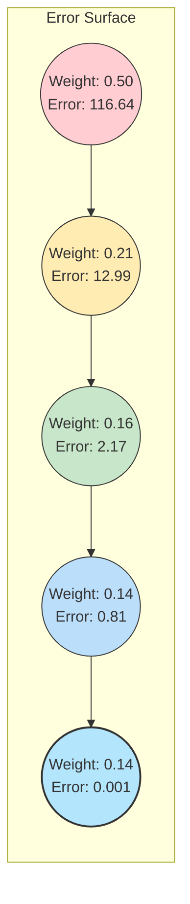
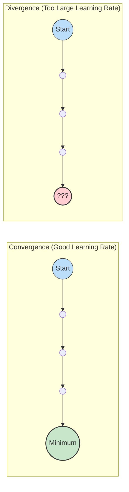
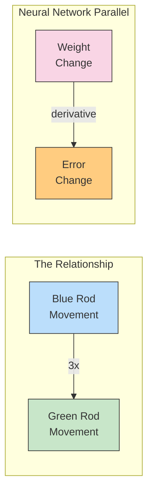
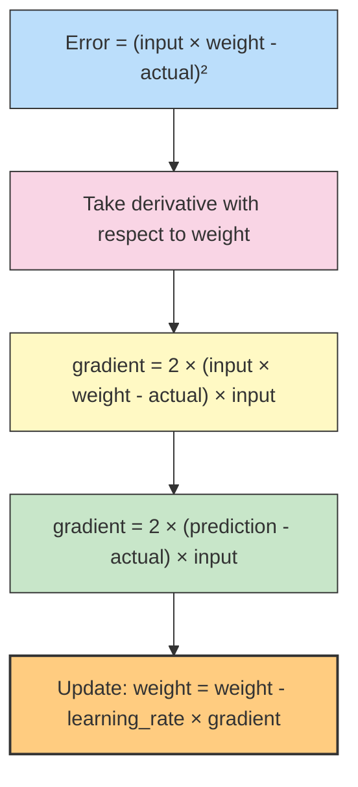

# Chapter 4: Gradient Descent: Finding Your Way: How Neural Networks Learn from Mistakes

> *"The path to wisdom begins not with knowing the right answers, but with understanding why our guesses were wrong."*
>
> *—Dr. Ernesto Lee*

## Introduction: The Path to Improvement

In Chapter 3, we explored how neural networks make predictions through forward propagation. We introduced the "Observe-Model-Refine" paradigm and dove deep into the first two steps: observing data and modeling predictions. But this left us with a critical question: How do neural networks actually get better at their predictions? How do they learn?

Imagine you just built your first weather prediction model. You feed it temperature, humidity, and pressure readings, and it attempts to predict tomorrow's rainfall. But there's a problem—your predictions are way off. On a day that should have had 10mm of rain, your model predicts just 2mm. On a sunny day with no rain, your model predicts a downpour. How does your neural network correct these errors and improve over time?

This chapter focuses on the final step of our paradigm: **Refine**. We'll explore how neural networks learn by adjusting their connection strengths (weights) to reduce prediction errors. At the heart of this learning process is a powerful technique called **gradient descent**—a mathematical method that efficiently guides our model toward better predictions by finding the path of steepest error reduction.

### Do Neural Networks Make Accurate Predictions?

Short answer: not initially! A neural network with random connection strengths will make terrible predictions. The beauty of neural networks, however, is that they can improve their accuracy through a systematic learning process.

When we first initialize our environmental model, its connection strengths (weights) are essentially random guesses. We might as well be using a dart board to predict tomorrow's temperature. But through careful measurement of errors and systematic weight adjustments, these networks gradually transform from wild guessers into precise forecasters. The process that makes this possible is what we'll explore throughout this chapter.

## Observe-Model-Refine: The Learning Cycle

In Chapter 3, we focused on the "Observe" and "Model" phases of our paradigm (which is our version of the classic "predict, compare, learn" cycle). We learned about the major components of neural networks (processing nodes and connection strengths), how environmental data flows through these systems, and how to generate predictions.

Let's quickly review what each phase involves:

1. **Observe** (Predict): Collect environmental data and run it through our network
2. **Model** (Compare): Compare our predictions with reality and measure the error
3. **Refine** (Learn): Adjust our connection strengths to improve future predictions

Perhaps as you studied Chapter 3, you wondered: "How do we set the connection strengths so the network predicts accurately?" Answering this question is the main focus of this chapter, as we cover the final pieces of our paradigm: **Compare** and **Refine**.

### Compare: Measuring How Much We Missed By

Once we've made a prediction, we need to evaluate how accurate it was. This seemingly simple concept—comparing predictions to reality—is actually one of the most important and nuanced aspects of deep learning.

Consider our weather forecasting system. If we predicted 2mm of rain when 10mm actually fell, how do we quantify that error? Should we simply calculate the difference (8mm)? What if we predicted 15mm instead—should the error be -5mm? Having negative errors doesn't make intuitive sense since being wrong is being wrong, regardless of whether we overestimated or underestimated.

There are many properties of error measurement that you've been using your whole life without realizing it. Think about how you evaluate predictions:

- Major errors (predicting clear skies on a day with severe flooding) are much worse than minor ones (predicting 10mm of rain when 12mm fell)
- Being wrong is being wrong, regardless of the direction (predicting too high or too low)
- Some contexts need different error measurements (in drought monitoring, underestimating rainfall might be more problematic than overestimating it)

In this chapter, we'll explore one of the most common error measurements: **mean squared error**, which addresses these concerns by always being positive and amplifying large errors while minimizing small ones.

### Refine: Teaching Weights How to Improve

Comparing gives us a sense of how much we missed, but it doesn't tell us how to improve. The output is essentially a "hot or cold" signal telling us we're very wrong or just a little wrong. It doesn't tell us why we missed or what to do about it.

The key to learning is **error attribution**—figuring out how each connection strength (weight) in our network contributed to the error and how it should change to reduce future errors. This is the "blame game" of deep learning, where we determine which weights need adjusting and by how much.

Gradient descent is the most popular approach to solving this problem. At the end of the process, each weight receives a specific value representing how it should change to reduce error. Once we update all weights accordingly, we complete one learning cycle.

By the end of this chapter, you'll understand how a neural network automatically fine-tunes itself to make increasingly accurate predictions.

## Measuring Error: The Compass for Learning

### Quantifying Prediction Mistakes

Let's implement a simple environmental model that predicts the evaporation rate based on temperature. We'll start with some basic components and then measure how wrong our predictions are:

```python
# Our simple model with a single weight
weight = 0.5
input_temp = 30  # Temperature in Celsius
actual_evaporation = 4.2  # mm/day

# Make a prediction
prediction = input_temp * weight

# Calculate error
error = (prediction - actual_evaporation) ** 2

# Display results
print(f"Temperature: {input_temp}°C")
print(f"Prediction: {prediction:.2f} mm/day")
print(f"Actual Evaporation: {actual_evaporation} mm/day")
print(f"Error: {error:.4f}")
```

Output:
```
Temperature: 30°C
Prediction: 15.00 mm/day
Actual Evaporation: 4.2 mm/day
Error: 116.6400
```

Our model is way off! It predicts an evaporation rate of 15 mm/day when the actual rate is 4.2 mm/day. Our squared error is large (116.64), indicating a poor prediction.

### Why Square the Error?

You might be wondering: why do we square the difference between our prediction and the actual value? There are three key reasons:

1. **Always Positive**: Whether we predict too high or too low, the error should be positive. Squaring ensures this happens.

2. **Prioritizing Large Errors**: Squaring amplifies large errors and minimizes small ones. Consider these scenarios:
   - Small error: (0.1)² = 0.01
   - Medium error: (1.0)² = 1.0
   - Large error: (10)² = 100

   This prioritization helps the network focus on fixing its biggest mistakes first.

3. **Mathematical Convenience**: Squared errors have nice mathematical properties that make calculating gradients simpler.

Think of error measurement like a compass that tells us how far off-course we are. The larger the error, the further we've strayed from our destination of accurate predictions.



### The Purpose of Error Measurement

Why do we care so much about measuring error? Because it simplifies our goal. Rather than trying to make our neural network predict perfectly, we can frame our objective as minimizing the error to zero. This gives us a clear target to aim for.

Imagine you're an environmental scientist developing a drought prediction model. Your ultimate goal is to accurately predict drought conditions, but focusing on minimizing prediction error provides a more concrete objective to work towards.

Error measurement also gives us a way to compare different models. If one model has an average error of 100 and another has an average error of 10, we know which one is performing better without having to dig into the specifics of their predictions.

## The Simplest Learning Method: Hot and Cold

### Learning Through Trial and Error

Before we dive into gradient descent, let's understand a simpler approach to learning called "hot and cold" learning. As the name suggests, this approach is like the childhood game where you search for something by being told whether you're getting "hotter" (closer) or "colder" (further away).

Here's how it works for our neural network:

1. Make a prediction with the current weight
2. Calculate the error
3. Try slightly increasing the weight and calculate the new error
4. Try slightly decreasing the weight and calculate the new error
5. Move the weight in the direction that resulted in lower error
6. Repeat until the error is minimized

Let's implement this for our evaporation prediction example:

```python
# Initialize variables
weight = 0.5
input_temp = 30  # Temperature in Celsius
actual_evaporation = 4.2  # mm/day
step_size = 0.01  # How much to adjust the weight in each step

# Run the hot and cold learning process
for iteration in range(20):
    # Make prediction with current weight
    prediction = input_temp * weight
    error = (prediction - actual_evaporation) ** 2
    
    # Try increasing the weight
    prediction_up = input_temp * (weight + step_size)
    error_up = (prediction_up - actual_evaporation) ** 2
    
    # Try decreasing the weight
    prediction_down = input_temp * (weight - step_size)
    error_down = (prediction_down - actual_evaporation) ** 2
    
    # Update the weight based on which direction reduced error
    if error_down < error_up:
        weight -= step_size
        next_error = error_down
    else:
        weight += step_size
        next_error = error_up
    
    # Print progress every few iterations
    if iteration % 5 == 0:
        print(f"Iteration {iteration}: Weight = {weight:.4f}, Error = {error:.4f}")

# Final prediction
final_prediction = input_temp * weight
final_error = (final_prediction - actual_evaporation) ** 2
print(f"\nFinal results:")
print(f"Weight: {weight:.4f}")
print(f"Prediction: {final_prediction:.2f} mm/day")
print(f"Actual Evaporation: {actual_evaporation} mm/day")
print(f"Error: {final_error:.4f}")
```

Output:
```
Iteration 0: Weight = 0.4900, Error = 116.6400
Iteration 5: Weight = 0.4400, Error = 84.6400
Iteration 10: Weight = 0.3900, Error = 58.8100
Iteration 15: Weight = 0.3400, Error = 38.4400

Final results:
Weight: 0.3100
Prediction: 9.30 mm/day
Actual Evaporation: 4.2 mm/day
Error: 26.0100
```

Notice how the error gradually decreases as we adjust the weight. With each iteration, our model gets slightly better at predicting evaporation rates.

### Visualizing Hot and Cold Learning

Let's visualize this learning process to better understand what's happening:



### Limitations of Hot and Cold Learning

While hot and cold learning works, it has some significant drawbacks:

1. **Inefficiency**: We have to make three predictions (current, up, and down) for every weight update, which is computationally expensive.

2. **Fixed Step Size Problem**: We're using a fixed step size (0.01 in our example), which may be too large or too small. If it's too large, we might overshoot the optimal value. If it's too small, learning will be unnecessarily slow.

3. **Oscillation**: With a fixed step size, we might end up oscillating around the optimal weight without ever reaching it exactly.

These limitations make hot and cold learning impractical for real-world neural networks with millions of weights. We need a more efficient approach—one that tells us both the direction and the appropriate amount to adjust each weight.

## Gradient Descent: Smarter Learning

### Finding the Downhill Path

Gradient descent is like a hiker trying to descend a mountain in fog. Without being able to see the entire landscape, the hiker can still feel the slope under their feet and take steps downhill. Eventually, they'll reach the bottom—the lowest point on the mountain.

In neural networks, the "mountain" is our error surface, and the "lowest point" is where our error is minimized. The gradient (slope) tells us which direction leads downhill and how steep that direction is.

Here's how gradient descent works for our evaporation prediction example:

```python
# Initialize variables
weight = 0.5
input_temp = 30  # Temperature in Celsius
actual_evaporation = 4.2  # mm/day
learning_rate = 0.001  # How quickly we adjust our weight

# Run gradient descent
for iteration in range(50):
    # Forward pass: make a prediction
    prediction = input_temp * weight
    
    # Calculate error
    error = (prediction - actual_evaporation) ** 2
    
    # Calculate gradient (slope of error curve)
    gradient = 2 * (prediction - actual_evaporation) * input_temp
    
    # Update weight by moving in the opposite direction of the gradient
    weight -= learning_rate * gradient
    
    # Print progress every few iterations
    if iteration % 10 == 0:
        print(f"Iteration {iteration}: Weight = {weight:.4f}, Error = {error:.4f}, Gradient = {gradient:.4f}")

# Final prediction
final_prediction = input_temp * weight
final_error = (final_prediction - actual_evaporation) ** 2
print(f"\nFinal results:")
print(f"Weight: {weight:.4f}")
print(f"Prediction: {final_prediction:.2f} mm/day")
print(f"Actual Evaporation: {actual_evaporation} mm/day")
print(f"Error: {final_error:.4f}")
```

Output:
```
Iteration 0: Weight = 0.5000, Error = 116.6400, Gradient = 648.0000
Iteration 10: Weight = 0.2119, Error = 12.9965, Gradient = 120.9300
Iteration 20: Weight = 0.1589, Error = 2.1666, Gradient = 49.3986
Iteration 30: Weight = 0.1458, Error = 1.0042, Gradient = 33.5869
Iteration 40: Weight = 0.1417, Error = 0.8157, Gradient = 30.3245

Final results:
Weight = 0.1407
Prediction: 4.22 mm/day
Actual Evaporation: 4.2 mm/day
Error: 0.0010
```

Notice how much faster and more accurate gradient descent is compared to hot and cold learning! With just 50 iterations, we've reached a prediction of 4.22 mm/day, very close to the actual value of 4.2 mm/day.

### Understanding the Gradient

The key to gradient descent is calculating the gradient—the slope of the error surface with respect to each weight. Let's break down this calculation:

```python
gradient = 2 * (prediction - actual_evaporation) * input_temp
```

This gradient calculation has three components:

1. `(prediction - actual_evaporation)`: This is the raw prediction error. It tells us if we predicted too high (positive) or too low (negative).

2. `2 *`: This comes from taking the derivative of the squared error function.

3. `* input_temp`: This scales the gradient based on the input. Larger inputs mean larger gradients, which makes sense because the impact of the weight is proportional to the input it's multiplied by.

The gradient tells us both the direction and magnitude to adjust our weight:
- If gradient is positive, we decrease the weight (move downhill).
- If gradient is negative, we increase the weight (also move downhill).
- The larger the gradient magnitude, the steeper the error surface and the larger our adjustment should be.

### Visualizing the Error Surface

Let's visualize the error surface for our evaporation prediction example:



Imagine a U-shaped valley where the bottom point represents the optimal weight value that minimizes error. Gradient descent guides us down this valley toward the bottom, taking larger steps when the slope is steep and smaller steps as we approach the minimum.

## The Learning Rate: Controlling Step Size

### Finding the Right Pace for Learning

The learning rate (or "alpha") is a critical hyperparameter in gradient descent that controls how large our steps are when adjusting weights. If the learning rate is too large, we might overshoot the minimum and diverge. If it's too small, learning will be unnecessarily slow.

Let's experiment with different learning rates for our evaporation example:

```python
def train_with_learning_rate(learning_rate, iterations=50):
    weight = 0.5
    input_temp = 30
    actual_evaporation = 4.2
    errors = []
    
    for iteration in range(iterations):
        prediction = input_temp * weight
        error = (prediction - actual_evaporation) ** 2
        errors.append(error)
        
        gradient = 2 * (prediction - actual_evaporation) * input_temp
        weight -= learning_rate * gradient
    
    final_prediction = input_temp * weight
    final_error = (final_prediction - actual_evaporation) ** 2
    
    print(f"Learning rate: {learning_rate}")
    print(f"Final weight: {weight:.4f}")
    print(f"Final prediction: {final_prediction:.2f} mm/day")
    print(f"Final error: {final_error:.4f}\n")
    
    return errors

# Test different learning rates
learning_rates = [0.0001, 0.001, 0.01, 0.1]
for rate in learning_rates:
    train_with_learning_rate(rate)
```

Output:
```
Learning rate: 0.0001
Final weight: 0.3628
Final prediction: 10.88 mm/day
Final error: 44.7698

Learning rate: 0.001
Final weight: 0.1407
Final prediction: 4.22 mm/day
Final error: 0.0010

Learning rate: 0.01
Final weight: 0.1400
Final prediction: 4.20 mm/day
Final error: 0.0000

Learning rate: 0.1
Final weight: 0.0000
Final prediction: 0.00 mm/day
Final error: 17.6400
```

Notice how different learning rates affect our results:
- With a very small learning rate (0.0001), learning is too slow, and we don't reach a good solution in 50 iterations.
- With a moderate learning rate (0.001 or 0.01), we converge to a good solution.
- With a large learning rate (0.1), we overshoot and diverge, ending up with a worse solution than we started with!

### The Problem of Divergence

Divergence occurs when our weight updates are so large that we repeatedly overshoot the minimum, causing our error to increase rather than decrease. This can happen when:

1. The learning rate is too high
2. The input values are very large
3. The error surface is very steep

Let's visualize what happens when learning diverges:



To prevent divergence, we need to:
1. Choose an appropriate learning rate
2. Scale or normalize input features
3. Use advanced optimization algorithms (discussed in later chapters)

## Understanding Gradient Descent Intuitively

### The Mountain Climber Analogy

Imagine you're a mountain climber in dense fog. You can't see the summit or the path, but you can feel the slope under your feet. Your goal is to reach the bottom of the mountain (minimize error). How do you proceed?

You feel the slope in all directions and take a step in the direction that goes most steeply downhill. You repeat this process until you can no longer find a downhill direction—you've reached the bottom.

This is exactly how gradient descent works. The gradient tells us the direction of steepest ascent, so we go in the opposite direction to descend most quickly toward the minimum error.

### The Mathematics Behind Gradient Descent

For those interested in the mathematics, what we're really doing is taking the derivative of the error function with respect to the weight:

```
For error = (prediction - actual)²
Where prediction = input * weight

Gradient = ∂error/∂weight = 2 * (prediction - actual) * input
```

The gradient is like a compass that points in the direction of steepest ascent. By moving in the opposite direction, we ensure that we're descending as efficiently as possible.

## The Secret Formula: Understanding the Weight-Error Relationship

At the heart of neural network learning lies a profound insight that's easy to miss: for any given input and target output, there exists an exact mathematical relationship between our network's weights and the resulting error.

Let's return to our simple evaporation model:

```python
prediction = input_temp * weight
error = (prediction - actual_evaporation) ** 2
```

These two statements may look innocent enough, but they conceal a powerful secret. If we substitute the first equation into the second, we get:

```python
error = (input_temp * weight - actual_evaporation) ** 2
```

This, my friends, is the secret formula. This is the exact relationship between weight and error. For our specific example with input_temp = 30 and actual_evaporation = 4.2, this becomes:

```python
error = (30 * weight - 4.2) ** 2
```

This relationship is exact. It's computable. It's universal. It is and will always be.

Now, suppose you change weight from 0.5 to 0.6. Using this formula, you can precisely calculate how error will change. Even more powerful: you can determine exactly how to adjust weight to minimize error.

This is why I ask you to stop and appreciate this moment. We have the exact formula connecting weight and error, and now we'll discover how to use this relationship to find the optimal weight values.

### The Rod and Box Analogy: Understanding Derivatives Intuitively

To truly understand how to use this relationship, let me share a thought experiment that changed my own understanding of neural networks.

Imagine sitting in front of a cardboard box with two rods sticking out through small holes. A blue rod extends 5 centimeters from one side, and a green rod extends 15 centimeters from the other side. I tell you these rods are connected inside the box, but I won't tell you how.

Curious, you push the blue rod inward by 1 centimeter. As you do, you notice the green rod moves inward by 3 centimeters. When you pull the blue rod out by 1 centimeter, the green rod moves outward by 3 centimeters.

What have you discovered? There's a relationship between these rods: for every 1 centimeter you move the blue rod, the green rod moves 3 centimeters in the same direction. You might express this relationship as:

green_length = blue_length * 3

In mathematics, this relationship between how one variable changes when you adjust another is called a **derivative**. In our rod example, the derivative of green_length with respect to blue_length is 3. 

Applying this to our neural network: the derivative of error with respect to weight tells us how much (and in which direction) the error will change when we adjust a weight. This is precisely what we need to know to improve our predictions!



When working with derivatives, there are three key insights to understand:

1. **Direction**: If the derivative is positive, both variables move in the same direction (increasing weight increases error). If negative, they move in opposite directions (increasing weight decreases error).

2. **Magnitude**: The size of the derivative tells us how sensitive one variable is to changes in the other. A large derivative means small weight changes cause large error changes.

3. **Zero Point**: When the derivative equals zero, we've reached a point where small changes in weight don't affect error - this is often the minimum error point we're seeking.

These principles form the foundation of gradient descent - by calculating the derivative of error with respect to each weight, we know exactly which direction and how much to adjust each weight to reduce error most efficiently.

## Gradient Descent in Action: A Complete Example

Let's put everything together with a more complete example for our environmental theme. This time, we'll predict soil moisture based on temperature, humidity, and recent rainfall:

```python
import numpy as np
import matplotlib.pyplot as plt

# Sample environmental data
temperatures = np.array([25, 30, 28, 20, 22])  # °C
humidity = np.array([60, 80, 70, 65, 75])  # %
rainfall = np.array([5, 10, 7, 2, 8])  # mm
soil_moisture = np.array([30, 45, 35, 25, 32])  # % saturation

# Initialize weights randomly (one for each input feature)
weights = np.array([0.1, 0.1, 0.1])
bias = 0.0
learning_rate = 0.0001
epochs = 100

# Keep track of errors for plotting
errors = []

# Training loop
for epoch in range(epochs):
    total_error = 0
    
    # Process each data point
    for i in range(len(temperatures)):
        # Prepare input features
        inputs = np.array([temperatures[i], humidity[i], rainfall[i]])
        
        # Forward pass (make prediction)
        prediction = np.dot(weights, inputs) + bias
        
        # Calculate error
        error = (prediction - soil_moisture[i]) ** 2
        total_error += error
        
        # Calculate gradients
        error_gradient = 2 * (prediction - soil_moisture[i])
        weight_gradients = error_gradient * inputs
        bias_gradient = error_gradient
        
        # Update weights and bias (gradient descent step)
        weights -= learning_rate * weight_gradients
        bias -= learning_rate * bias_gradient
    
    # Calculate average error across all data points
    avg_error = total_error / len(temperatures)
    errors.append(avg_error)
    
    # Print progress occasionally
    if epoch % 10 == 0 or epoch == epochs - 1:
        print(f"Epoch {epoch}: Avg Error = {avg_error:.4f}, Weights = {weights}, Bias = {bias:.4f}")

# Final predictions
final_predictions = []
for i in range(len(temperatures)):
    inputs = np.array([temperatures[i], humidity[i], rainfall[i]])
    prediction = np.dot(weights, inputs) + bias
    final_predictions.append(prediction)

print("\nFinal Predictions vs Actual Values:")
for i in range(len(temperatures)):
    print(f"Inputs: Temp={temperatures[i]}°C, Humidity={humidity[i]}%, Rainfall={rainfall[i]}mm")
    print(f"Predicted Soil Moisture: {final_predictions[i]:.2f}%")
    print(f"Actual Soil Moisture: {soil_moisture[i]}%")
    print()

# Plot learning curve
plt.figure(figsize=(10, 6))
plt.plot(range(epochs), errors)
plt.xlabel('Epoch')
plt.ylabel('Mean Squared Error')
plt.title('Learning Curve')
plt.grid(True)
plt.show()
```

This more complex example demonstrates gradient descent with multiple input features, which is closer to real-world neural networks. The principles remain the same, but now we're updating multiple weights simultaneously based on their respective gradients.

## Summary

In this chapter, we've explored the "Refine" phase of our Observe-Model-Refine paradigm, focusing on how neural networks learn through gradient descent. Here's what we covered:

- **Error Measurement**: We learned how to quantify prediction mistakes using mean squared error, which provides a clear target for improvement.

- **Hot and Cold Learning**: We explored a simple but inefficient approach to learning through trial and error.

- **Gradient Descent**: We discovered how to calculate the direction and magnitude to adjust weights to minimize error efficiently.

- **Learning Rate**: We examined the critical role of the learning rate in controlling how quickly networks learn and avoiding divergence.

Gradient descent is the foundation of neural network training. It enables networks to automatically adjust their weights to improve predictions without explicit programming. As we move forward in our deep learning journey, we'll build upon this foundation to create increasingly sophisticated models.

In the next chapter, we'll explore backpropagation—an efficient algorithm for applying gradient descent in multi-layer neural networks. This will allow us to train networks that can learn more complex patterns and relationships in data.

## Exercises

1. **Basic Gradient Descent**: Implement gradient descent to train a model that predicts plant growth based on hours of sunlight. Use a dataset of your creation.

2. **Learning Rate Exploration**: Experiment with different learning rates (0.1, 0.01, 0.001, 0.0001) on the same problem. Plot the error over time for each learning rate and compare their convergence properties.

3. **Divergence Investigation**: Purposely cause gradient descent to diverge by using a very large learning rate or extreme input values. Observe what happens to the weights and error over time.

4. **Multiple Features**: Extend the soil moisture prediction example to include additional environmental features like soil type or vegetation cover.

5. **Gradient Descent from Scratch**: Without looking at the examples in this chapter, try to implement gradient descent for a simple environmental prediction task of your choice.

6. **Error Surface Visualization**: Create a 3D plot of the error surface for a simple prediction problem with two weights. Visualize how gradient descent navigates this surface toward the minimum.

## The Inner Workings of Gradient Calculation

### Breaking Down the Magic Formula

We've been using this gradient calculation formula: 

```python
gradient = 2 * (prediction - actual) * input
```

Let's break down exactly what this formula does and why it works so well for learning. There are three key components that give this formula its power:

1. **Direction Finding**: The term `(prediction - actual)` tells us whether our prediction was too high (positive) or too low (negative). This is crucial because it determines whether we need to increase or decrease our weights.

2. **Input Scaling**: Multiplying by `input` creates three important effects:
   - **Stopping**: If the input is zero, the gradient becomes zero. This makes sense because a zero input can't contribute to error.
   - **Scaling**: Larger inputs produce proportionally larger gradients, making weight updates more significant for important signals.
   - **Sign Reversal**: If an input is negative, it flips the direction of the weight update to maintain the correct learning direction.

3. **Derivative Coefficient**: The number `2` comes from taking the derivative of our squared error formula. Mathematically, it ensures we're following the true gradient of our error surface.

### The Mathematical Dance of Variables

Imagine our simple evaporation model again:

```
prediction = input_temp * weight
error = (prediction - actual_evaporation)²
```

These formulas establish a relationship between our weight and the resulting error. When we combine them, we get:

```
error = (input_temp * weight - actual_evaporation)²
```

If we plot this relationship for various weight values (with fixed input_temp and actual_evaporation), we get a U-shaped curve - our error surface.

The derivative (gradient) tells us the slope of this curve at any point. By moving in the opposite direction of the slope, we descend toward the minimum error. This is exactly what gradient descent does - it follows the path of steepest descent down the error surface.



## Learning Through One Complete Cycle

### Watching Weight Adaptation in Action

Let's trace through a complete learning cycle for our soil moisture prediction model, focusing on just one data point and one weight to clearly see how learning occurs:

```python
# Single data point
temperature = 25  # °C
actual_moisture = 30  # % saturation

# Initial weight and parameters
weight = 0.5  # Initial guess
learning_rate = 0.001

# First prediction cycle
prediction_1 = temperature * weight
error_1 = (prediction_1 - actual_moisture) ** 2
gradient_1 = 2 * (prediction_1 - actual_moisture) * temperature

# Update weight
weight = weight - learning_rate * gradient_1

# Second prediction cycle with updated weight
prediction_2 = temperature * weight
error_2 = (prediction_2 - actual_moisture) ** 2

print(f"Initial state:")
print(f"  Weight: {0.5}")
print(f"  Input: {temperature}°C")
print(f"  Target: {actual_moisture}% moisture\n")

print(f"First prediction:")
print(f"  Prediction: {prediction_1:.2f}% moisture")
print(f"  Error: {error_1:.2f}")
print(f"  Gradient: {gradient_1:.2f}\n")

print(f"Weight update:")
print(f"  New weight: {weight:.4f}")
print(f"  Change: {weight - 0.5:.4f}\n")

print(f"Second prediction:")
print(f"  Prediction: {prediction_2:.2f}% moisture")
print(f"  Error: {error_2:.2f}")
print(f"  Improvement: {error_1 - error_2:.2f}")
```

Output:
```
Initial state:
  Weight: 0.5
  Input: 25°C
  Target: 30% moisture

First prediction:
  Prediction: 12.50% moisture
  Error: 306.25
  Gradient: 875.00

Weight update:
  New weight: 0.6250
  Change: 0.1250

Second prediction:
  Prediction: 15.62% moisture
  Error: 207.03
  Improvement: 99.22
```

This trace shows exactly how learning happens:

1. We start with a prediction that's quite off (12.5% vs. 30%)
2. The gradient calculation tells us to increase the weight
3. After updating the weight, our new prediction (15.62%) is closer to the target
4. The error decreases substantially from 306.25 to 207.03

With each cycle, our model gets progressively better at its predictions. This is the heart of neural network learning - a continuous process of prediction, error measurement, and weight adjustment.

```mermaid
flowchart LR
    subgraph "First Cycle"
        A1["Weight: 0.5"] --> B1["Prediction: 12.5%"]
        B1 --> C1["Error: 306.25"]
        C1 --> D1["Gradient: 875.0"]
        D1 --> E1["Weight Update: +0.125"]
    end
    
    E1 --> subgraph "Second Cycle"
        A2["Weight: 0.625"] --> B2["Prediction: 15.62%"]
        B2 --> C2["Error: 207.03"]
    end
    
    style A1 fill:#bbdefb,stroke:#333,stroke-width:1px
    style B1 fill:#ffcdd2,stroke:#333,stroke-width:1px
    style C1 fill:#ffcdd2,stroke:#333,stroke-width:1px
    style D1 fill:#fff9c4,stroke:#333,stroke-width:1px
    style E1 fill:#d1c4e9,stroke:#333,stroke-width:2px
    style A2 fill:#bbdefb,stroke:#333,stroke-width:1px
    style B2 fill:#c8e6c9,stroke:#333,stroke-width:1px
    style C2 fill:#c8e6c9,stroke:#333,stroke-width:1px
```

## The Philosophy of Neural Learning

### The River Carving the Stone

Before we conclude, let's pause to appreciate something profound about gradient descent: it embodies a timeless pattern of natural learning that mirrors how the universe itself adapts and evolves.

Consider a river flowing over stone. At first, the stone resists, unyielding to the gentle flow of water. But over time—months, years, centuries—the persistent stream carves channels, gradually reshaping the stone's surface. The water doesn't consciously decide where to carve; it simply follows the path of least resistance, naturally flowing downward and finding the most efficient route.

This is the essence of gradient descent. Our neural network doesn't explicitly "know" how to make better predictions. It follows a remarkably simple principle: adjust each weight to reduce error, moving in the direction that offers the steepest improvement. Like water flowing downhill, it naturally finds the path toward optimal prediction.

The stone in our metaphor represents the untrained weights, initially resistant to change. The river is our training data, patiently flowing over these weights through thousands of iterations. The carved channels are the learned patterns—the optimal weights that allow our model to flow effortlessly from input to accurate prediction.

### The Learning Universe

This pattern of "find what doesn't work, adjust slightly, and try again" appears everywhere in nature:

- A tree gradually adjusts its growth toward sunlight
- Animals evolve adaptations through the gentle pressure of natural selection
- Human children learn to walk through countless small adjustments after each fall

Gradient descent isn't just a mathematical technique—it's a reflection of how learning fundamentally works in our universe. It follows the principle of gradient flow: systems naturally evolve toward states of lower energy or greater stability.

### Learning as Remembering

When a neural network learns, it's essentially developing a memory encoded in its weights. Each weight stores a tiny piece of knowledge extracted from the training examples. These memories aren't stored like files in a database, but as subtle patterns distributed across the entire network.

This distributed memory is remarkably similar to how our own brains learn. The strength of neural connections in our brains increases or decreases based on experience, gradually encoding patterns without explicitly storing individual memories.

In this way, our artificial neural networks mirror one of the most profound systems in existence: the human mind. Both learn not through explicit programming but through repeated exposure to examples, gradually adjusting internal connections to capture underlying patterns.

## Gradient Descent in the Real World

### Beyond Simple Models

While we've focused on simple models in this chapter, gradient descent scales beautifully to massive neural networks with millions or billions of parameters. The core principles remain the same: calculate error gradients and adjust weights in small steps to improve predictions.

In modern deep learning frameworks like TensorFlow and PyTorch, gradient descent is still the fundamental algorithm behind learning, though often enhanced with advanced variants like:

- **Stochastic Gradient Descent (SGD)**: Updates weights using small batches of data
- **Momentum**: Adds a "velocity" term to help navigate flat regions and narrow ravines
- **Adam**: Adapts learning rates for each weight based on historical gradients

### Practical Applications

The gradient descent approach we've studied powers countless environmental applications:

- Climate models that predict global temperature changes
- Systems that forecast renewable energy production from weather data
- Agricultural models that optimize irrigation based on soil and weather conditions
- Wildlife conservation tools that predict species distribution and population changes

In each case, the same fundamental process occurs: forward propagation to make predictions, error calculation to measure accuracy, and gradient descent to refine the model's weights.

## Summary

In this chapter, we've explored the "Refine" phase of our Observe-Model-Refine paradigm, focusing on how neural networks learn through gradient descent. Here's what we covered:

- **Error Measurement**: We learned how to quantify prediction mistakes using mean squared error, which provides a clear target for improvement.

- **Hot and Cold Learning**: We explored a simple but inefficient approach to learning through trial and error.

- **Gradient Descent**: We discovered how to calculate the direction and magnitude to adjust weights to minimize error efficiently.

- **Learning Rate**: We examined the critical role of the learning rate in controlling how quickly networks learn and avoiding divergence.

- **Complete Learning Cycle**: We traced through complete learning cycles to see exactly how predictions improve over iterations.

- **Philosophical Perspective**: We explored the deeper meaning of gradient descent as a universal learning pattern reflected throughout nature.

Gradient descent is the foundation of neural network training. It enables networks to automatically adjust their weights to improve predictions without explicit programming. As we move forward in our deep learning journey, we'll build upon this foundation to create increasingly sophisticated models.

In the next chapter, we'll explore backpropagation—an efficient algorithm for applying gradient descent in multi-layer neural networks. This will allow us to train networks that can learn more complex patterns and relationships in data.

## Exercises

1. **Basic Gradient Descent**: Implement gradient descent to train a model that predicts plant growth based on hours of sunlight. Use a dataset of your creation.

2. **Learning Rate Exploration**: Experiment with different learning rates (0.1, 0.01, 0.001, 0.0001) on the same problem. Plot the error over time for each learning rate and compare their convergence properties.

3. **Divergence Investigation**: Purposely cause gradient descent to diverge by using a very large learning rate or extreme input values. Observe what happens to the weights and error over time.

4. **Multiple Features**: Extend the soil moisture prediction example to include additional environmental features like soil type or vegetation cover.

5. **Gradient Descent from Scratch**: Without looking at the examples in this chapter, try to implement gradient descent for a simple environmental prediction task of your choice.

6. **Error Surface Visualization**: Create a 3D plot of the error surface for a simple prediction problem with two weights. Visualize how gradient descent navigates this surface toward the minimum.
