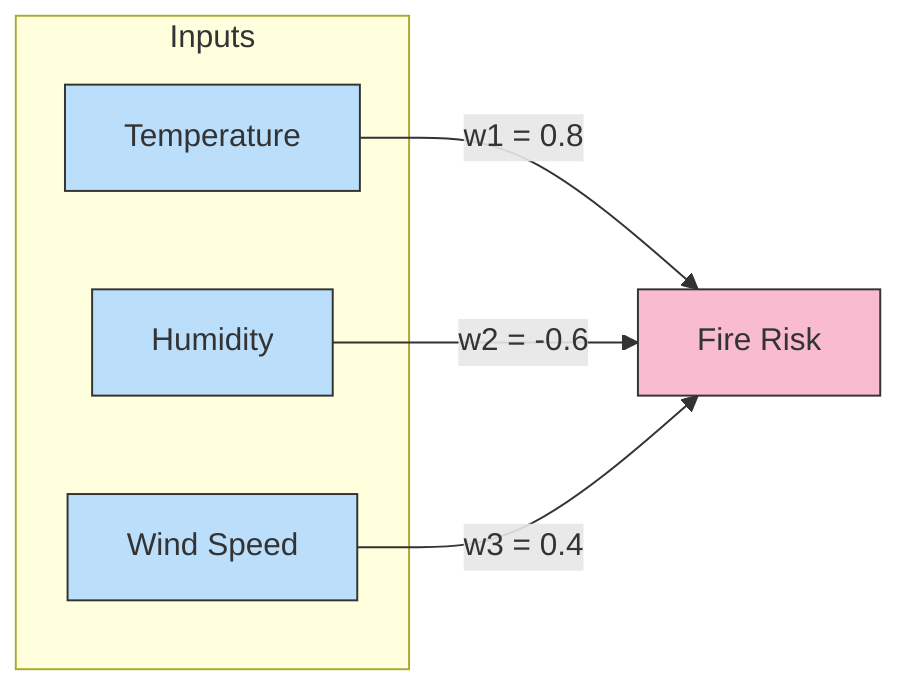
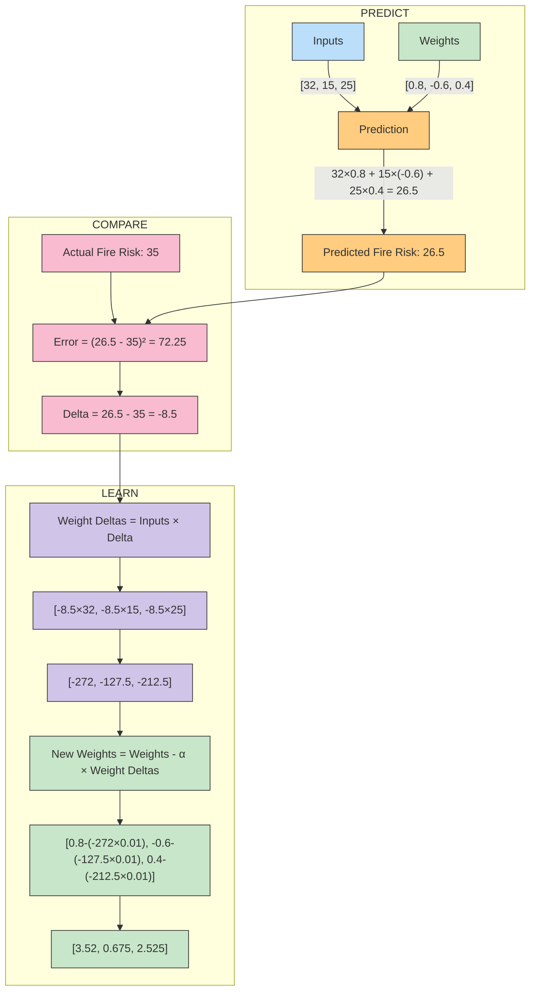
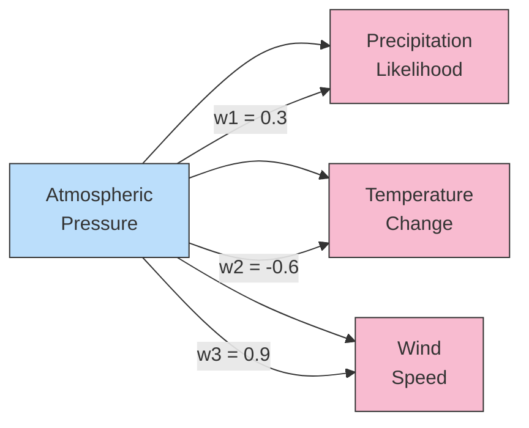
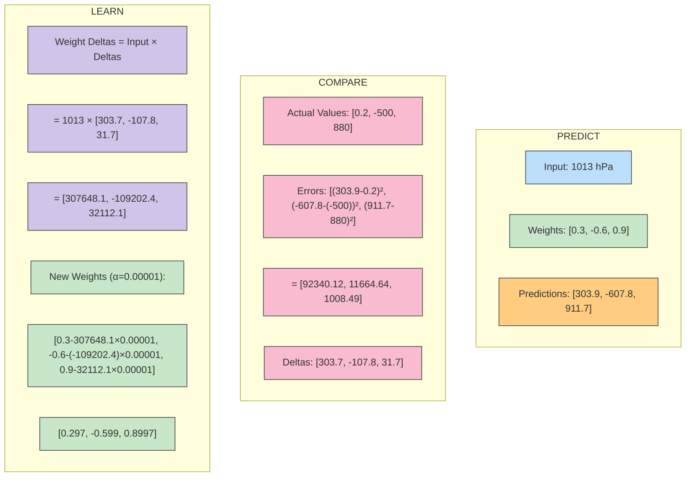
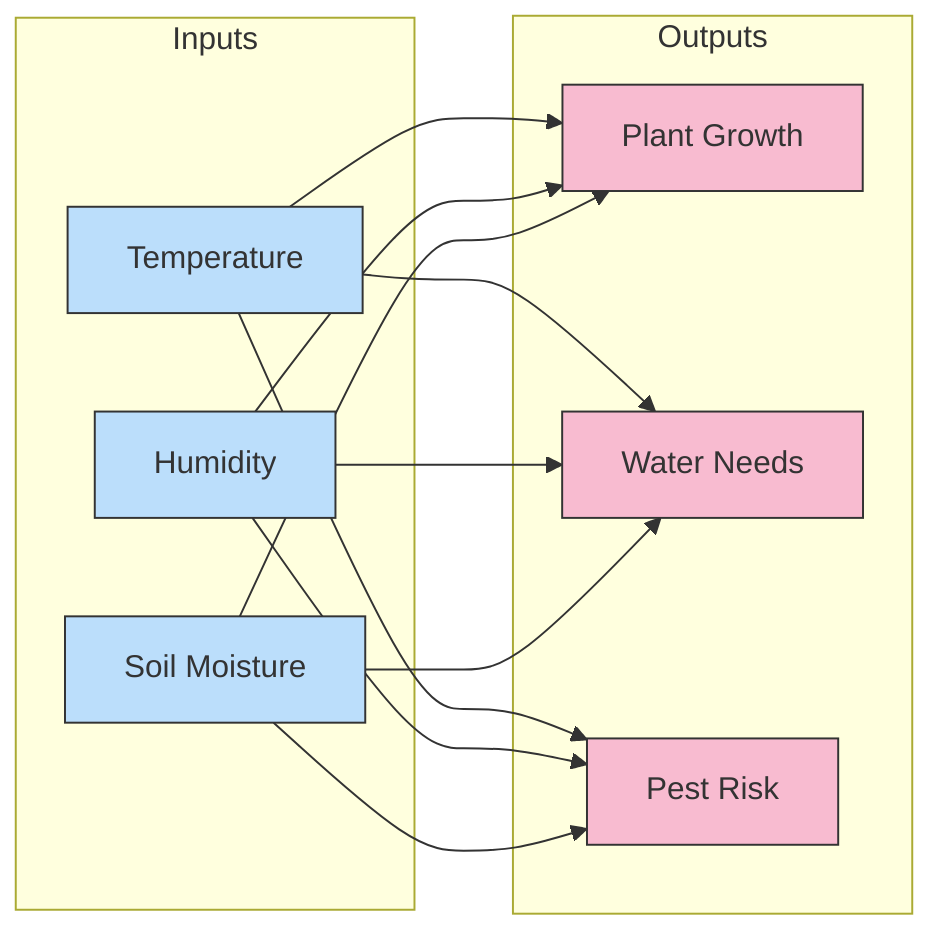
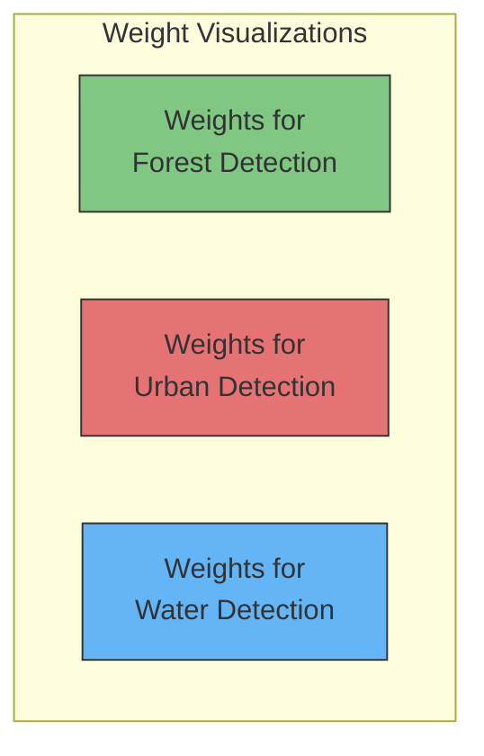
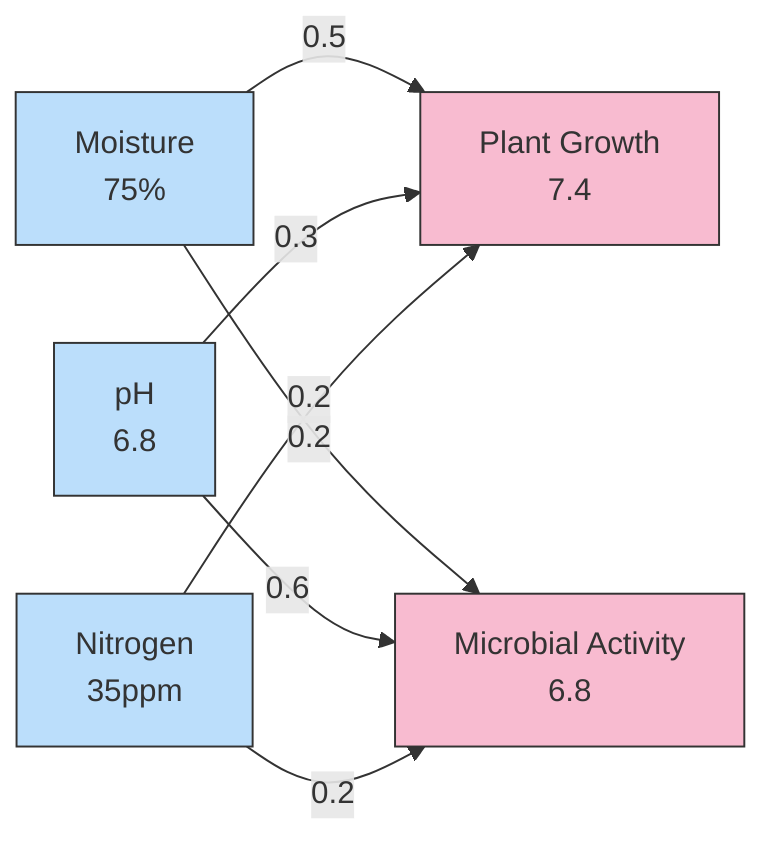

# Chapter 5: Generalized Gradient Descent: The Multi-Weight Waltz: Learning Across Dimensions

> *"In nature, complexity emerges not from solitary elements, but from the dance of many elements moving in harmony."*
>
> *—Dr. Ernesto Lee*

## Introduction: When One Weight Isn't Enough

In Chapter 4, we explored how a neural network learns through gradient descent—adjusting its weights to reduce error. But we focused primarily on networks with a single weight. While this helps understand the core principles, real-world environmental systems are vastly more complex.

Imagine trying to predict the spread of an invasive species using only temperature data. Yes, temperature matters, but what about rainfall, soil conditions, presence of natural predators, and human activity? Just as ecological systems thrive on interconnections, neural networks achieve their remarkable abilities through the coordinated adjustment of multiple weights.

This chapter expands our understanding from single-weight to multi-weight neural networks—the kind that can actually solve complex problems. We'll explore how networks learn when they have:
- Multiple input features (like temperature, humidity, and soil composition)
- Multiple output predictions (like crop yield, water usage, and pest risk)
- Both multiple inputs and multiple outputs simultaneously

We'll also visualize what these weights actually represent and discover how neural networks extract patterns from environmental data, turning seemingly arbitrary numbers into meaningful insights about our world.

## The Symphony of Multiple Inputs

### From Solo to Ensemble: Multiple Input Learning

In real environmental monitoring, we rarely make predictions based on a single measurement. Consider predicting forest fire risk: we need temperature, humidity, wind speed, precipitation history, and perhaps even human activity metrics. Each input feature contributes important information.

Let's expand our neural network to handle multiple inputs simultaneously:



Here's how multi-input prediction works in code:

```python
def neural_network(inputs, weights):
    # weighted sum of all inputs
    prediction = 0
    for i in range(len(inputs)):
        prediction += inputs[i] * weights[i]
    return prediction

# Sample environmental data
temperature = 32  # in Celsius
humidity = 15     # in percentage
wind_speed = 25   # in km/h

inputs = [temperature, humidity, wind_speed]
weights = [0.8, -0.6, 0.4]  # initial weight values

fire_risk = neural_network(inputs, weights)
print(f"Fire Risk Score: {fire_risk}")
```

But how does the network learn with multiple inputs? Let's explore the learning process step by step.

### The Learning Process with Multiple Inputs

When our network has multiple inputs, the prediction and error calculation remain the same as with a single input. The key difference comes when we need to adjust multiple weights based on a single error value.

Here's how it works:

1. **Predict**: Calculate the weighted sum of all inputs
2. **Compare**: Calculate error between prediction and actual value
3. **Learn**: Update each weight based on:
   - The direction of error
   - The contribution of that weight's input to the error

Let's visualize a complete learning cycle with our fire risk example:



Notice the critical insight: each weight gets its own "weight delta" calculated by multiplying the shared output delta by its unique input value. This means:

1. Weights connected to larger input values receive larger updates
2. All weight updates point in the same direction (to reduce the same error)
3. The learning rate (α) prevents overshooting the optimal weights

### The Weight-Input Dance: Understanding Different Update Magnitudes

Why do weights connected to larger inputs change more? Consider our fire risk example:
- Temperature (32°C) has a much larger value than humidity (15%)
- With the same delta (-8.5), temperature's weight delta (-272) is much larger than humidity's (-127.5)

This creates an important insight: inputs with naturally larger values will dominate the learning process unless we normalize our data.

This is why environmental scientists often normalize measurements to similar scales before feeding them to neural networks. Normalizing prevents variables with larger units (like temperature in Celsius) from overshadowing equally important variables with smaller units (like concentration of a gas in parts per million).

## Multiple Outputs: One Input, Many Predictions

Now, let's explore neural networks that make multiple predictions from a single input.

Consider a weather station that measures only atmospheric pressure. From this single measurement, we want to predict:
1. Likelihood of precipitation (0-1)
2. Expected temperature change (in degrees)
3. Wind speed (km/h)

Here's how such a network might look:



In code, our multi-output prediction works like this:

```python
def neural_network(input_value, weights):
    # Calculate multiple outputs from one input
    predictions = []
    for weight in weights:
        predictions.append(input_value * weight)
    return predictions

# Sample data
atmospheric_pressure = 1013  # in hPa (hectopascals)
weights = [0.3, -0.6, 0.9]   # one weight per output

predictions = neural_network(atmospheric_pressure, weights)
print(f"Precipitation Likelihood: {predictions[0]}")
print(f"Temperature Change: {predictions[1]}")
print(f"Wind Speed: {predictions[2]}")
```

### Learning with Multiple Outputs

The learning process for multiple outputs follows the same principles as before, but now we calculate separate errors and deltas for each output. Here's how it works:

1. **Predict**: Calculate each output prediction
2. **Compare**: Calculate error and delta for each output
3. **Learn**: Update each weight based on:
   - Its output's delta
   - The shared input value

Let's visualize one learning step:



Notice we needed a much smaller learning rate (α=0.00001) because the weight deltas became extremely large due to our large input value (1013). This again highlights the importance of normalizing input data in environmental applications.

## The Full Orchestra: Multiple Inputs and Multiple Outputs

Now, let's combine both approaches to create a neural network with multiple inputs and multiple outputs—the kind that can tackle real environmental problems.

Imagine an ecosystem monitoring system that takes multiple sensor readings and produces multiple predictions about the ecosystem's health:



Each connection between an input and output represents a weight. With 3 inputs and 3 outputs, we have 9 weights total, which we can organize in a weight matrix:

```
weights = [
    [w11, w12, w13],  # weights from input 1 to all outputs
    [w21, w22, w23],  # weights from input 2 to all outputs
    [w31, w32, w33]   # weights from input 3 to all outputs
]
```

In code, making predictions with this network looks like:

```python
def neural_network(inputs, weights):
    # Initialize predictions array
    predictions = [0] * len(weights[0])
    
    # For each input and its row of weights
    for i in range(len(inputs)):
        for j in range(len(weights[0])):  # For each output
            predictions[j] += inputs[i] * weights[i][j]
            
    return predictions

# Sample environmental data
inputs = [28, 65, 40]  # temperature, humidity, soil moisture
weights = [
    [0.1, 0.2, -0.1],  # weights from temperature to outputs
    [0.3, 0.2, 0.0],    # weights from humidity to outputs
    [-0.2, 0.5, 0.1]    # weights from soil moisture to outputs
]

predictions = neural_network(inputs, weights)
print(f"Plant Growth: {predictions[0]}")
print(f"Water Needs: {predictions[1]}")
print(f"Pest Risk: {predictions[2]}")
```

### Matrix Operations: The Language of Multi-Weight Networks

What we're really doing with multi-input, multi-output networks is matrix multiplication. The operation we performed in the code above is equivalent to:

```
Predictions = Inputs × Weights
```

Where Inputs is a 1×3 vector and Weights is a 3×3 matrix, resulting in a 1×3 Predictions vector.

This matrix representation becomes essential as networks grow larger. Most deep learning frameworks (like TensorFlow and PyTorch) are optimized for fast matrix operations, allowing networks with millions of weights to train efficiently.

### Learning in a Full Network

Learning in a multi-input, multi-output network follows the same principles we've seen, just applied to more weights:

1. **Predict**: Calculate all outputs using matrix multiplication
2. **Compare**: Calculate errors and deltas for each output
3. **Learn**: Update each weight using its specific input and output delta

Mathematically, each weight update follows:

```
weight_delta[i][j] = inputs[i] * deltas[j]
new_weights[i][j] = weights[i][j] - (alpha * weight_delta[i][j])
```

Where `i` is the input index and `j` is the output index.

## Weight Visualization: What Do These Numbers Mean?

After training, a neural network contains weights that may seem like arbitrary numbers. But these weights actually encode patterns discovered in the data. Let's explore what these weights represent and how we can visualize them.

### Interpreting Individual Weights

Each weight represents the strength and direction of relationship between an input feature and an output prediction. 

For example, in our ecosystem monitoring system, if the weight connecting temperature to water needs is strongly positive (e.g., 0.8), this means:

- As temperature increases, predicted water needs increase
- Temperature has a significant influence on water needs

If a weight is near zero (e.g., 0.01), it suggests that input has little impact on the prediction.

### Visualizing Weight Patterns

When networks process visual data (like satellite imagery of forests), we can visualize the weights themselves to understand what patterns the network has learned.

Let's imagine a simple scenario: a neural network trained to identify three types of land cover (forest, urban, water) from satellite image pixels.



Each visualization shows which pixel patterns activate each output. The forest detector might show sensitivity to green pixel patterns, while the water detector activates for blue patterns.

This visualization technique helps environmental scientists understand what features their models are using to make predictions, enhancing trust and enabling better model refinement.

## What Do Neural Networks Really Learn?

When training with multiple inputs and outputs, neural networks learn correlations in the data. Let's explore this concept with a simple example.

Imagine we're monitoring soil health with three measurements:
1. Moisture content (0-100%)
2. pH level (0-14)
3. Nitrogen content (ppm)

We want to predict:
1. Plant growth potential (0-10)
2. Microbial activity level (0-10)

In an ideal scenario, each input contributes meaningful information to the predictions:



After training, examining the weights reveals that:
- Moisture has the strongest impact on plant growth (weight = 0.5)
- pH level has the strongest impact on microbial activity (weight = 0.6)

These weights don't just help the network make predictions—they tell us something about the underlying environmental system. This is one reason neural networks are valuable in ecological research: they can discover relationships that might not be obvious to human observers.

### Experimental Insight: Freezing Weights

An interesting experiment is to "freeze" certain weights during training—preventing them from being updated—to understand their importance.

For example, if we freeze the weight connecting moisture to plant growth, the network is forced to rely on pH and nitrogen to predict growth. This might reveal alternative predictive patterns or confirm the critical importance of moisture data.

In environmental monitoring, this technique helps identify which sensors are most crucial and which might be redundant—valuable information when designing cost-effective monitoring systems.

## The Dance of Parameters: Batch Learning

So far, we've updated weights after seeing each individual training example. This approach, called stochastic gradient descent, works well but can be inefficient when dealing with large environmental datasets.

A more efficient approach is batch gradient descent, where we:
1. Calculate predictions for multiple examples
2. Accumulate errors across all examples
3. Update weights once based on the average error

This reduces the noise in weight updates and often leads to more stable learning. It's particularly useful when analyzing seasonal environmental data, where patterns might only become apparent when considering multiple time points together.

```python
def batch_training(inputs_batch, targets_batch, weights, learning_rate):
    # Initialize accumulated weight deltas
    accumulated_weight_deltas = [[0 for _ in range(len(weights[0]))] 
                               for _ in range(len(weights))]
    
    # For each example in the batch
    for i in range(len(inputs_batch)):
        inputs = inputs_batch[i]
        targets = targets_batch[i]
        
        # Make predictions
        predictions = neural_network(inputs, weights)
        
        # Calculate deltas
        deltas = []
        for j in range(len(predictions)):
            deltas.append(predictions[j] - targets[j])
        
        # Accumulate weight deltas
        for input_idx in range(len(inputs)):
            for output_idx in range(len(deltas)):
                weight_delta = inputs[input_idx] * deltas[output_idx]
                accumulated_weight_deltas[input_idx][output_idx] += weight_delta
    
    # Calculate average weight deltas and update weights
    batch_size = len(inputs_batch)
    for i in range(len(weights)):
        for j in range(len(weights[0])):
            avg_delta = accumulated_weight_deltas[i][j] / batch_size
            weights[i][j] -= learning_rate * avg_delta
    
    return weights
```

## Conclusion: The Symphony of Learning

We've journeyed from simple single-weight networks to complex systems with multiple inputs and outputs. Along the way, we've discovered that:

1. **Multiple weights learn together** in a coordinated dance, each adjusting according to its input's magnitude and contribution to error

2. **Matrix operations** efficiently encode the relationships between inputs and outputs

3. **Weight visualizations** reveal what patterns neural networks discover in environmental data

4. **Batch learning** helps neural networks find stable patterns across multiple examples

Just as ecosystems function through the interaction of many species, neural networks achieve their power through the coordinated adjustment of many weights. Each weight may be simple, but together they form a system capable of modeling complex environmental relationships.

As we continue our journey in the next chapter, we'll explore how to link multiple layers of these networks together, creating deep neural networks capable of learning even more complex patterns in environmental data.

### Reflection Questions

1. How would you design a neural network to predict multiple aspects of climate change (temperature rise, sea level change, precipitation patterns) based on various emissions metrics?

2. Consider a forest ecosystem monitoring system: what inputs would you collect, what outputs would you predict, and how would you structure the network's weights?

3. If you noticed that certain weights became very large during training while others remained small, what might this tell you about your environmental data?

4. How might visualizing the weights in your trained network help environmental scientists better understand the systems they study?
