# Chapter 5: Generalized Gradient Descent: The Multi-Weight Waltz: Learning Across Dimensions

> *"In nature, complexity emerges not from solitary elements, but from the dance of many elements moving in harmony."*
>
> *—Dr. Ernesto Lee*

## Introduction: When One Weight Isn't Enough

In Chapter 4, we explored how a neural network learns through gradient descent—adjusting its weights to reduce error. But we focused primarily on networks with a single weight. While this helps understand the core principles, real-world environmental systems are vastly more complex.

Imagine trying to predict the spread of an invasive species using only temperature data. Yes, temperature matters, but what about rainfall, soil conditions, presence of natural predators, and human activity? Just as ecological systems thrive on interconnections, neural networks achieve their remarkable abilities through the coordinated adjustment of multiple weights.

This chapter expands our understanding from single-weight to multi-weight neural networks—the kind that can actually solve complex problems. We'll explore how networks learn when they have:
- Multiple input features (like temperature, humidity, and soil composition)
- Multiple output predictions (like crop yield, water usage, and pest risk)
- Both multiple inputs and multiple outputs simultaneously

We'll also visualize what these weights actually represent and discover how neural networks extract patterns from environmental data, turning seemingly arbitrary numbers into meaningful insights about our world.

## The Symphony of Multiple Inputs

### From Solo to Ensemble: Multiple Input Learning

In real environmental monitoring, we rarely make predictions based on a single measurement. Consider predicting forest fire risk: we need temperature, humidity, wind speed, precipitation history, and perhaps even human activity metrics. Each input feature contributes important information.

Let's expand our neural network to handle multiple inputs simultaneously:

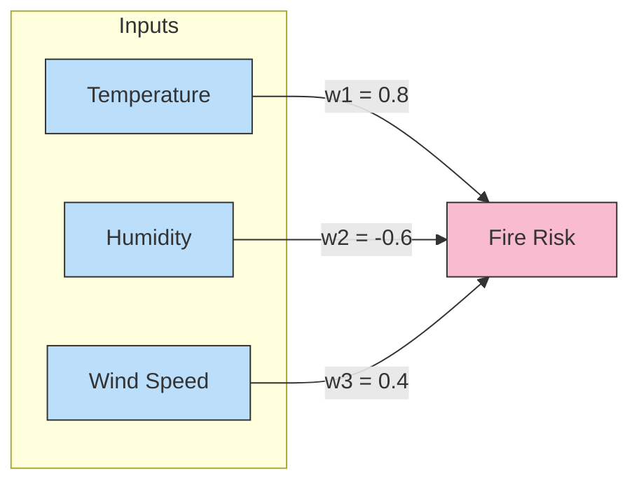

Here's how multi-input prediction works in code:

```python
def neural_network(inputs, weights):
    # weighted sum of all inputs
    prediction = 0
    for i in range(len(inputs)):
        prediction += inputs[i] * weights[i]
    return prediction

# Sample environmental data
temperature = 32  # in Celsius
humidity = 15     # in percentage
wind_speed = 25   # in km/h

inputs = [temperature, humidity, wind_speed]
weights = [0.8, -0.6, 0.4]  # initial weight values

fire_risk = neural_network(inputs, weights)
print(f"Fire Risk Score: {fire_risk}")
```

But how does the network learn with multiple inputs? Let's explore the learning process step by step.

### The Learning Process with Multiple Inputs

When our network has multiple inputs, the prediction and error calculation remain the same as with a single input. The key difference comes when we need to adjust multiple weights based on a single error value.

Here's how it works:

1. **Predict**: Calculate the weighted sum of all inputs
2. **Compare**: Calculate error between prediction and actual value
3. **Learn**: Update each weight based on:
   - The direction of error
   - The contribution of that weight's input to the error

Let's visualize a complete learning cycle with our fire risk example:

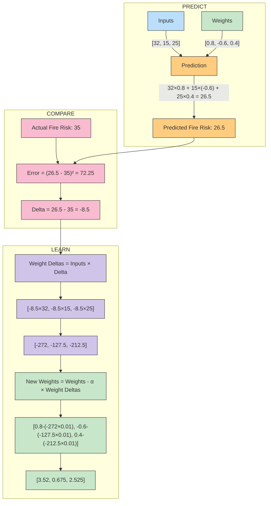

Notice the critical insight: each weight gets its own "weight delta" calculated by multiplying the shared output delta by its unique input value. This means:

1. Weights connected to larger input values receive larger updates
2. All weight updates point in the same direction (to reduce the same error)
3. The learning rate (α) prevents overshooting the optimal weights

### The Weight-Input Dance: Understanding Different Update Magnitudes

Why do weights connected to larger inputs change more? Consider our fire risk example:
- Temperature (32°C) has a much larger value than humidity (15%)
- With the same delta (-8.5), temperature's weight delta (-272) is much larger than humidity's (-127.5)

This creates an important insight: inputs with naturally larger values will dominate the learning process unless we normalize our data.

This is why environmental scientists often normalize measurements to similar scales before feeding them to neural networks. Normalizing prevents variables with larger units (like temperature in Celsius) from overshadowing equally important variables with smaller units (like concentration of a gas in parts per million).

## Multiple Outputs: One Input, Many Predictions

Now, let's explore neural networks that make multiple predictions from a single input.

Consider a weather station that measures only atmospheric pressure. From this single measurement, we want to predict:
1. Likelihood of precipitation (0-1)
2. Expected temperature change (in degrees)
3. Wind speed (km/h)

Here's how such a network might look:

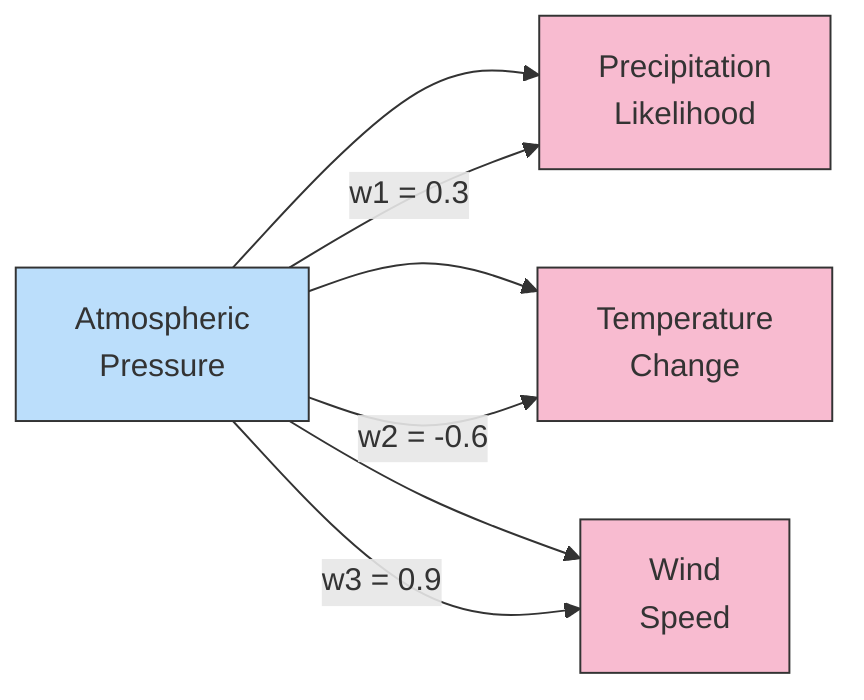

In code, our multi-output prediction works like this:

```python
def neural_network(input_value, weights):
    # Calculate multiple outputs from one input
    predictions = []
    for weight in weights:
        predictions.append(input_value * weight)
    return predictions

# Sample data
atmospheric_pressure = 1013  # in hPa (hectopascals)
weights = [0.3, -0.6, 0.9]   # one weight per output

predictions = neural_network(atmospheric_pressure, weights)
print(f"Precipitation Likelihood: {predictions[0]}")
print(f"Temperature Change: {predictions[1]}")
print(f"Wind Speed: {predictions[2]}")
```

### Learning with Multiple Outputs

The learning process for multiple outputs follows the same principles as before, but now we calculate separate errors and deltas for each output. Here's how it works:

1. **Predict**: Calculate each output prediction
2. **Compare**: Calculate error and delta for each output
3. **Learn**: Update each weight based on:
   - Its output's delta
   - The shared input value

Let's visualize one learning step:

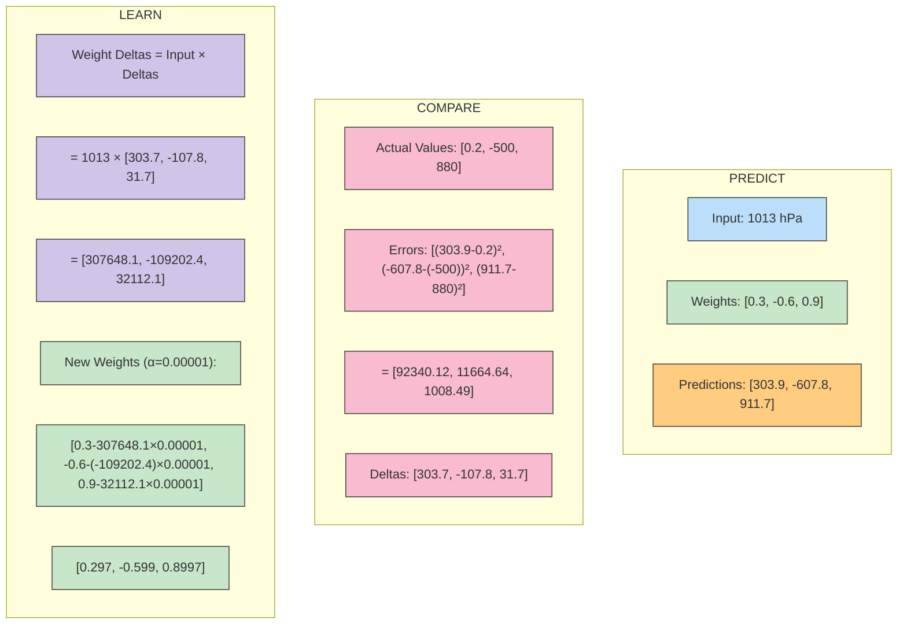

Notice we needed a much smaller learning rate (α=0.00001) because the weight deltas became extremely large due to our large input value (1013). This again highlights the importance of normalizing input data in environmental applications.

## The Full Orchestra: Multiple Inputs and Multiple Outputs

Now, let's combine both approaches to create a neural network with multiple inputs and multiple outputs—the kind that can tackle real environmental problems.

Imagine an ecosystem monitoring system that takes multiple sensor readings and produces multiple predictions about the ecosystem's health:

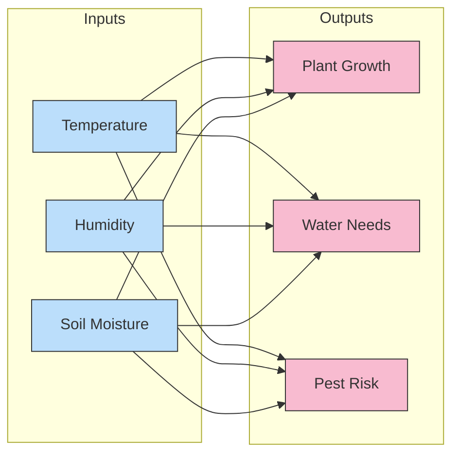

Each connection between an input and output represents a weight. With 3 inputs and 3 outputs, we have 9 weights total, which we can organize in a weight matrix:

```
weights = [
    [w11, w12, w13],  # weights from input 1 to all outputs
    [w21, w22, w23],  # weights from input 2 to all outputs
    [w31, w32, w33]   # weights from input 3 to all outputs
]
```

In code, making predictions with this network looks like:

```python
def neural_network(inputs, weights):
    # Initialize predictions array
    predictions = [0] * len(weights[0])
    
    # For each input and its row of weights
    for i in range(len(inputs)):
        for j in range(len(weights[0])):  # For each output
            predictions[j] += inputs[i] * weights[i][j]
            
    return predictions

# Sample environmental data
inputs = [28, 65, 40]  # temperature, humidity, soil moisture
weights = [
    [0.1, 0.2, -0.1],  # weights from temperature to outputs
    [0.3, 0.2, 0.0],    # weights from humidity to outputs
    [-0.2, 0.5, 0.1]    # weights from soil moisture to outputs
]

predictions = neural_network(inputs, weights)
print(f"Plant Growth: {predictions[0]}")
print(f"Water Needs: {predictions[1]}")
print(f"Pest Risk: {predictions[2]}")
```

### Matrix Operations: The Language of Multi-Weight Networks

What we're really doing with multi-input, multi-output networks is matrix multiplication. The operation we performed in the code above is equivalent to:

```
Predictions = Inputs × Weights
```

Where Inputs is a 1×3 vector and Weights is a 3×3 matrix, resulting in a 1×3 Predictions vector.

This matrix representation becomes essential as networks grow larger. Most deep learning frameworks (like TensorFlow and PyTorch) are optimized for fast matrix operations, allowing networks with millions of weights to train efficiently.

### Learning in a Full Network

Learning in a multi-input, multi-output network follows the same principles we've seen, just applied to more weights:

1. **Predict**: Calculate all outputs using matrix multiplication
2. **Compare**: Calculate errors and deltas for each output
3. **Learn**: Update each weight using its specific input and output delta

Mathematically, each weight update follows:

```
weight_delta[i][j] = inputs[i] * deltas[j]
new_weights[i][j] = weights[i][j] - (alpha * weight_delta[i][j])
```

Where `i` is the input index and `j` is the output index.

## Weight Visualization: What Do These Numbers Mean?

After training, a neural network contains weights that may seem like arbitrary numbers. But these weights actually encode patterns discovered in the data. Let's explore what these weights represent and how we can visualize them.

### Interpreting Individual Weights

Each weight represents the strength and direction of relationship between an input feature and an output prediction. 

For example, in our ecosystem monitoring system, if the weight connecting temperature to water needs is strongly positive (e.g., 0.8), this means:

- As temperature increases, predicted water needs increase
- Temperature has a significant influence on water needs

If a weight is near zero (e.g., 0.01), it suggests that input has little impact on the prediction.

### Visualizing Weight Patterns

When networks process visual data (like satellite imagery of forests), we can visualize the weights themselves to understand what patterns the network has learned.

Let's imagine a simple scenario: a neural network trained to identify three types of land cover (forest, urban, water) from satellite image pixels.

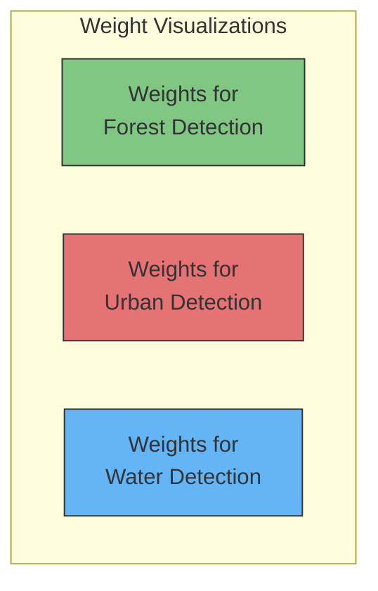

Each visualization shows which pixel patterns activate each output. The forest detector might show sensitivity to green pixel patterns, while the water detector activates for blue patterns.

This visualization technique helps environmental scientists understand what features their models are using to make predictions, enhancing trust and enabling better model refinement.

### Visualizing Dot Products: The Heart of Neural Computation

Remember that at its core, a neural network's prediction comes from dot products between inputs and weights. Visualizing these dot products can provide powerful insights into how the network makes decisions.

But what exactly is a dot product telling us? In essence, **dot products measure similarity** between two vectors. Let's explore this concept with an environmental monitoring example.

Imagine we have two environmental monitoring stations with sensor readings:

```
Station A: [temperature=25°C, humidity=60%, soil_moisture=35%]
Station B: [temperature=28°C, humidity=65%, soil_moisture=30%]
```

Now, suppose our neural network has learned a "drought risk" weight vector:
```
Drought Risk Weights: [temperature=0.8, humidity=-0.7, soil_moisture=-0.9]
```

The dot product between Station A's readings and these weights is:
```
(25 × 0.8) + (60 × -0.7) + (35 × -0.9) = 20 - 42 - 31.5 = -53.5
```

And for Station B:
```
(28 × 0.8) + (65 × -0.7) + (30 × -0.9) = 22.4 - 45.5 - 27 = -50.1
```

Station B has a higher (less negative) score, suggesting it has slightly lower drought risk, which makes sense as it has higher humidity despite higher temperature.

#### Visualizing Vector Similarity: The Key to Neural Network Predictions

Here's the intuitive breakthrough: **neural networks make predictions by finding similarities between input patterns and learned weight patterns**.

Let's visualize this with a concrete example. Imagine we're classifying forest ecosystems based on three measurements:

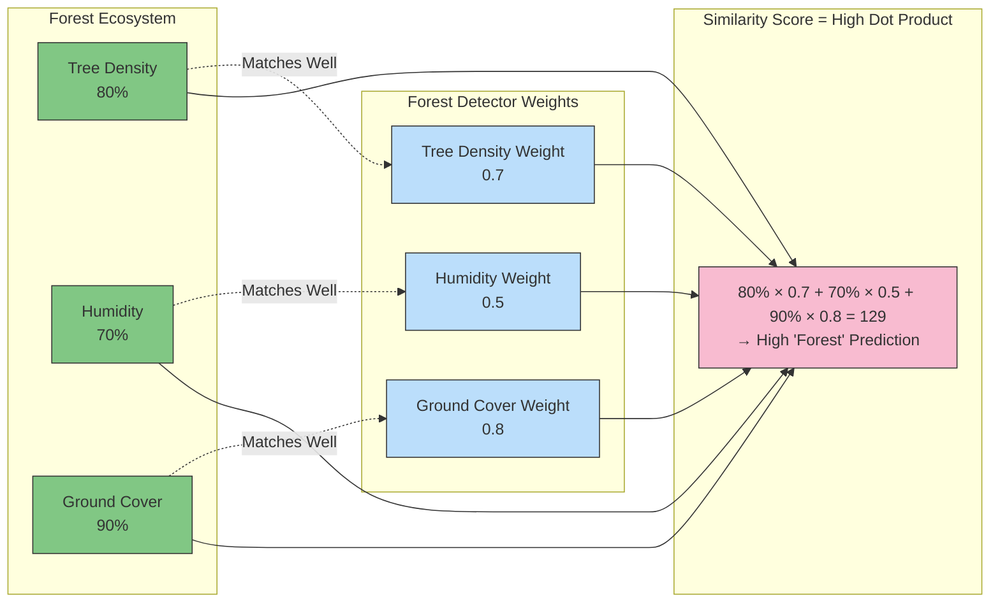

In this visualization, you can see that the input values (high tree density, high humidity, high ground cover) align well with the weights the network has learned for identifying forests. When values are high where weights are high, the dot product produces a large positive number.

Now let's compare how the same forest detector responds to a desert ecosystem:

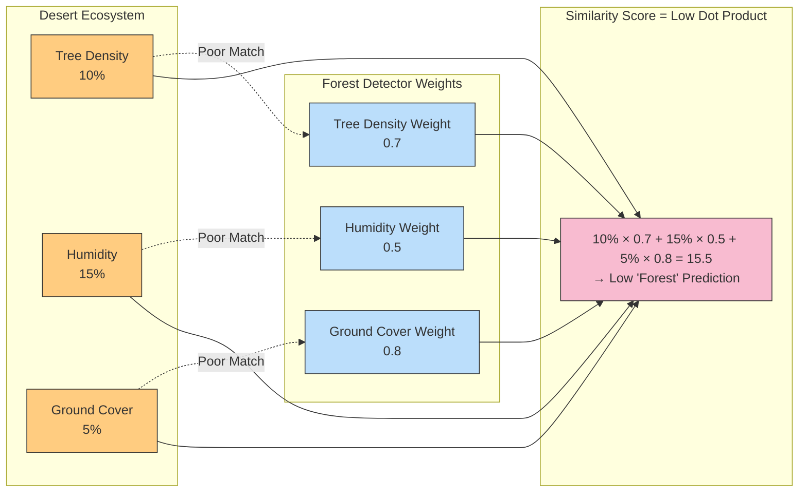

The desert ecosystem has low values precisely where the forest detector has high weights. This mismatch results in a low dot product value, correctly indicating this is not a forest.

#### The Pattern Detector Analogy

Think of each set of weights as a specialized "detector" that lights up when it encounters a pattern similar to what it's designed to find:

- The forest detector has high weights for tree density, humidity, and ground cover
- The desert detector would have high weights for temperature and sunlight but low or negative weights for humidity
- The wetland detector would have extremely high weights for standing water and aquatic plants

During training, the network automatically adjusts these weights to maximize the dot product for correct classifications and minimize it for incorrect ones. This is the essence of what neural networks learn: **optimal weight vectors that produce high dot products for matching inputs and low dot products for non-matching inputs**.

#### High Dot Products Drive Predictions

In our environmental classification network, when an input creates a high dot product with a specific set of weights, the corresponding output neuron activates strongly. This is visualized below:

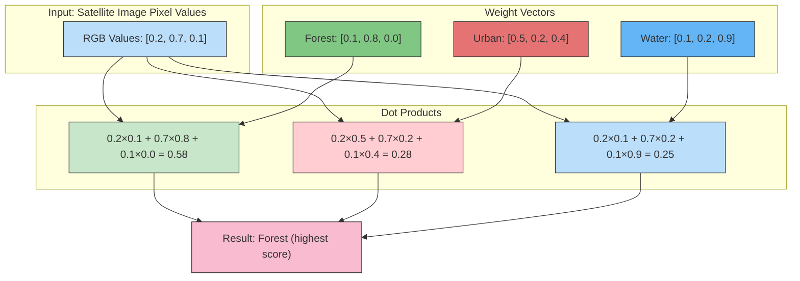

In this example, the input has the highest dot product with the "Forest" weights, leading to the classification of this pixel as forest. The high value in the green channel (0.7) matches well with the high weight for green in the forest detector (0.8).

#### Dot Products as Pattern Matching

This perspective helps us understand that neural networks are essentially sophisticated pattern matchers. Each weight vector represents a pattern the network is looking for, and the dot product measures how well the input matches that pattern.

For environmental scientists, this means neural networks excel at tasks like:

1. **Pattern recognition** - Finding similar environmental conditions across different locations
2. **Anomaly detection** - Identifying measurements that don't match expected patterns
3. **Classification** - Categorizing environments based on sensor readings

By visualizing these dot products, we gain insight into not just what the network predicts, but why it makes those predictions - an essential consideration when using neural networks for critical environmental decision-making.

## What Do Neural Networks Really Learn?

When training with multiple inputs and outputs, neural networks learn correlations in the data. Let's explore this concept with a simple example.

Imagine we're monitoring soil health with three measurements:
1. Moisture content (0-100%)
2. pH level (0-14)
3. Nitrogen content (ppm)

We want to predict:
1. Plant growth potential (0-10)
2. Microbial activity level (0-10)

In an ideal scenario, each input contributes meaningful information to the predictions:

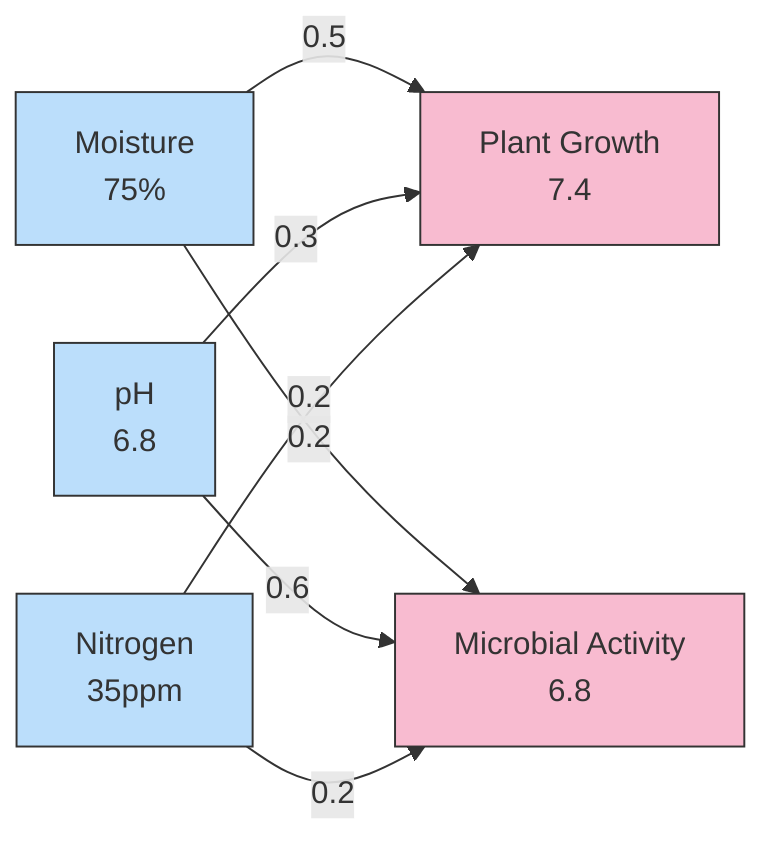

After training, examining the weights reveals that:
- Moisture has the strongest impact on plant growth (weight = 0.5)
- pH level has the strongest impact on microbial activity (weight = 0.6)

These weights don't just help the network make predictions—they tell us something about the underlying environmental system. This is one reason neural networks are valuable in ecological research: they can discover relationships that might not be obvious to human observers.

### Experimental Insight: Freezing Weights

An interesting experiment is to "freeze" certain weights during training—preventing them from being updated—to understand their importance.

For example, if we freeze the weight connecting moisture to plant growth, the network is forced to rely on pH and nitrogen to predict growth. This might reveal alternative predictive patterns or confirm the critical importance of moisture data.

In environmental monitoring, this technique helps identify which sensors are most crucial and which might be redundant—valuable information when designing cost-effective monitoring systems.

## The Dance of Parameters: Batch Learning

So far, we've updated weights after seeing each individual training example. This approach, called stochastic gradient descent, works well but can be inefficient when dealing with large environmental datasets.

A more efficient approach is batch gradient descent, where we:
1. Calculate predictions for multiple examples
2. Accumulate errors across all examples
3. Update weights once based on the average error

This reduces the noise in weight updates and often leads to more stable learning. It's particularly useful when analyzing seasonal environmental data, where patterns might only become apparent when considering multiple time points together.

```python
def batch_training(inputs_batch, targets_batch, weights, learning_rate):
    # Initialize accumulated weight deltas
    accumulated_weight_deltas = [[0 for _ in range(len(weights[0]))] 
                               for _ in range(len(weights))]
    
    # For each example in the batch
    for i in range(len(inputs_batch)):
        inputs = inputs_batch[i]
        targets = targets_batch[i]
        
        # Make predictions
        predictions = neural_network(inputs, weights)
        
        # Calculate deltas
        deltas = []
        for j in range(len(predictions)):
            deltas.append(predictions[j] - targets[j])
        
        # Accumulate weight deltas
        for input_idx in range(len(inputs)):
            for output_idx in range(len(deltas)):
                weight_delta = inputs[input_idx] * deltas[output_idx]
                accumulated_weight_deltas[input_idx][output_idx] += weight_delta
    
    # Calculate average weight deltas and update weights
    batch_size = len(inputs_batch)
    for i in range(len(weights)):
        for j in range(len(weights[0])):
            avg_delta = accumulated_weight_deltas[i][j] / batch_size
            weights[i][j] -= learning_rate * avg_delta
    
    return weights
```

## Conclusion: The Symphony of Learning

We've journeyed from simple single-weight networks to complex systems with multiple inputs and outputs. Along the way, we've discovered that:

1. **Multiple weights learn together** in a coordinated dance, each adjusting according to its input's magnitude and contribution to error

2. **Matrix operations** efficiently encode the relationships between inputs and outputs

3. **Weight visualizations** reveal what patterns neural networks discover in environmental data

4. **Batch learning** helps neural networks find stable patterns across multiple examples

Just as ecosystems function through the interaction of many species, neural networks achieve their power through the coordinated adjustment of many weights. Each weight may be simple, but together they form a system capable of modeling complex environmental relationships.

As we continue our journey in the next chapter, we'll explore how to link multiple layers of these networks together, creating deep neural networks capable of learning even more complex patterns in environmental data.

### Reflection Questions

1. How would you design a neural network to predict multiple aspects of climate change (temperature rise, sea level change, precipitation patterns) based on various emissions metrics?

2. Consider a forest ecosystem monitoring system: what inputs would you collect, what outputs would you predict, and how would you structure the network's weights?

3. If you noticed that certain weights became very large during training while others remained small, what might this tell you about your environmental data?

4. How might visualizing the weights in your trained network help environmental scientists better understand the systems they study?
## Exercises

1. **Exploration of Weight Initialization**: Implement a simple two-input, one-output neural network for predicting plant growth based on sunlight hours and water amount. Train the network three times with different initial weight values (-1, 0, and 1) and compare the learning curves.

2. **Correlation Detection**: Create a dataset with one input strongly correlated with the output and one input with no correlation. Train a network and examine the final weights. What do they tell you about how the network "discovered" the relationships in your data?

3. **Multi-Output Training**: Design a neural network that predicts both temperature and humidity based on barometric pressure data. Compare the accuracy of this multi-output network to two separate single-output networks.

4. **Weight Freezing Experiment**: Implement a multi-input network where you selectively "freeze" different weights during training (prevent them from updating). Analyze how this affects the network's ability to learn.

5. **Batch Training Implementation**: Compare the learning stability of updating weights after each example versus updating after batches of 5 examples. Plot the error curves and explain the differences.

## Project 1: Mathematical Analysis of a Multi-Weight Network

### Learning Objective
In this project, you'll mathematically compute a forward and backward pass through a multi-weight neural network using only algebra. This will solidify your understanding of how neural networks process information and learn.

### Problem Statement
You're building a model to predict biodiversity levels in different ecosystems. You have these input measurements:
- Tree density (trees per hectare): 25
- Annual rainfall (cm): 150
- Average temperature (°C): 22

You'll create a network with these inputs and one output (biodiversity score). 

### Step 1: Initialize Network Parameters
We'll start with these weights:
- w1 (for tree density): 0.1
- w2 (for rainfall): 0.2
- w3 (for temperature): -0.1

We'll use a very simple network with just weighted inputs:

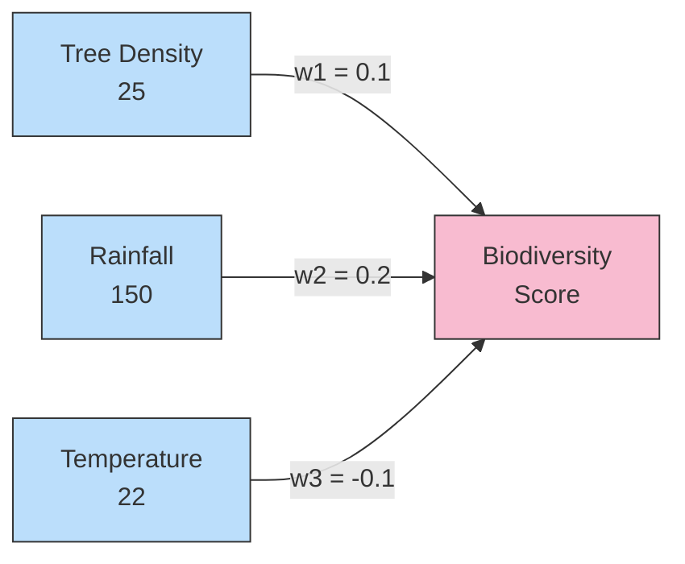

### Step 2: Forward Pass - Calculate Prediction
Compute the weighted sum of inputs:

prediction = (25 × 0.1) + (150 × 0.2) + (22 × -0.1)
prediction = 2.5 + 30 - 2.2
prediction = 30.3

### Step 3: Calculate Error
Assume the actual biodiversity score should be 35.

error = (prediction - actual)²
error = (30.3 - 35)²
error = (-4.7)²
error = 22.09

### Step 4: Calculate Error Derivatives
Now we'll compute how much each weight contributed to the error:

1. First, find the derivative of error with respect to prediction:
   
   error_derivative = 2 × (prediction - actual)
   error_derivative = 2 × (30.3 - 35)
   error_derivative = 2 × (-4.7)
   error_derivative = -9.4

2. Calculate weight gradients (how much each weight should change):
   
   w1_gradient = error_derivative × tree_density
   w1_gradient = -9.4 × 25
   w1_gradient = -235
   
   w2_gradient = error_derivative × rainfall
   w2_gradient = -9.4 × 150
   w2_gradient = -1410
   
   w3_gradient = error_derivative × temperature
   w3_gradient = -9.4 × 22
   w3_gradient = -206.8

### Step 5: Update Weights
Using a learning rate (α) of 0.0001:

new_w1 = w1 - (α × w1_gradient)
new_w1 = 0.1 - (0.0001 × -235)
new_w1 = 0.1 + 0.0235
new_w1 = 0.1235

new_w2 = w2 - (α × w2_gradient)
new_w2 = 0.2 - (0.0001 × -1410)
new_w2 = 0.2 + 0.141
new_w2 = 0.341

new_w3 = w3 - (α × w3_gradient)
new_w3 = -0.1 - (0.0001 × -206.8)
new_w3 = -0.1 + 0.02068
new_w3 = -0.07932

### Step 6: Calculate New Prediction with Updated Weights
prediction_new = (25 × 0.1235) + (150 × 0.341) + (22 × -0.07932)
prediction_new = 3.0875 + 51.15 - 1.74504
prediction_new ≈ 52.49

You can see the prediction is now closer to the target value of 35. However, it overshot because we used a single large update. In practice, smaller learning rates and multiple iterations produce smoother convergence.

### Exercise for Practice
Try computing one more iteration with these new weights. Calculate:
1. The new prediction
2. The new error
3. The new gradients
4. The updated weights after a second iteration

## Project 2: Implementing a Multi-Weight Neural Network

### Learning Objective
In this project, you'll implement a complete neural network with multiple inputs and outputs based solely on what you've learned in this chapter. You'll see how the mathematical concepts translate into working code.

### Problem Statement
We're creating an ecosystem health monitoring system for wetlands. Our network will:
- Take three input measurements: water level, pH, and temperature
- Predict two output values: plant diversity index and animal activity level

### Step 1: Prepare the Dataset
First, let's create a small dataset that represents our wetlands monitoring data:

```python
import numpy as np
import matplotlib.pyplot as plt

# Sample data (5 measurements)
# Format: [water_level, pH, temperature]
inputs = np.array([
    [120, 6.5, 22],  # Measurement 1
    [90, 7.2, 25],   # Measurement 2
    [150, 5.8, 18],  # Measurement 3
    [110, 6.7, 23],  # Measurement 4
    [85, 7.5, 26]    # Measurement 5
])

# Target values [plant_diversity, animal_activity]
targets = np.array([
    [7.8, 6.2],  # Ecosystem health metrics for measurement 1
    [5.2, 7.5],  # Ecosystem health metrics for measurement 2
    [8.7, 4.2],  # Ecosystem health metrics for measurement 3
    [7.2, 6.8],  # Ecosystem health metrics for measurement 4
    [4.9, 8.1]   # Ecosystem health metrics for measurement 5
])
```

### Step 2: Initialize the Neural Network
We'll create a network with 3 inputs and 2 outputs, which means we need 6 weights (3 weights per output):

```python
# Initialize weights randomly between -0.1 and 0.1
weights = np.random.uniform(-0.1, 0.1, size=(3, 2))
print("Initial weights:")
print(weights)

# Learning rate
learning_rate = 0.0001
```

### Step 3: Define the Network's Forward Pass
The forward pass calculates predictions based on inputs and weights:

```python
def forward_pass(inputs, weights):
    """
    Calculate predictions for all input examples
    
    Args:
        inputs: Array of shape (num_examples, num_features)
        weights: Array of shape (num_features, num_outputs)
        
    Returns:
        predictions: Array of shape (num_examples, num_outputs)
    """
    # Matrix multiplication: inputs × weights
    return np.dot(inputs, weights)
```

### Step 4: Define the Error Calculation
We'll use mean squared error (MSE) to measure how far our predictions are from the targets:

```python
def calculate_error(predictions, targets):
    """
    Calculate mean squared error between predictions and targets
    
    Args:
        predictions: Array of shape (num_examples, num_outputs)
        targets: Array of shape (num_examples, num_outputs)
        
    Returns:
        error: Mean squared error across all outputs and examples
    """
    return np.mean((predictions - targets) ** 2)
```

### Step 5: Define the Learning Process
Now let's implement the gradient descent update step:

```python
def train_network(inputs, targets, weights, learning_rate, epochs):
    """
    Train the network using gradient descent
    
    Args:
        inputs: Input features, shape (num_examples, num_features)
        targets: Target values, shape (num_examples, num_outputs)
        weights: Initial weights, shape (num_features, num_outputs)
        learning_rate: Learning rate for gradient descent
        epochs: Number of training iterations
        
    Returns:
        weights: Updated weights after training
        errors: List of errors during training
    """
    num_examples = inputs.shape[0]
    errors = []
    
    for epoch in range(epochs):
        # Forward pass
        predictions = forward_pass(inputs, weights)
        
        # Calculate error
        error = calculate_error(predictions, targets)
        errors.append(error)
        
        # Calculate gradients
        # derivative of MSE = 2 * (prediction - target) / num_examples
        error_derivatives = 2 * (predictions - targets) / num_examples
        
        # Weight gradients = inputs^T × error_derivatives
        weight_gradients = np.dot(inputs.T, error_derivatives)
        
        # Update weights
        weights = weights - learning_rate * weight_gradients
        
        # Print progress
        if epoch % 100 == 0:
            print(f"Epoch {epoch}: Error = {error:.4f}")
    
    return weights, errors
```

### Step 6: Train the Network and Visualize Results

```python
# Train the network
epochs = 1000
final_weights, error_history = train_network(inputs, targets, weights, learning_rate, epochs)

# Print final weights
print("\nFinal weights:")
print(final_weights)

# Visualize the learning process
plt.figure(figsize=(10, 6))
plt.plot(error_history)
plt.title('Learning Curve')
plt.xlabel('Epoch')
plt.ylabel('Mean Squared Error')
plt.grid(True)

# Make predictions with the trained network
final_predictions = forward_pass(inputs, final_weights)

# Compare predictions with targets
print("\nPredictions vs Targets:")
for i in range(len(inputs)):
    print(f"Measurement {i+1}:")
    print(f"  Inputs: Water Level={inputs[i][0]}, pH={inputs[i][1]}, Temperature={inputs[i][2]}")
    print(f"  Predicted Plant Diversity: {final_predictions[i][0]:.2f}, Animal Activity: {final_predictions[i][1]:.2f}")
    print(f"  Actual Plant Diversity: {targets[i][0]:.2f}, Animal Activity: {targets[i][1]:.2f}")
    print()

plt.figure(figsize=(12, 5))
plt.subplot(1, 2, 1)
plt.scatter(targets[:, 0], final_predictions[:, 0])
plt.plot([min(targets[:, 0]), max(targets[:, 0])], [min(targets[:, 0]), max(targets[:, 0])], 'r--')
plt.title('Plant Diversity: Predictions vs Actual')
plt.xlabel('Actual Values')
plt.ylabel('Predicted Values')

plt.subplot(1, 2, 2)
plt.scatter(targets[:, 1], final_predictions[:, 1])
plt.plot([min(targets[:, 1]), max(targets[:, 1])], [min(targets[:, 1]), max(targets[:, 1])], 'r--')
plt.title('Animal Activity: Predictions vs Actual')
plt.xlabel('Actual Values')
plt.ylabel('Predicted Values')

plt.tight_layout()
plt.show()
```

### Step 7: Weight Analysis
Try to interpret what the network has learned by examining the weights:

```python
# Analyze the learned weights
print("\nWeight Analysis:")
feature_names = ["Water Level", "pH", "Temperature"]
output_names = ["Plant Diversity", "Animal Activity"]

for i in range(len(feature_names)):
    for j in range(len(output_names)):
        importance = abs(final_weights[i][j]) / np.sum(abs(final_weights[:, j]))
        print(f"Impact of {feature_names[i]} on {output_names[j]}: {importance:.2%}")
        
        # Interpret the relationship (positive/negative)
        if final_weights[i][j] > 0:
            relationship = "positive (increases together)"
        else:
            relationship = "negative (one increases as the other decreases)"
        print(f"  Relationship: {relationship}")
    print()
```

### Extensions and Challenges
1. Add a bias term to the network (as an additional constant input of 1.0)
2. Split the data into training and testing sets to evaluate generalization
3. Implement batch training instead of using all samples at once
4. Try with different learning rates and compare convergence 
5. Normalize the inputs and compare learning performance

This project demonstrates how the mathematical principles covered in this chapter apply to a real-world environmental monitoring problem. You've built a complete neural network from scratch that can learn patterns between ecological variables and make predictions about ecosystem health!
