# Chapter 6: Backpropagation: Chain Reaction: Training Multi-Layer Networks with Error Attribution

> *"In the forest, no tree stands alone; each sends signals through the soil, sharing both nutrients and knowledge, creating a network far more powerful than any individual could be."*
>
> *—Dr. Ernesto Lee*

## Introduction: The Limitations of Simple Neural Networks

In the previous chapters, we've explored how neural networks learn through gradient descent, adjusting their weights to reduce error and find patterns in data. With a single layer of weights, these networks can successfully identify direct correlations between inputs and outputs—like connecting temperature readings with evaporation rates or humidity levels with plant growth.

But what happens when no direct correlation exists? What if the relationship between our environmental inputs and the outputs we want to predict is more complex? For example:

* A single soil measurement alone can't predict crop yields—the interaction between moisture, pH level, and nutrient content matters
* No individual weather variable directly correlates with flood risk—it's specific combinations of rainfall, ground saturation, and upstream conditions that signal danger
* Predicting wildlife migration patterns requires understanding complex interactions between temperature, food availability, and human activity

In this chapter, we'll tackle these more complex problems by introducing **multi-layer neural networks** and the powerful algorithm that makes them work: **backpropagation**. Just as ecosystems thrive through intricate, multi-level relationships, our neural networks will gain new capabilities by adding depth and complexity.

## The Nature Crossing Problem: Learning Without Direct Correlation

Before diving into mathematical details, let's understand why we need deeper networks through an intuitive example. Imagine you're a wildlife biologist studying animal crossing behavior at a forest trail intersection. You've installed a special wildlife traffic signal with three colored lights to guide animal movement and prevent dangerous crossings.

The problem? You've just arrived at a new research site in a different ecosystem, and you don't know which light combinations signal "safe to cross" versus "danger—don't cross" for the local wildlife. Through observation, you record how animals respond to different light patterns:

```mermaid
flowchart TB
    subgraph "Observation 1: Animals WAIT"
        L1["🔴 ⚪ 🔵"]  
    end
    
    subgraph "Observation 2: Animals CROSS"
        L2["⚪ 🔴 🔵"]  
    end
    
    subgraph "Observation 3: Animals WAIT"
        L3["⚪ ⚪ 🔵"]  
    end
    
    subgraph "Observation 4: Animals CROSS"
        L4["🔴 🔴 🔵"]  
    end
    
    subgraph "Observation 5: Animals CROSS"
        L5["⚪ 🔴 🔵"]  
    end
    
    subgraph "Observation 6: Animals WAIT"
        L6["🔴 ⚪ 🔵"]  
    end
    
    style L1 fill:#ffcdd2,stroke:#333,stroke-width:1px
    style L2 fill:#c8e6c9,stroke:#333,stroke-width:1px
    style L3 fill:#ffcdd2,stroke:#333,stroke-width:1px
    style L4 fill:#c8e6c9,stroke:#333,stroke-width:1px
    style L5 fill:#c8e6c9,stroke:#333,stroke-width:1px
    style L6 fill:#ffcdd2,stroke:#333,stroke-width:1px
```



After careful study, you realize something: there's no single light that perfectly correlates with crossing behavior. Looking at the middle light, it's ON for all crossing events, but also ON for some waiting events. No individual light gives you a reliable rule.

What's really happening is that animals cross when the *specific combination* of the first two lights matches a pattern: either both are ON, or the first is OFF and the second is ON. This kind of relationship—where the outcome depends on specific combinations of inputs rather than any single input—requires a more sophisticated neural network.

### Converting Observations into Training Data

To train a neural network to recognize these patterns, we first convert our observations into numerical form:

```
Light Patterns (Inputs)        Animal Behavior (Output)
[1, 0, 1]                      0 (WAIT)
[0, 1, 1]                      1 (CROSS)
[0, 0, 1]                      0 (WAIT)
[1, 1, 1]                      1 (CROSS)
[0, 1, 1]                      1 (CROSS)
[1, 0, 1]                      0 (WAIT)
```

Where 1 represents a light that's ON, and 0 represents a light that's OFF.

Let's try to solve this with our single-layer network from Chapter 5:

```python
def neural_network(inputs, weights):
    prediction = 0
    for i in range(len(inputs)):
        prediction += inputs[i] * weights[i]
    return prediction > 0.5  # Convert to binary output

# After training...
final_weights = [0.1, 0.9, 0.0]  # Example weights after training
```

With these weights, our network essentially says: "The middle light being ON is what matters most." But this doesn't capture the full pattern! Testing these weights against our observations reveals errors:

```
[1, 0, 1] → prediction: 0.1 → WAIT ✓
[0, 1, 1] → prediction: 0.9 → CROSS ✓
[0, 0, 1] → prediction: 0.0 → WAIT ✓
[1, 1, 1] → prediction: 1.0 → CROSS ✓
[0, 1, 1] → prediction: 0.9 → CROSS ✓
[1, 0, 1] → prediction: 0.1 → WAIT ✓
```

Wait—this actually works! But there's a catch. This simple solution works for this *specific dataset*, but it doesn't capture the true pattern. If we add more observations:

```
[1, 1, 0] → ? (should be CROSS)
[0, 1, 0] → ? (should be CROSS)
```

Our simple model would fail on the second case. The real pattern is more complex than what a single-layer network can learn.

## The Need for Deeper Networks

Single-layer networks, as we've seen, can identify direct correlations between inputs and outputs. They essentially say: "This input correlates with this output to this degree." But they can't identify correlations between *specific combinations* of inputs and outputs.

In our wildlife crossing example, the rule isn't about individual lights—it's about specific combinations. This is where multi-layer networks shine.


With a hidden layer, our network can now create nodes that activate for specific input combinations. For example, one hidden node might learn to activate when "Light 1 is ON AND Light 2 is ON," while another might activate when "Light 1 is OFF AND Light 2 is ON."

This is the essential power of deep networks: they can create intermediate representations that capture complex patterns not directly visible in the raw inputs.

### The Expressive Power of Depth

As we add more layers, neural networks can learn increasingly complex patterns. This is similar to how ecosystems work in nature:

* **Level 1**: Individual species interactions (predator-prey)
* **Level 2**: Community dynamics (competitive exclusion, mutualism)
* **Level 3**: Ecosystem feedback loops (nutrient cycling, energy flow)
* **Level 4**: Biome-level adaptation and evolution

Each level builds upon the patterns detected at the previous level, creating a rich hierarchy of representations—much like a deep neural network.

## Creating Correlation Where None Exists

The key insight of multi-layer networks is that they can create intermediate representations (the hidden layer) that have correlation with the output, even when the original inputs don't. Let's see how this works.

### The Hidden Layer: A Bridge Between Worlds

In our animal crossing problem, the direct inputs (light states) don't perfectly correlate with the animal behavior. But with a hidden layer, the network can create new, intermediate features that do have strong correlation.

Imagine our network develops two hidden nodes with these functions:

1. Hidden Node 1: Activates when "Light 1 is ON AND Light 2 is ON"
2. Hidden Node 2: Activates when "Light 1 is OFF AND Light 2 is ON"


Now the output layer has a much easier job—it only needs to recognize that when either Hidden Node 1 OR Hidden Node 2 is active, animals will cross. This is something a single layer can easily learn!

This concept is profound: the network creates its own intermediate features that better represent the problem. This is similar to how environmental scientists might create derived metrics (like aridity indices from temperature and humidity) that better predict ecological outcomes than the raw measurements alone.

### From Mathematics to Learning: Building a Deep Network

To implement our multi-layer network, we need two sets of weights:
1. **Weights_0_1**: Connecting the input layer to the hidden layer
2. **Weights_1_2**: Connecting the hidden layer to the output layer

The forward pass through this network looks like this in code:

```python
def deep_neural_network(input_data, weights_0_1, weights_1_2):
    # First layer transformation
    hidden_layer = np.dot(input_data, weights_0_1)
    
    # Apply nonlinearity (we'll discuss this more soon)
    hidden_layer = relu(hidden_layer)
    
    # Second layer transformation
    output = np.dot(hidden_layer, weights_1_2)
    
    return output
```

But how do we train this network? That's where backpropagation comes in.

## The Backpropagation Algorithm: Tracing Responsibility for Error

### The Chain Rule of Calculus in Neural Networks

Backpropagation is named after its key insight: we can propagate error backward through the network to assign responsibility to each weight. At its heart, backpropagation is an application of the chain rule from calculus.

Imagine a simple ecosystem with these relationships:
1. Temperature affects soil moisture
2. Soil moisture affects plant growth
3. Plant growth affects herbivore populations

If we want to understand how temperature impacts herbivore populations, we need to trace the effect through each link in the chain. The chain rule allows us to calculate this total effect by multiplying the individual effects at each step.

Neural networks work the same way. To understand how an input layer weight affects the final output error, we need to trace the effect through each layer:


### Forward and Backward Passes

Backpropagation involves two passes through the network:

1. **Forward Pass**: Calculate the network's prediction and the resulting error
2. **Backward Pass**: Distribute responsibility for that error back through the network's weights

Let's see how this works with a concrete example from our animal crossing problem:

```python
# Forward pass
layer_0 = light_patterns[0]  # [1, 0, 1]
layer_1 = relu(np.dot(layer_0, weights_0_1))  # Hidden layer outputs
layer_2 = np.dot(layer_1, weights_1_2)  # Final prediction

# Calculate error and output delta
error = (layer_2 - animal_behavior[0]) ** 2
layer_2_delta = layer_2 - animal_behavior[0]  # How much should the output change?

# Backward pass - the key to backpropagation
layer_1_delta = layer_2_delta.dot(weights_1_2.T) * relu2deriv(layer_1)

# Weight updates
weights_1_2 -= alpha * layer_1.T.dot(layer_2_delta)
weights_0_1 -= alpha * layer_0.T.dot(layer_1_delta)
```

### The Chain Rule of Calculus: Following the Error Trail

At the heart of backpropagation lies one of the most powerful ideas in calculus: the Chain Rule. To understand backpropagation, we first need to understand this fundamental principle in an intuitive way.

#### What is the Chain Rule?

Imagine you're hiking through a forest. You want to know how quickly the temperature changes as you climb a mountain. The temperature depends on your elevation, but your elevation depends on how far you've hiked along the trail. The Chain Rule tells us that:

```
Rate of temperature change with distance = 
    Rate of temperature change with elevation × Rate of elevation change with distance
```

Mathematically, if we have a function z that depends on y, which in turn depends on x, then:

```
dz/dx = (dz/dy) × (dy/dx)
```

This is the essence of the Chain Rule: when computing how changes in an input affect the output through a chain of dependencies, you multiply the individual rates of change together.

#### The Chain Rule in Neural Networks

In our neural network, we need to know how changing each weight affects the final error. But there's a chain of dependencies:

1. Weights → Hidden Layer Activations → Output → Error

To find how a weight in the first layer affects the error, we need to apply the Chain Rule to track the error backward through this chain.

```mermaid
flowchart LR
    subgraph "Chain of Dependencies"
        W["Weight"] --> H["Hidden Layer Activation"]
        H --> O["Output"]
        O --> E["Error"]
    end
    
    subgraph "Chain Rule Application"
        D1["dError/dWeight = "]
        D2["dError/dOutput × "]
        D3["dOutput/dHidden × "]
        D4["dHidden/dWeight"]
    end
    
    D1 --- D2 --- D3 --- D4
    
    style W fill:#bbdefb,stroke:#333,stroke-width:1px
    style H fill:#c8e6c9,stroke:#333,stroke-width:1px
    style O fill:#ffcc80,stroke:#333,stroke-width:1px
    style E fill:#f8bbd0,stroke:#333,stroke-width:1px
    
    style D1 fill:#e1bee7,stroke:#333,stroke-width:1px
    style D2 fill:#e1bee7,stroke:#333,stroke-width:1px
    style D3 fill:#e1bee7,stroke:#333,stroke-width:1px
    style D4 fill:#e1bee7,stroke:#333,stroke-width:1px
```



#### The Chain Rule in Action

Let's see this with a concrete example from our animal crossing problem. Consider how we calculate the update for a weight connecting input layer to hidden layer:

1. **Output Error**: First, we calculate how much the network's prediction differs from the target:
   ```
   layer_2_delta = layer_2 - animal_behavior[0]  # This is dError/dOutput
   ```

2. **Output to Hidden Connection**: Then, we calculate how each hidden node contributed to this error:
   ```
   # This applies weights_1_2.T to distribute error backward
   # It represents dOutput/dHidden in our chain
   hidden_contribution = layer_2_delta.dot(weights_1_2.T)
   ```

3. **Activation Function Effect**: We account for the effect of the activation function:
   ```
   # This is dHidden/dHidden_before_activation
   activation_effect = relu2deriv(layer_1)
   ```

4. **Hidden Layer Delta**: Combining these with the Chain Rule:
   ```
   layer_1_delta = hidden_contribution * activation_effect
   # This is dError/dHidden_before_activation
   ```

5. **Final Weight Update**: Finally, we determine how each weight contributed:
   ```
   weight_updates = layer_0.T.dot(layer_1_delta)
   # This accounts for dHidden_before_activation/dWeight
   ```

#### The Power of the Chain Rule: Connecting Distant Causes and Effects

What makes the Chain Rule so powerful for neural networks is that it allows us to connect cause and effect across multiple layers. Like tracing an environmental impact back through a complex ecosystem, backpropagation traces errors backward through the network.

Think of it as attribution in an ecosystem:
1. We observe reduced fish populations (the error)
2. We trace this to reduced water oxygen (output layer)
3. Which we trace to algal blooms (hidden layer)
4. Which we ultimately trace to fertilizer runoff (input weight)

The Chain Rule gives us a mathematical way to quantify each link in this causal chain.

### The Magic of Error Attribution

The key insight in the backward pass is how we calculate `layer_1_delta`. Let's break this down:

```python
layer_1_delta = layer_2_delta.dot(weights_1_2.T) * relu2deriv(layer_1)
```

This has two components:

1. `layer_2_delta.dot(weights_1_2.T)`: This distributes the output error to each hidden node based on how much that node contributed to the output (via the weights) - this is applying the first part of our chain rule

2. `relu2deriv(layer_1)`: This ensures we only assign error to nodes that were actually active during the forward pass - this is applying the second part of our chain rule

The result is a delta for each hidden node that tells us how much that node's output should change to reduce the final error.


This approach allows error information to flow backward through the network, guiding weight updates at each layer to collectively reduce the final prediction error.

## Nonlinear Activation Functions: The Alchemical Transformation

### The Great Divide: Linear vs. Nonlinear Worlds

There's a critical component we haven't fully explained yet: the `relu()` function applied to the hidden layer. This seemingly simple operation—a nonlinear activation function—represents the fundamental dividing line between classical machine learning and modern deep learning. It's as transformative as the discovery of fire was to early humans.

Without nonlinearity, the entire architecture of deep neural networks would collapse. Here's why: when you stack linear functions together, you just get another linear function. The mathematical composition of any number of linear layers is equivalent to a single linear transformation.

Let's demonstrate:

```
With two linear layers:
y = W2 * (W1 * x)
y = (W2 * W1) * x
```

This means a 100-layer linear network has exactly the same expressive power as a single-layer network! No matter how "deep" we make it, we're still confined to the world of lines and planes.


### The Alchemy of Nonlinearity: Transforming Lead into Gold

Nonlinear activation functions break this fundamental limitation. They introduce the capacity for a network to approximate any function, no matter how complex—a property known as universal approximation. This is the true alchemy of deep learning: the ability to transform simple linear operations into representations that can capture the intricate patterns of our nonlinear universe.

The most commonly used activation function today is ReLU (Rectified Linear Unit):

```python
def relu(x):
    return (x > 0) * x  # Returns x if x > 0, otherwise returns 0
```

Despite its mathematical simplicity, this function creates a profound philosophical shift. It introduces *conditionality* into the network—the idea that neurons can selectively respond based on specific input conditions.

### The Philosophical Implications: Finding Meaning in a Complex World

This leap from linear to nonlinear has profound philosophical implications. Consider:

1. **Emergence of Complexity**: Just as complex life emerges from simple chemical processes, complex intelligence emerges from simple nonlinear operations repeated across layers. The whole becomes greater than the sum of its parts.

2. **The Nature of Understanding**: Linear systems are fully interpretable—we can trace exactly how inputs become outputs. Nonlinear systems, like deep neural networks, develop their own internal representations that sometimes defy simple explanation. This mirrors the philosophical debate about whether understanding requires reducibility.

3. **The Power of Representation**: Nonlinearity enables representation learning—the network discovers features rather than being told what's important. This parallels how human understanding evolves: we don't just passively perceive reality; we actively construct models of it.


### Nonlinearity in Nature: The Universe's Preference

Nonlinearity isn't just a mathematical trick—it's the dominant paradigm in nature. Consider these examples:

1. **Ecosystem Tipping Points**: When environmental stressors reach certain thresholds, ecosystems don't respond linearly—they can collapse suddenly or transform into entirely new states.

2. **Climate Feedback Loops**: Small temperature increases can trigger nonlinear effects like melting ice caps, which reduce reflectivity, causing more warming in an accelerating cycle.

3. **Population Dynamics**: Species populations don't grow linearly but follow logistic curves with sudden crashes and booms.

4. **Neuronal Firing**: Our own brain neurons operate nonlinearly—they only fire after reaching a certain activation threshold, remarkably similar to the ReLU function!

By incorporating nonlinearity, neural networks become better aligned with how natural systems actually operate. This may explain their remarkable effectiveness at modeling environmental phenomena.

### The Magic of "Sometimes Correlation": Selective Pattern Recognition

Nonlinearity enables what we call "sometimes correlation"—the ability for a neuron to activate only under specific conditions. For example, in our animal crossing problem, a hidden neuron might compute:

```
Output = 0.8 * Light1 + 0.7 * Light2 - 1.0
```

With ReLU applied:
- When both lights are ON: 0.8 + 0.7 - 1.0 = 0.5 → Neuron activates
- When only Light1 is ON: 0.8 - 1.0 = -0.2 → ReLU makes this 0 → Neuron remains silent
- When only Light2 is ON: 0.7 - 1.0 = -0.3 → ReLU makes this 0 → Neuron remains silent

This creates a detector for the specific pattern "both lights on" that wouldn't be possible with purely linear operations. Now imagine this capability multiplied across thousands or millions of neurons across many layers—suddenly, we can detect patterns of almost arbitrary complexity.

### The Universal Approximation Theorem: Deep Learning's Profound Promise

The Universal Approximation Theorem is perhaps the most profound mathematical result in deep learning. It states that a neural network with just a single hidden layer and a nonlinear activation function can approximate ANY continuous function to arbitrary precision, given enough hidden neurons.

This has staggering implications:

1. **No Pattern is Too Complex**: Given enough neurons and training data, a nonlinear neural network can theoretically learn any pattern that exists in the world.

2. **The End of Feature Engineering**: Traditional machine learning required experts to carefully craft features. Nonlinear networks can discover their own features.

3. **A New Scientific Tool**: Deep networks can find patterns in data that humans might never detect, potentially revealing new scientific insights about our environment.

4. **Limitless Applications**: From modeling ecosystem dynamics to predicting climate change effects to understanding animal behavior—the same fundamental architecture can adapt to countless domains.

### From Theory to Reality: Real-World Transformations

This theoretical power has translated into practical revolutions:

1. **Computer Vision**: Nonlinear networks can identify thousands of object categories in images, recognize individual animals in ecological studies, or detect plant diseases from photographs.

2. **Language Understanding**: Models like GPT can generate and understand human language by capturing the deeply nonlinear relationships between words and concepts.

3. **Scientific Discovery**: DeepMind's AlphaFold revolutionized protein structure prediction by capturing the nonlinear relationships between amino acid sequences and 3D structures.

4. **Environmental Modeling**: Predicting complex phenomena like weather patterns, species distributions, or ecosystem responses to climate change.

All of these breakthroughs fundamentally rely on the power of nonlinearity to capture complex patterns.

### Common Activation Functions: Different Windows into Nonlinearity

While ReLU is most common today, other activation functions offer different nonlinear perspectives:


Each mimics different nonlinear phenomena in nature:
- **ReLU**: Similar to ecological thresholds and neuronal firing
- **Sigmoid**: Models population growth curves and resource saturation
- **Tanh**: Represents systems with natural equilibrium points

### The Derivative of Power: Backpropagation Through Nonlinearity

For backpropagation to work, we need the derivative of our activation function. For ReLU, this is elegantly simple:

```python
def relu2deriv(output):
    return output > 0  # Returns 1 where output > 0, otherwise returns 0
```

This derivative acts like a gate, controlling which neurons receive error signals during backpropagation. It creates a selective learning mechanism that focuses updates only on neurons actively participating in the prediction.

### The Philosophical Question: Reality or Representation?

Nonlinear networks raise profound questions about the nature of knowledge itself. When a deep network develops internal representations that even its creators struggle to interpret, are we discovering something fundamental about reality, or merely finding useful abstractions?

Perhaps most profound is the parallel with human cognition. Our own understanding of the world isn't linearly reducible either. We create mental models—abstractions that are useful even when incomplete. In this way, deep learning's nonlinear nature may be not just mathematically powerful but philosophically aligned with how intelligence naturally develops, whether biological or artificial.

As we continue to develop deeper networks that can find patterns in our complex environmental data, we're not just building better predictive tools—we're exploring new ways of understanding reality itself.

## Implementing a Complete Deep Network

Now let's put everything together and implement a full multi-layer neural network to solve our animal crossing problem.

### Building the Network Architecture

```python
import numpy as np

np.random.seed(42)  # For reproducibility

# Define activation functions
def relu(x):
    return (x > 0) * x

def relu2deriv(output):
    return output > 0

# Network configuration
alpha = 0.2  # Learning rate
hidden_size = 4  # Number of neurons in hidden layer

# Prepare the data
light_patterns = np.array([
    [1, 0, 1],
    [0, 1, 1],
    [0, 0, 1],
    [1, 1, 1],
    [0, 1, 1],
    [1, 0, 1]
])

animal_behavior = np.array([[0, 1, 0, 1, 1, 0]]).T  # 1=CROSS, 0=WAIT

# Initialize weights
weights_0_1 = 2 * np.random.random((3, hidden_size)) - 1
weights_1_2 = 2 * np.random.random((hidden_size, 1)) - 1
```

### Training on Real Problems

Here's the code for training our network:

```python
# Training loop
for iteration in range(60):
    layer_2_error = 0
    
    # Train on each example
    for i in range(len(light_patterns)):
        # Forward pass
        layer_0 = light_patterns[i:i+1]
        layer_1 = relu(np.dot(layer_0, weights_0_1))
        layer_2 = np.dot(layer_1, weights_1_2)
        
        # Calculate error
        layer_2_error += np.sum((layer_2 - animal_behavior[i:i+1]) ** 2)
        
        # Backward pass
        layer_2_delta = layer_2 - animal_behavior[i:i+1]
        layer_1_delta = layer_2_delta.dot(weights_1_2.T) * relu2deriv(layer_1)
        
        # Update weights
        weights_1_2 -= alpha * layer_1.T.dot(layer_2_delta)
        weights_0_1 -= alpha * layer_0.T.dot(layer_1_delta)
    
    # Print progress
    if iteration % 10 == 9:
        print(f"Error after iteration {iteration+1}: {layer_2_error}")
```

Running this code produces:

```
Error after iteration 10: 0.63
Error after iteration 20: 0.36
Error after iteration 30: 0.08
Error after iteration 40: 0.006
Error after iteration 50: 0.0003
Error after iteration 60: 0.00001
```

Our network has successfully learned the complex pattern!

### Visualizing the Learning Process

Let's examine what our network has learned by visualizing the weights and activations:


In this diagram, the thickness of each connection represents the weight magnitude, while the color (green or red) represents positive or negative weights.

The network has developed hidden nodes that recognize specific patterns in the light configurations. The output node has learned to predict "CROSS" when certain hidden nodes activate and "WAIT" otherwise.

### Debugging Neural Networks

Deep networks can be challenging to debug. Here are some strategies for troubleshooting common issues:

1. **Vanishing/Exploding Gradients**: If errors stop improving, your gradients might be vanishing or exploding.
   - Solution: Try different activation functions, initialization methods, or learning rates

2. **Overfitting**: The network memorizes training examples instead of learning general patterns.
   - Solution: Use more training data, add regularization, or simplify the network

3. **Underfitting**: The network fails to capture the underlying pattern.
   - Solution: Increase network capacity (more neurons or layers)

4. **Visualize, Visualize, Visualize**: Using tools to visualize what your network is learning can provide invaluable insights.

## Simplified Visualization: Understanding What Your Network Learns

Visualization is one of the most powerful tools for understanding neural networks. Let's explore some techniques to peek inside our network's "mind."

### Seeing the Network Predict

One helpful approach is to visualize how the network responds to different inputs:


Notice how different hidden nodes activate for different input patterns. This gives us insight into what patterns each hidden node has learned to detect.

### Using Letters Instead of Pictures: Feature Importance

Another useful visualization shows the importance of each input feature to each hidden node:

```
Hidden Node 1 Weights: [0.7, 0.8, -0.1]  # Strongly influenced by first two lights
Hidden Node 2 Weights: [-0.9, 0.6, 0.2]  # Activates when Light 1 OFF, Light 2 ON
Hidden Node 3 Weights: [0.8, -0.7, 0.1]  # Activates when Light 1 ON, Light 2 OFF
Hidden Node 4 Weights: [0.1, 0.1, 0.1]  # Not strongly specialized
```

By examining these weights, we can understand what environmental patterns our network has discovered.

### Correlation Summarization

We can also visualize which inputs have the most influence on the final prediction by examining the product of weights across layers:

```python
# Calculate effective influence of each input on output
effective_influence = np.zeros(3)

for i in range(hidden_size):
    for j in range(3):
        effective_influence[j] += weights_0_1[j, i] * weights_1_2[i, 0]
        
print(f"Effective influence of each input: {effective_influence}")
```

This helps us understand which environmental factors are most critical in the prediction.

### Linking Variables: Weight Matrices as Relationships

Neural networks can be thought of as encoding relationships between variables. In our example, the weights encode the relationship between light patterns and animal behavior.

For environmental applications, this means we can discover complex relationships that might not be obvious through traditional statistical methods.

## Matrices and the Matrix Relationship: The Language of Deep Learning

As our networks grow more complex, we need an efficient language to describe the operations taking place. This is where matrices come in—the fundamental mathematical structure that enables efficient deep learning.

### Translating Environmental Patterns into Mathematics

Consider our animal crossing problem. How do we represent the state of the streetlights in a form that a computer can understand? We use a matrix—a structured grid of numbers that perfectly captures the pattern.

For example, six different light configurations might be represented as:

```
Streetlights
1 0 1  # Light 1 ON, Light 2 OFF, Light 3 ON
0 1 1  # Light 1 OFF, Light 2 ON, Light 3 ON
0 0 1  # Light 1 OFF, Light 2 OFF, Light 3 ON
1 1 1  # All lights ON
0 1 1  # Light 1 OFF, Light 2 ON, Light 3 ON
1 0 1  # Light 1 ON, Light 2 OFF, Light 3 ON
```

And the corresponding animal behaviors:

```
Animal Behavior
0  # WAIT
1  # CROSS
0  # WAIT
1  # CROSS
1  # CROSS
0  # WAIT
```

### The Matrix Representation is the Pattern

It's important to understand that matrices don't just contain data—they encode patterns and relationships. In fact, there are infinitely many ways to represent the same underlying pattern.

For example, we could scale our light intensities to different ranges:

```
Streetlights (Scaled Version A)
0.9 0.0 1.0
0.2 0.8 1.0
0.1 0.0 1.0
0.8 0.9 1.0
0.1 0.7 1.0
0.9 0.1 0.0
```

Or even:

```
Streetlights (Scaled Version B)
9 0 10
2 8 10
1 0 10
8 9 10
1 7 10
9 1 0
```

All these matrices capture the same underlying pattern, just at different scales. This is important because neural networks don't care about the absolute values—they care about the relationships between values, the patterns they encode.

### Matrix Operations in Neural Networks

Neural networks process data primarily through matrix operations. When we perform a forward pass, we're really doing a series of matrix multiplications and then applying nonlinear functions to the results.

Let's understand this with our animal crossing problem:

```python
import numpy as np

# Define our data matrices
streetlights = np.array([[1, 0, 1],
                        [0, 1, 1],
                        [0, 0, 1],
                        [1, 1, 1],
                        [0, 1, 1],
                        [1, 0, 1]])

walk_vs_stop = np.array([[0, 1, 0, 1, 1, 0]]).T  # .T transposes to make a column vector

# Initialize weights (this is what the network will learn)
weights_0_1 = 2 * np.random.random((3, 4)) - 1  # 3 inputs to 4 hidden neurons
weights_1_2 = 2 * np.random.random((4, 1)) - 1  # 4 hidden neurons to 1 output
```

When we make a prediction, the matrix operations look like this:

```python
# Forward pass
layer_0 = streetlights[0:1]  # First example
layer_1 = np.dot(layer_0, weights_0_1)  # Matrix multiplication
layer_1 = relu(layer_1)  # Apply nonlinearity
layer_2 = np.dot(layer_1, weights_1_2)  # Matrix multiplication
```

The power of this approach is that we can process entire batches of data at once, making our computations extremely efficient.


## Full, Batch, and Stochastic Gradient Descent: Strategies for Learning

### The Journey of a Thousand Steps: How to Navigate the Error Landscape

Imagine you're standing on a mountain range in dense fog, trying to reach the lowest valley. You have a compass that points downhill, but you need to decide how to use it. Should you:

1. Take careful measurements from every point on the mountain before deciding on a direction (full gradient descent)?
2. Pick a random spot to measure and immediately head in that direction (stochastic gradient descent)?
3. Sample a small area around you and then move (mini-batch gradient descent)?

This is the fundamental challenge in training neural networks: how to efficiently navigate the error landscape to find the lowest point (the minimum error).

### The Efficiency-Accuracy Tradeoff

At the heart of this decision is a tradeoff between accuracy and efficiency:

- **More examples** per update → more accurate direction → slower updates → potentially stuck in local minima
- **Fewer examples** per update → less accurate direction → faster updates → can escape local minima

Imagine trying to understand climate patterns. You could:

1. Analyze 100 years of data before drawing conclusions (accurate but slow)
2. Look at today's weather and make an immediate prediction (fast but noisy)
3. Study a season's worth of data to balance insights with timeliness (the middle ground)

These approaches parallel the three main variants of gradient descent in deep learning:


### Full Gradient Descent: Learning from Everything at Once

In full (or batch) gradient descent, we use the entire dataset to compute the error gradient before making a single weight update:

```python
# Full Gradient Descent
for iteration in range(100):  # Train for 100 iterations
    # Calculate predictions for ALL examples
    layer_0 = streetlights
    layer_1 = relu(np.dot(layer_0, weights_0_1))
    layer_2 = np.dot(layer_1, weights_1_2)
    
    # Calculate error for ALL examples
    layer_2_error = layer_2 - walk_vs_stop
    layer_2_delta = layer_2_error
    
    # Backpropagate error
    layer_1_delta = layer_2_delta.dot(weights_1_2.T) * relu2deriv(layer_1)
    
    # Update weights ONCE per iteration using the entire dataset
    weights_1_2 -= alpha * layer_1.T.dot(layer_2_delta)
    weights_0_1 -= alpha * layer_0.T.dot(layer_1_delta)
```

This approach provides the most accurate direction for weight updates but can be very slow for large datasets.

### Stochastic Gradient Descent: Learning from One Example at a Time

At the other extreme, stochastic gradient descent updates weights after seeing just a single example:

```python
# Stochastic Gradient Descent
for iteration in range(100):  # Train for 100 iterations
    for i in range(len(streetlights)):  # Loop through each example
        # Calculate prediction for ONE example
        layer_0 = streetlights[i:i+1]
        layer_1 = relu(np.dot(layer_0, weights_0_1))
        layer_2 = np.dot(layer_1, weights_1_2)
        
        # Calculate error for ONE example
        layer_2_error = layer_2 - walk_vs_stop[i:i+1]
        layer_2_delta = layer_2_error
        
        # Backpropagate error
        layer_1_delta = layer_2_delta.dot(weights_1_2.T) * relu2deriv(layer_1)
        
        # Update weights after EACH example
        weights_1_2 -= alpha * layer_1.T.dot(layer_2_delta)
        weights_0_1 -= alpha * layer_0.T.dot(layer_1_delta)
```

This approach updates weights much more frequently, which can lead to faster convergence, but the updates are noisier because they're based on less information.

### Mini-Batch Gradient Descent: The Golden Mean

Mini-batch gradient descent strikes a balance by updating weights after seeing a small batch of examples (typically 8-256):

```python
# Mini-Batch Gradient Descent
batch_size = 3  # Update weights after seeing 3 examples

for iteration in range(100):  # Train for 100 iterations
    for i in range(0, len(streetlights), batch_size):  # Loop through batches
        # Calculate predictions for a BATCH of examples
        batch_end = min(i + batch_size, len(streetlights))
        layer_0 = streetlights[i:batch_end]
        targets = walk_vs_stop[i:batch_end]
        
        layer_1 = relu(np.dot(layer_0, weights_0_1))
        layer_2 = np.dot(layer_1, weights_1_2)
        
        # Calculate error for a BATCH of examples
        layer_2_error = layer_2 - targets
        layer_2_delta = layer_2_error
        
        # Backpropagate error
        layer_1_delta = layer_2_delta.dot(weights_1_2.T) * relu2deriv(layer_1)
        
        # Update weights after each BATCH
        weights_1_2 -= alpha * layer_1.T.dot(layer_2_delta)
        weights_0_1 -= alpha * layer_0.T.dot(layer_1_delta)
```


### Environmental Applications

Let's consider how different gradient descent strategies might apply to environmental monitoring:

1. **Climate Modeling**: With vast amounts of historical climate data, full gradient descent might be too slow, while stochastic gradient descent might be too noisy. Mini-batch gradient descent with carefully chosen batch sizes would likely be optimal.

2. **Species Distribution Monitoring**: When tracking animal populations across different habitats, the data might arrive in natural batches (by region or season). Mini-batch gradient descent aligned with these natural groupings could be more effective.

3. **Real-time Sensor Networks**: For real-time environmental sensors producing continuous streams of data, online learning with stochastic gradient descent might be preferred to adapt quickly to changing conditions.

## Overfitting: The Memorization Trap

### The Fundamental Challenge: Generalization vs. Memorization

Perhaps the most critical challenge in all of machine learning and artificial intelligence is distinguishing between **true learning** and **mere memorization**. This is the problem of overfitting, and it's so central that some AI researchers consider mastering it to be the essence of intelligence itself.

Imagine you're teaching a child to identify birds. You show them pictures of blue jays, always perched on oak trees. Later, you test them:

* **Test 1**: Blue jays on oak trees → Child correctly identifies them
* **Test 2**: Blue jays on pine trees → Child fails to recognize them

Has the child learned what a blue jay is? No—they've memorized the specific images without grasping the essential features that define a blue jay.

### Neural Networks as Memory Systems

Neural networks face the same fundamental challenge. They have remarkable capacity to memorize training examples:


A sufficiently large network with enough training time can achieve **zero error** on its training data by essentially creating a sophisticated lookup table. Each hidden neuron becomes tuned to recognize specific training examples rather than general patterns.

### Real-World Consequences of Overfitting

The consequences of overfitting can be severe in real-world applications:

1. **Environmental Monitoring**: An overfitted model might predict safe pollution levels simply because it memorized that Tuesdays typically have lower readings, rather than understanding the actual factors affecting pollution.

2. **Medical Diagnosis**: A model might learn that images taken with a particular machine are more likely to show disease, rather than learning the actual visual markers of the disease itself.

3. **Wildlife Conservation**: A model for identifying endangered species might learn to recognize the specific backgrounds in training photos rather than the animals themselves.

### The Telltale Signs of Overfitting

How can you tell if your model is overfitting? The classic signature is a **divergence between training and testing performance**:

```
             Training Error    Testing Error
Early training:    High            High
Optimal point:     Medium          Medium
Overfitting:       Very Low        High or Rising
```

This pattern reveals that the network is becoming increasingly specialized to the training examples while losing the ability to generalize.


### The Generalization Gap: How Big Is Too Big?

The difference between training and testing performance is called the **generalization gap**. A small gap indicates that your model is learning robust patterns. A large gap warns that your model is becoming too specialized to the training data.

Think of overfitting as "focusing too much on the trees and missing the forest"—the model becomes expert at the specific examples but fails to grasp the broader concepts.


### Detecting Overfitting

How do you know if your network is overfitting? The key is to split your data into training and testing sets:

1. **Training Set**: Used to update the network's weights
2. **Testing Set**: Used only to evaluate the network's performance

If performance on the training set continues to improve while performance on the testing set plateaus or degrades, that's a clear sign of overfitting.

```python
# Track both training and testing error
train_errors = []
test_errors = []

for iteration in range(500):  # Train for 500 iterations
    # Train on training data
    # ...training code here...
    
    # Calculate training error
    train_pred = predict(train_data)
    train_error = np.sum((train_pred - train_targets) ** 2)
    train_errors.append(train_error)
    
    # Calculate testing error (no weight updates!)
    test_pred = predict(test_data)
    test_error = np.sum((test_pred - test_targets) ** 2)
    test_errors.append(test_error)
    
    # Monitor for overfitting
    if iteration > 50 and test_errors[-1] > test_errors[-20]:
        print("Possible overfitting detected!")
        break
```

### Strategies to Combat Overfitting

Several techniques can help prevent your network from memorizing the training data:

1. **More Data**: The most straightforward solution. With more diverse examples, the network is forced to learn general patterns.

2. **Regularization**: Adding penalties for large weights encourages the network to find simpler solutions. The most common forms are L1 and L2 regularization:

   ```python
   # L2 regularization
   l2_penalty = 0.001  # Regularization strength
   
   # Add regularization term to weight updates
   weights_1_2 -= alpha * (layer_1.T.dot(layer_2_delta) + l2_penalty * weights_1_2)
   weights_0_1 -= alpha * (layer_0.T.dot(layer_1_delta) + l2_penalty * weights_0_1)
   ```

3. **Dropout**: Randomly turning off neurons during training forces the network to create redundant representations and not rely too heavily on any single neuron:

   ```python
   # Apply dropout during training
   dropout_percent = 0.2  # 20% of neurons will be turned off
   
   # Forward pass with dropout
   layer_0 = streetlights[i:i+1]
   layer_1 = relu(np.dot(layer_0, weights_0_1))
   
   # Apply dropout - randomly set some values to 0
   dropout_mask = np.random.binomial(1, 1-dropout_percent, layer_1.shape)
   layer_1 *= dropout_mask  # Turn off some neurons
   
   layer_2 = np.dot(layer_1, weights_1_2)
   ```

4. **Early Stopping**: Stop training when performance on a validation set starts to degrade.

5. **Cross-Validation**: Use multiple training/testing splits to get a more reliable measure of generalization performance.

### Overfitting in Environmental Contexts

Overfitting is particularly concerning in environmental applications, where data can be sparse and noisy:

1. **Climate Prediction**: A model that overfits might pick up on random weather fluctuations rather than meaningful climate patterns, leading to poor long-term predictions.

2. **Species Distribution Models**: An overfitted model might associate species presence with irrelevant environmental features that happened to be present in the limited training data.

3. **Pollution Monitoring**: A network that memorizes specific pollution patterns might fail to generalize to new situations, potentially missing dangerous conditions.

The key is to balance model complexity with the amount and quality of available data. Sometimes a simpler model that generalizes well is far more useful than a complex one that only works in familiar scenarios.

## Backpropagation in Our Observe-Model-Refine Framework

Throughout this book, we've explored neural networks through our **Observe-Model-Refine** framework. Let's connect backpropagation to this conceptual structure to see how multi-layer networks enhance each phase of our learning paradigm.

### Observe: Richer Feature Detection

In the **Observe** phase, we collect and prepare environmental data for our neural network. With multi-layer networks, this phase gains new power:

* **Feature Hierarchies**: Lower layers can detect simple patterns (like edges or textures in images, or basic trends in time series), while higher layers combine these to recognize complex features (forest types, weather patterns)

* **Automatic Feature Engineering**: Single-layer networks required carefully hand-crafted features. Multi-layer networks can discover useful features on their own, particularly important when we don't know which environmental variables might interact.


### Model: Multi-level Abstraction

In the **Model** phase, we process data to make predictions. Backpropagation expands what we can model:

* **Non-linear Relationships**: As we've seen, the combination of hidden layers and activation functions allows us to model highly complex, non-linear relationships commonly found in ecological systems.

* **Adaptive Representations**: Through backpropagation, the network develops internal representations tailored to the specific environmental patterns in our data.

* **Information Distillation**: Each layer essentially distills information from the previous layer, gradually transforming raw measurements into meaningful predictions about environmental outcomes.

For example, in predicting ecosystem health, a deep network might:
1. First layer: Process raw climate and soil measurements
2. Second layer: Recognize patterns like "drought conditions" or "nutrient cycling disruption"
3. Output layer: Predict biodiversity or resilience metrics

### Refine: Multi-Level Learning

The **Refine** phase is where backpropagation truly shines, transforming how neural networks learn:

* **Distributed Error Attribution**: Error isn't just used to update the final weights—backpropagation distributes responsibility throughout the network, allowing all layers to learn together.

* **Coordinated Adaptation**: Through the chain rule, each layer adapts in harmony with the others. This coordinated learning allows the network to discover synergistic representations across layers.

* **Feedback Across Timescales**: Just as ecosystems have feedback loops operating on different timescales, backpropagation creates a learning system where long-term patterns can influence the processing of immediate inputs.


### Bridging the Framework

Backpropagation creates a powerful synergy between all three phases of our framework:

* **Observe → Model**: The hidden layers bridge raw observations to useful models by creating intermediate representations

* **Model → Refine**: The forward pass provides predictions that can be evaluated against reality

* **Refine → Observe**: The backward pass updates how the network "observes" the environment by adjusting weights at all levels

The magic of backpropagation is that it creates a continuous learning cycle where refinement improves both observation and modeling capabilities. This mirrors how environmental scientists continuously refine their understanding of complex ecosystems—each new insight changes both what they observe and how they model the system.

## Conclusion: The Emergence of Deep Learning

In this chapter, we've explored how backpropagation allows us to train multi-layer neural networks that can solve complex problems with no direct correlation between inputs and outputs. This ability to create powerful intermediate representations is the essence of deep learning.

Just as forest ecosystems develop complex networks of relationships—where no single species or factor determines the whole system's behavior—deep neural networks develop intricate webs of weights that collectively solve problems beyond the capability of simpler models.

In the next chapter, we'll build on these foundations to explore how to visualize and interpret what neural networks learn, making these powerful tools more transparent and trustworthy for environmental applications.

## From Backpropagation to Modern Language Models: The Path to ChatGPT

The principles we've explored in this chapter—backpropagation, nonlinearity, and deep architectures—form the foundation for today's most advanced AI systems, including large language models (LLMs) like ChatGPT. Let's connect what we've learned to these cutting-edge technologies.

### Scaling Up: From Simple Networks to Billions of Parameters

The neural network we built for our animal crossing problem had just a few dozen parameters. Modern language models scale these same principles to unprecedented levels:

- **GPT-4**: ~1.76 trillion parameters
- **GPT-3**: ~175 billion parameters
- **BERT-Large**: ~340 million parameters

This increase in scale isn't just quantitative—it creates qualitative differences in capabilities. But fundamentally, these models are trained using the same backpropagation algorithm we've explored, just applied to vastly larger networks.


### Transformer Architecture: Attention is All You Need

While backpropagation remains the learning algorithm, the architecture of language models differs from our simple feedforward network. Modern LLMs use a **transformer architecture** that replaces traditional layers with an attention mechanism.

Attention allows the model to focus on different parts of the input when generating each part of the output—similar to how you might focus on different parts of a sentence to understand its meaning.


Despite these architectural differences, training still requires:
1. Forward pass to make predictions
2. Error calculation based on incorrect predictions
3. Backward pass using backpropagation to update weights

### Training at Massive Scale: Challenges and Solutions

Training language models introduces unique challenges that build on our discussion of gradient descent and overfitting:

#### 1. Gradient Descent at Scale

With billions of parameters, traditional gradient descent becomes impractical. LLMs rely on optimized versions:

- **Mini-batch gradient descent**: Using carefully tuned batch sizes
- **Adaptive learning rates**: Methods like Adam that adjust learning rates per parameter
- **Distributed training**: Spreading computation across hundreds or thousands of GPUs

#### 2. The Ultimate Overfitting Challenge

With their enormous capacity, LLMs could easily memorize their training data. Several techniques prevent this:

- **Massive datasets**: Training on trillions of tokens of text
- **Regularization**: Weight decay, dropout at multiple levels
- **Early stopping**: Monitoring performance on validation sets

### Environmental Applications of LLMs

Large language models open new possibilities for environmental applications:

1. **Analyzing scientific literature**: Synthesizing findings across thousands of environmental research papers

2. **Extracting insights from unstructured data**: Processing field notes, observations, and reports that wouldn't fit traditional structured databases

3. **Policy analysis and development**: Evaluating the language of environmental regulations and policy documents

4. **Environmental education**: Creating personalized educational content about environmental issues

5. **Interdisciplinary connections**: Finding unexpected links between environmental phenomena and other domains of knowledge

### The Computational Cost: Environmental Considerations

Training a large language model consumes significant energy—a single GPT-3 training run may emit as much CO2 as several cars do in their lifetimes. This creates an interesting paradox: models that might help solve environmental problems require substantial environmental resources to create.

This has led to research on:

- **Model efficiency**: Creating smaller models with similar capabilities
- **Green AI**: Using renewable energy for AI data centers
- **Parameter-efficient fine-tuning**: Adapting pre-trained models with minimal new training

### The Future: From Passive Learning to Active Learning

As these models continue to evolve, they're beginning to move beyond passive pattern recognition to more active forms of learning:

- **Reinforcement Learning from Human Feedback (RLHF)**: Learning from human preferences rather than just correct/incorrect labels

- **Few-shot and zero-shot learning**: Applying knowledge to new tasks without explicit training examples

- **Multimodal learning**: Combining text with images, sounds, and other data types

These developments represent natural extensions of the backpropagation principle we've explored—finding ways to propagate useful learning signals through increasingly complex networks.

### Conclusion: Same Principles, New Scale

The leap from our simple neural network to ChatGPT is primarily one of scale and architecture, not fundamental principles. The mathematics of backpropagation, the power of nonlinearity, and the challenges of optimization and generalization remain the same.

Understanding these core concepts gives you insight into even the most advanced AI systems. As you continue through this book, remember that the patterns you're learning form the foundation for all neural networks, from the simplest environmental sensor to the most sophisticated language model.

### Reflection Questions

1. Can you think of an environmental monitoring problem where individual measurements might not directly correlate with the outcome you want to predict, but certain combinations of measurements would?

2. How might the concept of "sometimes correlation" apply to ecological systems? Can you identify threshold effects in nature that resemble the behavior of ReLU activation?

3. Why is visualization particularly important when applying neural networks to environmental problems?

4. If you were designing a neural network to predict wildlife behavior, what kinds of hidden features might the network discover?

## Exercises: Putting Backpropagation into Practice

### Exercise 1: Trace the Calculations

For the following simple neural network:
- 2 inputs (x1=0.5, x2=0.8)
- 1 hidden layer with 2 neurons and ReLU activation
- 1 output neuron
- Weights from inputs to hidden: w1_h1=0.1, w2_h1=0.2, w1_h2=-0.1, w2_h2=0.3
- Weights from hidden to output: wh1_o=0.4, wh2_o=-0.5
- Target output: 0.2

A) Perform a complete forward pass. Show all calculations.

B) Calculate the output error.

C) Perform one step of backpropagation to calculate the weight updates. Use a learning rate of 0.1.

### Exercise 2: The Role of Nonlinearity

Consider these two small networks:
- Network A: Input → Linear Hidden Layer → Linear Output
- Network B: Input → ReLU Hidden Layer → Linear Output

A) For Network A, show mathematically why this is equivalent to a single-layer network.

B) For a simple environmental dataset with these features: [temperature, humidity, wind_speed, soil_moisture], create a small example (3-4 data points) where Network A would fail but Network B could succeed.

C) Explain why Network B can solve the problem you created.

### Exercise 3: Implementing Backpropagation

Complete the following Python code for a basic neural network that predicts whether a forest area is at risk of fire based on three input factors: [temperature, humidity, recent_rainfall].

```python
import numpy as np

# Define your dataset (you decide the values, but make it biologically realistic)
# X = ? (at least 6 examples with 3 features each)
# y = ? (0 = low fire risk, 1 = high fire risk)

# Network architecture
hidden_size = 4
alpha = 0.1  # Learning rate

# Define activation functions
def relu(x):
    # Your code here
    pass

def relu2deriv(output):
    # Your code here
    pass

# Initialize weights
np.random.seed(42)
weights_0_1 = # Your code here
weights_1_2 = # Your code here

# Training loop
for iteration in range(100):
    # Your code here
    # Should include:
    # 1. Forward pass
    # 2. Error calculation
    # 3. Backward pass
    # 4. Weight updates
    pass

# Test your trained network on a new example
test_example = # Your new example
# Print the prediction
```

### Exercise 4: Activation Function Exploration

Design an experiment comparing three different activation functions (ReLU, Sigmoid, and Tanh) on a hypothetical environmental dataset. Create a table showing:

A) The mathematical formula for each activation function

B) The derivative of each activation function (for backpropagation)

C) The advantages and disadvantages of each for environmental data

D) A sketch or description of an environmental scenario where one would be better than the others

### Exercise 5: Visualizing and Interpreting a Network

Imagine you've trained a neural network to predict coral reef health based on [water_temperature, pH, dissolved_oxygen, turbidity, nutrient_levels].

A) Design a visualization (sketch it or describe it in detail) that would help marine biologists understand which factors are most influential in the neural network's predictions.

B) If your network has a hidden layer with 3 neurons, explain how you would interpret what each neuron has learned to detect.

C) How would you validate that your network has learned meaningful patterns rather than just memorizing the training data?

D) How would the network's learned patterns help marine conservationists make better decisions about reef protection?

---

These exercises will help you solidify your understanding of backpropagation, nonlinear activation functions, and the practical implementation of deep neural networks for environmental applications. They also give you practice visualizing and interpreting what your networks learn—a crucial skill for making neural networks useful in real-world environmental science.
