# Chapter 7: Neural Network Visualization: Inside the Black Box: Understanding and Visualizing What Networks Learn

> *"Numbers have an important story to tell. They rely on you to give them a clear and convincing voice."*
> 
> *—Stephen Few, Teacher and Consultant, adapted for environmental data visualization*

## Introduction: Making the Invisible Visible

Imagine standing at the edge of a pristine forest ecosystem. You can observe the trees, undergrowth, and perhaps some wildlife, but the complex interactions between soil microbes, nutrient cycles, and root systems remain invisible to the naked eye. Much like complex ecosystems, neural networks contain intricate patterns and relationships that are not immediately apparent.

In the previous chapter, we built a multi-layer neural network capable of detecting complex patterns in environmental data. We used 35 dense lines of code to implement backpropagation across multiple layers. But as our networks grow more complex, it becomes increasingly difficult to understand what's happening inside them. This is where visualization becomes essential.

This chapter is about developing tools to see and understand neural networks—both in your mind and on paper (or screen). We'll explore ways to visualize, simplify, and comprehend these powerful pattern-detection systems. Just as environmental scientists use visualization tools to understand complex ecosystems, we'll develop techniques to peer inside our neural networks.

## The Importance of Visualization

### Why Visualization Matters for Understanding

When working with neural networks, visualization serves several critical purposes:

1. **Debugging**: Identifying where and why networks fail
2. **Explanation**: Communicating how networks function to others
3. **Insight**: Discovering patterns the network has learned
4. **Trust**: Building confidence in the network's decisions

Consider a neural network trained to predict forest fire risk. If the network makes a prediction that seems counterintuitive to experienced forest managers, visualization tools can help explain why the network reached its conclusion, potentially revealing overlooked factors or novel patterns.

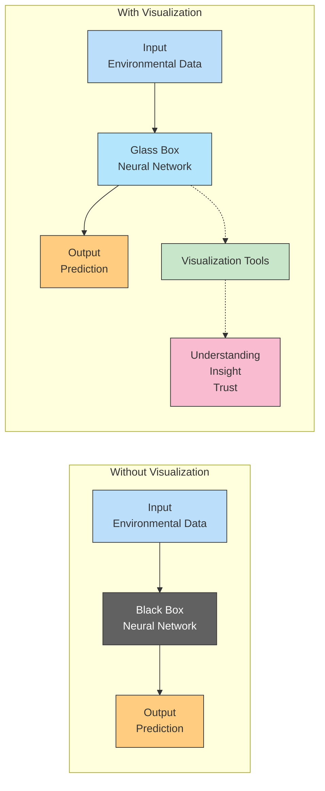

### Types of Network Visualizations

There are numerous ways to visualize neural networks, each revealing different aspects of their operation:

1. **Architecture Visualization**: The structure and organization of layers and connections
2. **Activation Visualization**: What neurons respond to and how they activate
3. **Weight Visualization**: The strength and pattern of connections between neurons
4. **Gradient Visualization**: How error flows backward through the network
5. **Feature Visualization**: What patterns or features each neuron detects
6. **Dimensionality Reduction**: Projecting high-dimensional network states into understandable forms

### From Complexity to Clarity

The code we wrote in the previous chapter was dense and complex. A trained eye might understand it, but even experienced practitioners can struggle to mentally trace all the operations happening within a neural network.

Visualization tools provide a way to distill this complexity into understandable patterns, much like how satellite imagery helps ecologists see large-scale patterns in forest growth or urban development that would be impossible to perceive from the ground.

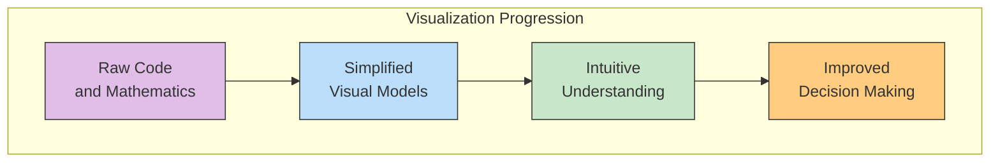

## Correlation Summarization: The Key to Understanding Neural Networks

### It's Impractical to Think About Everything All the Time

Thinking about every weight, every neuron, and every calculation in a neural network is overwhelming. Even our simple animal crossing prediction network had hundreds of individual operations. Modern networks can have billions of parameters.

Just as environmental scientists use concepts like "ecosystem services" or "carbon cycle" to encapsulate complex systems, we need mental tools to summarize neural networks.

### The Correlation Perspective

At their core, neural networks do one thing: **find and create correlation between inputs and outputs**. This perspective shifts our understanding from the complex web of individual calculations to a more intuitive framework centered on relationships.

#### From Complexity to Correlation

While the technical details of neural networks involve linear algebra, calculus, and countless operations, the essence of their function can be distilled to correlation hunting. Consider the following environmental examples:

- **Weather Prediction**: A neural network doesn't need to understand fluid dynamics to predict rainfall; it discovers the correlation between atmospheric pressure patterns, humidity levels, and subsequent precipitation.

- **Species Distribution**: Instead of encoding biological adaptations explicitly, networks learn the correlation between environmental factors (temperature ranges, soil chemistry, elevation) and the presence of specific species.

- **Pollution Impact Assessment**: Networks find correlations between industrial emission patterns and subsequent changes in air quality, often revealing non-obvious relationships beyond simple cause-and-effect.

This correlation hunting mirrors how human experts learn from experience – recognizing patterns and associations without necessarily understanding every physical or biological mechanism.

#### Beyond Simple Correlation: Pattern Recognition

What makes neural networks particularly powerful is that they don't just find simple correlations like "high temperature correlates with higher wildfire risk." They discover complex, multi-dimensional patterns that might include:

- **Multi-factor correlations**: "Specific combinations of temperature, soil moisture, wind speed, and time since last fire correlate with elevated wildfire risk."

- **Temporal patterns**: "A sequence of dry days followed by lightning activity correlates with ignition events."

- **Non-linear relationships**: "Below a certain soil moisture threshold, even small temperature increases dramatically raise risk levels."

```mermaid
flowchart TD
    subgraph "Evolution of Correlation Finding"
        S1["Simple Linear\nCorrelation"] --> S2["Multi-factor\nCorrelation"] --> S3["Non-linear Pattern\nDetection"] --> S4["Complex Hierarchical\nFeature Correlation"]\n\n        S1 -.- E1["Temperature vs.\nWildfire Occurrence"]\n        S2 -.- E2["Temperature + Humidity +\nWind vs. Wildfire Severity"]\n        S3 -.- E3["Threshold Effects in\nEcosystem Responses"]\n        S4 -.- E4["Cascading Effects\nAcross Trophic Levels"]\n    end\n    \n    style S1 fill:#bbdefb,stroke:#333,stroke-width:1px\n    style S2 fill:#c8e6c9,stroke:#333,stroke-width:1px\n    style S3 fill:#ffcc80,stroke:#333,stroke-width:1px\n    style S4 fill:#f8bbd0,stroke:#333,stroke-width:1px\n    style E1 fill:#e3f2fd,stroke:#333,stroke-width:1px\n    style E2 fill:#e8f5e9,stroke:#333,stroke-width:1px\n    style E3 fill:#fff3e0,stroke:#333,stroke-width:1px\n    style E4 fill:#fce4ec,stroke:#333,stroke-width:1px\n```

#### The Correlation-Causation Distinction

It's worth noting that neural networks find correlations, not causation. This reflects a fundamental limitation but also a practical strength:

- **Limitation**: Networks won't automatically uncover mechanisms (why certain patterns exist).
- **Strength**: They don't need to understand mechanisms to make accurate predictions.

Environmental scientists face the same balance – they often observe correlations ("declining amphibian populations correlate with increasing ultraviolet radiation") before establishing causation through controlled experiments.

#### Formalizing the Correlation Perspective

Let's formalize this viewpoint into what we'll call the **Correlation Summarization**:

> **Correlation Summarization**: Neural networks seek to find direct and indirect correlation between an input layer and an output layer, which are determined by the input and output datasets, respectively.

This summarization helps us mentally organize what's happening in the tangle of weights, biases, and activations. Rather than tracking each individual parameter, we can think of the network as continuously refining its understanding of correlations in the data.

#### Correlation in Everyday Environmental Analogies

This correlation hunting mirrors how we make sense of the natural world:

- A forester notices that certain understory plant communities correlate with forest health, without necessarily understanding all biochemical interactions

- A wildlife tracker recognizes subtle environmental cues that correlate with animal movement patterns

- A traditional farmer observes correlations between certain cloud formations and imminent weather changes

Neural networks systematize and scale this pattern recognition to dimensions beyond human perception, but the fundamental approach remains similar – finding meaningful correlations in complex data.

This high-level perspective allows us to think about neural networks more efficiently. Rather than tracking individual weight updates, we can think about how the network as a whole is finding patterns.

### Local vs. Global Correlation

We can refine this summarization into two levels:

> **Local Correlation Summarization**: Any given set of weights optimizes to learn how to correlate its input layer with what the output layer says it should be.

This works directly when we have only input and output layers. But with multiple layers, we need:

> **Global Correlation Summarization**: What an earlier layer "should be" can be determined by taking what a later layer "should be" and multiplying it by the weights in between them. This way, later layers can tell earlier layers what kind of signal they need to ultimately find correlation with the output. This cross-communication is called backpropagation.

```mermaid
flowchart TD
    subgraph "Correlation Signal Flow"
        O["Output Layer\nError"] -.-> |"Backpropagates\nTo Tell What To Be"| H2["Hidden Layer 2"]
        H2 -.-> |"Backpropagates\nTo Tell What To Be"| H1["Hidden Layer 1"]
        H1 -.-> |"Backpropagates\nTo Tell What To Be"| I["Input Layer"]
        
        I --> |"Forward Pass\nSends Signal"| H1
        H1 --> |"Forward Pass\nSends Signal"| H2
        H2 --> |"Forward Pass\nSends Signal"| O
    end
    
    style I fill:#bbdefb,stroke:#333,stroke-width:1px
    style H1 fill:#c8e6c9,stroke:#333,stroke-width:1px
    style H2 fill:#c8e6c9,stroke:#333,stroke-width:1px
    style O fill:#ffcc80,stroke:#333,stroke-width:1px
```

When global correlation teaches each layer what it should be, local correlation can optimize weights to achieve that goal. It's like a forest ecosystem where changes in one species' population cascade through the food web, eventually stabilizing into a new equilibrium.

## Mental Models of Neural Networks

### Conceptual Frameworks for Understanding Networks

Just as environmental scientists use conceptual frameworks like food webs, succession models, or nutrient cycles to understand ecosystems, we need mental models to comprehend neural networks.

Here are some useful mental models:

1. **The Network as a Function Approximator**: The network learns to approximate any mathematical function that maps inputs to outputs

2. **The Network as a Pattern Detector**: Each layer detects increasingly complex patterns in the data

3. **The Network as a Feature Transformer**: Each layer transforms raw inputs into more useful features

4. **The Network as a Probability Estimator**: The output represents probabilities of different outcomes

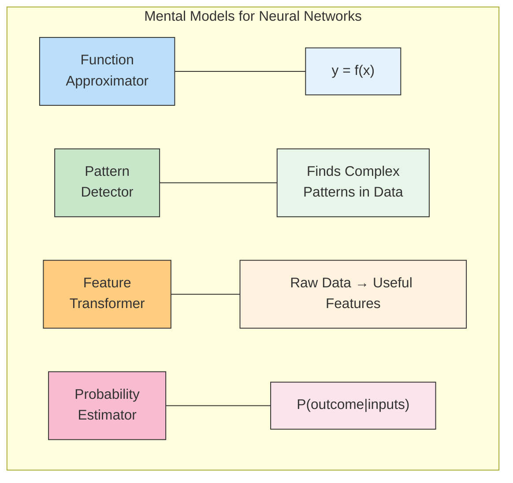

### Developing Intuition for Network Operations

Developing intuition for neural networks involves practicing different ways of thinking about them. Just as experienced field ecologists develop an intuitive sense about ecosystem health by observing many different environments, you'll develop neural network intuition by working with many different architectures and datasets.

Some exercises that can help develop this intuition:

1. **Mental Tracing**: Following a single input through the entire network, estimating activations at each layer

2. **Parameter Counting**: Quickly calculating how many parameters a network has based on its architecture

3. **Bottleneck Identification**: Identifying where information might be compressed or lost in a network

4. **Pattern Prediction**: Predicting what kinds of patterns different architectures might learn

### Sketching Networks on Paper

One of the best ways to develop intuition is to sketch neural networks on paper. This forces you to think about the essential components and how they fit together.

When sketching a neural network, consider:

1. **Layer Dimensions**: How many neurons are in each layer?
2. **Connectivity**: How are layers connected?
3. **Activation Functions**: What nonlinearities are used?
4. **Parameter Count**: How many weights and biases are there?

Just as field biologists sketch ecosystems to understand relationships between species, sketching neural networks helps solidify your understanding of their architecture and operation.

## Simplified Visualization: Less Is More

### The Previously Overcomplicated Visualization

In earlier chapters, we visualized neural networks with detailed diagrams showing each neuron and connection. While useful for learning the basics, this level of detail becomes overwhelming for larger networks.

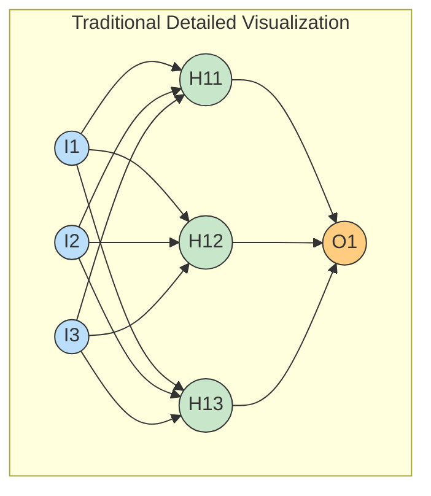

This visualization quickly becomes unmanageable with larger networks. Modern networks might have thousands or millions of neurons - trying to visualize each connection would be impossible.

### Neural Networks as Building Blocks

Just as ecologists moved from cataloging individual species to understanding functional groups and ecosystem services, we need to shift to a more abstract, modular understanding of neural networks.

Let's simplify our visualization by thinking of neural networks as composed of fundamental building blocks: vectors and matrices.

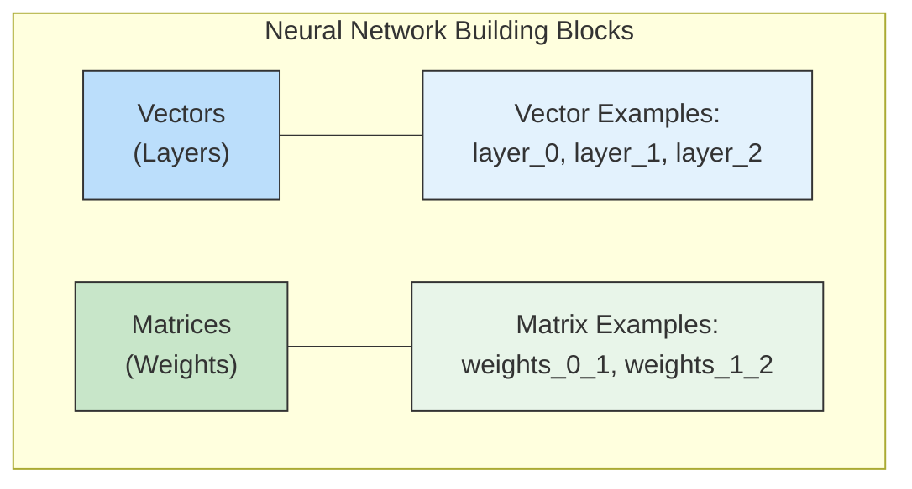

### LEGO-like Visualization

Think of neural networks like LEGO structures. Each layer is a vector (a strip of neurons), and the connections between layers are matrices (grids of weights).

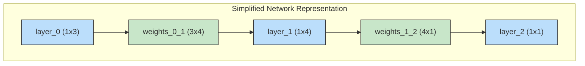

This simplified view shows us the dimensions of each component without getting lost in the details of individual connections. It tells us everything we need to know to implement the network.

### Inferring Dimensions

A key insight is that the dimensions of each matrix are determined by the layers it connects. For example, if layer_0 has 3 neurons and layer_1 has 4 neurons, then weights_0_1 must be a 3×4 matrix.

This allows us to simplify our visualization even further. We can just show the layers and infer the weight matrices' dimensions:

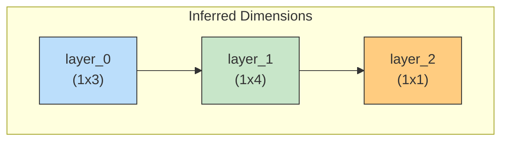

Just as ecosystem diagrams don't show every individual organism but instead focus on functional groups and their relationships, our simplified neural network visualization focuses on the structure and flow, not individual weights.

## Seeing the Network Predict: Visualizing Data Flow

One of the most powerful ways to understand a neural network is to see it in action - to visualize data flowing through the system. This is similar to how ecologists use tracer dyes to follow water movement through watersheds, allowing us to see the invisible.

Let's visualize how our animal crossing network processes a single example.

### Step 1: Input Layer

First, we input a streetlight pattern [1, 0, 1] (first and third lights are ON, middle light is OFF).

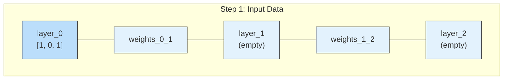

### Step 2: Hidden Layer Computation

Next, the network computes the hidden layer values through matrix multiplication and applies the ReLU activation function:

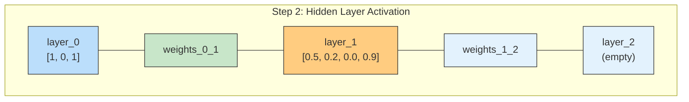

Notice that the third value in layer_1 is 0.0 - this is the result of the ReLU function setting a negative value to zero, similar to how certain environmental thresholds (like freezing temperature) create non-linear effects.

### Step 3: Output Prediction

Finally, the network computes the output by another matrix multiplication:

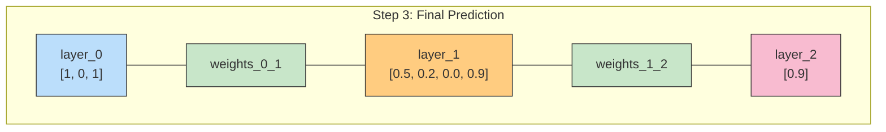

The output value 0.9 is close to 1, indicating the network predicts animals should CROSS with this light pattern.

### Connecting to Ecological Prediction

This visualization helps us understand how a neural network makes predictions - similar to how we might trace the flow of nutrients through an ecosystem to predict its response to environmental changes.

For example, in a network predicting wildfire risk:
1. Input layer might represent temperature, humidity, wind speed, and fuel moisture
2. Hidden layer neurons might detect combinations like "hot AND dry" or "windy AND dry fuel"
3. Output layer combines these intermediate features to predict overall risk

## Visualizing Using Letters Instead of Pictures: Mathematical Notation

### From Pictures to Algebra

Just as environmental scientists use mathematical models to supplement visual diagrams, we can represent neural networks using algebraic notation. This provides a compact, precise way to describe network operations.

Instead of drawing boxes and vectors, we can use letters to represent each component:

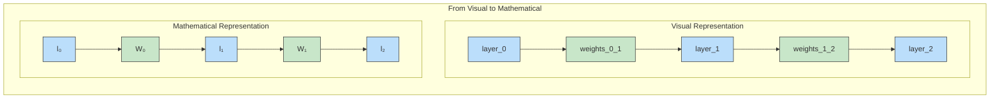

### Mathematical Representation Conventions

When representing neural networks mathematically:

- **Vectors (layers)** are usually lowercase letters (e.g., l₀, l₁, l₂)
- **Matrices (weights)** are usually uppercase letters (e.g., W₀, W₁)
- **Subscripts** indicate the position or layer number

We can choose any letters that make sense to us, but common conventions make communication easier with other researchers.

### Vector-Matrix Multiplication in Mathematics

Vector-matrix multiplication is represented by placing the symbols next to each other.

For example:

l₁W₁ means "perform vector-matrix multiplication between layer 1 and weight matrix 1"

This mathematical notation is powerful because it's concise while still conveying all necessary information.

## Linking Variables: From Mathematics to Code

### Combining Mathematical Symbols to Represent Operations

The real power of mathematical notation comes when we link variables together to represent operations. This allows us to express complex neural network computations in a compact, readable form.

Here are some examples of how we can link variables to represent neural network operations:

| Algebra | Translation |
|---------|-------------|
| l₀W₀ | "Take the layer 0 vector and perform vector-matrix multiplication with the weight matrix 0" |
| l₁W₁ | "Take the layer 1 vector and perform vector-matrix multiplication with the weight matrix 1" |

We can also include functions like ReLU in our notation:

| Algebra | Translation |
|---------|-------------|
| l₁ = relu(l₀W₀) | "To create the layer 1 vector, take the layer 0 vector and perform vector-matrix multiplication with the weight matrix 0; then perform the relu function on the output (setting all negative numbers to 0)" |
| l₂ = l₁W₁ | "To create the layer 2 vector, take the layer 1 vector and perform vector-matrix multiplication with the weight matrix 1" |

### Chaining Operations: The Complete Forward Pass

Since the output of one operation becomes the input to the next, we can chain these expressions together. For example, the entire forward pass of our neural network can be expressed in a single formula:

```
l₂ = relu(l₀W₀)W₁
```

This compact formula encapsulates everything our neural network does during the forward pass:
1. Takes input data (l₀)
2. Multiplies it by the first weight matrix (W₀)
3. Applies the ReLU activation function
4. Multiplies the result by the second weight matrix (W₁)
5. Produces the output (l₂)

Compare this single line to the equivalent Python code:

```python
layer_2 = relu(layer_0.dot(weights_0_1)).dot(weights_1_2)
```

The mathematical notation and the code are nearly identical, showing how close mathematical notation is to actual implementation.

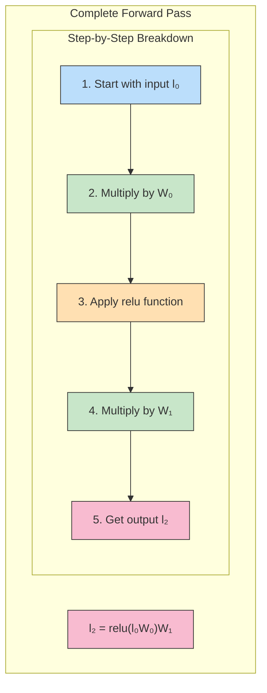

### From Visualization to Code

With these visualizations and mathematical representations, we can now move seamlessly between different ways of understanding neural networks:

1. **Visual representation**: Layers and connections
2. **Mathematical notation**: Variables and operations
3. **Code implementation**: Actual programming syntax

This multi-modal understanding is similar to how environmental scientists might understand an ecosystem through diagrams, mathematical models, and actual observation.

## Visualizing Layer Activations: What Are Neurons Looking For?

### Peering Into Neuron Activations

So far, we've visualized the structure of neural networks and how data flows through them. Now let's explore what individual neurons actually learn to detect.

Neurons in a neural network are essentially feature detectors. Each neuron activates in response to specific patterns in its inputs. By visualizing these activations, we can understand what the network has learned.

### Activation Patterns Across Layers

Let's examine how different input patterns activate different neurons in our animal crossing network:

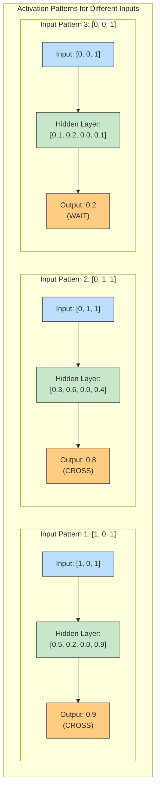

Notice how different hidden neurons activate differently for each input pattern. This gives us insight into what each neuron has learned to detect.

### Feature Visualization Techniques

For more complex networks and datasets, we can use specialized techniques to visualize what neurons respond to:

1. **Activation Maximization**: Generating inputs that maximize a specific neuron's activation
2. **Occlusion Analysis**: Systematically occluding parts of the input to see which parts affect particular neurons
3. **Feature Maps**: For convolutional networks, visualizing the activations as spatial maps

In environmental applications, these techniques can reveal what features of environmental data (such as specific temperature patterns, habitat characteristics, or pollution signatures) trigger different parts of the network.

### Understanding What Neurons Detect

Let's analyze what each hidden neuron in our animal crossing network might be detecting:

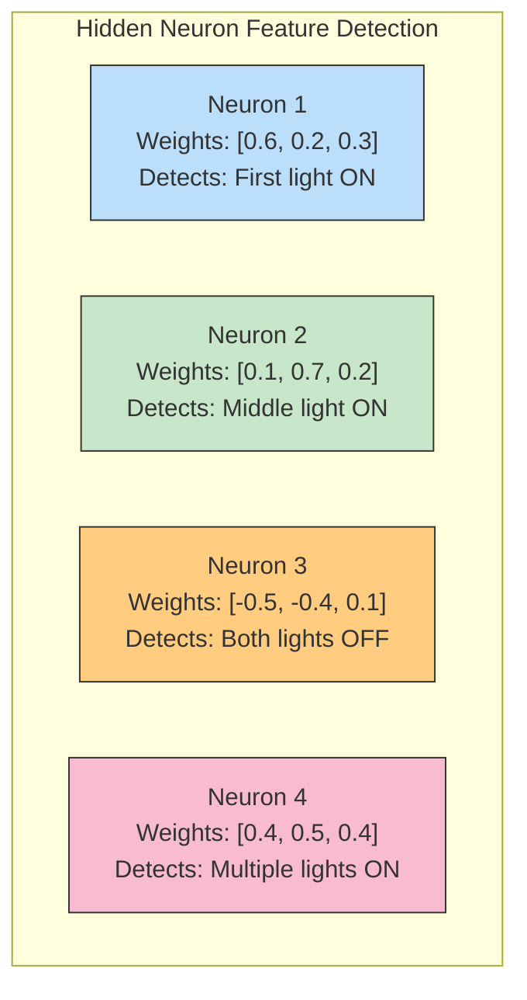

By examining the weights connecting inputs to each hidden neuron, we can determine what input patterns each neuron responds to most strongly. This is analogous to understanding what environmental conditions trigger certain ecosystem responses.

## Weight and Gradient Visualization: Seeing What the Network Has Learned

### Visualizing Weight Matrices

The weights of a neural network encode what the network has learned. Visualizing these weights can provide insight into the patterns the network has discovered.

For our animal crossing problem, we can visualize the weights connecting the input layer to the hidden layer as a heatmap:

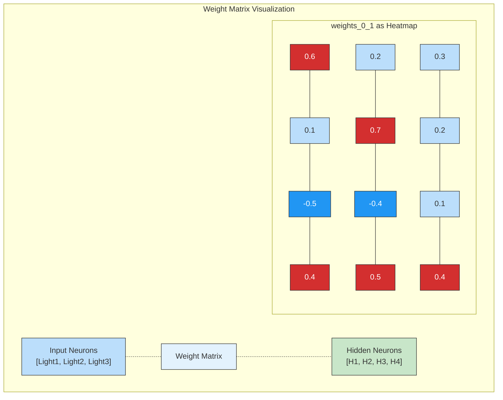

In this heatmap, red indicates positive weights (excitatory connections), blue indicates negative weights (inhibitory connections), and the intensity of the color indicates the magnitude of the weight.

### Gradient Flow Visualization

During backpropagation, gradients flow backward through the network. Visualizing these gradients can help understand how the network is learning.

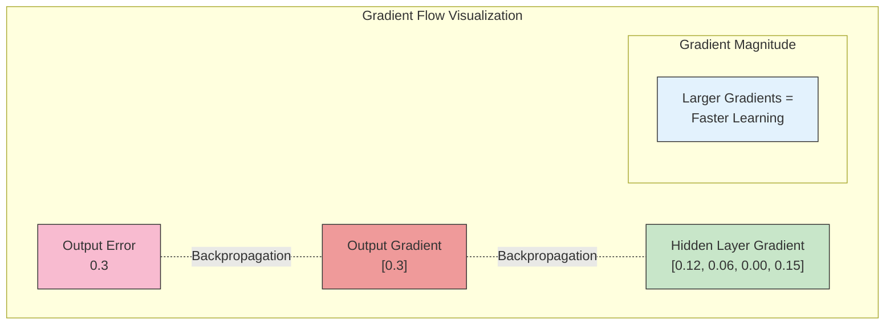

Note that the third value in the hidden layer gradient is 0.00. This corresponds to the hidden neuron that had a 0.0 activation due to ReLU - since this neuron wasn't active during the forward pass, it doesn't receive gradient during backpropagation.

### Identifying Learning Patterns

By visualizing weights and gradients over time, we can identify patterns in how the network learns:

1. **Initially**: Weights are random and gradients are large
2. **Middle stages**: The network forms specializations - some neurons become sensitive to specific patterns
3. **Later stages**: Weights stabilize and gradients decrease as the network converges on a solution

This mirrors how scientific understanding of environmental systems evolves - from general observations to specific, refined models of ecosystem behavior.

## Dimensionality Reduction for Visualization: Seeing the Big Picture

### The Challenge of High Dimensions

Neural networks operate in high-dimensional spaces that are impossible to visualize directly. A hidden layer with 100 neurons exists in a 100-dimensional space, far beyond what we can directly observe.

Dimensionality reduction techniques help us project these high-dimensional representations into 2D or 3D spaces that we can visualize.

### PCA and t-SNE for Neural Representations

Two popular techniques for dimensionality reduction are:

1. **Principal Component Analysis (PCA)**: Finds the directions of maximum variance in the data
2. **t-Distributed Stochastic Neighbor Embedding (t-SNE)**: Preserves local neighborhood structure

Here's how we might visualize the hidden layer activations for different input examples using these techniques:

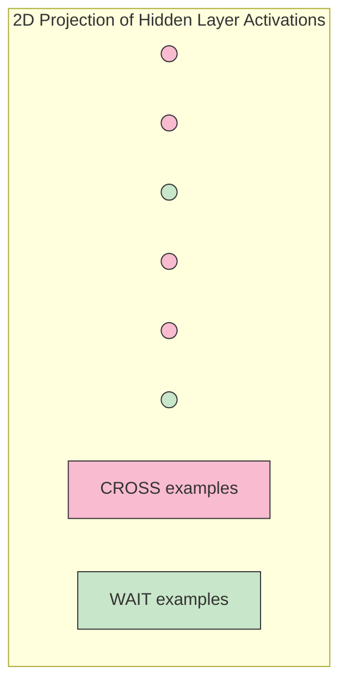

In this visualization, each point represents the hidden layer activations for a single input example, projected down to 2D. Points with the same color represent examples with the same class (CROSS or WAIT).

### Projecting High-Dimensional Data

The process of dimensionality reduction involves mapping from high-dimensional spaces to lower-dimensional ones while preserving important relationships:

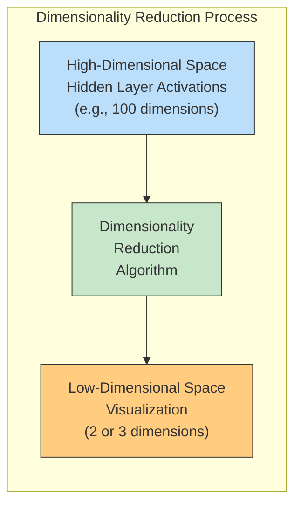

### Revealing Hidden Structures in Neural Networks

Dimensionality reduction can reveal structures and patterns that wouldn't be apparent otherwise:

1. **Clusters**: Groups of similar examples that the network treats similarly
2. **Decision Boundaries**: How the network separates different classes
3. **Outliers**: Unusual examples that the network processes differently

This is similar to how ecologists might use multivariate statistics to identify ecological communities or disturbance patterns from complex environmental datasets.

## The Importance of Visualization Tools: Building Better Models

### Visualization as a Core Skill

As neural networks become more complex, visualization becomes not just helpful but essential. The ability to visualize and interpret neural networks is as important as the ability to code them.

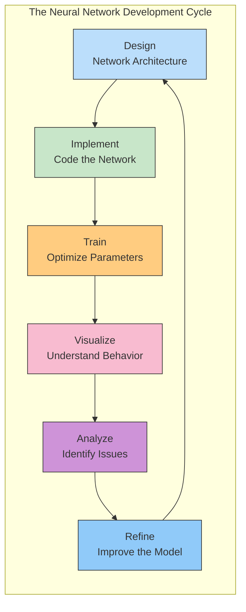

Visualization plays a critical role in this cycle, helping us understand what our networks have learned and identifying opportunities for improvement.

### Modern Visualization Tools

A variety of tools exist for visualizing neural networks:

1. **TensorBoard**: TensorFlow's visualization toolkit
2. **PyTorch Visualization Tools**: For PyTorch models
3. **Matplotlib/Seaborn**: For custom visualizations
4. **Interactive Tools**: Like Netron for network architecture visualization
5. **Web-based Tools**: Like TensorSpace.js for 3D network visualization

These tools make it easier to understand complex networks and communicate their behavior to others.

### Visualization for Responsible AI

Visualization is also essential for responsible AI development, especially in environmental applications where decisions might have significant consequences:

1. **Interpretability**: Understanding why a model made a specific prediction
2. **Bias Detection**: Identifying unwanted biases in model behavior
3. **Error Analysis**: Understanding where and why models fail
4. **Knowledge Discovery**: Revealing new patterns or relationships in environmental data

By visualizing neural networks, we can build more trustworthy, effective tools for environmental monitoring and protection.

## Conclusion: Seeing Is Understanding

Visualization transforms neural networks from inscrutable black boxes into interpretable tools. Just as environmental scientists use visualization to understand complex ecosystems, AI practitioners use visualization to understand neural networks.

The techniques we've explored in this chapter - from simplified network diagrams to mathematical notation to dimensionality reduction - provide multiple ways to peer inside neural networks and understand their behavior.

In the next chapter, we'll build on these visualization techniques to explore more advanced neural network architectures designed specifically for different types of environmental data.

### Reflection Questions

1. How might different visualization techniques help you explain a neural network's prediction to non-technical stakeholders in an environmental agency?

2. Consider a neural network trained to predict wildlife populations. What visualization techniques would be most useful for understanding what environmental factors the network has learned are most important?

3. How does the way we visualize neural networks influence how we think about them? Could different visualizations lead to different insights or innovations?

4. Think about an environmental monitoring problem that interests you. How would you visualize a neural network that addresses this problem to better understand its behavior?

## Exercises: Visualizing Your Own Networks

### Exercise 1: Network Notation Practice

For the following network architecture, write the mathematical notation that describes the forward pass:

- Input layer with 5 neurons (environmental sensors)
- First hidden layer with 8 neurons and ReLU activation
- Second hidden layer with 4 neurons and ReLU activation
- Output layer with 3 neurons (ecosystem health indicators)

### Exercise 2: Activation Visualization

For the animal crossing network, create a table showing how each hidden neuron activates for the six different streetlight patterns. What patterns do you notice? Which neurons seem to be detecting similar features?

### Exercise 3: Weight Interpretation

For a neural network with the following weight matrix connecting the input layer (temperature, humidity, wind speed) to a hidden layer with 4 neurons:

```
weights_0_1 = [[0.8, -0.3, 0.1, 0.5],
               [-0.2, 0.7, -0.4, 0.6],
               [0.1, 0.2, 0.9, -0.5]]
```

Interpret what each hidden neuron might be detecting based on these weights.

### Exercise 4: Dimensionality Reduction Experiment

Design an experiment that uses t-SNE or PCA to visualize the hidden layer activations of a neural network trained on an environmental dataset. What patterns would you expect to see if the network has successfully learned meaningful features?

### Exercise 5: Visualization Tool Exploration

Research one visualization tool mentioned in this chapter. Write a brief guide explaining how to use it to visualize a neural network for an environmental application.
