# Chapter 8: Regularization Techniques: The Goldilocks Principle: Fighting Overfitting in Neural Networks

> *"A model that remembers everything knows nothing. Like a forest that cannot see beyond its individual trees, it misses the patterns that matter most."*
> 
> *—Dr. Ernesto Lee, Environmental Data Scientist*

## Introduction: The Balance of Learning and Generalization

Imagine you're a field ecologist studying a forest ecosystem. If you focus too narrowly on a single square meter of forest floor, you might conclude that the entire forest consists of moss, fungi, and leaf litter. Conversely, if you take only a satellite view, you might miss the intricate interactions between species that give the forest its resilience. Finding the right balance between detailed observation and broad perspective is essential.

Neural networks face a similar challenge. They need to learn enough detail from training data to make accurate predictions, but not so much that they can't generalize to new, unseen data. This balancing act is at the heart of what we call regularization.

In the previous chapter, we explored ways to visualize what neural networks learn. Now, we'll tackle a critical question: How do we ensure what they learn is actually useful beyond the training examples?

## The Overfitting Problem: When Models Learn Too Well

### Understanding Training vs. Test Performance

Let's return to our MNIST digit classification problem. Consider a neural network with an input layer, a hidden layer with ReLU activation, and an output layer. After training for several hundred iterations, we might see something like this:

```
Training accuracy: 100%
Test accuracy: 70.7%
```

This significant gap between training and test performance is the hallmark of overfitting. The network has learned to perfectly predict the training data but fails to generalize to new examples. It's like a student who memorizes answers to practice questions but can't solve similar problems on the actual exam.

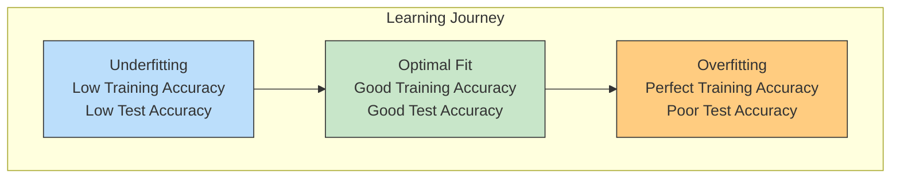

### The Curse of Dimensionality: Why More Dimensions Create Sparse Data

Overfitting becomes dramatically more problematic as our models grow more complex. This is largely due to what statisticians call the "curse of dimensionality" - a phenomenon that's counter-intuitive but critically important to understand.

Imagine you're trying to map biodiversity in a small garden plot that's 10×10 meters. If you place one sampling point every meter, you'd need 100 sampling points to cover the area adequately. Now, imagine trying to map biodiversity across three environmental dimensions: elevation, soil moisture, and canopy cover. If you sample at the same resolution (one point per unit), you'd need 1,000 points (10×10×10). Add just two more dimensions (soil pH and temperature), and suddenly you need 100,000 sampling points!

This exponential growth in the volume of the space is the essence of the curse of dimensionality. As dimensions increase:

1. **Data becomes exponentially more sparse**
   * The same number of data points covers a vanishingly small fraction of the space
   * In a 100-dimensional space, even millions of examples leave most of the space completely empty

2. **Distance metrics become less meaningful**
   * In high dimensions, all points tend to be roughly equidistant from each other
   * This undermines algorithms that rely on distance-based similarity

3. **The volume near the boundaries dominates**
   * Most of the volume of a high-dimensional hypercube is concentrated near its edges
   * This means most data points end up near the boundaries, not in the center

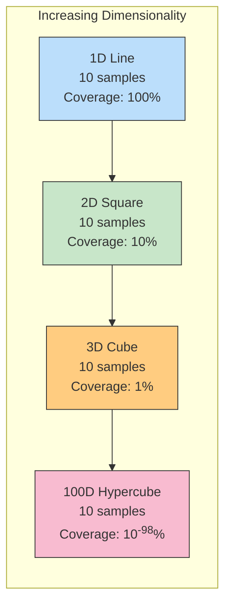

In neural networks, each parameter represents another dimension in the parameter space. A network with millions of parameters creates a space so vast that finding the true pattern (which might exist in just a few dimensions) becomes like finding a needle in a cosmic haystack.

What happens in practice? The model finds "shortcuts" - superficial patterns in the training data that perfectly separate the examples it has seen but fail to generalize to new data. These shortcuts often involve complex combinations of many variables that happen to correlate with outcomes in your specific training sample purely by chance.

Consider an ecological example: A model trying to predict the presence of an endangered butterfly species might examine 50 environmental variables. With limited training data (perhaps just 100 observation sites), the model could "discover" that butterflies appear when soil phosphorus is between 12-15 ppm AND wind speed is below 3 mph AND there was rainfall 8 days prior AND five other arbitrary conditions are met. This complex rule might perfectly fit the training data by chance, even if the butterfly's actual habitat requirements are much simpler (perhaps just requiring a specific host plant).

### Detecting Overfitting in Practice: Concrete Tests and Metrics

How do we know when a model is overfitting? Here are specific tests and metrics you can monitor to detect overfitting as it happens:

#### 1. Training vs. Validation Gap

The most fundamental test is comparing training and validation performance. Here's a practical rule:

**Overfitting Check #1:** If the gap between training and validation accuracy exceeds 10-15%, your model is likely overfitting.

For example:
```
Training accuracy: 95%, Validation accuracy: 75% → 20% gap = Overfitting
Training accuracy: 87%, Validation accuracy: 82% → 5% gap = Likely not overfitting
```

Visualize this by plotting learning curves for both metrics:

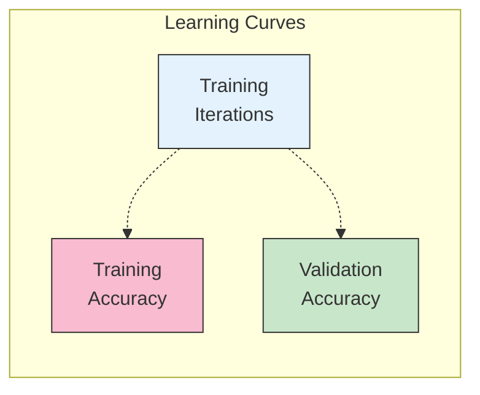

#### 2. Validation Performance Trend

Even without achieving 100% training accuracy, you can detect overfitting by watching the validation curve.

**Overfitting Check #2:** If validation performance improves and then starts deteriorating for multiple consecutive evaluations while training performance continues to improve, you're overfitting.

Example sequence from MNIST training:

```
Iteration 10: Train-Acc: 90.1% Test-Acc: 81.1%
Iteration 50: Train-Acc: 96.6% Test-Acc: 79.8% ← Decline begins here
Iteration 100: Train-Acc: 98.4% Test-Acc: 77.1%
Iteration 200: Train-Acc: 99.9% Test-Acc: 72.3%
Iteration 300: Train-Acc: 100.0% Test-Acc: 70.7%
```

Once validation performance has declined for 3-5 consecutive evaluation points, it's strong evidence of overfitting.

#### 3. Response to Data Augmentation

**Overfitting Check #3:** If performance significantly improves when you apply data augmentation (like adding noise or creating synthetic examples), your model was likely overfitting to the original training data.

Example:
```
Original model: 70% test accuracy
After data augmentation: 85% test accuracy → 15% improvement = Strong evidence of prior overfitting
```

#### 4. Parameter-to-Data Ratio

**Overfitting Check #4:** If your model has more parameters than training examples, it's almost certainly overfitting. As a rule of thumb, aim for at least 10 training examples per parameter.

Example:
```
Network with 100,000 parameters
Training set with 5,000 examples
Ratio: 0.05 examples per parameter (far below the recommended 10) → High risk of overfitting
```

#### 5. Simplified Model Comparison

**Overfitting Check #5:** If a significantly simpler model (fewer layers/neurons) achieves similar or better validation performance, your complex model is overfitting.

Example:
```
Complex model (3 layers, 500 neurons): 72% test accuracy
Simple model (1 layer, 100 neurons): 76% test accuracy → Complex model is overfitting
```

By systematically applying these five checks, you can reliably detect overfitting and take corrective action before deploying a model that won't generalize well to real-world data.

### Memorization vs. Generalization

At its core, overfitting represents a shift from generalization to memorization. Instead of learning the essential features that make a "7" recognizable as a "7" (the general pattern), an overfit model learns the exact pixel patterns of each "7" in the training set (memorization).

In environmental science, this would be equivalent to mistaking a correlation for causation. For example, a model might notice that invasive species tend to be found near roads in your training data. But if this correlation exists only because your surveys were conducted along roadways (sampling bias), the model will make poor predictions in roadless areas.

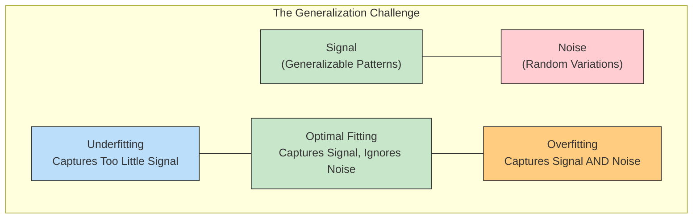

## Regularization Techniques: Finding the Right Balance

### L1 and L2 Regularization: Penalizing Complexity

One of the most common approaches to combat overfitting is to add a penalty for complexity to the loss function. This incentivizes the model to find simpler solutions that are more likely to generalize.

We can modify our loss function by adding a term based on the weights:

**L2 Regularization (Ridge)**: Add the sum of squared weights multiplied by a regularization parameter λ.

```
New Loss = Original Loss + λ * sum(weights²)
```

This encourages all weights to be small but non-zero.

**L1 Regularization (Lasso)**: Add the sum of absolute weight values multiplied by λ.

```
New Loss = Original Loss + λ * sum(|weights|)
```

This tends to push many weights to exactly zero, effectively selecting only the most important features.

These regularization techniques have direct parallels in ecological modeling. When predicting species distributions, ecologists often prefer simpler models with fewer variables. This preference for parsimony reflects an understanding that simpler models are more likely to capture true ecological relationships rather than dataset-specific anomalies.

### Weight Decay Implementation

L2 regularization is often implemented as "weight decay" during optimization. After computing gradients for the original loss, we simply subtract a small fraction of each weight:

```python
# Standard weight update
weights += alpha * gradient

# With weight decay (L2 regularization)
weights += alpha * gradient - alpha * lambda * weights
```

This has the effect of "shrinking" weights slightly with each update, unless there's strong evidence (from the gradient) that a particular weight should be large.

The optimal value for λ depends on the dataset and model. Too small, and it won't prevent overfitting; too large, and the model won't learn enough from the data. This brings us back to the Goldilocks principle: we need a value that's "just right."

### Early Stopping: Knowing When to Quit

Perhaps the simplest regularization technique is early stopping. Instead of training until the model perfectly fits the training data, we stop when validation performance starts to deteriorate.

To implement early stopping, we need:
1. A validation dataset (separate from both training and testing data)
2. Regular evaluation of validation performance during training
3. A stopping criterion (e.g., "stop if validation error increases for N consecutive evaluations")

Early stopping works because neural networks tend to learn general patterns before fitting to noise. In the early stages of training, the model captures the strongest signals in the data—the broad patterns that generalize well. Only later does it start fitting to the noise, the dataset-specific anomalies that won't generalize.

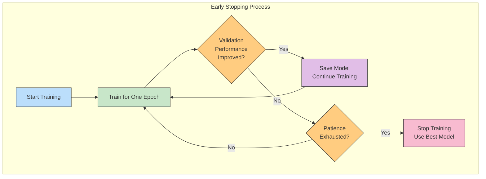

This is similar to how field ecologists might approach model selection. Rather than continuing to add variables until they perfectly explain historical data, they focus on models that perform well on new observations, even if they don't explain every detail of the past.

## Dropout and Batch Normalization: Powerful Modern Techniques

### Dropout: The Neural Network's Immune System

#### How Dropout Works: A Deeper Understanding

Dropout is one of the most powerful regularization techniques in deep learning. While the concept is deceptively simple - randomly deactivate (set to zero) a percentage of neurons during training - its effects and the intuition behind it are profound.

Here's what happens in detail during dropout:

1. For each training example (or mini-batch) in each iteration:
   * Create a random binary mask for each layer where dropout is applied
   * Each neuron has a probability p (the dropout rate) of being temporarily turned off
   * The remaining neurons are scaled up by 1/(1-p) to maintain the expected sum of activations

2. During testing/inference:
   * All neurons are active (no dropout)
   * No scaling is applied (or alternatively, activations are scaled down by (1-p))

Visually, it looks like this:

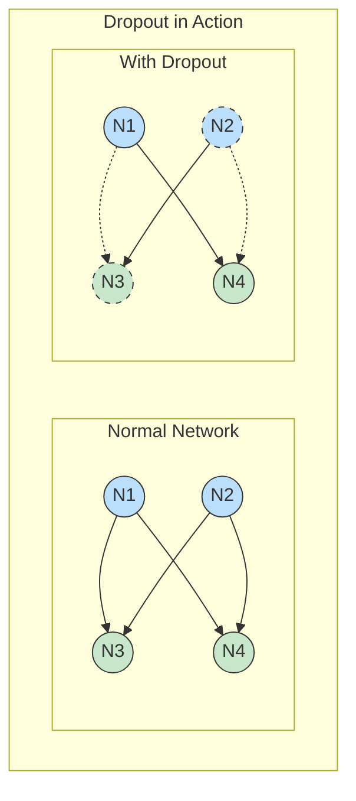

#### Why Dropout is Revolutionary: Multiple Powerful Mechanisms

Dropout works through several complementary mechanisms that make it uniquely effective:

1. **Ensemble Learning in a Single Network**
   * Each training iteration uses a different "thinned" network (a random subset of neurons)
   * With a dropout rate of 0.5 in a network with n neurons, you're effectively training 2ⁿ different possible network architectures
   * The final network represents an implicit ensemble of all these thinned networks
   * Ensembles of models typically outperform individual models

2. **Prevention of Co-adaptation**
   * In normal networks, neurons can become co-dependent, relying on specific patterns of activations from other neurons
   * This leads to brittle, overspecialized feature detectors that don't generalize well
   * Dropout forces each neuron to be useful independent of specific companions
   * Think of it as teaching each neuron to stand on its own rather than becoming a one-trick specialist

3. **Feature Noise Immunity**
   * Dropout simulates missing or noisy features
   * The network learns to make correct predictions even when some information is missing
   * This creates robust representations that don't depend on specific input elements

#### Ecological Parallels: Dropout in Nature

The effectiveness of dropout has fascinating parallels in natural systems:

**Ecosystem Resilience**: In a rainforest, species regularly go through population fluctuations. The ecosystem remains stable because multiple species can fulfill similar roles. If certain pollinator populations drop temporarily, others take up the slack. This redundancy is precisely what dropout cultivates in neural networks.

**Immune System Training**: Our immune system becomes more robust when exposed to a variety of challenges rather than a single pathogen. Similarly, neural networks with dropout learn to function under a variety of conditions rather than specializing to a single training configuration.

**Evolutionary Pressure**: In nature, adaptations that rely on perfect conditions rarely survive. Similarly, dropout applies selective pressure against features that require specific network configurations.

#### Practical Dropout Implementation Tips

For effective dropout use:

1. **Layer-specific rates**: Input layer: 0.1-0.2, Hidden layers: 0.3-0.5, Never on output layer

2. **Scale with network size**: Larger networks often benefit from higher dropout rates

3. **Combine with larger networks**: Since dropout reduces effective capacity, use it with networks that have more neurons than you might otherwise choose

4. **Adjust learning rate**: Dropout networks often benefit from higher learning rates and momentum

5. **Test-time scaling**: Ensure predictions at test time have the same expected magnitude as during training

### Implementing Dropout During Training and Testing

Let's augment our MNIST model with dropout:

```python
def train_with_dropout(images, labels, test_images, test_labels):
    # Network parameters
    alpha, iterations, hidden_size = 0.005, 300, 100
    pixels_per_image, num_labels = 784, 10
    dropout_rate = 0.5  # 50% dropout
    
    # Initialize weights
    weights_0_1 = 0.2 * np.random.random((pixels_per_image, hidden_size)) - 0.1
    weights_1_2 = 0.2 * np.random.random((hidden_size, num_labels)) - 0.1
    
    for j in range(iterations):
        error, correct_cnt = 0.0, 0
        
        for i in range(len(images)):
            # Forward pass
            layer_0 = images[i:i+1]
            layer_1 = relu(np.dot(layer_0, weights_0_1))
            
            # Apply dropout to layer_1
            dropout_mask = np.random.binomial(1, 1-dropout_rate, layer_1.shape)
            layer_1 *= dropout_mask * (1/(1-dropout_rate))  # Scale to maintain output magnitude
            
            layer_2 = np.dot(layer_1, weights_1_2)
            
            # Calculate error
            error += np.sum((labels[i:i+1] - layer_2) ** 2)
            correct_cnt += int(np.argmax(layer_2) == np.argmax(labels[i:i+1]))
            
            # Backpropagation
            layer_2_delta = (labels[i:i+1] - layer_2)
            layer_1_delta = layer_2_delta.dot(weights_1_2.T) * relu2deriv(layer_1)
            layer_1_delta *= dropout_mask  # Apply same dropout mask to deltas
            
            # Weight updates
            weights_1_2 += alpha * layer_1.T.dot(layer_2_delta)
            weights_0_1 += alpha * layer_0.T.dot(layer_1_delta)
```

Notice the key differences:  

1. We create a `dropout_mask` - a binary matrix with the same shape as layer_1, where each element has a probability of (1-dropout_rate) of being 1 and dropout_rate of being 0

2. We scale the activations by 1/(1-dropout_rate) to maintain the same expected sum of inputs to the next layer

3. We apply the same dropout mask to the deltas during backpropagation

Importantly, **during testing, dropout is turned off** - we use the full network for making predictions. This is because dropout is specifically a training regularization technique.

When we train our MNIST network with dropout, we see a dramatic improvement in generalization:

```
Without dropout: Training acc: 100%, Test acc: 70.7%
With dropout:    Training acc: 89.2%, Test acc: 81.8%
```

The training accuracy is lower (as expected - we're making the learning problem harder), but the test accuracy is significantly higher.

### Batch Normalization for Stable Learning

Another powerful technique is batch normalization. While primarily designed to address the problem of internal covariate shift (inputs to each layer changing distribution as training progresses), it also has a strong regularizing effect.

Batch normalization standardizes the activations of each layer by subtracting the batch mean and dividing by the batch standard deviation:

```
z_normalized = (z - mean(z)) / sqrt(var(z) + ε)
z_out = gamma * z_normalized + beta
```

Where:  
- z is the vector of inputs to a layer for a mini-batch  
- gamma and beta are learnable parameters  
- ε is a small constant for numerical stability

This has several beneficial effects:

1. **Faster training**: Networks with batch normalization can use higher learning rates and converge more quickly

2. **Reduced sensitivity**: The network becomes less sensitive to weight initialization

3. **Regularization**: The noise in batch statistics provides a form of regularization

In environmental modeling, this would be similar to standardizing input variables (like temperature, precipitation, soil pH) to ensure they're on comparable scales and that the model doesn't become overly sensitive to the units or ranges of particular measurements.

### The Synergy of Multiple Techniques

The most effective approach often combines multiple regularization techniques. For example, a network might use:

- L2 regularization to keep weights small
- Dropout to prevent co-adaptation
- Batch normalization to stabilize learning
- Early stopping to prevent eventual overfitting

Each technique addresses a different aspect of the overfitting problem, and together they can create a model that generalizes remarkably well.

## Batch Gradient Descent and Mini-Batching: Efficient Learning

So far, we've discussed regularization techniques that help prevent overfitting. Now let's explore a technique that improves both training efficiency and generalization: mini-batch gradient descent.

### Full, Batch, and Stochastic Gradient Descent

There are three main approaches to updating weights in neural networks:

1. **Full Gradient Descent**: Calculate gradients using all training examples before updating weights.
   * Stable but extremely slow for large datasets
   * Requires a lot of memory

2. **Stochastic Gradient Descent (SGD)**: Update weights after each individual training example.
   * Fast updates but noisy gradients
   * Can have trouble converging

3. **Mini-batch Gradient Descent**: Update weights after seeing a small batch of examples (typically 32-256).
   * Balances stability and speed
   * Enables parallelization on GPUs
   * Provides some inherent regularization through gradient noise

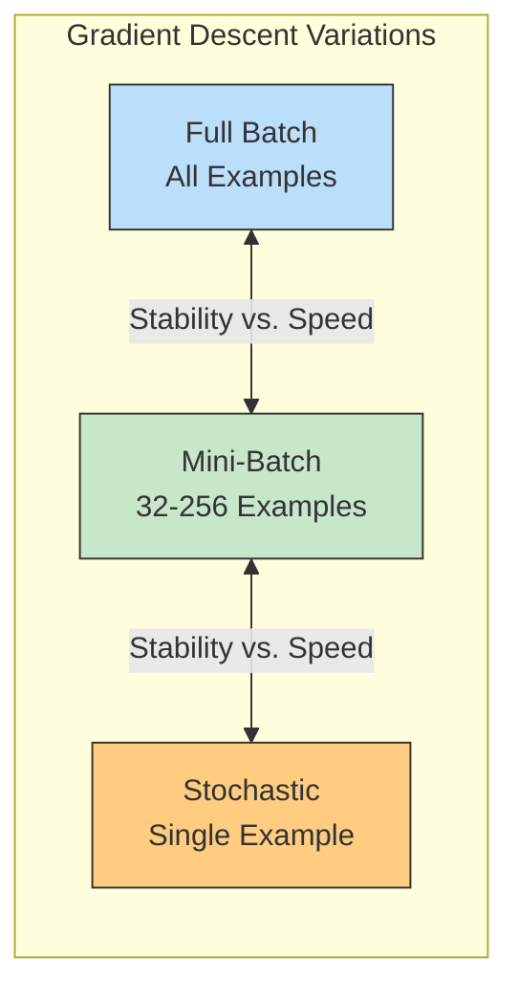

### Implementing Mini-Batch Learning

Here's how we can modify our MNIST network to use mini-batches:

```python
def train_with_minibatch(images, labels, test_images, test_labels, batch_size=100):
    # Network parameters
    alpha, iterations, hidden_size = 0.001, 300, 100
    pixels_per_image, num_labels = 784, 10
    
    # Initialize weights
    weights_0_1 = 0.2 * np.random.random((pixels_per_image, hidden_size)) - 0.1
    weights_1_2 = 0.2 * np.random.random((hidden_size, num_labels)) - 0.1
    
    for j in range(iterations):
        error, correct_cnt = 0.0, 0
        
        # Process mini-batches
        for i in range(int(len(images) / batch_size)):
            batch_start, batch_end = i * batch_size, (i + 1) * batch_size
            
            # Forward pass with entire batch
            layer_0 = images[batch_start:batch_end]
            layer_1 = relu(np.dot(layer_0, weights_0_1))
            layer_2 = np.dot(layer_1, weights_1_2)
            
            # Calculate error and accuracy
            error += np.sum((labels[batch_start:batch_end] - layer_2) ** 2)
            for k in range(batch_size):
                correct_cnt += int(np.argmax(layer_2[k:k+1]) == 
                                 np.argmax(labels[batch_start+k:batch_start+k+1]))
            
            # Backpropagation - note we're using the mean gradient across the batch
            layer_2_delta = (labels[batch_start:batch_end] - layer_2) / batch_size
            layer_1_delta = layer_2_delta.dot(weights_1_2.T) * relu2deriv(layer_1)
            
            # Weight updates based on batch average
            weights_1_2 += alpha * layer_1.T.dot(layer_2_delta)
            weights_0_1 += alpha * layer_0.T.dot(layer_1_delta)
```

Using mini-batches provides several benefits:

1. **Efficiency**: Vectorized operations on batches are much faster than processing examples one at a time

2. **Better gradients**: Averaging over a batch reduces the noise in gradient estimates compared to SGD

3. **Natural regularization**: The stochasticity of mini-batches provides a form of regularization, as weight updates have a natural variation

4. **Memory efficiency**: Using mini-batches requires less memory than full-batch gradient descent

This approach has a direct parallel in environmental field sampling. Rather than basing conclusions on a single measurement (stochastic) or requiring exhaustive sampling of an entire ecosystem (full batch), ecologists often take multiple samples (mini-batch) at various locations to get a representative picture while managing time and resource constraints.

## Hyperparameter Tuning: Finding Optimal Settings

### Learning Rate Selection

The learning rate is perhaps the most important hyperparameter in neural network training. Too large, and training may diverge; too small, and training will be unnecessarily slow.

Learning rate selection strategies include:

1. **Manual search**: Start with a reasonable value (e.g., 0.01) and adjust based on training behavior

2. **Grid search**: Try a pre-defined set of values (e.g., 0.0001, 0.001, 0.01, 0.1)

3. **Learning rate schedules**: Start with a larger learning rate and decrease it over time
   * Step decay: Reduce the learning rate by a factor after a set number of epochs
   * Exponential decay: Multiply the learning rate by a factor < 1 at each step
   * Cosine annealing: Vary the learning rate following a cosine curve

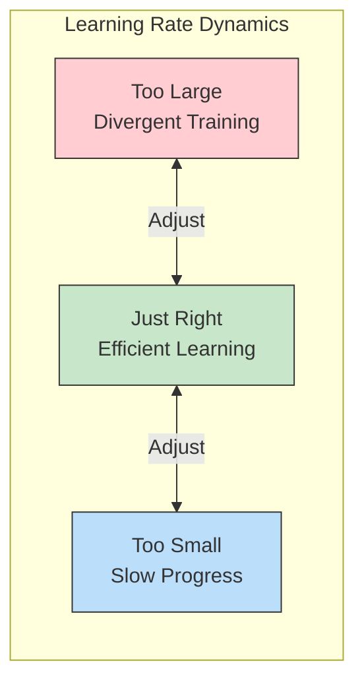

This tuning process is similar to how an environmental scientist might adjust sampling frequency - sampling too frequently wastes resources without providing additional insight, while sampling too infrequently might miss important patterns.

### Network Architecture Decisions: Taking Control of Your Network's Design

The architecture of a neural network is one of the most powerful levers you have to control its behavior. Think of architecture as the fundamental blueprint that determines what your network can learn and how well it can generalize. Let's explore how to deliberately shape your network through architectural choices:

#### 1. Depth vs. Width: Strategic Capacity Allocation

**Depth (Number of Layers)**: Each layer in a deep network transforms the representation from the previous layer, creating increasingly abstract features.

* **Your control**: Add more layers when:
  * Your data has hierarchical structure (like images, where edges → shapes → objects)
  * You need to model complex, non-linear relationships
  * Your problem domain has known compositional structure

* **Warning signs**: If deeper networks perform worse than shallower ones on validation data, you may be:  
  * Suffering from vanishing gradients
  * Overfitting due to excessive capacity
  * Training insufficiently (deeper networks often need more iterations)

**Width (Neurons per Layer)**: Wider layers can represent more information at each level of abstraction.

* **Your control**: Use wider layers when:
  * Your input data is high-dimensional
  * You need to preserve detailed information through the network
  * You're using aggressive regularization like high dropout rates

* **Practical guideline**: For hidden layers, start with widths between the input and output dimensions, following a pyramidal structure (gradually decreasing).

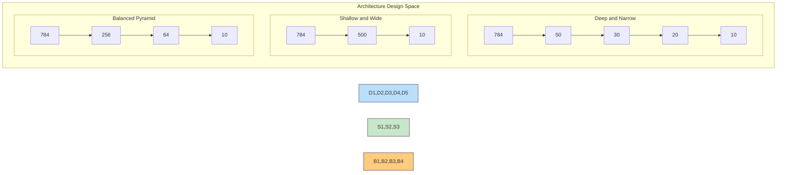

#### 2. Activation Function Selection: Controlling Information Flow

Activation functions determine how information propagates through your network. Your choice directly impacts:

* **Representation Power**: Some functions (like ReLU) create sparse activations, while others (like tanh) produce dense ones

* **Gradient Flow**: This affects how efficiently your network learns

* **Your control**: Choose activation functions based on the layer's purpose:
  * Hidden layers: ReLU and variants (Leaky ReLU, ELU) generally work well
  * Output layer: Depends on task (sigmoid for binary classification, softmax for multi-class, linear for regression)

* **Advanced technique**: Experiment with per-layer activation functions rather than using the same throughout

#### 3. Connectivity Patterns: Beyond Sequential Designs

The connections between layers define how information flows through your network.

* **Your control**: Beyond simple sequential networks, consider:
  * **Skip connections**: Allow information to bypass one or more layers
  * **Dense connections**: Connect each layer to all subsequent layers
  * **Residual blocks**: Learn residual functions rather than direct mappings

* **Practical example**: In environmental data with both long-term trends and seasonal patterns, skip connections can help the network model both time scales simultaneously.

#### 4. Architecture Templates: Proven Starting Points

Rather than designing from scratch, you can adapt proven architectures:

* **MLPs**: General-purpose fully-connected networks for tabular data
* **CNNs**: For spatial data like images or geographical information
* **RNNs/LSTMs**: For sequential data like time series or text
* **Transformers**: For data with complex dependencies, especially text

#### 5. Practical Control Strategy: Incremental Architecture Refinement

Here's a systematic approach to architectural control:

1. **Start simple**: Begin with the simplest architecture that could work
2. **Track validation performance**: Monitor how changes affect generalization
3. **Bottleneck analysis**: Identify where information is lost or distorted
4. **Controlled experiments**: Change one architectural element at a time
5. **Document rationale**: Track which changes helped and which didn't

For instance, with our MNIST example, this process might lead us to:

```python
def create_controlled_architecture(input_size=784, hidden_size=100, output_size=10):
    # Consciously designed architecture
    model = Sequential([
        # Input layer - no transformation, just reshaping
        Input(shape=(input_size,)),
        
        # First hidden layer - wider to capture diverse features
        Dense(hidden_size * 2),
        ReLU(),  # Chosen for sparse activation and good gradient flow
        Dropout(0.3),  # Moderate dropout to prevent co-adaptation
        
        # Second hidden layer - narrower for abstraction
        Dense(hidden_size),
        ReLU(),
        Dropout(0.5),  # Stronger dropout deeper in the network
        
        # Output layer
        Dense(output_size),
        Softmax()  # Appropriate for multi-class classification
    ])
    return model
```

By taking control of your network architecture, you move from being a passive user of neural networks to being an active designer who can adapt the technology to fit the specific characteristics of your environmental data and modeling tasks.

### Cross-Validation Strategies

To reliably assess how well our model will generalize, we need robust validation strategies:

1. **Hold-out validation**: Set aside a fixed portion (e.g., 20%) of training data for validation

2. **K-fold cross-validation**: Divide data into K subsets, train on K-1 folds and validate on the remaining fold, then rotate

3. **Stratified K-fold**: Ensure each fold has roughly the same class distribution (important for imbalanced datasets)

4. **Leave-one-out**: For small datasets, train on all but one example and test on the remaining one, then rotate

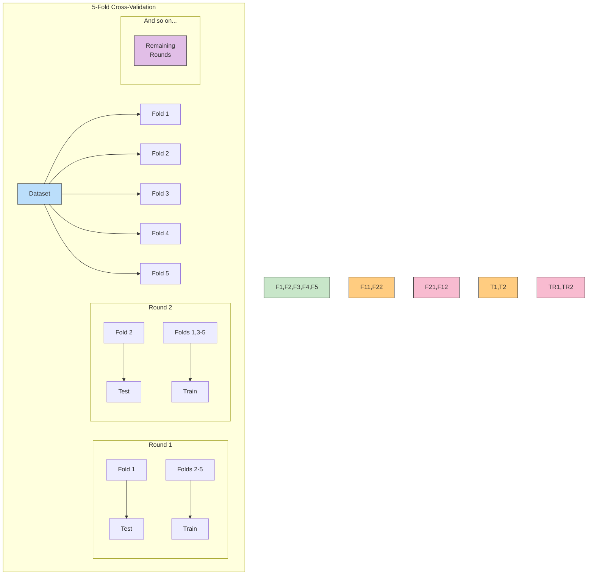

In environmental applications, cross-validation is particularly important when working with spatial or temporal data. For example, when predicting species distributions, we might use spatial cross-validation (training on some regions, testing on others) to ensure our model generalizes across different geographic areas.

## Putting It All Together: The Goldilocks Approach to Neural Networks

The title of this chapter references the Goldilocks principle - finding the solution that's "just right" - neither too simple nor too complex. This is the essence of fighting overfitting in neural networks.

We've explored several techniques:

1. **Regularization methods** (L1, L2, dropout) prevent the model from becoming too complex

2. **Training approaches** (early stopping, batch normalization, mini-batching) help the model focus on general patterns

3. **Hyperparameter tuning** (learning rate, architecture, validation strategies) fine-tune the model's capacity

By combining these techniques appropriately, we can build neural networks that avoid the extremes of underfitting and overfitting, instead finding the Goldilocks zone where the model generalizes well to new data.

### Reflection Questions

1. How might the concept of overfitting apply to environmental policy decisions? What would be the equivalent of "training data" and "test data" in this context?

2. Consider a neural network being used to predict wildlife movement patterns. What specific forms of overfitting might occur, and how could you detect them?

3. Many regularization techniques introduce randomness (dropout, mini-batching). How does this controlled randomness ultimately lead to more reliable models?

4. How would you explain the concept of model validation to a non-technical stakeholder in an environmental conservation project?

## Exercises: Experimenting with Regularization

### Exercise 1: Early Stopping Implementation

Implement early stopping for the MNIST classifier. Track both training and validation accuracy, and stop training when validation accuracy decreases for 5 consecutive epochs. Compare the final test accuracy with a network trained for a fixed number of iterations.

### Exercise 2: Dropout Rate Experiments

Train the MNIST classifier with different dropout rates (0%, 25%, 50%, 75%) and compare the resulting test accuracies. Graph the relationship between dropout rate and generalization performance.

### Exercise 3: Combining L2 and Dropout

Implement both L2 regularization and dropout in the MNIST classifier. Experiment with different combinations of regularization strength (λ) and dropout rate to find the optimal combination.

### Exercise 4: Learning Rate Schedules

Implement a step decay learning rate schedule where the learning rate is multiplied by 0.5 every 50 epochs. Compare the training dynamics and final performance with constant learning rate training.

### Exercise 5: Mini-Batch Size Effects

Train the MNIST classifier with different mini-batch sizes (1, 10, 100, full dataset) and compare the resulting training curves and final test accuracies. Discuss the trade-offs between batch size, training speed, and generalization performance.
## Project 1: Mathematical Analysis of L1 and L2 Regularization

### Learning Objective
In this project, you'll mathematically analyze how L1 and L2 regularization affect network weights during training. You'll learn how these techniques prevent overfitting by performing calculations and visualizing the results.

### Problem Statement
You're developing a neural network to predict wildfires based on environmental factors. However, your dataset is limited to only 50 observations from a specific region. To ensure your model generalizes well to other regions, you need to implement regularization.

Let's examine a simplified version of your model with just two weights:
- w1: weight for temperature data
- w2: weight for humidity data

### Step 1: Define the Loss Function
Without regularization, your loss function is the Mean Squared Error (MSE):

Loss = (prediction - actual)²

With regularization, we add a penalty term:

L1 Regularization (Lasso):
Loss = (prediction - actual)² + λ × (|w1| + |w2|)

L2 Regularization (Ridge):
Loss = (prediction - actual)² + λ × (w1² + w2²)

Where λ (lambda) is the regularization strength.

### Step 2: Calculate Gradient Updates
Let's analyze how each regularization method affects weight updates during training. Assume we've calculated that the gradients of the MSE with respect to w1 and w2 are:

∂MSE/∂w1 = -0.4  
∂MSE/∂w2 = -0.3

This means that without regularization, we'd update the weights as follows (with learning rate α = 0.1):

w1_new = w1_old - α × (-0.4) = w1_old + 0.04
w2_new = w2_old - α × (-0.3) = w2_old + 0.03

Now let's consider the effect of regularization on these updates.

#### L2 Regularization (Ridge)
For L2 regularization, we need to add the gradient of the penalty term:

∂(L2_penalty)/∂w1 = 2λw1
∂(L2_penalty)/∂w2 = 2λw2

Let's use λ = 0.1 and assume current weights are w1 = 2.0 and w2 = -1.5.

L2 gradient for w1 = 2 × 0.1 × 2.0 = 0.4
L2 gradient for w2 = 2 × 0.1 × (-1.5) = -0.3

Total gradient for w1 = -0.4 + 0.4 = 0.0
Total gradient for w2 = -0.3 + (-0.3) = -0.6

Weight updates with L2 regularization:
w1_new = 2.0 - 0.1 × 0.0 = 2.0
w2_new = -1.5 - 0.1 × (-0.6) = -1.5 + 0.06 = -1.44

#### L1 Regularization (Lasso)
For L1 regularization, the gradient of the penalty term is:

∂(L1_penalty)/∂w1 = λ × sign(w1)
∂(L1_penalty)/∂w2 = λ × sign(w2)

Where sign() returns 1 for positive values, -1 for negative values, and 0 for zero.

With λ = 0.1 and the same weights (w1 = 2.0, w2 = -1.5):

L1 gradient for w1 = 0.1 × sign(2.0) = 0.1 × 1 = 0.1
L1 gradient for w2 = 0.1 × sign(-1.5) = 0.1 × (-1) = -0.1

Total gradient for w1 = -0.4 + 0.1 = -0.3
Total gradient for w2 = -0.3 + (-0.1) = -0.4

Weight updates with L1 regularization:
w1_new = 2.0 - 0.1 × (-0.3) = 2.0 + 0.03 = 2.03
w2_new = -1.5 - 0.1 × (-0.4) = -1.5 + 0.04 = -1.46

### Step 3: Visualize and Compare Results

Let's visualize how these weights would change over multiple iterations:

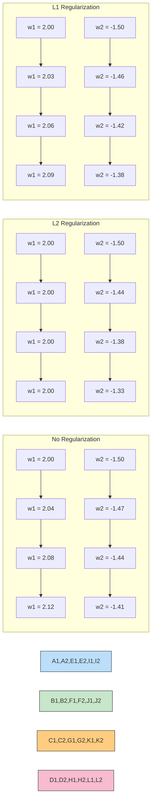

### Step 4: Interpret the Results
Notice the different effects of each regularization method:

1. **No Regularization**: Both weights continue to increase in magnitude without any constraints.

2. **L2 Regularization**: 
   - Weight w1 remains unchanged because the data gradient and regularization gradient cancel each other out.
   - Weight w2 still increases in magnitude but more slowly than without regularization.
   - L2 "shrinks" weights proportionally to their size.

3. **L1 Regularization**: 
   - Both weights increase in magnitude, but less than without regularization.
   - L1 applies a constant penalty regardless of weight magnitude.
   - Over time, L1 can push small or irrelevant weights exactly to zero.

### Step 5: Special Case - Driving Weights to Zero
Let's explore how L1 regularization can drive weights to exactly zero. 

Assume we have a weight w3 = 0.05 with gradient ∂MSE/∂w3 = -0.02.

With L1 regularization (λ = 0.1):
L1 gradient for w3 = 0.1 × sign(0.05) = 0.1

Total gradient = -0.02 + 0.1 = 0.08

Weight update (α = 0.1):
w3_new = 0.05 - 0.1 × 0.08 = 0.05 - 0.008 = 0.042

If we continue this process, w3 will eventually reach zero and potentially become negative. But once it crosses zero, the sign() function flips, creating a "bouncing" effect that often results in the weight staying exactly at zero.

This behavior explains why L1 regularization produces sparse models (many exactly-zero weights), while L2 makes weights small but rarely exactly zero.

### Step 6: Effect on Decision Boundaries
The weights in neural networks determine decision boundaries between classes. Let's examine how regularization affects these boundaries.

Consider a simple classification problem with two features:
- Temperature (normalized to 0-1)
- Humidity (normalized to 0-1)

Without any regularization, our network might find a complex decision boundary:

```
wildfireRisk = 3.5 × temperature + 2.7 × humidity - 4.2 × temperature² + 5.1 × temperature × humidity - 1.8
```

With strong regularization, the model is forced to find a simpler boundary:

```
wildfireRisk = 1.2 × temperature - 0.8 × humidity + 0.3
```

The simpler boundary may have slightly higher error on training data but will likely generalize better to new regions with different environmental conditions.

### Exercise for Practice
Calculate three more iterations of gradient updates for w1 and w2 with both L1 and L2 regularization. Observe which regularization method drives w2 closer to zero more quickly.

1. Start with: w1 = 2.0, w2 = -1.5
2. Use the gradients: ∂MSE/∂w1 = -0.4, ∂MSE/∂w2 = -0.3
3. Use λ = 0.1 and learning rate α = 0.1
4. Calculate updates for both L1 and L2 regularization
5. Graph the weight trajectories

This project demonstrates how regularization mathematically affects weight updates during training, helping control model complexity and prevent overfitting—critical for environmental models that need to generalize across different ecosystems and conditions.
## Project 2: Implementing Regularization Techniques for Species Distribution Modeling

### Learning Objective
In this project, you'll implement and compare various regularization techniques to create a robust species distribution model. You'll work with environmental data to predict habitat suitability for an endangered species, using regularization to ensure your model generalizes well to unseen locations.

### Problem Statement
You're a conservation scientist developing a model to predict suitable habitat for the Golden-cheeked Warbler, an endangered bird species. You have data from 100 survey sites with various environmental measurements and presence/absence observations. Since you can only survey a small fraction of the bird's potential range, your model needs to generalize well beyond your sampling sites.

### Step 1: Set Up the Dataset

```python
import numpy as np
import matplotlib.pyplot as plt
from sklearn.model_selection import train_test_split
from sklearn.preprocessing import StandardScaler
import tensorflow as tf
from tensorflow.keras.models import Sequential
from tensorflow.keras.layers import Dense, Dropout
from tensorflow.keras.regularizers import l1, l2, l1_l2
from tensorflow.keras.callbacks import EarlyStopping

# Generate synthetic environmental data for demonstration
np.random.seed(42)

# Create features: temperature, precipitation, elevation, canopy cover, distance to water
n_samples = 100
features = np.random.rand(n_samples, 5)

# Generate synthetic species presence/absence based on an ecological pattern
# The true pattern is related to only 2 features plus some noise
true_weights = np.array([1.5, -2.0, 0.0, 0.0, 0.0])
noise = np.random.normal(0, 0.3, n_samples)
z = np.dot(features, true_weights) + noise
probability = 1 / (1 + np.exp(-z))  # Logistic function
labels = (np.random.random(n_samples) < probability).astype(int)

# Split into training and testing sets (70% train, 30% test)
X_train, X_test, y_train, y_test = train_test_split(features, labels, test_size=0.3, random_state=42)

# Standardize features
scaler = StandardScaler()
X_train_scaled = scaler.fit_transform(X_train)
X_test_scaled = scaler.transform(X_test)

# Print dataset shape
print(f"Training data shape: {X_train.shape}")
print(f"Testing data shape: {X_test.shape}")
print(f"Class distribution in training data: {np.bincount(y_train)}")
```

### Step 2: Create a Baseline Model (No Regularization)

```python
def create_baseline_model(input_shape):
    model = Sequential([
        Dense(16, activation='relu', input_shape=(input_shape,)),
        Dense(8, activation='relu'),
        Dense(1, activation='sigmoid')
    ])
    
    model.compile(
        optimizer='adam', 
        loss='binary_crossentropy',
        metrics=['accuracy']
    )
    
    return model

# Create and train baseline model
baseline_model = create_baseline_model(X_train_scaled.shape[1])

history_baseline = baseline_model.fit(
    X_train_scaled, y_train,
    epochs=200,
    batch_size=16,
    validation_split=0.2,
    verbose=0
)

# Evaluate baseline model
baseline_train_loss, baseline_train_acc = baseline_model.evaluate(X_train_scaled, y_train, verbose=0)
baseline_test_loss, baseline_test_acc = baseline_model.evaluate(X_test_scaled, y_test, verbose=0)

print(f"Baseline model - Training accuracy: {baseline_train_acc:.4f}")
print(f"Baseline model - Testing accuracy: {baseline_test_acc:.4f}")
```

### Step 3: Implement L2 Regularization

```python
def create_l2_model(input_shape, l2_strength=0.01):
    model = Sequential([
        Dense(16, activation='relu', input_shape=(input_shape,), 
              kernel_regularizer=l2(l2_strength)),
        Dense(8, activation='relu',
              kernel_regularizer=l2(l2_strength)),
        Dense(1, activation='sigmoid')
    ])
    
    model.compile(
        optimizer='adam', 
        loss='binary_crossentropy',
        metrics=['accuracy']
    )
    
    return model

# Create and train L2 regularized model
l2_model = create_l2_model(X_train_scaled.shape[1])

history_l2 = l2_model.fit(
    X_train_scaled, y_train,
    epochs=200,
    batch_size=16,
    validation_split=0.2,
    verbose=0
)

# Evaluate L2 model
l2_train_loss, l2_train_acc = l2_model.evaluate(X_train_scaled, y_train, verbose=0)
l2_test_loss, l2_test_acc = l2_model.evaluate(X_test_scaled, y_test, verbose=0)

print(f"L2 regularized model - Training accuracy: {l2_train_acc:.4f}")
print(f"L2 regularized model - Testing accuracy: {l2_test_acc:.4f}")
```

### Step 4: Implement Dropout Regularization

```python
def create_dropout_model(input_shape, dropout_rate=0.3):
    model = Sequential([
        Dense(16, activation='relu', input_shape=(input_shape,)),
        Dropout(dropout_rate),
        Dense(8, activation='relu'),
        Dropout(dropout_rate),
        Dense(1, activation='sigmoid')
    ])
    
    model.compile(
        optimizer='adam', 
        loss='binary_crossentropy',
        metrics=['accuracy']
    )
    
    return model

# Create and train dropout model
dropout_model = create_dropout_model(X_train_scaled.shape[1])

history_dropout = dropout_model.fit(
    X_train_scaled, y_train,
    epochs=200,
    batch_size=16,
    validation_split=0.2,
    verbose=0
)

# Evaluate dropout model
dropout_train_loss, dropout_train_acc = dropout_model.evaluate(X_train_scaled, y_train, verbose=0)
dropout_test_loss, dropout_test_acc = dropout_model.evaluate(X_test_scaled, y_test, verbose=0)

print(f"Dropout model - Training accuracy: {dropout_train_acc:.4f}")
print(f"Dropout model - Testing accuracy: {dropout_test_acc:.4f}")
```

### Step 5: Implement Early Stopping

```python
def create_model_with_early_stopping(input_shape):
    model = Sequential([
        Dense(16, activation='relu', input_shape=(input_shape,)),
        Dense(8, activation='relu'),
        Dense(1, activation='sigmoid')
    ])
    
    model.compile(
        optimizer='adam', 
        loss='binary_crossentropy',
        metrics=['accuracy']
    )
    
    return model

# Define early stopping callback
early_stopping = EarlyStopping(
    monitor='val_loss',
    patience=10,
    restore_best_weights=True
)

# Create and train model with early stopping
es_model = create_model_with_early_stopping(X_train_scaled.shape[1])

history_es = es_model.fit(
    X_train_scaled, y_train,
    epochs=200,
    batch_size=16,
    validation_split=0.2,
    callbacks=[early_stopping],
    verbose=0
)

# Evaluate early stopping model
es_train_loss, es_train_acc = es_model.evaluate(X_train_scaled, y_train, verbose=0)
es_test_loss, es_test_acc = es_model.evaluate(X_test_scaled, y_test, verbose=0)

print(f"Early stopping model - Training accuracy: {es_train_acc:.4f}")
print(f"Early stopping model - Testing accuracy: {es_test_acc:.4f}")
print(f"Early stopping occurred at epoch {len(history_es.history['loss'])}")
```

### Step 6: Combine Multiple Regularization Techniques

```python
def create_combined_model(input_shape, l2_strength=0.01, dropout_rate=0.3):
    model = Sequential([
        Dense(16, activation='relu', input_shape=(input_shape,),
              kernel_regularizer=l2(l2_strength)),
        Dropout(dropout_rate),
        Dense(8, activation='relu',
              kernel_regularizer=l2(l2_strength)),
        Dropout(dropout_rate),
        Dense(1, activation='sigmoid')
    ])
    
    model.compile(
        optimizer='adam', 
        loss='binary_crossentropy',
        metrics=['accuracy']
    )
    
    return model

# Create and train combined regularization model
combined_model = create_combined_model(X_train_scaled.shape[1])

history_combined = combined_model.fit(
    X_train_scaled, y_train,
    epochs=200,
    batch_size=16,
    validation_split=0.2,
    callbacks=[early_stopping],  # Also use early stopping
    verbose=0
)

# Evaluate combined model
combined_train_loss, combined_train_acc = combined_model.evaluate(X_train_scaled, y_train, verbose=0)
combined_test_loss, combined_test_acc = combined_model.evaluate(X_test_scaled, y_test, verbose=0)

print(f"Combined regularization model - Training accuracy: {combined_train_acc:.4f}")
print(f"Combined regularization model - Testing accuracy: {combined_test_acc:.4f}")
```

### Step 7: Compare Results and Visualize

```python
# Collect all results
models = ['Baseline', 'L2', 'Dropout', 'Early Stopping', 'Combined']
train_acc = [baseline_train_acc, l2_train_acc, dropout_train_acc, es_train_acc, combined_train_acc]
test_acc = [baseline_test_acc, l2_test_acc, dropout_test_acc, es_test_acc, combined_test_acc]

# Calculate overfitting gap
gap = [train - test for train, test in zip(train_acc, test_acc)]

# Plotting
plt.figure(figsize=(12, 8))

# Bar plot comparing accuracy
plt.subplot(2, 2, 1)
x = np.arange(len(models))
width = 0.35
plt.bar(x - width/2, train_acc, width, label='Training')
plt.bar(x + width/2, test_acc, width, label='Testing')
plt.xlabel('Model Type')
plt.ylabel('Accuracy')
plt.title('Training vs Testing Accuracy')
plt.xticks(x, models, rotation=45)
plt.legend()

# Bar plot showing overfitting gap
plt.subplot(2, 2, 2)
plt.bar(models, gap)
plt.xlabel('Model Type')
plt.ylabel('Overfitting Gap (Train Acc - Test Acc)')
plt.title('Overfitting Comparison')
plt.xticks(rotation=45)

# Plot learning curves for baseline and best model
plt.subplot(2, 2, 3)
plt.plot(history_baseline.history['loss'], label='Baseline Training')
plt.plot(history_baseline.history['val_loss'], label='Baseline Validation')
plt.xlabel('Epoch')
plt.ylabel('Loss')
plt.title('Baseline Model Learning Curves')
plt.legend()

plt.subplot(2, 2, 4)
plt.plot(history_combined.history['loss'], label='Combined Training')
plt.plot(history_combined.history['val_loss'], label='Combined Validation')
plt.xlabel('Epoch')
plt.ylabel('Loss')
plt.title('Combined Model Learning Curves')
plt.legend()

plt.tight_layout()
plt.show()
```

### Step 8: Analyze Feature Importance

```python
# Function to extract and visualize weights from the first layer
def visualize_feature_importance(model, feature_names):
    # Extract weights from first layer
    weights = model.layers[0].get_weights()[0]
    
    # Calculate absolute importance of each feature
    feature_importance = np.mean(np.abs(weights), axis=1)
    
    # Sort by importance
    sorted_idx = np.argsort(feature_importance)
    
    plt.figure(figsize=(10, 6))
    plt.barh(np.array(feature_names)[sorted_idx], feature_importance[sorted_idx])
    plt.xlabel('Mean Absolute Weight')
    plt.ylabel('Feature')
    plt.title('Feature Importance')
    plt.tight_layout()
    plt.show()
    
    return feature_importance

# Define feature names
feature_names = ['Temperature', 'Precipitation', 'Elevation', 'Canopy Cover', 'Distance to Water']

# Analyze feature importance for baseline and regularized models
baseline_importance = visualize_feature_importance(baseline_model, feature_names)
l2_importance = visualize_feature_importance(l2_model, feature_names)

# Compare importance
plt.figure(figsize=(12, 6))
x = np.arange(len(feature_names))
width = 0.35
plt.bar(x - width/2, baseline_importance, width, label='Baseline')
plt.bar(x + width/2, l2_importance, width, label='L2 Regularized')
plt.xlabel('Feature')
plt.ylabel('Importance')
plt.title('Feature Importance: Baseline vs Regularized')
plt.xticks(x, feature_names, rotation=45)
plt.legend()
plt.tight_layout()
plt.show()

print("Remember that the true pattern only depends on Temperature and Precipitation!")
```

### Step 9: Create a Habitat Suitability Map

```python
# Function to create a habitat suitability map using our trained model
def create_habitat_map(model, resolution=100):
    # Create a grid of temperature and precipitation values
    temp_range = np.linspace(0, 1, resolution)
    precip_range = np.linspace(0, 1, resolution)
    temp_grid, precip_grid = np.meshgrid(temp_range, precip_range)
    
    # For simplicity, we'll set other features to their mean values
    mean_values = np.mean(features, axis=0)[2:]
    
    # Prepare the grid points for prediction
    grid_points = np.zeros((resolution**2, 5))
    grid_points[:, 0] = temp_grid.flatten()
    grid_points[:, 1] = precip_grid.flatten()
    grid_points[:, 2:] = mean_values
    
    # Scale the grid points
    grid_points_scaled = scaler.transform(grid_points)
    
    # Predict habitat suitability
    predictions = model.predict(grid_points_scaled, verbose=0)
    suitability_map = predictions.reshape(resolution, resolution)
    
    return temp_grid, precip_grid, suitability_map

# Create habitat maps using both baseline and regularized models
temp_grid, precip_grid, baseline_map = create_habitat_map(baseline_model)
_, _, regularized_map = create_habitat_map(combined_model)

# Plot the habitat suitability maps
plt.figure(figsize=(15, 6))

plt.subplot(1, 2, 1)
plt.contourf(temp_grid, precip_grid, baseline_map, levels=20, cmap='viridis')
plt.colorbar(label='Habitat Suitability')
plt.xlabel('Temperature')
plt.ylabel('Precipitation')
plt.title('Baseline Model: Habitat Suitability Map')

plt.subplot(1, 2, 2)
plt.contourf(temp_grid, precip_grid, regularized_map, levels=20, cmap='viridis')
plt.colorbar(label='Habitat Suitability')
plt.xlabel('Temperature')
plt.ylabel('Precipitation')
plt.title('Regularized Model: Habitat Suitability Map')

plt.tight_layout()
plt.show()
```

### Step 10: Model Analysis and Ecological Interpretation

```python
# Function to identify areas of high uncertainty in predictions
def analyze_prediction_uncertainty(model, X, n_samples=50):
    # Use dropout layers at inference time to get prediction variance
    # This requires a custom model with inference-time dropout
    
    # Create a model with dropout active during inference
    inference_model = Sequential([
        Dense(16, activation='relu', input_shape=(X.shape[1],)),
        Dropout(0.3, training=True),  # Keep dropout active during inference
        Dense(8, activation='relu'),
        Dropout(0.3, training=True),
        Dense(1, activation='sigmoid')
    ])
    
    # Copy weights from our trained model
    for i, layer in enumerate(inference_model.layers):
        if isinstance(layer, Dense):
            layer.set_weights(model.layers[i].get_weights())
    
    # Make multiple predictions
    predictions = np.zeros((n_samples, X.shape[0]))
    for i in range(n_samples):
        predictions[i] = inference_model.predict(X, verbose=0).flatten()
    
    # Calculate mean and variance of predictions
    mean_pred = np.mean(predictions, axis=0)
    var_pred = np.var(predictions, axis=0)
    
    return mean_pred, var_pred

# Analyze prediction uncertainty on test data
mean_preds, var_preds = analyze_prediction_uncertainty(dropout_model, X_test_scaled)

# Plot uncertainty
plt.figure(figsize=(12, 6))
plt.scatter(mean_preds, var_preds, c=y_test, cmap='coolwarm', s=50)
plt.colorbar(label='Actual Class')
plt.xlabel('Predicted Probability')
plt.ylabel('Prediction Variance (Uncertainty)')
plt.title('Prediction Uncertainty Analysis')
plt.tight_layout()
plt.show()

# Ecological interpretation
high_uncertainty_idx = np.argsort(var_preds)[-5:]  # Top 5 most uncertain predictions
print("Environmental conditions with highest prediction uncertainty:")
for i in high_uncertainty_idx:
    print(f"Sample {i}: Temperature={X_test[i][0]:.2f}, Precipitation={X_test[i][1]:.2f}, "
          f"Predicted suitability={mean_preds[i]:.2f} ± {np.sqrt(var_preds[i]):.2f}")
```

### Ecological Significance of Regularization

In species distribution modeling, overfitting has serious real-world consequences:

1. **Conservation Resource Misallocation**: An overfit model might identify highly specific habitat requirements that don't generalize well, leading to protection of areas with limited actual conservation value.

2. **Missed Critical Habitat**: Conversely, the model might fail to identify suitable habitats in areas with slightly different environmental conditions than the training data.

3. **Climate Change Adaptation Planning**: When projecting habitat suitability under future climate scenarios, an overfit model will make unreliable projections because it's too sensitive to specific current conditions.

By applying regularization techniques, we develop more robust models that:

- Focus on the truly important environmental variables
- Generalize better to unsampled areas
- Make more reliable projections under changing conditions
- Provide more realistic uncertainty estimates

### Extensions and Challenges

1. **Cross-validation**: Implement spatial cross-validation to ensure your model generalizes across different geographic regions.

2. **Hyperparameter Tuning**: Use grid search to find optimal regularization strength (λ) and dropout rates.

3. **Feature Engineering**: Create interaction terms between environmental variables and apply regularization to identify which combinations are truly important.

4. **Ensemble Methods**: Build an ensemble of regularized models to further improve generalization and provide uncertainty estimates.

5. **Transfer Learning**: Test how well your regularized model transfers to a related species with similar but not identical habitat requirements.

This project demonstrates how regularization techniques can significantly improve the generalization of species distribution models, making them more reliable for conservation planning and ecological research.
