# Chapter 9: Activation Functions: The Neural Activation Cookbook: ReLU, Sigmoid, and Beyond

> *"It is the mark of an educated mind to rest satisfied with the degree of precision which the nature of the subject admits."*
> 
> *Aristotle*

## Introduction: The Hidden Power of Nonlinearity

Imagine a forest ecosystem that operated in a purely linear fashion: twice as much rainfall would always produce exactly twice as much tree growth, and twice as many predators would result in exactly half the prey population. Such an ecosystem would be eerily predictable, but it would also lack the resilience, adaptability, and rich complexity that characterize real natural systems.

Nature thrives on nonlinearity - the subtle curves, thresholds, and saturation points that create complex relationships between cause and effect. A small change in temperature might trigger a massive bloom of algae; a slight increase in predator population might cause prey to adopt entirely different behaviors.

In neural networks, activation functions serve a similar purpose. They introduce the essential nonlinearity that allows networks to learn complex patterns and relationships. Without them, even the deepest neural networks would be limited to learning only linear relationships, regardless of their depth or width.

In this chapter, we'll explore the remarkable diversity of activation functions - from the classic sigmoid to modern alternatives like ReLU and its variants. We'll examine how these functions shape the behavior of neural networks and develop intuition for selecting the right activation for different scenarios, much like an ecologist might study the different roles species play in maintaining ecosystem balance.

## The Role of Activation Functions: Why Nonlinearity Matters

### The Linear Limitation: Why Networks Need Curves

To understand why nonlinear activation functions are essential, let's first consider what happens without them. Imagine a deep neural network with multiple layers but using only linear transformations (no activation functions). Each layer performs a matrix multiplication:

```
layer_1 = layer_0 · weights_0_1
layer_2 = layer_1 · weights_1_2
layer_3 = layer_2 · weights_2_3
```

While this looks sophisticated, there's a mathematical reality hiding in plain sight: a series of matrix multiplications can always be collapsed into a single matrix multiplication. In other words, our deep network is mathematically equivalent to:

```
layer_3 = layer_0 · (weights_0_1 · weights_1_2 · weights_2_3)
```

This means that without nonlinear activation functions, a 100-layer neural network has exactly the same expressive power as a single-layer network! It can only learn linear relationships, regardless of how deep or wide it becomes.

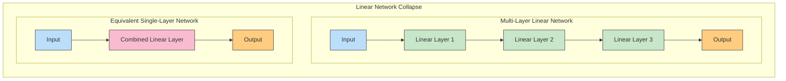

In an environmental context, this would be like trying to model a complex ecosystem using only linear equations. You might capture the broad trends, but you'd miss the critical threshold effects, feedback loops, and emergent behaviors that make real ecosystems fascinating and resilient.

### Nonlinearity: The Essential Ingredient

Nonlinear activation functions introduce curves, bends, and kinks into our network's transformations. This seemingly simple change has profound consequences:

1. **Representation Power**: Nonlinear activations allow networks to approximate any function (the Universal Approximation Theorem), including the complex, nonlinear relationships found in real-world data

2. **Feature Creation**: Each layer can create new, higher-level features that are nonlinear combinations of lower-level features

3. **Layer Independence**: Nonlinearity ensures that adding more layers genuinely increases the network's expressive power

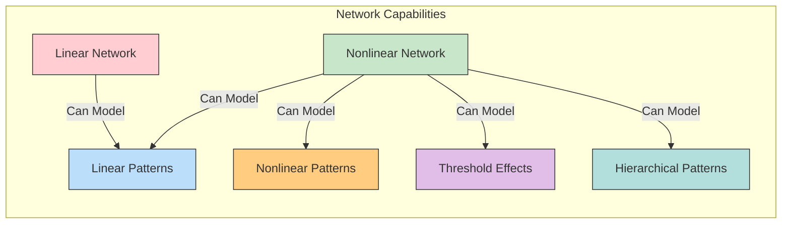

Consider an environmental example: predicting how a forest ecosystem responds to changes in rainfall. A linear model would predict that each additional inch of rain produces a fixed increase in vegetation growth. But real ecosystems have thresholds and saturation points - below a certain rainfall, plant growth might be minimal; beyond a certain point, additional water might cause flooding or nutrient runoff. Nonlinear activations allow our neural networks to capture these complex relationships.

### The Intuition Behind Nonlinearity

Let's develop a deeper intuition for how nonlinearity enables neural networks to model complex patterns. Imagine a network trying to classify points in a 2D plane, with the task of separating blue points (water-safe areas) from red points (contaminated areas) in an environmental monitoring application.

A linear classifier can only draw a straight line to separate the points. But what if the contamination follows a circular pattern, as might happen from a point source of pollution?

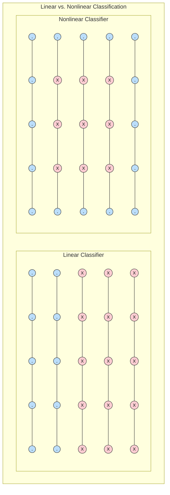

With nonlinear activation functions, each layer of a neural network can transform the data in increasingly complex ways, eventually learning to separate points in patterns that would be impossible for linear models - such as detecting circular contamination zones or complex ecological boundaries.

## Activation Function Properties: What Makes a Good Activation?

Not all nonlinear functions are suitable as activation functions. Let's explore the key properties that make a function effective for neural networks.

### Essential Properties for Effective Activations

#### 1. Nonlinearity

As we've discussed, nonlinearity is the fundamental property that gives neural networks their expressive power. Without it, deep networks collapse into simple linear models.

#### 2. Differentiability

For gradient-based optimization methods to work effectively, activation functions should be differentiable (or at least sub-differentiable) almost everywhere. This allows the gradient to flow backward through the network during backpropagation.

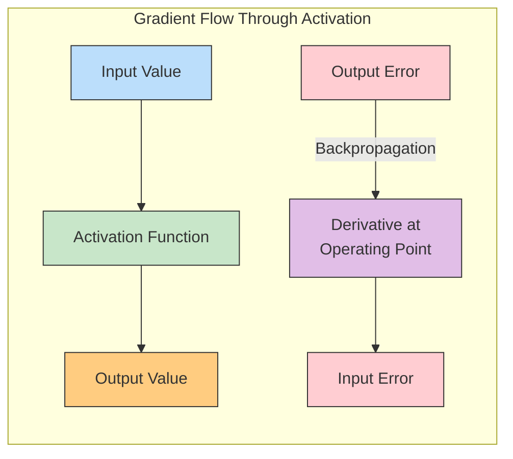

#### 3. Range

The range of an activation function affects how the values flow through the network:

- **Bounded activations** (like sigmoid or tanh) squeeze outputs into a fixed range
- **Unbounded activations** (like ReLU) allow outputs to grow as large as needed

Both approaches have their uses, similar to how different environmental systems have different natural bounds.

#### 4. Monotonicity

Most effective activation functions are monotonic - they consistently increase or decrease across their domain. This ensures that the relationship between input and output is clear and predictable, making optimization more stable.

#### 5. Computational Efficiency

Since activation functions are applied to every neuron in every forward and backward pass, their computational cost matters significantly. Simpler functions (like ReLU) offer performance advantages in large networks.

### Visualizing Common Activation Functions

Let's visualize some of the most common activation functions and their derivatives to understand their behavior:

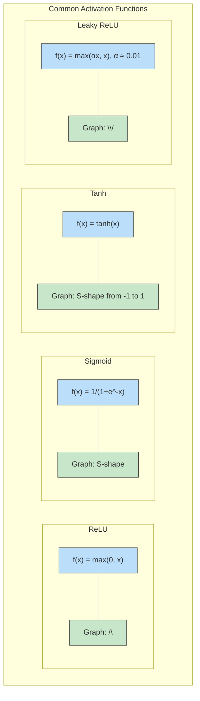

### Understanding Function Behavior Through Environmental Analogies

These activation functions have interesting parallels in environmental systems:

**Sigmoid**: Similar to how species populations respond to environmental conditions. When conditions are poor (large negative input), the population is near zero. When conditions are ideal (large positive input), the population approaches a carrying capacity. In the middle range, small changes in conditions can lead to significant population changes.

**ReLU**: Acts like a threshold effect in ecosystems. Below a certain input level (such as a minimum temperature for plant growth), there's no response. Above that threshold, the response increases linearly with the input.

**Tanh**: Functions like water flow regulation in a wetland. It can produce both positive and negative outputs, allowing the system to both add and remove resources depending on conditions.

**Leaky ReLU**: Resembles adaptive responses in nature. Even in unfavorable conditions (negative inputs), organisms maintain a minimal level of activity, ready to respond more vigorously when conditions improve.

## Impact on Gradient Flow: The Lifeblood of Learning

### Gradient Flow: How Networks Learn

The backpropagation algorithm relies on gradient flow - the process of computing error gradients at the output layer and propagating them backward through the network. Activation functions crucially affect this process through their derivatives.

When a neural network trains, each weight is updated in proportion to how much a small change in that weight would reduce the error. This information flows backward through the network as gradients, and activation functions can either help this flow or hinder it.

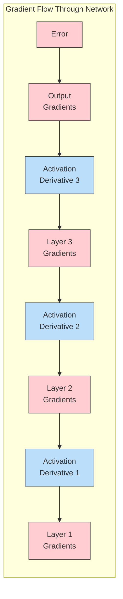

### The Vanishing Gradient Problem

One of the most significant issues in deep learning is the vanishing gradient problem. This occurs when gradients become extremely small as they flow backward through the network, effectively preventing deep layers from learning.

Sigmoid and tanh activations are particularly susceptible to this problem because their derivatives are small (less than 0.25 for sigmoid, less than 1 for tanh) for most input values. When these small gradients are multiplied through many layers, they can become vanishingly small.

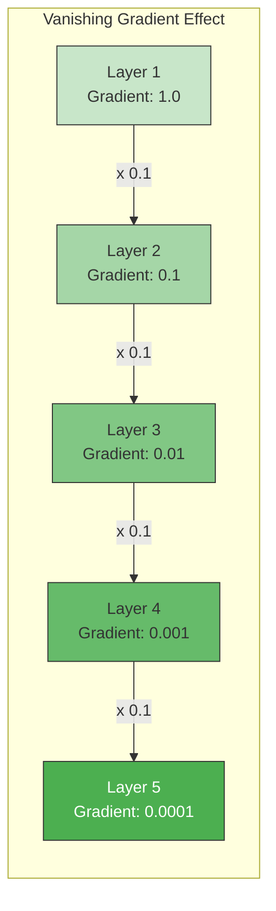

This has a direct parallel in ecosystem information flow. Imagine trying to understand how a small change in soil chemistry affects the population of apex predators. The signal must propagate through many layers of the food web, and at each stage, some information is lost or dampened. By the time we reach the predators, the original signal might be too weak to detect.

### The Exploding Gradient Problem

Conversely, some networks suffer from exploding gradients, where the error signal grows uncontrollably large as it propagates backward. This typically happens with unbounded activation functions and improperly initialized weights.

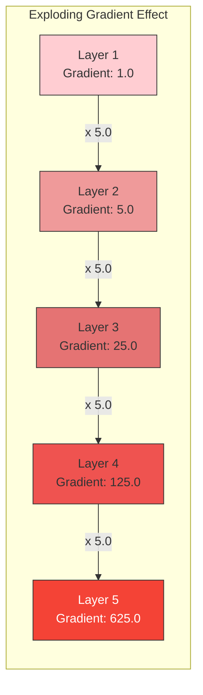

In environmental terms, this resembles a cascading effect or positive feedback loop, where a small disturbance amplifies through the system, potentially leading to catastrophic shifts - like how a small change in temperature can trigger a runaway greenhouse effect.

### ReLU and the Revolution in Gradient Flow

The ReLU activation function helped address the vanishing gradient problem. Since its derivative is exactly 1 for all positive inputs, it allows gradients to flow backward without diminishing (though it sets the gradient to 0 for negative inputs).

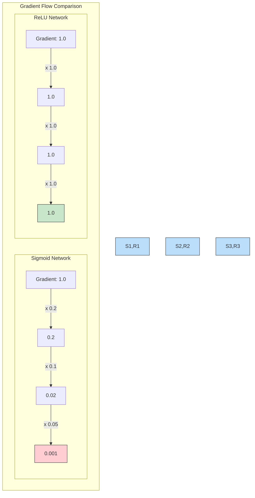

This property allowed researchers to train much deeper networks successfully, leading to the deep learning revolution of the 2010s. However, ReLU isn't perfect - its tendency to "die" (produce permanently zero outputs) for negative inputs led to developments like Leaky ReLU, which we'll explore later.

## Modern Activation Functions: The Evolution of Neural Nonlinearity

### ReLU and Its Variants: The Modern Workhorses

The Rectified Linear Unit (ReLU) has become the default activation function for most neural networks since the early 2010s, largely replacing sigmoid and tanh in hidden layers. Let's explore ReLU and its descendants in detail.

#### ReLU: Simple yet Powerful

ReLU is defined by the remarkably simple formula: $f(x) = max(0, x)$

Its benefits include:

1. **Computational efficiency**: It's just a simple maximum operation
2. **Non-saturating**: For positive inputs, the gradient is always 1, mitigating vanishing gradients
3. **Sparse activation**: It naturally produces sparse representations (many neurons output exactly zero)

Its primary drawback is the "dying ReLU" problem - if a neuron consistently receives negative inputs, it will always output zero and its weights won't update during backpropagation. It's as if this neuron has died and no longer contributes to the network.

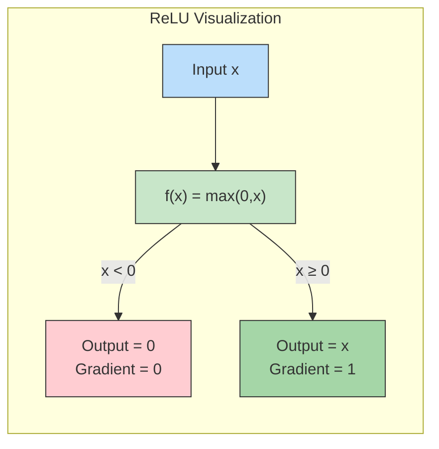

In ecological terms, ReLU resembles ecological threshold effects - like how a plant might show no growth until a minimum temperature is reached, and then growth increases proportionally with temperature. The "dying ReLU" problem is similar to population collapse - once a species population falls below a critical threshold, it may never recover.

#### Leaky ReLU: Keeping Neurons Alive

Leaky ReLU addresses the dying neuron problem by allowing a small, non-zero gradient when the input is negative:

$f(x) = max(\alpha x, x)$ where $\alpha$ is typically a small value like 0.01

This small "leak" ensures that neurons never completely die, maintaining a pathway for gradient flow even with negative inputs.

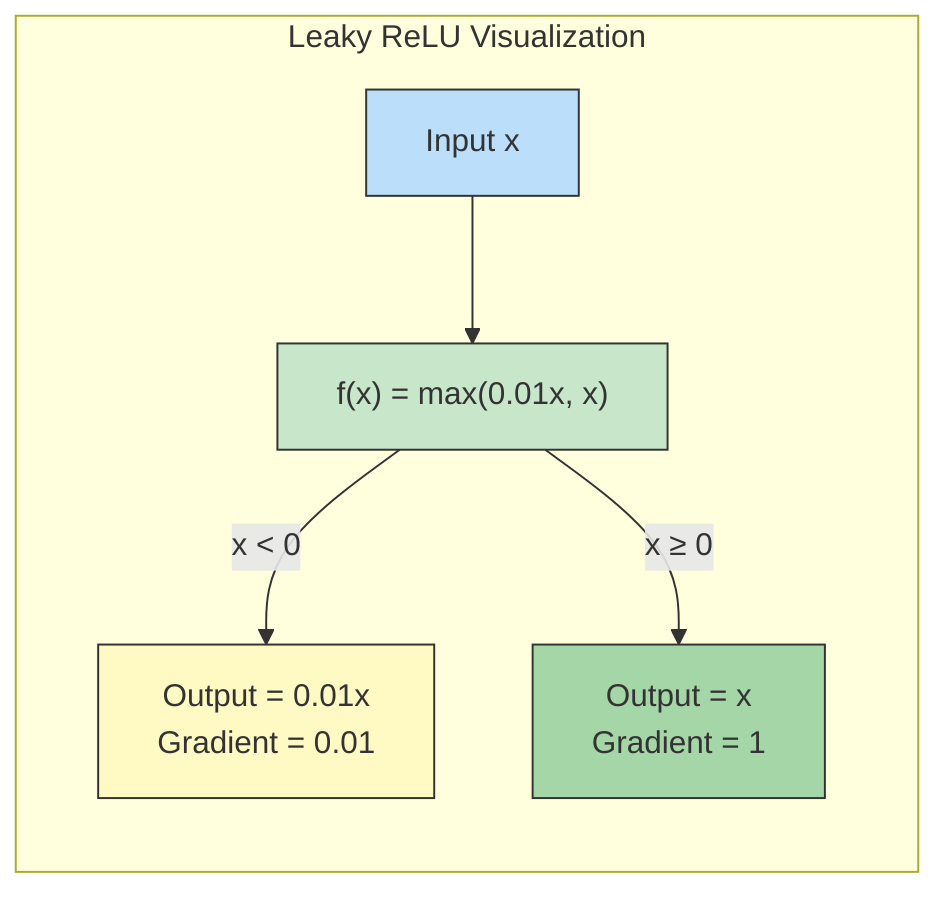

This mirrors how organisms in harsh environments maintain minimal metabolic activity - they don't completely shut down but operate at a greatly reduced level until conditions improve.

#### Parametric ReLU (PReLU): Learnable Leakiness

Parametric ReLU takes adaptability a step further by making the leakage parameter $\alpha$ learnable:

$f(x) = max(\alpha x, x)$ where $\alpha$ is learned during training

The network can determine the optimal amount of "leakiness" for each neuron, allowing more flexibility.

#### Exponential Linear Unit (ELU): Smooth Saturation

ELU combines the best aspects of ReLU and traditional sigmoidal activations:

$f(x) = x$ if $x \geq 0$
$f(x) = \alpha(e^x - 1)$ if $x < 0$

For positive inputs, ELU behaves exactly like ReLU. For negative inputs, it provides a smooth saturation to a negative value (-$\alpha$), allowing negative outputs while still having a bounded range. This helps the network push mean activations closer to zero, which can speed up learning.

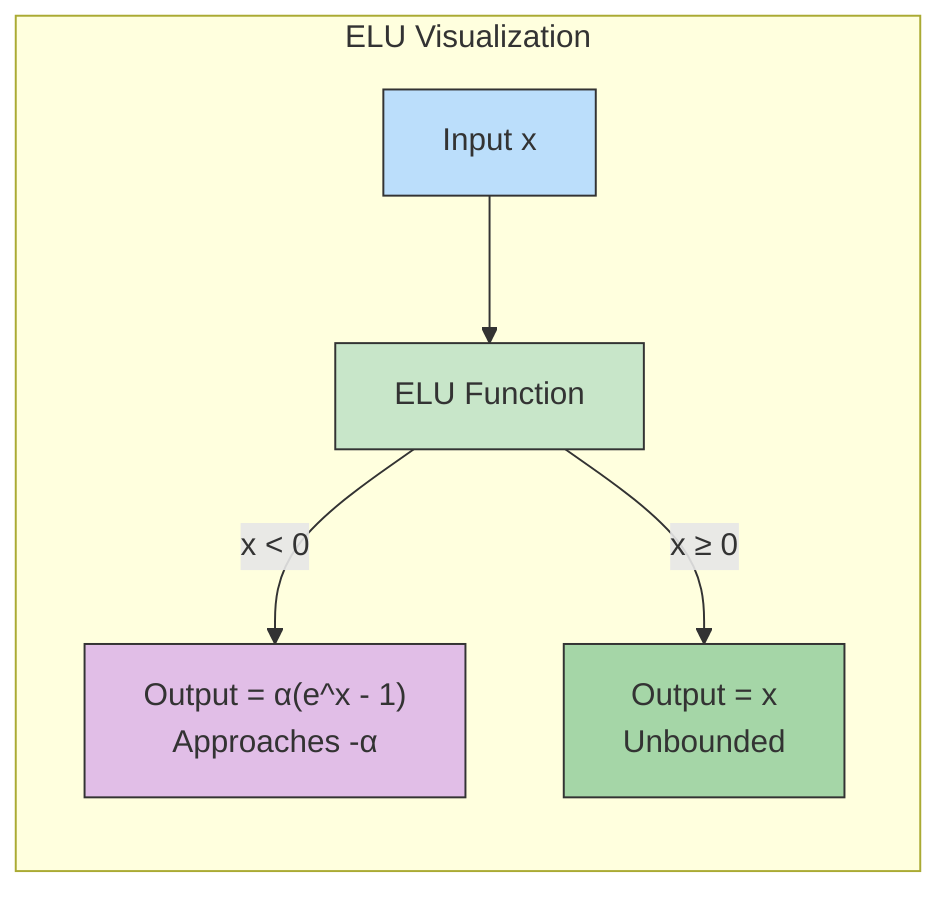

In environmental terms, ELU resembles more complex dose-response curves in toxicology, where organisms might show increasing negative effects up to a saturation point as toxin concentrations increase.

### Sigmoid and Tanh: The Traditional Staples

Before the ReLU revolution, sigmoid and tanh dominated neural network design. While they've been largely replaced in hidden layers, they still have important uses, particularly in output layers.

#### Sigmoid: The Probability Function

The sigmoid function squeezes input values into the range (0,1):

$\sigma(x) = \frac{1}{1 + e^{-x}}$

Key properties:

1. **Bounded output**: Always between 0 and 1
2. **Interpretable as probability**: Perfect for binary classification problems
3. **Smooth and differentiable**: Has well-defined derivatives everywhere

Its main drawbacks are saturating gradients (derivatives approaching zero for large positive or negative inputs) and non-zero centered outputs (average output is greater than 0.5), which can slow down learning.

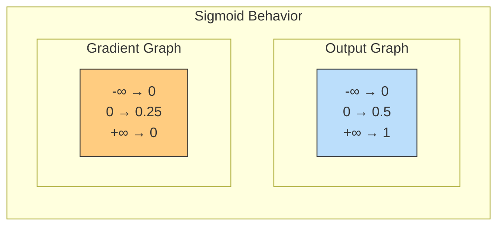

The sigmoid function resembles many natural phenomena, including species population growth curves, chemical reaction rates as a function of temperature, and the oxygen saturation curve of hemoglobin.

#### Tanh: The Zero-Centered Alternative

The hyperbolic tangent function is similar to sigmoid but maps inputs to the range (-1,1):

$tanh(x) = \frac{e^x - e^{-x}}{e^x + e^{-x}}$

Its advantages over sigmoid include:

1. **Zero-centered outputs**: Average output is closer to zero, which helps with learning dynamics
2. **Stronger gradients**: Derivatives can reach up to 1 (compared to sigmoid's maximum of 0.25)

However, it still suffers from the saturating gradient problem for large inputs.

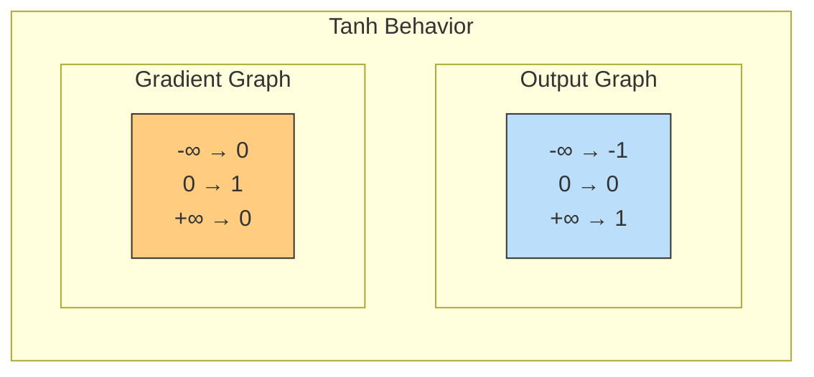

In ecological contexts, tanh can model phenomena with both positive and negative responses, such as how some species might either benefit or suffer from environmental changes, depending on the magnitude of the change.

### Newer Alternatives: GELU, Swish, and More

Recent years have seen a proliferation of new activation functions that offer subtle improvements for specific applications.

#### GELU (Gaussian Error Linear Unit)

GELU has become particularly important in transformer architectures used for natural language processing:

$GELU(x) = x \cdot \Phi(x)$

where $\Phi(x)$ is the cumulative distribution function of the standard normal distribution.

An approximation is: $GELU(x) \approx 0.5x(1 + tanh[\sqrt{2/\pi}(x + 0.044715x^3)])$

GELU can be thought of as a smoother version of ReLU that includes some probabilistic elements. It multiplies the input by the probability that the input is positive, which creates a unique nonlinearity that performs well in practice.

#### Swish: Self-Gated Activation

Swish, developed by researchers at Google, is defined as:

$Swish(x) = x \cdot \sigma(\beta x)$

where $\sigma$ is the sigmoid function and $\beta$ is either a constant or a trainable parameter.

Swish resembles ReLU for positive values but with a smooth transition and limited negative values. It has been shown to outperform ReLU on deep networks for certain tasks.

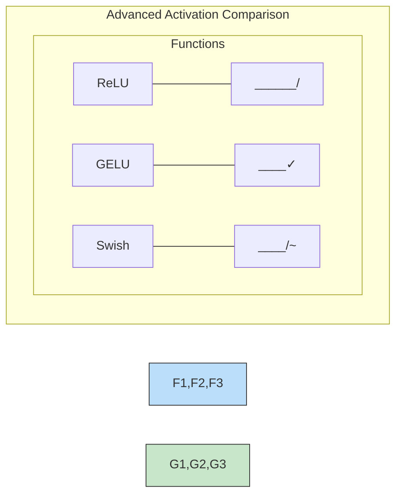

These newer functions often provide small but meaningful improvements in specific contexts, similar to how specialized adaptations in nature might provide slight advantages in particular ecological niches.

## Activation Function Selection: The Art and Science of Neural Network Design

### Matching Activations to Network Types: A Comprehensive Guide

Selecting the right activation function is one of the most critical design decisions in neural networks. Like choosing the right species for ecological restoration, the right activation function can make your network thrive, while the wrong one can lead to poor performance or training failure. This expanded section provides a detailed cookbook approach to activation selection for various network types and tasks.

#### The Activation Selection Framework

Before diving into specific recommendations, let's establish a framework for thinking about activation function selection.

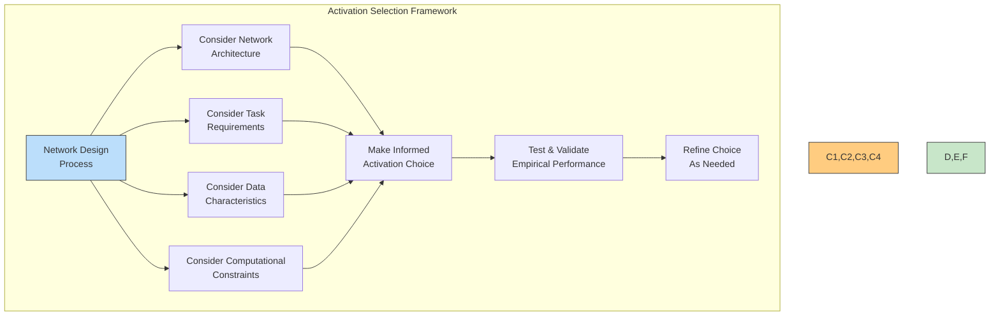

#### Hidden Layer Activation Functions: Detailed Decision Guide

The hidden layers are where most of the learning happens in your network. Let's explore an enhanced decision tree for hidden layer activation selection:

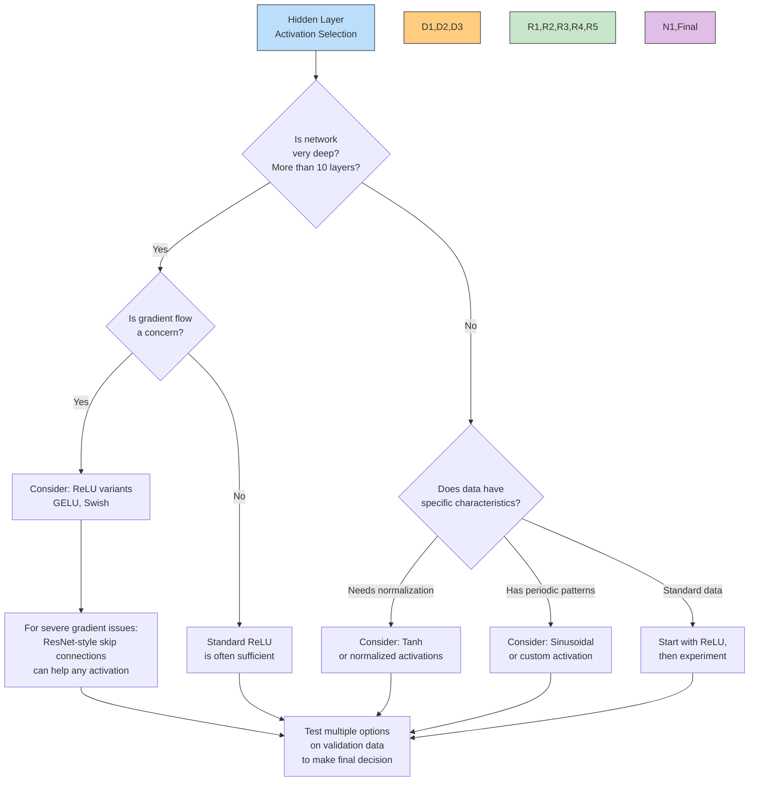

#### For Hidden Layers in Common Network Architectures

Different network architectures benefit from different activation functions. Here's a detailed breakdown:

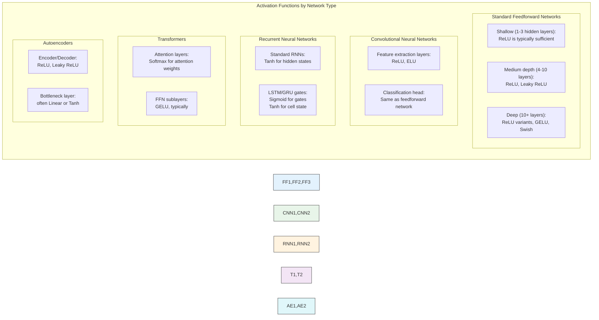

#### For Output Layers: Task-Specific Selection

The output layer activation function must be chosen based on the specific task your network is performing:

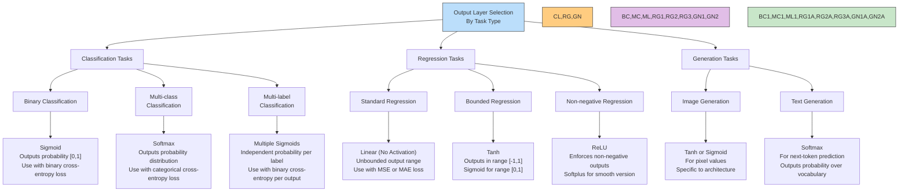

#### Real-World Examples: Network Architectures and Their Activation Functions

Let's examine how activation functions are used in well-known network architectures:

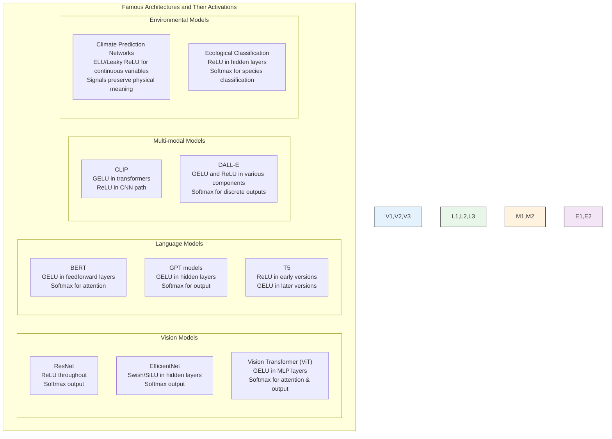

#### Detailed Example: Building a Network for Environmental Data

Let's walk through a concrete example of activation function selection for an environmental monitoring task:

**Task**: Predict water quality parameters from sensor data

**Network Architecture**:
- Input: Time-series data from multiple sensors
- Hidden layers: Mix of convolutional and recurrent layers
- Output: Multiple continuous parameters (temperature, pH, dissolved oxygen, etc.)

```mermaid
flowchart TD
    subgraph "Environmental Monitoring Network"
        I["Input Layer
Raw sensor data"] --> C1["Conv1D Layers
ReLU activation
Extracts temporal patterns"]
        
        C1 --> R1["GRU Layers
Tanh activation
Captures sequences"]
        
        R1 --> D1["Dense Layers
ELU activation
Handles varying scales"]
        
        D1 --> O1["Output Layer 1
Linear activation
Temperature (unbounded)"]
        
        D1 --> O2["Output Layer 2
Sigmoid scaled to [6.0-9.0]
pH (bounded range)"]
        
        D1 --> O3["Output Layer 3
ReLU activation
Dissolved oxygen (non-negative)"]
    end
    
    style I fill:#bbdefb,stroke:#333,stroke-width:1px
    style C1 fill:#ffcc80,stroke:#333,stroke-width:1px
    style R1 fill:#e1bee7,stroke:#333,stroke-width:1px
    style D1 fill:#c8e6c9,stroke:#333,stroke-width:1px
    style O1,O2,O3 fill:#fff9c4,stroke:#333,stroke-width:1px
```

**Activation Function Rationale**:
1. **Conv1D layers**: ReLU provides non-linearity without affecting the representation of temporal patterns
2. **GRU layers**: Tanh is standard for RNNs as it provides normalized outputs that help with sequence learning
3. **Dense layers**: ELU helps with variables that may have both positive and negative significance
4. **Output layers**: Custom activations for each parameter based on physical constraints
   - Temperature: Linear (can be any real value)
   - pH: Sigmoid scaled to valid pH range (6.0-9.0)
   - Dissolved oxygen: ReLU (cannot be negative in nature)

#### Comprehensive Activation Selection Table

Here's a comprehensive reference table to guide your activation function selection:

| Activation Function | Best Use Cases | Advantages | Disadvantages | Use When... | Avoid When... | Environmental Analogy |
|-------------------|---------------|------------|--------------|------------|--------------|---------------------|
| **ReLU** | Hidden layers in feedforward & CNN models | Fast computation, No vanishing gradient for positive values, Sparse activations | Dead neurons for negative inputs | Training medium-sized networks, Fast inference is critical | Training very deep networks without skip connections | Like sunlight's effect on plants - abundant and effective in most cases, but completely absent in some areas |
| **Leaky ReLU** | Hidden layers where dead neurons are a concern | Prevents dead neurons, Preserves some information in negative range | Adds parameter complexity, Less sparse | Dead neurons occur with ReLU, Training deep networks | Network benefits from sparsity | Minimal metabolic activity maintained during dormancy periods |
| **ELU** | Deep networks where gradient flow is important | Smooth saturation for negative values, Self-normalizing properties | More computationally expensive than ReLU | Dealing with varied data with both positive and negative signals | Very compute-constrained environments | Ecosystem resilience - can respond differently to positive and negative environmental changes |
| **GELU** | Modern transformer architectures | Smooth transitions, Works well with self-attention | Computationally expensive | Training state-of-the-art language models | Compute is severely constrained | Natural selection processes - probabilistic element to activation |
| **Swish** | Deep networks, especially in computer vision | Often outperforms ReLU on deep networks | Requires empirical validation, Computationally expensive | Fine-tuning high-performance networks | Simpler functions work well enough | Adaptive response curves in biology - combines multiple response types |
| **Sigmoid** | Binary classification output layer, Gates in recurrent networks | Outputs in [0,1] range, Interpretable as probability | Saturating gradients, Vanishing gradient | Output needs to be a probability | Hidden layers in deep networks | Population growth curve - grows in the middle, saturates at extremes |
| **Tanh** | Recurrent network hidden states, Bounded regression, Normalization layers | Zero-centered outputs, Stronger gradients than sigmoid | Still has saturating gradient issue | Outputs need normalization in range [-1,1] | Very deep feedforward networks | Seasonal patterns with both positive and negative responses |
| **Softmax** | Multi-class classification output | Outputs normalized probability distribution | Only suitable for output layers | Classification across multiple exclusive classes | When classes aren't mutually exclusive | Resource allocation in ecosystems - competition forces normalization |
| **Linear** | Regression output, Linear transformations | No transformation, Preserves scale | No non-linearity | Final output in regression problems | Hidden layers (no non-linearity) | Direct cause-effect relationships in nature |
| **Custom Functions** | Domain-specific tasks with unique constraints | Tailored to specific problem | Requires design and testing effort | Standard functions don't capture domain dynamics | General-purpose models | Highly specialized adaptations in unique ecological niches |

#### Implementation Patterns: Common Code Examples

Here's how to implement and use these activation functions in popular frameworks:

**PyTorch Example**:
```python
import torch
import torch.nn as nn

# Creating a network with different activations for different parts
class EnvironmentalMonitoringNetwork(nn.Module):
    def __init__(self, input_size, hidden_size, output_size):
        super().__init__()
        
        # Feature extraction with ReLU
        self.feature_extractor = nn.Sequential(
            nn.Linear(input_size, hidden_size),
            nn.ReLU(),  # Standard ReLU for initial features
            nn.Linear(hidden_size, hidden_size),
            nn.ReLU()
        )
        
        # Deeper processing with ELU
        self.deep_processor = nn.Sequential(
            nn.Linear(hidden_size, hidden_size),
            nn.ELU(),  # ELU for better gradient flow in deeper layers
            nn.Linear(hidden_size, hidden_size),
            nn.ELU()
        )
        
        # Output heads with task-appropriate activations
        # Temperature prediction (unbounded) - Linear
        self.temp_output = nn.Linear(hidden_size, 1)  # No activation
        
        # pH prediction (bounded 0-14) - Sigmoid scaled
        self.ph_output = nn.Sequential(
            nn.Linear(hidden_size, 1),
            nn.Sigmoid(),  # Outputs [0,1]
            # Scale to pH range in forward method
        )
        
        # Oxygen prediction (non-negative) - ReLU
        self.oxygen_output = nn.Sequential(
            nn.Linear(hidden_size, 1),
            nn.ReLU()  # Ensures non-negative output
        )
    
    def forward(self, x):
        features = self.feature_extractor(x)
        processed = self.deep_processor(features)
        
        temp = self.temp_output(processed)  # Linear output
        ph = self.ph_output(processed) * 14.0  # Scale sigmoid to pH range
        oxygen = self.oxygen_output(processed)
        
        return {
            'temperature': temp,
            'ph': ph,
            'dissolved_oxygen': oxygen
        }
```

**TensorFlow/Keras Example**:
```python
import tensorflow as tf
from tensorflow.keras import layers, Model

# Custom activation combining benefits of ReLU and tanh
def custom_eco_activation(x):
    # ReLU-like for positive values, tanh-like for negative values
    # Useful for environmental data with different behaviors in different ranges
    pos_part = tf.nn.relu(x)
    neg_part = 0.5 * tf.nn.tanh(x) * tf.cast(x < 0, tf.float32)
    return pos_part + neg_part

# Register custom activation
tf.keras.utils.get_custom_objects().update({'custom_eco_activation': custom_eco_activation})

# Input
inputs = layers.Input(shape=(input_dim,))

# Hidden layers with different activations
x = layers.Dense(128)(inputs)
x = layers.Activation('relu')(x)  # Standard ReLU

x = layers.Dense(128)(x)
x = layers.LeakyReLU(alpha=0.01)(x)  # Leaky ReLU to prevent dead neurons

x = layers.Dense(128)(x)
x = layers.Activation('custom_eco_activation')(x)  # Custom activation

# Output layers with task-appropriate activations
classification_output = layers.Dense(num_classes, activation='softmax')(x)
regression_output = layers.Dense(1)(x)  # Linear for regression

# Multi-output model
model = Model(inputs=inputs, outputs=[classification_output, regression_output])
```

#### Activation Function Decision Flowchart for Environmental Deep Learning

For environmental applications specifically, here's a specialized decision flowchart:

```mermaid
flowchart TD
    Start["Environmental DL
Task"] --> Q1{"What type of
environmental data?"}
    
    Q1 -->|"Satellite/Image Data"| I1["CNN Architecture"]
    Q1 -->|"Time Series"| I2["RNN/LSTM Architecture"]
    Q1 -->|"Tabular/Sensor"| I3["Feedforward Architecture"]
    Q1 -->|"Text/Reports"| I4["Transformer Architecture"]
    
    I1 --> I1A["ReLU/ELU for CNNs
Consider Leaky ReLU for deep networks"]
    I2 --> I2A["Tanh for hidden states
Sigmoid for gates
ReLU for dense projections"]
    I3 --> I3A["ReLU for general use
ELU for varied data distributions"]
    I4 --> I4A["GELU for transformer blocks
Softmax for attention"]
    
    I1A --> O1{"Output representation?"} 
    I2A --> O1
    I3A --> O1
    I4A --> O1
    
    O1 -->|"Classes
E.g., Species, Land Cover"| O1A["Softmax
With categorical cross-entropy"]
    O1 -->|"Physical quantitities
E.g., Temperature, Rainfall"| O1B["Linear
With MSE loss"]
    O1 -->|"Bounded physical quantities
E.g., Concentration [0-100%]"| O1C["Sigmoid (scaled)
With MSE/MAE loss"]
    O1 -->|"Non-negative quantities
E.g., Biomass, Population"| O1D["ReLU
With MSE/MAE loss"]
    
    style Start fill:#bbdefb,stroke:#333,stroke-width:1px
    style Q1 fill:#ffcc80,stroke:#333,stroke-width:1px
    style I1,I2,I3,I4 fill:#e1bee7,stroke:#333,stroke-width:1px
    style I1A,I2A,I3A,I4A fill:#c8e6c9,stroke:#333,stroke-width:1px
    style O1 fill:#ffcc80,stroke:#333,stroke-width:1px
    style O1A,O1B,O1C,O1D fill:#dcedc8,stroke:#333,stroke-width:1px
```

#### Environmental Case Study: Climate Model Downscaling Network

Let's examine a specific environmental application and its activation function choices:

**Task**: Downscale coarse climate model outputs to high-resolution predictions

**Data**: 
- Input: Low-resolution climate model variables (temperature, precipitation, etc.)
- Output: High-resolution local climate predictions

**Network Design**:
```mermaid
flowchart TD
    subgraph "Climate Downscaling Architecture"
        I["Input: Coarse Climate Variables"] --> C1["Conv2D encoder
ReLU activation
Extract spatial features"]
        
        C1 --> U1["Upsampling Blocks
Leaky ReLU
Prevent dead features during upsampling"]
        
        U1 --> R1["Residual Connections
ELU activation
Preserve physical variable relationships"]
        
        R1 --> O1["Temperature Output
Linear activation
Preserve true temperature scale"]
        
        R1 --> O2["Precipitation Output
Softplus activation
Ensure non-negative with smooth gradients"]
        
        R1 --> O3["Humidity Output
Sigmoid scaled to [0-100%]
Physically plausible range"]
    end
    
    style I fill:#bbdefb,stroke:#333,stroke-width:1px
    style C1 fill:#ffcc80,stroke:#333,stroke-width:1px
    style U1 fill:#e1bee7,stroke:#333,stroke-width:1px
    style R1 fill:#c8e6c9,stroke:#333,stroke-width:1px
    style O1,O2,O3 fill:#fff9c4,stroke:#333,stroke-width:1px
```

**Activation Function Justification**:
1. **ReLU in encoder**: Efficient feature extraction while preserving spatial patterns
2. **Leaky ReLU in upsampling**: Critical to prevent feature loss during the expansion process
3. **ELU in residual connections**: Helps maintain relationships between physical variables
4. **Custom output activations**: Each climate variable has specific physical constraints:
   - Temperature: Linear (can be any value, including negative)
   - Precipitation: Softplus (must be non-negative but needs smooth gradients)
   - Humidity: Sigmoid scaled to 0-100% (physically bounded)

#### Practical Tips for Activation Function Experimentation

When determining the optimal activation functions for your specific environmental deep learning task:

1. **Start with established patterns**: Use the table above as a starting point

2. **Create ablation studies**: Systematically test different activations while keeping other parameters constant

3. **Monitor both training and validation performance**: Some activations may lead to faster training but worse generalization

4. **Consider computational constraints**: More complex activations have higher computational costs

5. **Incorporate domain knowledge**: Physical constraints of environmental variables should guide output activation selection

6. **Test hybrid approaches**: Different activations in different parts of the network can be optimal

7. **Keep physical interpretability in mind**: For environmental science, maintaining physical meaning in outputs is crucial

### Performance Considerations: Balancing Theory and Practice

While theoretical properties are important, empirical performance often drives activation function selection. Here are practical considerations:

#### Computational Efficiency

Activation functions are computed for every neuron in every forward and backward pass, so their efficiency matters:  

1. **ReLU family**: Extremely efficient (simple max operations)
2. **Tanh/Sigmoid**: Moderately expensive (require exponential calculations)  
3. **GELU/Swish**: Most expensive (involve multiple operations)

For large networks or resource-constrained environments, this efficiency difference can be significant.

#### Memory Footprint

Some activation functions require storing intermediate values for the backward pass:

1. **ReLU**: Needs only to store a binary mask (which inputs were positive)
2. **Sigmoid/Tanh**: Need to store output values to compute gradients
3. **Complex functions**: May need multiple intermediate values

This is similar to how different metabolic pathways in organisms have different energy and resource requirements.

#### Learning Dynamics

```mermaid
flowchart LR
    subgraph "Training Dynamics by Activation Function"
        subgraph "ReLU"
            R1["Fast initial learning
Potential dead neurons
Constant gradient for positives"]  
        end
        
        subgraph "Sigmoid/Tanh"
            S1["Slower initial learning
No dead neurons
Vanishing gradients for extremes"]  
        end
        
        subgraph "Modern Variants"
            M1["Fast learning
Fewer dead neurons
More stable gradients"]  
        end
    end
    
    style R1 fill:#bbdefb,stroke:#333,stroke-width:1px
    style S1 fill:#ffcc80,stroke:#333,stroke-width:1px
    style M1 fill:#c8e6c9,stroke:#333,stroke-width:1px
```

Different activation functions can lead to different learning dynamics:

1. **Learning speed**: ReLU-based networks typically learn faster in early stages

2. **Convergence stability**: Modern variants like ELU often have more stable convergence

3. **Generalization**: Some evidence suggests that bounded activations (like tanh) can have better generalization in certain contexts

### Implementation and Benchmarking: Putting Theory into Practice

When implementing activation functions, it's important to understand both their forward computation and their backward gradient calculation.

Here's a practical implementation of several activation functions in Python:

```python
# Forward pass implementations
def relu(x):
    return np.maximum(0, x)

def leaky_relu(x, alpha=0.01):
    return np.maximum(alpha * x, x)

def sigmoid(x):
    return 1 / (1 + np.exp(-x))

def tanh(x):
    return np.tanh(x)

# Gradient (derivative) implementations
def relu_gradient(output):
    return (output > 0).astype(output.dtype)  # 1 for positive outputs, 0 otherwise

def leaky_relu_gradient(output, alpha=0.01):
    dx = np.ones_like(output)
    dx[output < 0] = alpha
    return dx

def sigmoid_gradient(output):
    # Note: output is the sigmoid output, not the input
    return output * (1 - output)

def tanh_gradient(output):
    # Note: output is the tanh output, not the input
    return 1 - output**2
```

When selecting an activation function, it's often valuable to benchmark multiple options on your specific task. Run controlled experiments with different activation functions while keeping other parameters constant, and measure metrics like:

1. Training and validation accuracy
2. Convergence speed (epochs to reach a target performance)
3. Final model performance
4. Robustness to hyperparameter changes

This empirical approach complements theoretical understanding and can identify the best activation for your specific use case.

## Custom Activation Functions: Designing Your Own Nonlinearities

### Designing Your Own Activations: Principles and Process

While existing activation functions cover most needs, there are cases where designing a custom activation function can be beneficial. This is analogous to how nature evolves specialized adaptations for unique ecological niches.

When designing a custom activation function, consider these principles:

#### 1. Understand the Problem Constraints

Identify what properties are most important for your task:

- Is gradient flow through many layers critical? (Favor non-saturating functions)
- Do you need bounded outputs? (Consider sigmoids or normalized functions)
- Is computational efficiency paramount? (Prefer simpler functions)
- Are there domain-specific constraints? (e.g., must outputs be non-negative?)

#### 2. Start from Existing Functions

Rather than creating something entirely new, consider modifying existing functions:

```mermaid
flowchart TD
    subgraph "Custom Activation Development"
        Start["Base Function"] --> M1["Modify Shape\n(Scaling, Shifting)"]
        Start --> M2["Combine Functions\n(Weighted Sum, Product)"]
        Start --> M3["Add Parameters\n(Learnable Coefficients)"]
        Start --> M4["Domain-Specific\nModifications"]
    end
    
    style Start fill:#bbdefb,stroke:#333,stroke-width:1px
    style M1,M2,M3,M4 fill:#c8e6c9,stroke:#333,stroke-width:1px
```

For example, Swish began as a modification of the sigmoid function by multiplying it with the input. Similarly, Leaky ReLU is a simple modification of ReLU to address its limitations.

#### 3. Ensure Differentiability

For use with gradient-based optimization, your function must be differentiable (or at least sub-differentiable) in most of its domain. Carefully consider the gradient behavior, especially at transition points.

#### 4. Implementation Efficiency

Design your function to be computationally efficient in both forward and backward passes. Ideally, the gradient should be computable directly from the output, without requiring additional storage of intermediate values.

### Examples of Custom Activation Functions

Here are some examples of how you might design custom activation functions for specific scenarios:

#### Bounded ReLU: For Controlled Outputs

```python
def bounded_relu(x, max_value=6.0):
    return np.minimum(np.maximum(0, x), max_value)
```

This function combines ReLU with an upper bound, ensuring outputs never exceed a certain value. This can be useful for preventing exploding activations in deep networks.

#### Sinusoidal Activation: For Periodic Data

```python
def sinusoidal(x, alpha=1.0):
    return alpha * np.sin(x)
```

For data with inherent periodicity (like time-of-day or seasonal environmental data), a sinusoidal activation might capture patterns more effectively.

#### Domain-Specific Example: Environmental Threshold Activation

```python
def environmental_threshold(x, lower_threshold=0, upper_threshold=1, slope=1.0):
    # No response below lower threshold
    # Linear response between thresholds
    # Saturated response above upper threshold
    return np.where(
        x < lower_threshold, 
        0, 
        np.where(
            x > upper_threshold, 
            slope * (upper_threshold - lower_threshold), 
            slope * (x - lower_threshold)
        )
    )
```

This activation models common threshold effects in environmental systems, where responses occur only within specific ranges of input variables.

### Evaluating Novel Activation Functions

How do you know if your custom activation function is effective? Here's a systematic approach to evaluation:

#### Theoretical Analysis

Before implementation, analyze your function's properties:

1. **Plot the function and its derivative**: Look for potential issues like vanishing gradients

2. **Analyze limiting behavior**: How does it behave for very large or small inputs?

3. **Check computational complexity**: Is it efficient to compute in both forward and backward passes?

#### Empirical Testing

```mermaid
flowchart LR
    subgraph "Activation Function Evaluation Process"
        T1["Implement\nfunction"] --> T2["Test on small\nsynthetic dataset"] --> T3["Compare with\nstandard activations"] --> T4["Scale to\nlarger problems"] --> T5["Analyze\ntraining dynamics"]
    end
    
    style T1,T2,T3,T4,T5 fill:#bbdefb,stroke:#333,stroke-width:1px
```

Implement controlled experiments:

1. **Comparison baseline**: Compare your activation against established functions on the same task

2. **Multiple datasets**: Test across different types of problems to assess generalization

3. **Hyperparameter robustness**: Check if the function performs well across different learning rates, batch sizes, etc.

4. **Ablation studies**: Isolate the impact of your activation by changing only that part of the network

Similar to how new species adaptations must prove their worth in natural ecosystems, your custom activation function must demonstrate clear advantages over established alternatives.

### The Search for Better Nonlinearities: A Never-Ending Quest

The development of new activation functions continues to be an active area of research. Recent trends include:

#### 1. Adaptive Activations

Activation functions that can adapt during training, either at the individual neuron level or layer level:

- **Parametric activations**: Like PReLU, where the shape of the function is learned
- **Mixture activations**: Weighted combinations of multiple activation functions
- **Context-dependent activations**: Functions that change behavior based on input patterns

#### 2. Activation Search Algorithms

Automatic discovery of activation functions using techniques like:

- **Neural Architecture Search (NAS)**: Searching for optimal activations alongside network architectures
- **Genetic algorithms**: Evolving activation functions through selection and mutation
- **Symbolic regression**: Using mathematical expressions to represent and optimize functions

#### 3. Biological Inspirations

The study of biological neural systems continues to inspire new activation functions:

- **Spiking neuron models**: Activations that mimic the discrete firing patterns of biological neurons
- **Dendritic computation**: Functions inspired by the complex processing in dendrites of biological neurons
- **Neuromodulation**: Activation functions that simulate how neuromodulators regulate neural activity

Just as natural evolution continuously improves adaptations for changing environments, the evolution of activation functions is an ongoing process, driven by new problems, architectures, and insights.

## Conclusion: Choosing the Right Tool for the Job

Activation functions are the essential components that give neural networks their power to learn complex, nonlinear relationships. Each function has its strengths, weaknesses, and specific use cases - much like how different species have evolved specialized traits for their ecological niches.

While ReLU and its variants dominate current practice, understanding the full spectrum of activation functions empowers you to make informed choices for your specific problems. Whether you're using established functions or designing custom ones, the principles we've explored should guide your decisions.

In the next chapter, we'll build on this foundation to explore convolutional neural networks, which combine specialized architectures with these activation functions to achieve remarkable results in computer vision tasks.

### Reflection Questions

1. How might the choice of activation function affect a neural network's ability to model different types of environmental relationships? Consider threshold effects, saturation points, and periodic patterns.

2. What parallels can you draw between the evolution of activation functions in deep learning and the evolution of adaptations in natural ecosystems?

3. For a specific environmental monitoring task you're interested in, which activation function would you choose for hidden layers and why?

4. When might it be worthwhile to design a custom activation function rather than using an established one?

### Exercises: Exploring Activation Functions

#### Exercise 1: Activation Visualization

Implement and visualize the major activation functions (ReLU, Leaky ReLU, ELU, sigmoid, tanh) and their derivatives. Compare their behavior across the input range [-5, 5].

#### Exercise 2: Activation Benchmarking

Train the same network architecture on the MNIST dataset using different activation functions. Compare training speed, final accuracy, and generalization performance.

#### Exercise 3: Designing a Custom Activation

Design a custom activation function that combines aspects of ReLU and sigmoid. Implement it, visualize it, and test it on a simple classification problem.

#### Exercise 4: Gradient Flow Analysis

Create a deep network (10+ layers) and analyze how gradients flow through the network using different activation functions. Which ones maintain gradient magnitude best in deep networks?

#### Exercise 5: Periodic Data Modeling

Test how different activation functions perform on data with inherent periodicity (like seasonal environmental patterns). Is there an advantage to using activation functions that capture periodicity?
## Project 1: Mathematical Analysis of Activation Functions

### Learning Objective
In this project, you'll perform a detailed mathematical analysis of different activation functions and their effects on gradient flow in neural networks. You'll develop a deeper understanding of how activation functions transform signals and control gradient propagation.

### Problem Statement
You're developing a neural network to predict seasonal variations in river water quality based on multiple environmental factors. The choice of activation function is critical for capturing the nonlinear relationships in this ecological system. You need to understand how different activation functions affect signal propagation and gradient flow.

### Step 1: Analyze Signal Propagation
Let's examine how different activation functions transform input signals. Consider the input value x = 2.5, which might represent a normalized temperature measurement.

Calculate the output for each of these activation functions:

**ReLU**: f(x) = max(0, x)
ReLU(2.5) = max(0, 2.5) = 2.5

**Sigmoid**: f(x) = 1/(1 + e^(-x))
Sigmoid(2.5) = 1/(1 + e^(-2.5))
Sigmoid(2.5) = 1/(1 + 0.082)
Sigmoid(2.5) ≈ 1/1.082
Sigmoid(2.5) ≈ 0.924

**Tanh**: f(x) = (e^x - e^(-x))/(e^x + e^(-x))
Tanh(2.5) = (e^2.5 - e^(-2.5))/(e^2.5 + e^(-2.5))
Tanh(2.5) = (12.182 - 0.082)/(12.182 + 0.082)
Tanh(2.5) = 12.100/12.264
Tanh(2.5) ≈ 0.987

**Leaky ReLU**: f(x) = max(0.01x, x) with α = 0.01
LeakyReLU(2.5) = max(0.01 × 2.5, 2.5) = max(0.025, 2.5) = 2.5

**ELU**: f(x) = x if x > 0, else α(e^x - 1) with α = 1.0
ELU(2.5) = 2.5 (since 2.5 > 0)

Now calculate the output for the negative input x = -1.5:

**ReLU**: ReLU(-1.5) = max(0, -1.5) = 0

**Sigmoid**: Sigmoid(-1.5) = 1/(1 + e^(1.5))
Sigmoid(-1.5) = 1/(1 + 4.482)
Sigmoid(-1.5) ≈ 1/5.482
Sigmoid(-1.5) ≈ 0.182

**Tanh**: Tanh(-1.5) = (e^(-1.5) - e^(1.5))/(e^(-1.5) + e^(1.5))
Tanh(-1.5) = (0.223 - 4.482)/(0.223 + 4.482)
Tanh(-1.5) = -4.259/4.705
Tanh(-1.5) ≈ -0.905

**Leaky ReLU**: LeakyReLU(-1.5) = max(0.01 × (-1.5), -1.5) = max(-0.015, -1.5) = -0.015

**ELU**: ELU(-1.5) = 1.0 × (e^(-1.5) - 1)
ELU(-1.5) = 0.223 - 1
ELU(-1.5) ≈ -0.777

### Step 2: Analyze Gradient Propagation
Now, let's examine how each activation function affects gradient propagation. Calculate the derivative of each function at the same input values.

For x = 2.5:

**ReLU**: ReLU'(x) = 1 if x > 0, else 0
ReLU'(2.5) = 1

**Sigmoid**: Sigmoid'(x) = Sigmoid(x) × (1 - Sigmoid(x))
Sigmoid'(2.5) = 0.924 × (1 - 0.924)
Sigmoid'(2.5) = 0.924 × 0.076
Sigmoid'(2.5) ≈ 0.070

**Tanh**: Tanh'(x) = 1 - (Tanh(x))²
Tanh'(2.5) = 1 - (0.987)²
Tanh'(2.5) = 1 - 0.974
Tanh'(2.5) ≈ 0.026

**Leaky ReLU**: LeakyReLU'(x) = 1 if x > 0, else α
LeakyReLU'(2.5) = 1

**ELU**: ELU'(x) = 1 if x > 0, else α × e^x
ELU'(2.5) = 1

For x = -1.5:

**ReLU**: ReLU'(-1.5) = 0

**Sigmoid**: Sigmoid'(-1.5) = 0.182 × (1 - 0.182)
Sigmoid'(-1.5) = 0.182 × 0.818
Sigmoid'(-1.5) ≈ 0.149

**Tanh**: Tanh'(-1.5) = 1 - (-0.905)²
Tanh'(-1.5) = 1 - 0.819
Tanh'(-1.5) ≈ 0.181

**Leaky ReLU**: LeakyReLU'(-1.5) = 0.01

**ELU**: ELU'(-1.5) = α × e^(-1.5) = 1.0 × 0.223 ≈ 0.223

### Step 3: Analyze Gradient Flow in a Deep Network
Let's analyze how gradients propagate through multiple layers of a neural network. Consider a 5-layer network where each layer uses the same activation function. We'll track how an initial gradient of 1.0 propagates backward.

Assume that for each layer, the activation function operates at the same input region (either consistently positive or consistently negative). Calculate the gradient magnitude after flowing through all 5 layers.

For consistently positive activations (x = 2.5 in all layers):

**ReLU**: 1.0 × 1 × 1 × 1 × 1 = 1.0

**Sigmoid**: 1.0 × 0.070 × 0.070 × 0.070 × 0.070 ≈ 2.4 × 10^-7

**Tanh**: 1.0 × 0.026 × 0.026 × 0.026 × 0.026 ≈ 4.6 × 10^-8

**Leaky ReLU**: 1.0 × 1 × 1 × 1 × 1 = 1.0

**ELU**: 1.0 × 1 × 1 × 1 × 1 = 1.0

For consistently negative activations (x = -1.5 in all layers):

**ReLU**: 1.0 × 0 × 0 × 0 × 0 = 0.0

**Sigmoid**: 1.0 × 0.149 × 0.149 × 0.149 × 0.149 ≈ 4.9 × 10^-4

**Tanh**: 1.0 × 0.181 × 0.181 × 0.181 × 0.181 ≈ 1.1 × 10^-3

**Leaky ReLU**: 1.0 × 0.01 × 0.01 × 0.01 × 0.01 = 10^-8

**ELU**: 1.0 × 0.223 × 0.223 × 0.223 × 0.223 ≈ 2.5 × 10^-3

### Step 4: Visualize the Calculations

Let's create a visual comparison of the gradient propagation:

```mermaid
flowchart LR
    subgraph "Gradient Magnitude After 5 Layers (Positive Inputs)"
        GP1["ReLU: 1.0"] --> |"100%"| GPR["Strong\nGradient"]
        GP2["Leaky ReLU: 1.0"] --> |"100%"| GPR
        GP3["ELU: 1.0"] --> |"100%"| GPR
        GP4["Sigmoid: 0.000000024"] --> |"0.0000024%"| GPV["Vanishing\nGradient"]
        GP5["Tanh: 0.0000000046"] --> |"0.00000046%"| GPV
    end
    
    subgraph "Gradient Magnitude After 5 Layers (Negative Inputs)"
        GN1["ReLU: 0.0"] --> |"0%"| GND["Dead\nNeuron"]
        GN2["Leaky ReLU: 0.00000001"] --> |"0.000001%"| GNW["Weak\nGradient"]
        GN3["ELU: 0.0025"] --> |"0.25%"| GNM["Moderate\nGradient"]
        GN4["Sigmoid: 0.00049"] --> |"0.049%"| GNW
        GN5["Tanh: 0.0011"] --> |"0.11%"| GNM
    end
    
    style GP1,GP2,GP3 fill:#c8e6c9,stroke:#333,stroke-width:1px
    style GP4,GP5 fill:#ffcdd2,stroke:#333,stroke-width:1px
    style GPR fill:#c8e6c9,stroke:#333,stroke-width:1px
    style GPV fill:#ffcdd2,stroke:#333,stroke-width:1px
    
    style GN1 fill:#ffcdd2,stroke:#333,stroke-width:1px
    style GN2,GN4 fill:#ffe0b2,stroke:#333,stroke-width:1px
    style GN3,GN5 fill:#e1bee7,stroke:#333,stroke-width:1px
    style GND fill:#ffcdd2,stroke:#333,stroke-width:1px
    style GNW fill:#ffe0b2,stroke:#333,stroke-width:1px
    style GNM fill:#e1bee7,stroke:#333,stroke-width:1px
```

### Step 5: Analyze and Compare Activation Behavior

Based on our calculations, we can draw several key insights:

1. **Gradient Magnitude Preservation**:
   - ReLU, Leaky ReLU, and ELU perfectly preserve gradients for positive inputs
   - Sigmoid and tanh severely reduce gradient magnitude even for positive inputs
   - For negative inputs, ReLU completely blocks gradient flow ("dying ReLU" problem)
   - ELU provides the best gradient flow for negative inputs among the analyzed functions

2. **Signal Transformation**:
   - ReLU, Leaky ReLU, and ELU maintain the original signal scale for positive inputs
   - Sigmoid and tanh compress inputs into bounded ranges, losing magnitude information
   - For negative inputs, only ReLU completely loses information (outputs zero)
   - ELU provides smooth negative values proportional to input magnitude

3. **Implications for Deep Networks**:
   - ReLU networks may suffer from dead neurons in layers where inputs are predominantly negative
   - Sigmoid and tanh networks will face vanishing gradients in deep architectures
   - Leaky ReLU allows gradients to flow for negative inputs but at greatly reduced magnitude
   - ELU provides the best balance of gradient flow for both positive and negative inputs

### Step 6: Application to River Water Quality Prediction

For your river water quality prediction task, consider these implications:

1. **If seasonal patterns create both positive and negative normalized inputs**:
   - ReLU might lose information during winter months (when normalized temperatures are negative)
   - ELU or Leaky ReLU would be better choices to preserve seasonal patterns

2. **If your network needs to be deep** (to capture complex ecological interactions):
   - Avoid sigmoid and tanh in deep hidden layers due to vanishing gradients
   - Consider using ELU or a ReLU variant

3. **If interpretability of layer outputs is important**:
   - Bounded functions like sigmoid or tanh produce consistent output scales
   - Unbounded functions require more careful normalization between layers

### Exercise for Practice
Calculate the output and gradient for the Swish activation function: f(x) = x × sigmoid(βx), where β = 1.0, for inputs x = 2.5 and x = -1.5. Then compare how a gradient of 1.0 would propagate through 5 layers using this activation function.

Swish(x) = x × sigmoid(x)
Swish'(x) = sigmoid(x) + x × sigmoid(x) × (1 - sigmoid(x))

This project demonstrates the mathematical principles behind activation functions and their critical impact on neural network behavior. Understanding these details helps you make informed choices when designing networks for environmental applications.
## Project 2: Implementing Custom Activation Functions for Environmental Data

### Learning Objective
In this project, you'll implement and compare different activation functions on an environmental dataset. You'll also create a custom activation function designed specifically for seasonal ecological data.

### Problem Statement
You're analyzing a dataset of seasonal algae growth in a lake ecosystem, which shows strong periodic patterns throughout the year. Standard activation functions might not capture these seasonal patterns effectively. You'll implement and test various activation functions, including a custom one designed for seasonal data.

### Step 1: Set Up the Project Environment

```python
import numpy as np
import matplotlib.pyplot as plt
import tensorflow as tf
from tensorflow.keras.models import Sequential
from tensorflow.keras.layers import Dense, Input, Lambda
from tensorflow.keras import backend as K
import pandas as pd
```

### Step 2: Create a Synthetic Seasonal Dataset

```python
# Generate synthetic seasonal data with ecological patterns
def generate_seasonal_data(n_years=5, samples_per_year=52):
    n_samples = n_years * samples_per_year
    
    # Time index (weeks)
    time = np.linspace(0, n_years, n_samples)
    
    # Temperature: seasonal pattern with some random variation
    temperature = 20 + 15 * np.sin(2 * np.pi * time) + np.random.normal(0, 2, n_samples)
    
    # Nutrient levels: higher in spring/fall, lower in summer/winter
    nutrients = 10 + 5 * np.sin(4 * np.pi * time + np.pi/4) + np.random.normal(0, 1, n_samples)
    
    # Sunlight hours: seasonal pattern
    sunlight = 12 + 4 * np.sin(2 * np.pi * time - np.pi/8) + np.random.normal(0, 0.5, n_samples)
    
    # Algae growth: complex relationship with temperature, nutrients, and sunlight
    algae = (0.3 * temperature + 0.5 * nutrients + 0.2 * sunlight) * (1 + 0.2 * np.sin(2 * np.pi * time - np.pi/6))
    algae += np.random.normal(0, 5, n_samples)
    
    # Create features and target arrays
    X = np.column_stack([temperature, nutrients, sunlight])
    y = algae
    
    return X, y, time

# Generate data
X, y, time = generate_seasonal_data()

# Split data: use first 4 years for training, last year for testing
train_size = int(0.8 * len(X))
X_train, X_test = X[:train_size], X[train_size:]
y_train, y_test = y[:train_size], y[train_size:]
time_train, time_test = time[:train_size], time[train_size:]

# Normalize data
X_mean, X_std = X_train.mean(axis=0), X_train.std(axis=0)
y_mean, y_std = y_train.mean(), y_train.std()

X_train_norm = (X_train - X_mean) / X_std
X_test_norm = (X_test - X_mean) / X_std
y_train_norm = (y_train - y_mean) / y_std
y_test_norm = (y_test - y_mean) / y_std

# Visualize the dataset
plt.figure(figsize=(12, 8))

plt.subplot(4, 1, 1)
plt.plot(time, X[:, 0])
plt.title('Temperature')
plt.ylabel('°C')

plt.subplot(4, 1, 2)
plt.plot(time, X[:, 1])
plt.title('Nutrients')
plt.ylabel('mg/L')

plt.subplot(4, 1, 3)
plt.plot(time, X[:, 2])
plt.title('Sunlight')
plt.ylabel('Hours')

plt.subplot(4, 1, 4)
plt.plot(time, y)
plt.title('Algae Growth')
plt.ylabel('Index')
plt.xlabel('Years')

plt.tight_layout()
plt.show()
```

### Step 3: Implement Standard and Custom Activation Functions

```python
def relu(x):
    return tf.nn.relu(x)

def leaky_relu(x, alpha=0.1):
    return tf.maximum(alpha * x, x)

def elu(x, alpha=1.0):
    return tf.where(x > 0, x, alpha * (tf.exp(x) - 1))

def sigmoid(x):
    return tf.nn.sigmoid(x)

def tanh(x):
    return tf.nn.tanh(x)

# Custom activation: "Seasonal" activation function
# This combines sine wave patterns with ReLU to capture seasonality
def seasonal_activation(x, frequency=1.0):
    # Base response with ReLU
    base = tf.nn.relu(x)
    # Add seasonal component (sine wave pattern)
    seasonal = tf.sin(frequency * np.pi * x) * 0.2 * tf.abs(x)
    return base + seasonal
```

### Step 4: Create Models with Different Activation Functions

```python
def create_model(activation, input_shape):
    model = Sequential([
        Input(shape=(input_shape,)),
        Dense(16, activation=activation),
        Dense(8, activation=activation),
        Dense(1, activation='linear')  # Linear activation for regression output
    ])
    
    model.compile(optimizer='adam', loss='mse', metrics=['mae'])
    return model

# Create a model with the custom seasonal activation
def create_seasonal_model(input_shape, frequency=1.0):
    model = Sequential([
        Input(shape=(input_shape,)),
        Dense(16, use_bias=True),
        Lambda(lambda x: seasonal_activation(x, frequency)),
        Dense(8, use_bias=True),
        Lambda(lambda x: seasonal_activation(x, frequency)),
        Dense(1, activation='linear')
    ])
    
    model.compile(optimizer='adam', loss='mse', metrics=['mae'])
    return model
```

### Step 5: Train and Evaluate Models

```python
# Training parameters
batch_size = 32
epochs = 100
input_shape = X_train_norm.shape[1]

# Create and train models with different activation functions
activation_functions = {
    'relu': relu,
    'leaky_relu': leaky_relu,
    'elu': elu,
    'sigmoid': sigmoid,
    'tanh': tanh
}

models = {}
histories = {}

for name, activation in activation_functions.items():
    print(f"\nTraining model with {name} activation...")
    models[name] = create_model(activation, input_shape)
    histories[name] = models[name].fit(
        X_train_norm, y_train_norm,
        batch_size=batch_size,
        epochs=epochs,
        validation_split=0.2,
        verbose=0
    )
    
# Train the seasonal model
print("\nTraining model with seasonal activation...")
models['seasonal'] = create_seasonal_model(input_shape)
histories['seasonal'] = models['seasonal'].fit(
    X_train_norm, y_train_norm,
    batch_size=batch_size,
    epochs=epochs,
    validation_split=0.2,
    verbose=0
)
```

### Step 6: Compare Model Performance

```python
# Evaluate models on test data
results = {}
for name, model in models.items():
    score = model.evaluate(X_test_norm, y_test_norm, verbose=0)
    results[name] = {
        'loss': score[0],
        'mae': score[1]
    }
    
# Display results
print("\nTest Set Performance:")
for name, metrics in results.items():
    print(f"{name.upper()}: MSE = {metrics['loss']:.4f}, MAE = {metrics['mae']:.4f}")

# Plot learning curves
plt.figure(figsize=(15, 10))

for i, (name, history) in enumerate(histories.items(), 1):
    plt.subplot(2, 3, i)
    plt.plot(history.history['loss'], label='Training Loss')
    plt.plot(history.history['val_loss'], label='Validation Loss')
    plt.title(f'{name.upper()} Activation')
    plt.xlabel('Epoch')
    plt.ylabel('Loss')
    plt.legend()
    plt.yscale('log')

plt.tight_layout()
plt.show()
```

### Step 7: Visualize Predictions on Seasonal Data

```python
# Make predictions with all models
predictions = {}
for name, model in models.items():
    pred = model.predict(X_test_norm, verbose=0)
    # Denormalize predictions
    predictions[name] = pred * y_std + y_mean
    
# Plot predictions for the test period
plt.figure(figsize=(12, 8))

# Actual values
plt.plot(time_test, y_test, 'k-', linewidth=2, label='Actual')

# Predictions
colors = ['b', 'g', 'r', 'c', 'm', 'y']
for (name, pred), color in zip(predictions.items(), colors):
    plt.plot(time_test, pred, color, linestyle='--', label=f'{name}')

plt.title('Algae Growth Predictions')
plt.xlabel('Years')
plt.ylabel('Algae Growth Index')
plt.legend()
plt.grid(True)
plt.show()
```

### Step 8: Analyze Activation Behavior on Seasonal Data

```python
# Visualize how each activation function transforms the input
x_range = np.linspace(-3, 3, 1000)

plt.figure(figsize=(15, 10))

# Standard activation functions
plt.subplot(2, 1, 1)
plt.plot(x_range, [relu(x) for x in x_range], 'r-', label='ReLU')
plt.plot(x_range, [leaky_relu(x) for x in x_range], 'g-', label='Leaky ReLU')
plt.plot(x_range, [elu(x) for x in x_range], 'b-', label='ELU')
plt.plot(x_range, [sigmoid(x) for x in x_range], 'm-', label='Sigmoid')
plt.plot(x_range, [tanh(x) for x in x_range], 'c-', label='Tanh')
plt.title('Standard Activation Functions')
plt.xlabel('Input')
plt.ylabel('Output')
plt.legend()
plt.grid(True)

# Custom seasonal activation function
plt.subplot(2, 1, 2)
plt.plot(x_range, [seasonal_activation(x) for x in x_range], 'r-', label='Seasonal (freq=1.0)')
plt.plot(x_range, [seasonal_activation(x, frequency=2.0) for x in x_range], 'g-', label='Seasonal (freq=2.0)')
plt.plot(x_range, [relu(x) for x in x_range], 'k--', label='ReLU (reference)')
plt.title('Custom Seasonal Activation Function')
plt.xlabel('Input')
plt.ylabel('Output')
plt.legend()
plt.grid(True)

plt.tight_layout()
plt.show()
```

### Step 9: Extract and Visualize Learned Features

```python
# Extract weights from the first layer for each model
features = {}
for name, model in models.items():
    weights, biases = model.layers[1].get_weights()
    features[name] = weights

# Visualize the first layer weights for each model
plt.figure(figsize=(15, 8))

feature_names = ['Temperature', 'Nutrients', 'Sunlight']
for i, (name, feature_weights) in enumerate(features.items(), 1):
    plt.subplot(2, 3, i)
    
    # For each feature, show weights to all 16 neurons in first hidden layer
    for j, feature_name in enumerate(feature_names):
        plt.bar(np.arange(16) + j*0.25, feature_weights[j], width=0.2, label=feature_name)
    
    plt.title(f'{name.upper()} Weights')
    plt.xlabel('Neurons')
    plt.ylabel('Weight Value')
    if i == 1:
        plt.legend()

plt.tight_layout()
plt.show()
```

### Step 10: Design Your Own Custom Activation Function

Now that you've seen how the seasonal activation function works, try designing your own custom activation function that might better capture ecological relationships in your data:

```python
def my_custom_activation(x):
    # YOUR CODE HERE
    # Example: Combine multiple existing activations or create something new
    # For example, a function that has different behavior for positive and negative values
    # with a smooth transition between seasons
    pass

# Test your activation function
x_range = np.linspace(-5, 5, 1000)
y_values = [my_custom_activation(x) for x in x_range]

plt.figure(figsize=(10, 6))
plt.plot(x_range, y_values)
plt.title('My Custom Activation Function')
plt.xlabel('Input')
plt.ylabel('Output')
plt.grid(True)
plt.axhline(y=0, color='k', linestyle='-', alpha=0.3)
plt.axvline(x=0, color='k', linestyle='-', alpha=0.3)
plt.show()
```

### Ecological Insights from Activation Functions

The choice of activation functions has significant implications for modeling ecological systems:

1. **Threshold Effects**: Many ecological phenomena exhibit threshold behaviors where a small change in input (e.g., temperature exceeding a critical value) causes a dramatic change in output (e.g., algal blooms). ReLU and ELU can model these effects.

2. **Saturation Effects**: Other ecological relationships saturate at high values (e.g., growth rates cannot exceed certain biological limits). Sigmoid and tanh capture these saturation dynamics.

3. **Seasonal Patterns**: Ecological data often contains cyclical patterns. Our custom seasonal activation incorporates sinusoidal components that can better model these cycles.

4. **Asymmetric Responses**: Many species respond differently to increases versus decreases in environmental factors. Leaky ReLU and ELU provide different behaviors for positive and negative inputs.

### Extensions and Challenges

1. **Parameterized Activation**: Modify the seasonal activation to include a learnable parameter for the frequency and amplitude of seasonality.

2. **Multiple Seasonal Patterns**: Create an activation function that can capture both annual and daily cycles often present in ecological data.

3. **Threshold-Based Activation**: Design an activation function specifically for modeling ecological thresholds (e.g., minimum temperature for germination).

4. **Compare with Attention Mechanisms**: For advanced students, compare how attention mechanisms might capture seasonal patterns compared to custom activations.

This project demonstrates how carefully chosen or custom-designed activation functions can significantly improve neural network performance on environmental data with complex nonlinear and seasonal patterns.
