# Deep Learning from Scratch: Book Architecture

## Book Structure and Flow

This document outlines the architectural design of "Deep Learning from Scratch" by Dr. Ernesto Lee, including the progression of concepts, learning flow, and connections between chapters.

### Overall Book Architecture

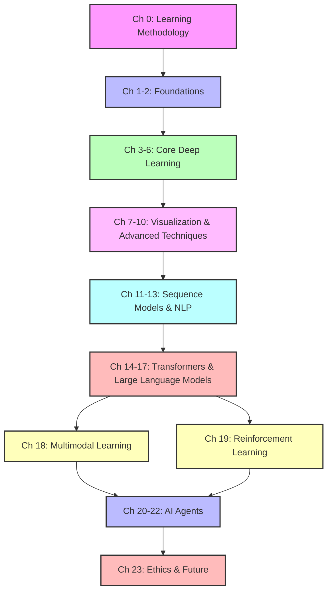

### Knowledge Building Progression

```mermaid
graph LR
    A["Basic Math & Python"] --> B["Neural Network Fundamentals"];
    B --> C["Training & Optimization"];
    C --> D["Visualization & Advanced Networks"];
    D --> E["Specialized Applications"];
    E --> F["Cutting-Edge AI Systems"];
    
    style A fill:#f9f,stroke:#333,stroke-width:2px
    style B fill:#bbf,stroke:#333,stroke-width:2px
    style C fill:#bfb,stroke:#333,stroke-width:2px
    style D fill:#fbf,stroke:#333,stroke-width:2px
    style E fill:#bff,stroke:#333,stroke-width:2px
    style F fill:#fbb,stroke:#333,stroke-width:2px
```

### The Observe-Model-Refine Framework

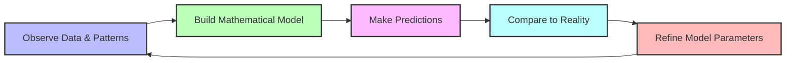

### Project Complexity Progression

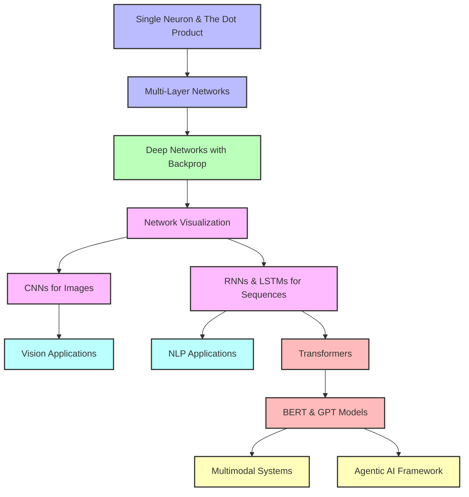

## Chapter Dependencies

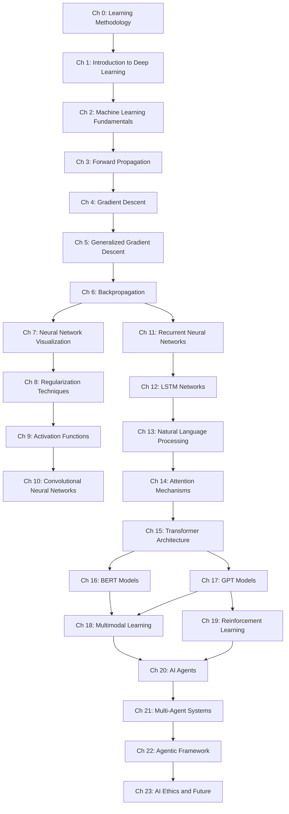

## Core Deep Learning Concepts Map

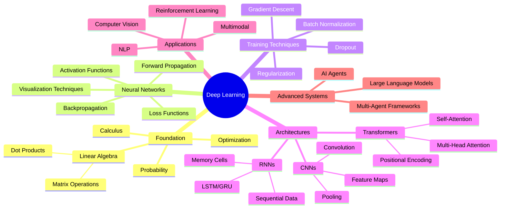

## From Neural Networks to AI Agents: Evolution Path

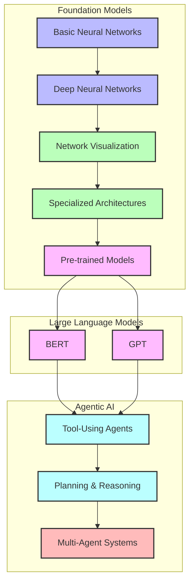

## Learning Model: Intuition to Implementation

```mermaid
graph LR
    A["Intuitive Explanation"] --> B["Mathematical Foundation"];
    B --> C["Code Implementation"];
    C --> D["Visualization & Analysis"];
    D --> E["Applied Examples"];
    E --> F["Advanced Variations"];
    
    style A fill:#f9f,stroke:#333,stroke-width:2px
    style B fill:#bbf,stroke:#333,stroke-width:2px
    style C fill:#bfb,stroke:#333,stroke-width:2px
    style D fill:#fbf,stroke:#333,stroke-width:2px
    style E fill:#bff,stroke:#333,stroke-width:2px
    style F fill:#fbb,stroke:#333,stroke-width:2px
```

## The Magic of the Dot Product

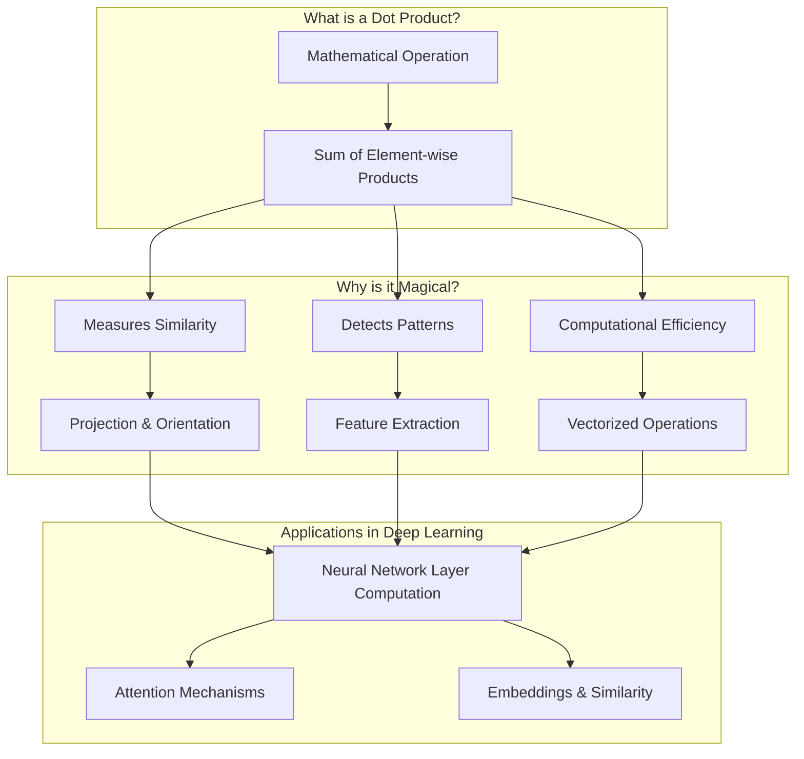

## Neural Network Core Components

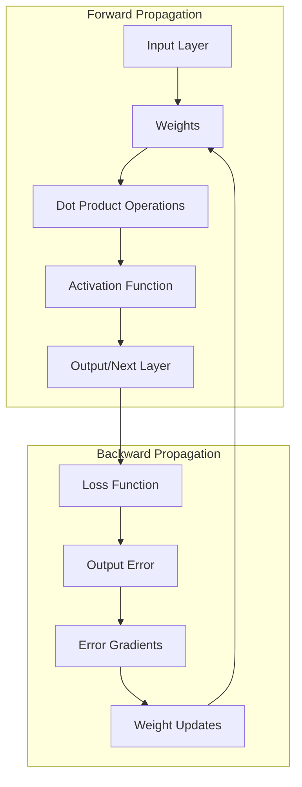

## Deep Learning Book Development Journey

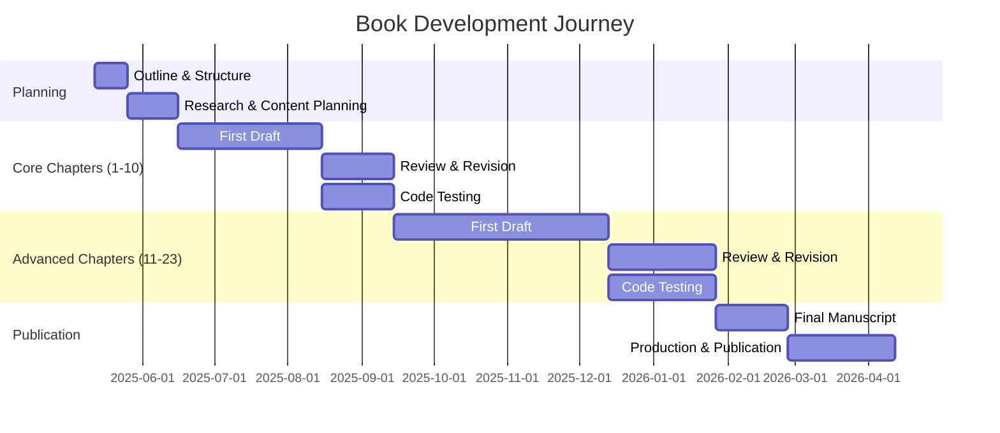

## Modern Deep Learning Stack

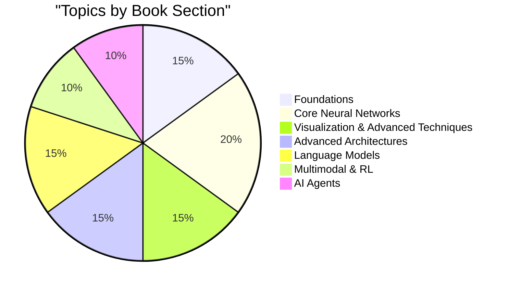

## Reading Paths Through the Book

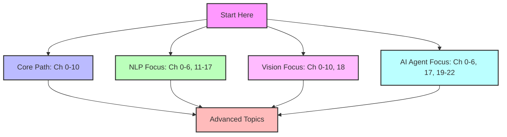
