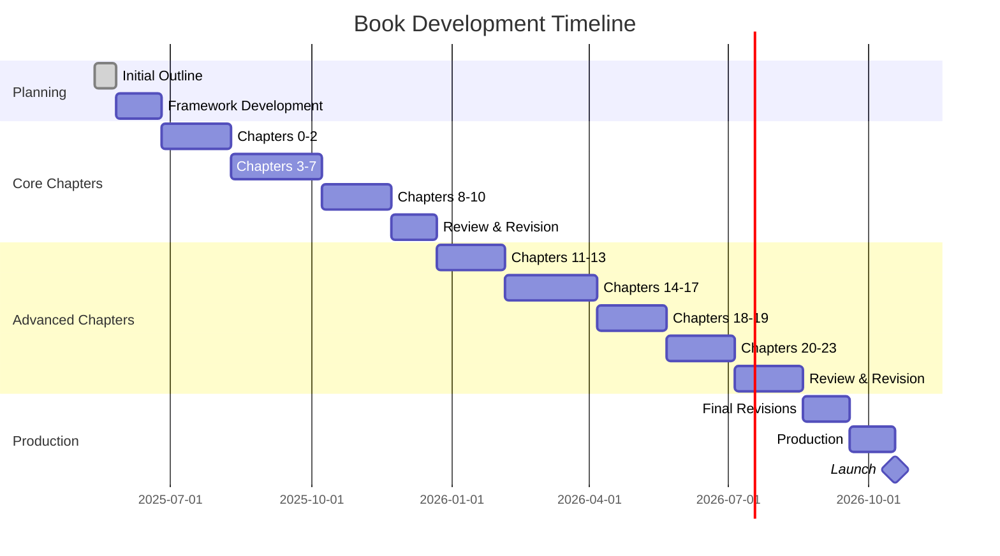

# Deep Learning from Scratch: Development Plan

## Book Development Strategy

This document outlines the step-by-step plan for developing "Deep Learning from Scratch" by Dr. Ernesto Lee, including timelines, checkpoints, and quality assurance processes.

## Development Phases

### Phase 1: Planning & Framework (1 month)
- [x] Create high-level book outline
- [x] Develop detailed chapter structure
- [x] Design book architecture and flow
- [ ] Establish code standards and testing methodology
- [ ] Develop code repository structure
- [ ] Create sample chapter template
- [ ] Establish visual design guidelines for diagrams

### Phase 2: Core Chapters Development (4 months)
- [ ] **Chapter 0: Learning Methodology: Mind Hacks: How to Succeed in This Deep Learning Adventure**
  - [ ] Develop learning mindset framework
  - [ ] Create ADEPT method examples
  - [ ] Design diagrams for mathematical intuition

- [ ] **Chapters 1-2: Foundation**
  - [ ] Draft introduction materials
  - [ ] Introduce the Observe-Model-Refine cycle
  - [ ] Create machine learning taxonomy diagrams
  - [ ] Develop code examples for basic concepts

- [ ] **Chapters 3-6: Neural Networks Core**
  - [ ] Build progressive code examples
  - [ ] Create visualizations for the magic of the dot product
  - [ ] Develop interactive examples for neural prediction
  - [ ] Implement backpropagation from scratch
  - [ ] Create visual explanations of gradient descent

- [ ] **Chapter 7: Neural Network Visualization**
  - [ ] Develop mental models for neural networks
  - [ ] Create visualization techniques for activations
  - [ ] Build weight and gradient visualization tools
  - [ ] Implement dimensionality reduction techniques

- [ ] **Chapters 8-10: Advanced Training & CNNs**
  - [ ] Implement regularization techniques
  - [ ] Develop activation function visualizations
  - [ ] Create CNN architecture diagrams
  - [ ] Build image recognition examples
  - [ ] Develop visualization tools for learned features

### Phase 3: Advanced Chapters Development (5 months)
- [ ] **Chapters 11-13: Sequence Models & NLP**
  - [ ] Implement RNN and LSTM models
  - [ ] Develop text processing pipelines
  - [ ] Create sequence visualization tools
  - [ ] Build language model examples

- [ ] **Chapters 14-17: Transformer Architecture & LLMs**
  - [ ] Implement attention mechanisms
  - [ ] Build transformer components from scratch
  - [ ] Create simplified BERT and GPT models
  - [ ] Develop training and fine-tuning examples

- [ ] **Chapters 18-19: Multimodal & RL**
  - [ ] Create text-image integration examples
  - [ ] Implement basic reinforcement learning algorithms
  - [ ] Develop visualization tools for RL concepts

- [ ] **Chapters 20-23: AI Agents & Ethics**
  - [ ] Design agent architecture components
  - [ ] Implement simple agentic framework
  - [ ] Develop multi-agent communication systems
  - [ ] Create ethics case studies and examples
  - [ ] Develop future roadmap visualizations

### Phase 4: Review & Refinement (3 months)
- [ ] Technical review of all code examples
- [ ] Editorial review of content flow and clarity
- [ ] Peer review by subject matter experts
- [ ] Student testing of learning exercises
- [ ] Integration of feedback and revision
- [ ] Final code testing and quality assurance

### Phase 5: Production & Publication (2 months)
- [ ] Finalize all diagrams and visualizations
- [ ] Complete code repository and documentation
- [ ] Assemble final manuscript
- [ ] Prepare supplementary materials
- [ ] Create website and distribution channels
- [ ] Launch and promotion planning

## Code Development Checklist

### Infrastructure Setup
- [ ] Create GitHub repository for book code
- [ ] Establish coding style guidelines
- [ ] Set up continuous integration for code testing
- [ ] Create development environment guide

### Core Implementations
- [ ] Basic neural network library
  - [ ] Forward propagation with dot product focus
  - [ ] Backpropagation
  - [ ] Gradient descent optimization
  - [ ] Layer abstractions

- [ ] Visualization components
  - [ ] Network architecture visualizers
  - [ ] Weight and activation visualization
  - [ ] Training dynamics plotters

- [ ] Convolutional network components
  - [ ] Convolution operations
  - [ ] Pooling layers
  - [ ] Feature visualization

- [ ] Sequence models
  - [ ] RNN implementation
  - [ ] LSTM cells
  - [ ] Sequence prediction utilities

- [ ] Transformer architecture
  - [ ] Attention mechanisms
  - [ ] Position embeddings
  - [ ] Encoder-decoder structure

- [ ] Advanced model implementations
  - [ ] BERT-style model
  - [ ] GPT-style model
  - [ ] Multimodal integration
  - [ ] Reinforcement learning algorithms
  - [ ] Agent architecture components

### Testing and Validation
- [ ] Unit tests for all components
- [ ] Integration tests for model architectures
- [ ] Performance benchmarks
- [ ] Validation on standard datasets
  - [ ] MNIST for basic vision
  - [ ] CIFAR for CNNs
  - [ ] Text datasets for NLP
  - [ ] Multimodal datasets

## Content Development Checklist

### For Each Chapter
- [ ] Draft chapter outline
- [ ] Develop core concepts and intuitive explanations
- [ ] Create mathematical foundations
- [ ] Implement code examples
- [ ] Design diagrams and visualizations
- [ ] Develop exercises and projects
- [ ] Write complete draft
- [ ] Technical review
- [ ] Revision based on feedback

### Visual Assets
- [ ] Architecture diagrams
- [ ] Process flow charts
- [ ] Mathematical visualizations
- [ ] Result demonstrations
- [ ] Concept maps
- [ ] Dot product visualizations
- [ ] Neural network visualization techniques

### Code Assets
- [ ] Chapter-specific implementations
- [ ] Example notebooks
- [ ] Solution guides
- [ ] Extended projects

## Project Management Timeline

## Quality Assurance Plan

### Code Review Process
1. **Initial Development**
   - Write core functionality with documentation
   - Include inline comments explaining key concepts
   - Develop accompanying tests

2. **Technical Review**
   - Code correctness verification
   - Performance optimization
   - Clarity and educational value assessment

3. **User Testing**
   - Student volunteers test code examples
   - Collect feedback on clarity and usability
   - Identify common stumbling points

4. **Final Revision**
   - Address all feedback and issues
   - Ensure consistent style across chapters
   - Verify that code builds properly in isolation

### Content Review Process
1. **Subject Matter Expert Review**
   - Technical accuracy check
   - Pedagogy assessment
   - Content completeness verification

2. **Editorial Review**
   - Clarity and accessibility check
   - Consistency of terminology
   - Flow and structure assessment

3. **Student Feedback**
   - Test chapters with target audience
   - Gather qualitative feedback
   - Measure learning outcomes

4. **Final Content Revision**
   - Integrate all feedback
   - Ensure consistency across chapters
   - Verify all references and citations

## Risk Management

### Potential Challenges
- **Technical Complexity**: Some advanced concepts may be difficult to explain simply
  - *Mitigation*: Use the ADEPT method consistently, develop multiple explanations

- **Code Maintenance**: Ensuring all code examples work consistently
  - *Mitigation*: Robust testing framework, modular design, version control

- **Visualization Quality**: Creating clear, intuitive visualizations for complex networks
  - *Mitigation*: Develop consistent visual language, iterative design process

- **Scope Management**: Advanced topics can expand rapidly
  - *Mitigation*: Clear chapter boundaries, focused learning objectives

- **Technology Changes**: AI field evolves rapidly
  - *Mitigation*: Focus on fundamentals, design for easy updates

## Success Metrics

- **Educational Effectiveness**: Students can implement concepts independently
- **Code Quality**: All examples run as expected with minimal troubleshooting
- **Conceptual Clarity**: Readers develop intuition for complex topics
- **Content Completeness**: Covers foundation to cutting-edge topics
- **Reader Satisfaction**: Positive feedback on clarity and approach
